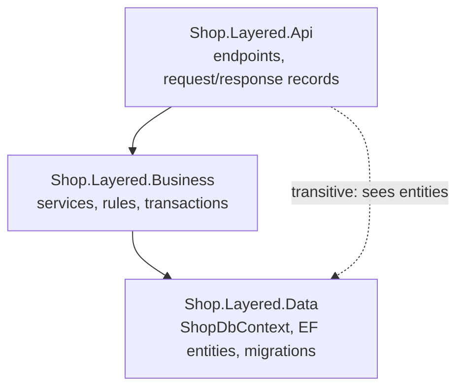
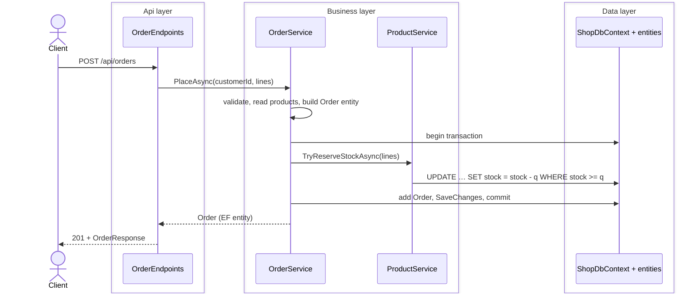

# 01 — Layered (N-tier)

The shop as a classic three-layer application: **Api → Business → Data**. It is the baseline the other versions are compared against. The full explanation is in the guide, [chapter 4](../docs/ARCHITECTURE_GUIDE.md#4-layered-n-tier).

## The idea

Code is cut into horizontal layers by kind of work. Presentation talks HTTP, Business holds the rules and the transactions, Data reads and writes PostgreSQL. Each layer calls only the one below. It is the most common structure in business applications (in Spring: controller → service → repository). Its weakness: **the rules depend on the database layer**.



| Layer | Responsibility | Must NOT know |
|---|---|---|
| [Api](src/Shop.Layered.Api) | HTTP in and out, map entities to responses, exceptions → ProblemDetails | `ShopDbContext`, SQL, rules |
| [Business](src/Shop.Layered.Business) | Validation, rules, transactions (`OrderService`, `ProductService`, `PaymentService`) | HTTP, the Api |
| [Data](src/Shop.Layered.Data) | Entities, `ShopDbContext`, migrations | Business, Api |

## Database

Database `shop_layered` with four tables: `products`, `orders`, `order_lines`, `payments`. They map one-to-one to the EF entities in [`src/Shop.Layered.Data/Entities`](src/Shop.Layered.Data/Entities). The diagram, column by column, and how to inspect it are in [guide §4.2](../docs/ARCHITECTURE_GUIDE.md#42-layers-and-their-responsibilities) ("The database schema"). The full SQL:

```bash
dotnet ef migrations script --project 01-layered/src/Shop.Layered.Data
```

## Using it

```bash
docker compose up -d                                    # from the repo root: PostgreSQL on 5433
dotnet run --project 01-layered/src/Shop.Layered.Api    # http://localhost:5101, migrates shop_layered on startup
dotnet test 01-layered/Shop.slnx                        # unit, architecture and contract tests
```

Then send the requests in [`http/shop.http`](../http/shop.http) with `@baseUrl = {{layered}}`.

## Journey of `POST /api/orders`



Step by step, with the error path: [guide §4.5](../docs/ARCHITECTURE_GUIDE.md#45-journey-of-a-request).

## Trade-offs

- **Good:** everyone knows it. Little code per feature. A request reads top-down in three files.
- **Costs:** the rules depend on EF Core and PostgreSQL. One class is the table row, the business object and almost the API shape, so a field rename touches every layer. Business logic needs a database to be tested.
- **Use it for** CRUD-style apps, internal tools, prototypes. **Avoid it** when the domain has real rules and states, or the infrastructure must be swappable or testable in isolation.

## Decisions

- [0001 — Use a layered (N-tier) architecture](docs/adr/0001-use-layered-architecture.md)
- [0002 — Use the EF Core entities as the business model](docs/adr/0002-ef-entities-as-business-model.md)
