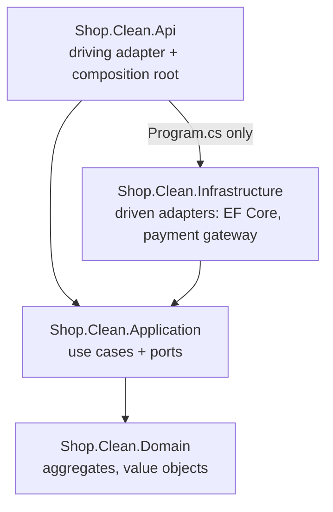
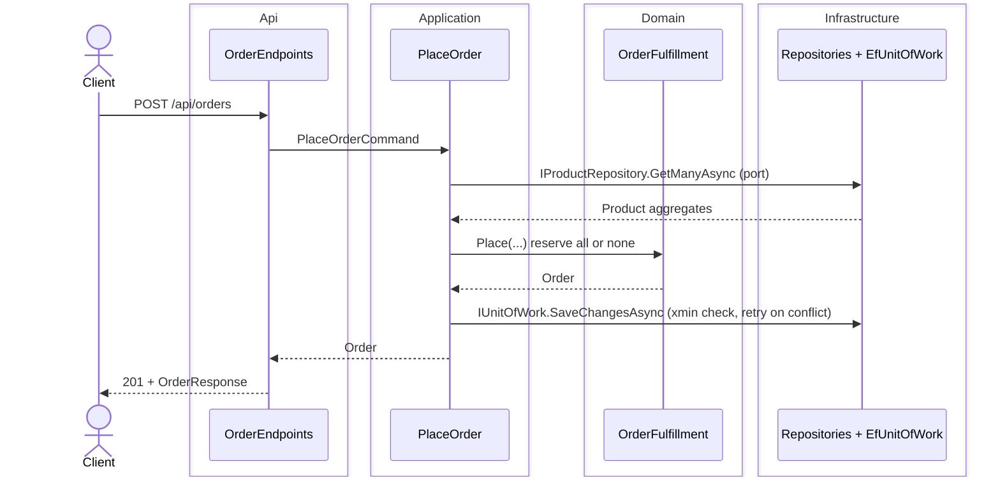

# 02 — Clean / Hexagonal

The shop with the dependency **inverted**. The business rules sit in the centre (Domain + Application) and depend on nothing technical. HTTP and the database are adapters around them. Full explanation: guide [chapter 5](../docs/ARCHITECTURE_GUIDE.md#5-clean--hexagonal).

## The idea

Version 01 stacked the rules on top of the database. Here the core **owns interfaces (ports)** for what it needs: "load these products", "charge this amount". Infrastructure **implements** them (adapters). The rules also move into a **rich domain model**: `Order.Cancel()`, `Product.Reserve()`, value objects like `Money` and `Sku` that cannot be invalid.



| Project | Responsibility | Must NOT know |
|---|---|---|
| [Domain](src/Shop.Clean.Domain) | `Product`, `Order`, `Payment`, `Money`, `Sku`, `Quantity`, `OrderFulfillment` | Anything outside itself |
| [Application](src/Shop.Clean.Application) | One use case per operation (`PlaceOrder`, `PayOrder`…), ports (`IProductRepository`…) | EF Core, ASP.NET Core, adapters |
| [Infrastructure](src/Shop.Clean.Infrastructure) | EF Core repositories, unit of work, mapping, `FakePaymentGateway` | The Api |
| [Api](src/Shop.Clean.Api) | Endpoints → use cases, errors → ProblemDetails | EF Core, the adapters (except in `Program.cs`) |

## Database

Database `shop_clean`, **the same four tables as version 01** (`products`, `orders`, `order_lines`, `payments`). Only the code that reaches them changed: value converters, a shadow row version, owned order lines. Diagram and notes: [guide §5.2](../docs/ARCHITECTURE_GUIDE.md#52-layers-ports-and-adapters). Full SQL:

```bash
dotnet ef migrations script --project 02-clean-hexagonal/src/Shop.Clean.Infrastructure
```

## Using it

```bash
docker compose up -d                                         # from the repo root
dotnet run --project 02-clean-hexagonal/src/Shop.Clean.Api   # http://localhost:5102
dotnet test 02-clean-hexagonal/Shop.slnx                     # unit (no database), architecture and contract tests
```

Send [`http/shop.http`](../http/shop.http) with `@baseUrl = {{clean}}`.

## Journey of `POST /api/orders`



The use case calls the repository (outwards), but Infrastructure depends on the port (inwards): **dependency inversion**. Step by step: [guide §5.5](../docs/ARCHITECTURE_GUIDE.md#55-journey-of-a-request).

## Trade-offs

- **Good:** rules in one place that cannot be bypassed. Domain and use cases unit-tested without a database. Database and payment provider swappable in Infrastructure only.
- **Costs:** about 50% more code than 01 (commands, value objects, mapping, ports). Optimistic concurrency needs retries. Placing an order changes several aggregates in one transaction.
- **Use it for** domains with real rules and long-lived systems. **Avoid it** for thin CRUD.

## Decisions

- [0001 — Use Clean / Hexagonal Architecture](docs/adr/0001-clean-architecture.md)
- [0002 — Use a rich domain model](docs/adr/0002-rich-domain-model.md)
- [0003 — Ports are defined by the Application layer](docs/adr/0003-ports-defined-by-application.md)
