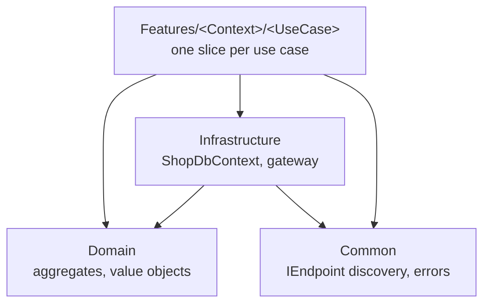
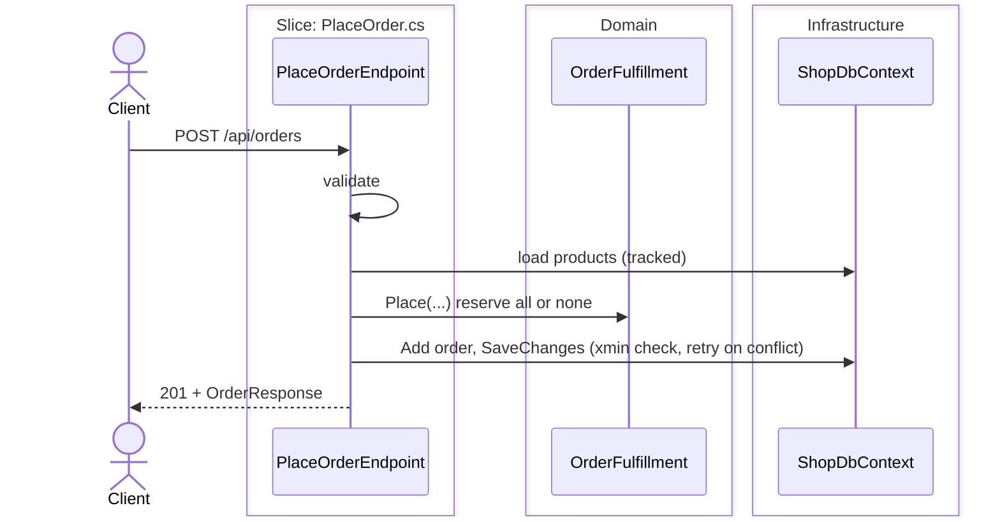

# 03 — Vertical Slice

The shop organised **by use case** instead of by layer: one file per use case under `Features/`, with its request, validation, handler and route. The domain model of 02 stays, and the ports, repositories and commands go away. Reads are projections (light CQRS). Full explanation: guide [chapter 6](../docs/ARCHITECTURE_GUIDE.md#6-vertical-slice).

## The idea

Most changes are about one feature, so code that changes together lives together. Placing an order is [`Features/Ordering/PlaceOrder.cs`](src/Shop.Slice.Api/Features/Ordering/PlaceOrder.cs), top to bottom. Slices never use each other. Shared rules live in `Domain/`, shared technology in `Infrastructure/` and `Common/`.



| Part | Responsibility | Must NOT know |
|---|---|---|
| [A slice](src/Shop.Slice.Api/Features) | One use case end to end; commands go through the domain, queries project | Any other slice |
| [Domain](src/Shop.Slice.Api/Domain) | `Product`, `Order`, `Money`, `OrderFulfillment` (copied from 02) | Features, EF Core, ASP.NET Core |
| [Infrastructure](src/Shop.Slice.Api/Infrastructure) | EF Core mapping, migrations, retry helper, fake gateway | Features |
| [Common](src/Shop.Slice.Api/Common) | `IEndpoint` + discovery, errors, validation helper | Features |

## Database

Database `shop_slice`, the same four tables as 01 and 02 (`products`, `orders`, `order_lines`, `payments`). Diagram: [guide §5.2](../docs/ARCHITECTURE_GUIDE.md#52-layers-ports-and-adapters). Full SQL: `scripts/create-schemas.sh 03`.

## Using it

```bash
docker compose up -d                                         # from the repo root
dotnet run --project 03-vertical-slice/src/Shop.Slice.Api    # http://localhost:5103
dotnet test 03-vertical-slice/Shop.slnx
```

Send [`http/shop.http`](../http/shop.http) with `@baseUrl = {{slice}}`.

## Journey of `POST /api/orders`



Step by step: [guide §6.5](../docs/ARCHITECTURE_GUIDE.md#65-journey-of-a-request).

## Trade-offs

- **Good:** a use case lives in one file, new ones touch nothing else, less ceremony than 02, each slice picks its tool (aggregate or projection).
- **Costs:** slices depend on EF Core directly; cross-cutting changes are spread out; logic outside the domain is tested through HTTP and a database; duplication needs judgement.
- **Use it for** APIs with many independent use cases. **Avoid it** when infrastructure must be swappable or several entry points share the same use cases.

## Decisions

- [0001 — Organise the code by use case](docs/adr/0001-vertical-slices.md)
- [0002 — No mediator library; endpoints discovered by reflection](docs/adr/0002-no-mediator-library.md)
- [0003 — Light CQRS](docs/adr/0003-cqrs-light.md)
