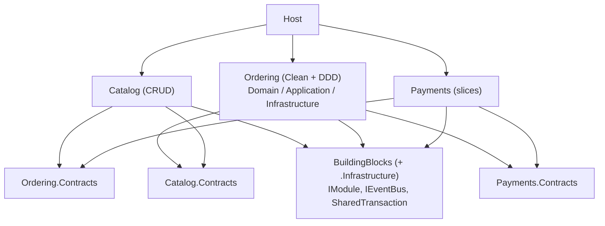
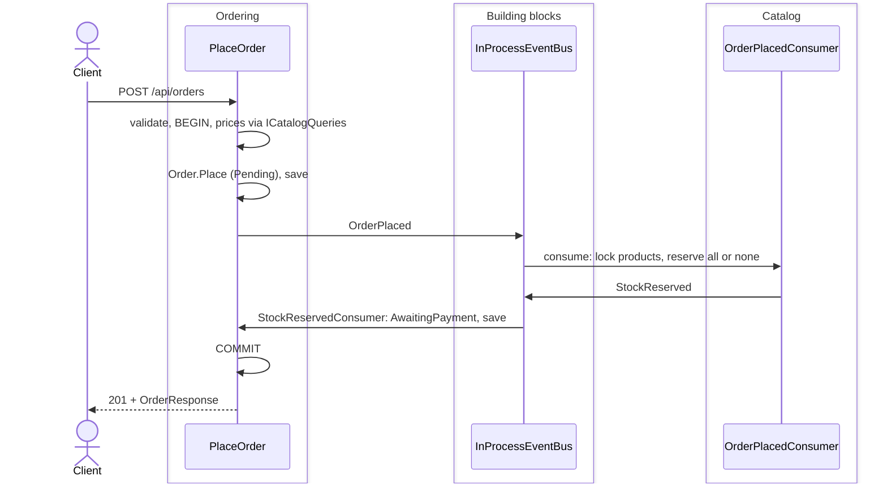

# 04 — Modular monolith

The shop as **one process, three modules**: Catalog, Ordering and Payments. Each module has its own internal code, its own database schema and a public `*.Contracts` project, and each is built in the style that fits it. Catalog is simple CRUD, Ordering keeps 02's clean architecture and rich domain, and Payments uses 03's vertical slices. Modules talk only through their contracts: a query interface and integration events on an in-process bus, all inside one database transaction. Full explanation: guide [chapter 7](../docs/ARCHITECTURE_GUIDE.md#7-modular-monolith).

## The idea

Versions 01–03 are one model where anything can use anything. Here each bounded context becomes a module with walls the compiler enforces (`internal` types, references only to contracts), so the system stays modular as it grows, and any module could later move out into its own service (version 05).



| Part | Responsibility | Must NOT know |
|---|---|---|
| [Host](src/Shop.Modular.Host/Program.cs) | One process, the list of modules | Anything inside a module |
| [BuildingBlocks](src/Shop.Modular.BuildingBlocks) / [.Infrastructure](src/Shop.Modular.BuildingBlocks.Infrastructure) | Event interfaces, shared errors / module interface, in-process bus, shared transaction | Any module |
| [Catalog](src/Shop.Modular.Catalog) | Products and stock, CRUD endpoints, price lookups, stock reservation | Other modules' code and tables |
| [Ordering](src/Shop.Modular.Ordering.Application) | Orders: `Order` aggregate, use cases, consumers, adapters (three projects as in 02) | Other modules' code and tables |
| [Payments](src/Shop.Modular.Payments) | Charging (a slice triggered by an event) and reading payments | Other modules' code and tables |
| `*.Contracts` | Each module's public events and queries | Any framework, any module's internals |

## Database

Database `shop_modular`, one schema per module: `catalog.products`, `ordering.orders` + `ordering.order_lines`, `payments.payments`. No foreign key crosses a schema; each schema has its own migrations history. Diagrams: [guide §7.2](../docs/ARCHITECTURE_GUIDE.md#72-modules-and-their-responsibilities). Full SQL: `scripts/create-schemas.sh 04` (one file per module).

## Using it

```bash
docker compose up -d                                             # from the repo root
dotnet run --project 04-modular-monolith/src/Shop.Modular.Host   # http://localhost:5104
dotnet test 04-modular-monolith/Shop.slnx
```

Send [`http/shop.http`](../http/shop.http) with `@baseUrl = {{modular}}`.

## Journey of `POST /api/orders`



Step by step: [guide §7.5](../docs/ARCHITECTURE_GUIDE.md#75-journey-of-a-request).

## Trade-offs

- **Good:** boundaries that hold (compiler + tests), the right style per module, still one deployable and one transaction, a cheap path to microservices.
- **Costs:** more projects and plumbing; no joins or shortcuts across modules; the in-process bus couples modules in time and failure; one shared database still scales as one unit.
- **Use it for** a new system with several business areas, as the default before microservices. **Avoid it** for a small single-context app, or when parts already need independent deployment.

## Decisions

- [0001 — A modular monolith](docs/adr/0001-modular-monolith.md)
- [0002 — A different style per module](docs/adr/0002-style-per-module.md)
- [0003 — One schema per module, no foreign keys across](docs/adr/0003-schema-per-module.md)
- [0004 — In-process integration events in one shared transaction](docs/adr/0004-in-process-integration-events.md)
