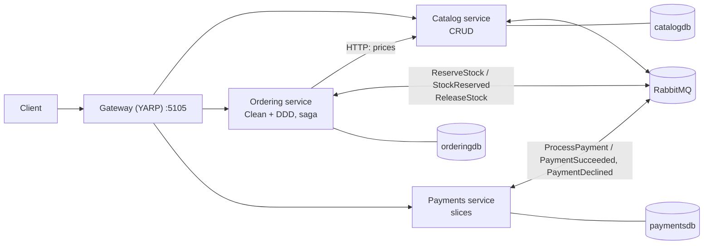
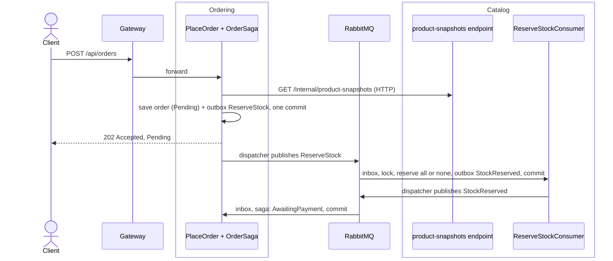

# 05 — Microservices

The shop as **three services and a gateway**: Catalog, Ordering and Payments each run in their own process with their own database, and an API gateway (YARP) gives clients one address and the same API as 01–04. The services talk through **RabbitMQ**, with a hand-written **transactional outbox** and **idempotent inbox**, and Ordering **orchestrates a saga** that compensates a declined payment by releasing the stock. Placing and paying an order answer `202 Accepted`. **.NET Aspire** starts everything and shows one order as one trace across all services. Full explanation: guide [chapter 8](../docs/ARCHITECTURE_GUIDE.md#8-microservices).

## The idea

Version 04 drew walls inside one process. Here each module moves into its own deployable, so it can be released, scaled and fail on its own, at the price of the network: messages that can be lost, duplicated or late, and no transaction across services. Inside, each service keeps its 04 style (Catalog CRUD, Ordering clean/hexagonal, Payments slices).



| Part | Responsibility | Must NOT know |
|---|---|---|
| [AppHost](src/Shop.Micro.AppHost/Program.cs) | Starts PostgreSQL (3 databases), RabbitMQ, the services and the gateway; development only | — |
| [Gateway](src/Shop.Micro.Gateway/Program.cs) | Routes `/api/products`, `/api/orders`, `/api/payments` to their services | Any service's code |
| [ServiceDefaults](src/Shop.Micro.ServiceDefaults) | Telemetry, health checks, service discovery, HTTP resilience | Any service |
| [Contracts](src/Shop.Micro.Contracts) | The messages and `ProductSnapshot` | Any framework, any service |
| [Messaging](src/Shop.Micro.Messaging) | Outbox, dispatcher, inbox, consumer host, queue layout, trace propagation | Which messages exist, any service |
| [Catalog](src/Shop.Micro.Catalog.Api) | Products and stock; reserves and releases stock on command | Other services' code and databases |
| [Ordering](src/Shop.Micro.Ordering.Application) | Orders, the `OrderSaga` orchestrator (four projects, clean) | Other services' code and databases |
| [Payments](src/Shop.Micro.Payments.Api) | Charges orders once, serves payment reads | Other services' code and databases |

## Database

One PostgreSQL server, **one database per service**: `catalogdb` (`products`), `orderingdb` (`orders`, `order_lines`, `xmin` row version), `paymentsdb` (`payments`), each with its own `outbox_messages` and `inbox_messages`. Diagrams: [guide §8.2](../docs/ARCHITECTURE_GUIDE.md#82-services-and-their-responsibilities). Full SQL: `scripts/create-schemas.sh 05` (one file per service).

## Using it

```bash
dotnet run --project 05-microservices/src/Shop.Micro.AppHost     # gateway http://localhost:5105, dashboard link in the console
dotnet test 05-microservices/Shop.slnx                           # unit, architecture, integration (containers), contract (Aspire)
```

Docker Desktop must be running (the root `compose.yaml` is not used). Send [`http/shop.http`](../http/shop.http) with `@baseUrl = {{micro}}`: a new order answers `Pending`, then becomes `AwaitingPayment`; paying answers `PaymentPending`, then `Paid` or `Cancelled`. In the dashboard, open *Traces* to follow one order through every service.

## Journey of `POST /api/orders`



Step by step, paying and the compensation: [guide §8.6](../docs/ARCHITECTURE_GUIDE.md#86-journey-of-a-request).

## Trade-offs

- **Good:** independent deployment and scaling per service, failure isolation where communication is asynchronous, hard data boundaries, observability from day one.
- **Costs:** a broker, outbox, inbox, dispatcher, dead letters, gateway and tracing (about 750 lines of messaging alone); eventual consistency and `202` responses; harder testing and operations; the synchronous price lookup still couples order placement to Catalog's availability.
- **Use it for** several teams that must deliver independently, or parts with very different scaling or availability needs, extracted one at a time from a modular monolith. **Avoid it** for a new product with moving boundaries, one small team, or data that needs strong consistency across services.
