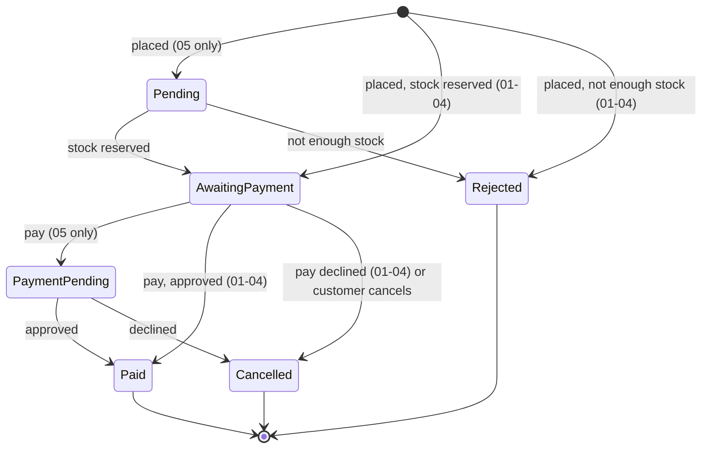
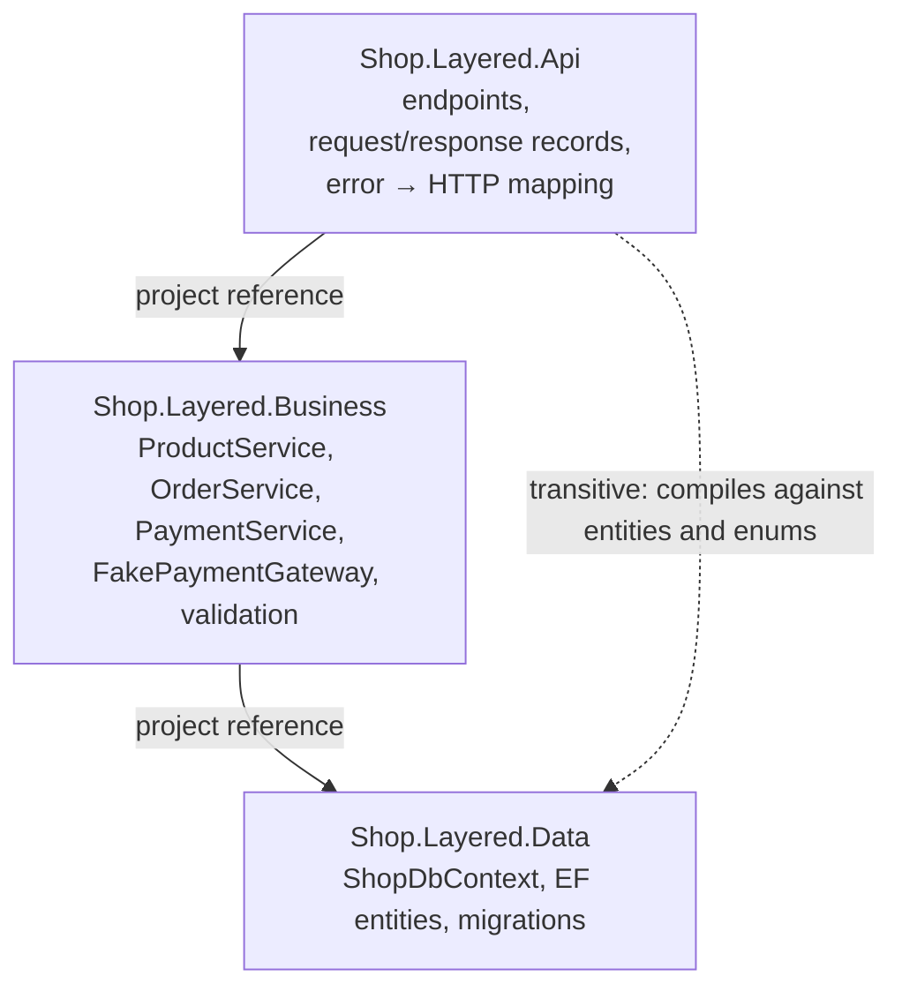
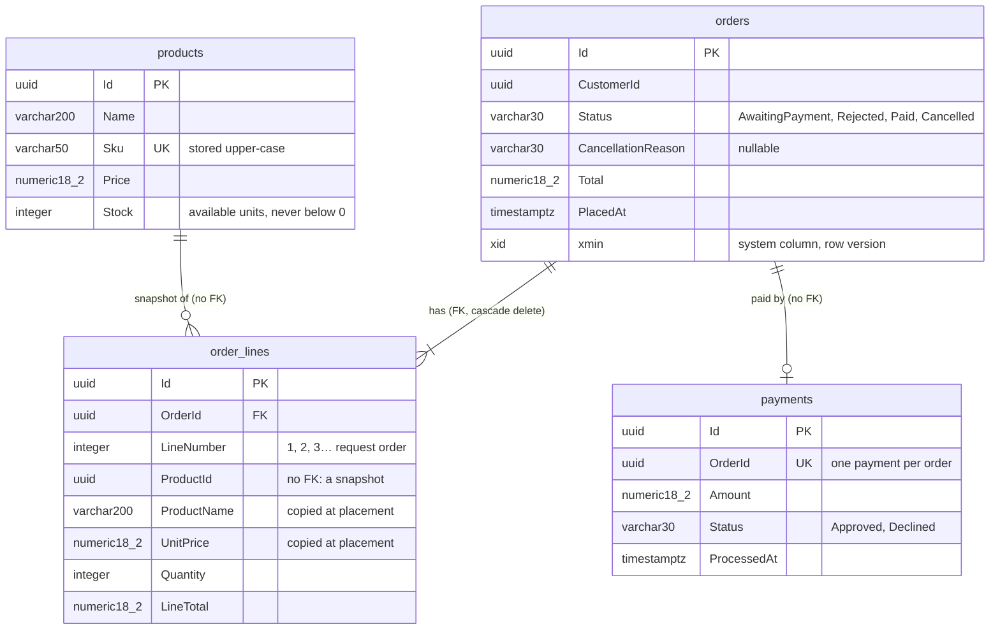
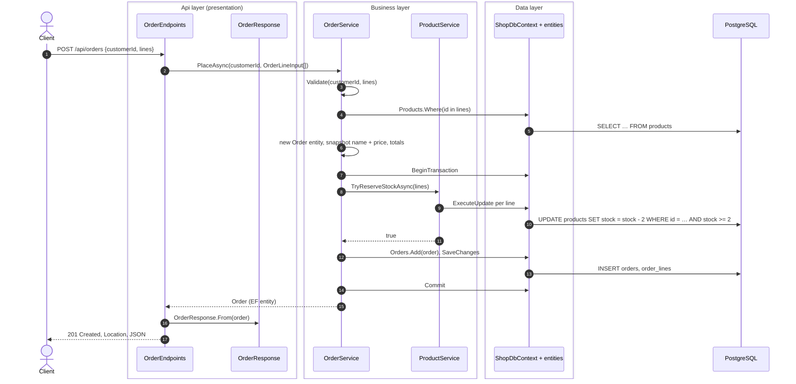
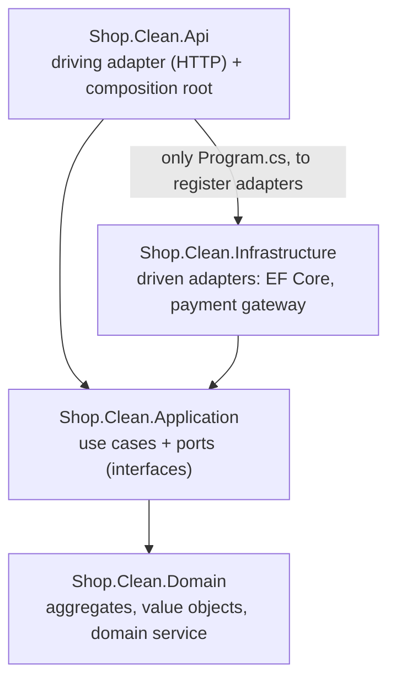
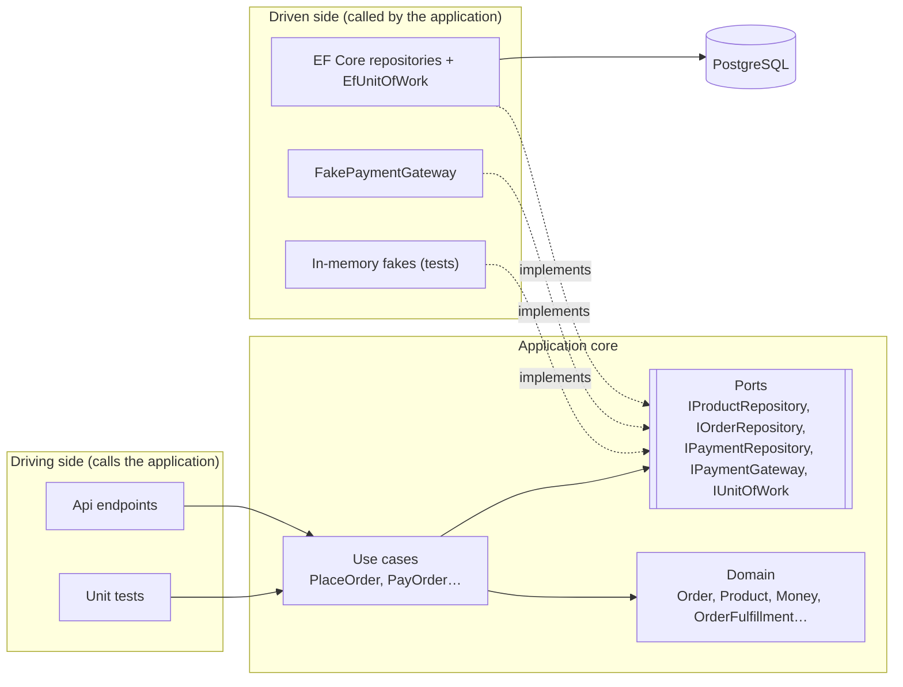
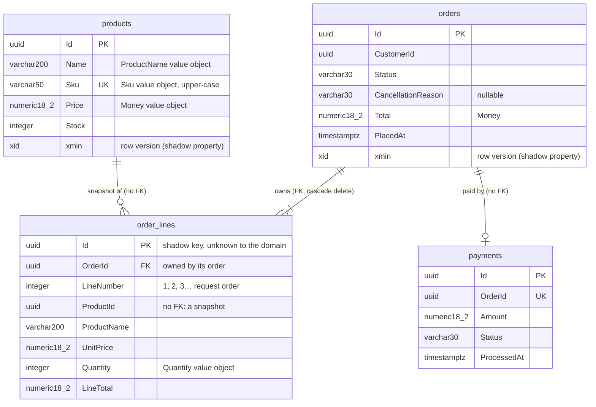
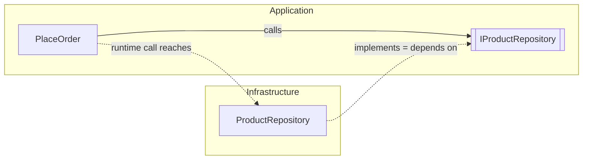
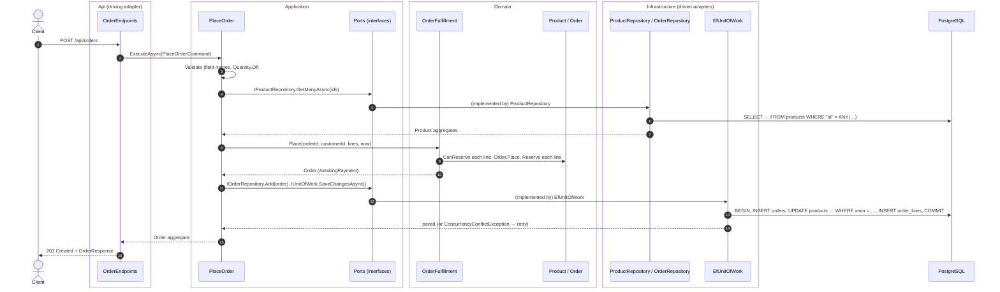

# Architecture Playground — Guide

This guide goes with the code. It explains software architecture from zero. Every acronym is spelled out the first time it appears, and every idea gets a plain-language introduction before any code. Then it walks through the same shop built five different ways.

**How to read it.** Chapters 1–2 are practical: install, run, find your way around the repo. Chapter 3 is the map: the vocabulary and the ideas every later chapter relies on. Chapters 4–8 take one architecture each, in the order they were built, and follow a real request through its layers. Chapters 9–12 put it all together: how styles combine, how to choose, and what this means when you work with AI coding agents. Unknown word? See the [Glossary](#glossary).

## Contents

1. [Setup](#1-setup)
   1. [The .NET SDK](#11-the-net-sdk)
   2. [VS Code and the recommended extensions](#12-vs-code-and-the-recommended-extensions)
   3. [Docker Desktop](#13-docker-desktop)
   4. [.NET Aspire (version 05 only)](#14-net-aspire-version-05-only)
   5. [Everyday commands](#15-everyday-commands)
2. [Project anatomy](#2-project-anatomy)
   1. [Solutions: `.slnx`](#21-solutions-slnx)
   2. [Projects: `.csproj`](#22-projects-csproj)
   3. [Project references: architecture enforced by the compiler](#23-project-references-architecture-enforced-by-the-compiler)
   4. [`Directory.Build.props`](#24-directorybuildprops)
   5. [Central package management](#25-central-package-management)
   6. [`.editorconfig` and analyzers](#26-editorconfig-and-analyzers)
   7. [Kinds of tests](#27-kinds-of-tests)
   8. [The shared contract suite](#28-the-shared-contract-suite)
   9. [Request files (`http/`)](#29-request-files-http)
   10. [Anatomy of a version folder](#210-anatomy-of-a-version-folder)
3. [The map and the primers](#3-the-map-and-the-primers)
   1. [What software architecture is](#31-what-software-architecture-is)
   2. [The four axes](#32-the-four-axes)
   3. [Clean Code is not Clean Architecture](#33-clean-code-is-not-clean-architecture)
   4. [Hexagonal, Onion, Clean: one family](#34-hexagonal-onion-clean-one-family)
   5. [Primer: coupling and cohesion](#35-primer-coupling-and-cohesion)
   6. [Primer: the dependency rule and dependency inversion](#36-primer-the-dependency-rule-and-dependency-inversion)
   7. [Primer: DDD in 10 minutes](#37-primer-ddd-in-10-minutes)
   8. [Primer: CQRS](#38-primer-cqrs)
   9. [Primer: events and messaging](#39-primer-events-and-messaging)
   10. [Primer: transactions and consistency](#310-primer-transactions-and-consistency)
   11. [The shop we build five times](#311-the-shop-we-build-five-times)
4. [Layered (N-tier)](#4-layered-n-tier)
   1. [The idea](#41-the-idea)
   2. [Layers and their responsibilities](#42-layers-and-their-responsibilities)
   3. [Using it](#43-using-it)
   4. [Before our code runs: what ASP.NET Core does](#44-before-our-code-runs-what-aspnet-core-does)
   5. [Journey of a request](#45-journey-of-a-request)
   6. [Rules](#46-rules)
   7. [What changed from the previous version](#47-what-changed-from-the-previous-version)
   8. [Trade-offs](#48-trade-offs)
   9. [Interview questions](#49-interview-questions)
5. [Clean / Hexagonal](#5-clean--hexagonal)
   1. [The idea](#51-the-idea)
   2. [Layers, ports and adapters](#52-layers-ports-and-adapters)
   3. [Using it](#53-using-it)
   4. [Dependency inversion, made visible](#54-dependency-inversion-made-visible)
   5. [Journey of a request](#55-journey-of-a-request)
   6. [Rules](#56-rules)
   7. [What changed from version 01](#57-what-changed-from-version-01)
   8. [Trade-offs](#58-trade-offs)
   9. [Interview questions](#59-interview-questions)
6. Vertical Slice — *coming in phase 03*
7. Modular monolith — *coming in phase 04*
8. Microservices — *coming in phase 05*
9. Combining styles — *coming in phase 06*
10. Decision guide — *coming in phase 06*
11. Styles explained but not implemented — *coming in phase 06*
12. Architecture and AI agents — *coming in phase 06*
13. References — *coming in phase 06*
- [Glossary](#glossary)
- Appendix: Java/Spring equivalences — *coming in phase 06*

---

## 1. Setup

### 1.1 The .NET SDK

.NET comes in two flavours:

- The **runtime** *runs* .NET programs. It is what a server needs.
- The **SDK** (Software Development Kit) *builds* them. It contains the runtime, plus the **C# compiler** (Roslyn), the **`dotnet` CLI** (Command-Line Interface: `dotnet build`, `dotnet test`, `dotnet run`…), MSBuild (the build engine) and the project templates.

There is no separate "C# install": installing the SDK installs C#. Each .NET version comes with a C# version (.NET 10 → C# 14).

**Install** (Windows):

```bash
winget install Microsoft.DotNet.SDK.10
```

Then open a **new** terminal, so it sees the updated `PATH`, and check:

```bash
dotnet --list-sdks      # should list 10.0.xxx
dotnet --info           # SDK, runtimes, OS details
```

**`global.json`** at the root pins the SDK this repo builds with:

```json
{
  "sdk": { "version": "10.0.401", "rollForward": "latestFeature" },
  "test": { "runner": "Microsoft.Testing.Platform" },
  "msbuild-sdks": { "Aspire.AppHost.Sdk": "13.6.0" }
}
```

- **`sdk`**: several SDKs can be installed side by side. This makes every `dotnet` command in this folder use 10.0.401 or the newest installed **feature band** of .NET 10 (10.0.4xx, 10.0.5xx…; a feature band is a group of SDK releases that add tooling features without changing the runtime). It never picks .NET 11, so the repo always builds with the same major version. Installing a newer .NET 10 SDK does switch to it silently; `dotnet --version` in the repo tells you which one is in use.
- **`test`**: `dotnet test` runs on **Microsoft.Testing.Platform**, the new test runner of .NET 10 (the older one is called VSTest). xUnit v3 test projects are small executables that this platform runs directly. Without this line, `dotnet test` on the .NET 10 SDK refuses to run them.
- **`msbuild-sdks`**: pins the version of the Aspire project SDK used by version 05 (§1.4).

### 1.2 VS Code and the recommended extensions

When you open the repo, VS Code offers to install the extensions listed in `.vscode/extensions.json`:

| Extension | What it gives you |
|---|---|
| **C# Dev Kit** (`ms-dotnettools.csdevkit`) | C# language support (IntelliSense, refactorings), the **Solution Explorer** (open a version's `Shop.slnx`), and the **Test Explorer** to run and debug tests one by one |
| **REST Client** (`humao.rest-client`) | Send the requests in `http/shop.http` with one click and see the response next to them |
| **EditorConfig** (`editorconfig.editorconfig`) | Applies `.editorconfig` (indentation, line endings) while you type |
| **Container Tools** (`ms-azuretools.vscode-containers`) | See and manage the Docker containers (PostgreSQL, RabbitMQ) from VS Code |
| **Markdown Preview Mermaid Support** (`bierner.markdown-mermaid`) | Renders the **Mermaid** diagrams of this guide and of the READMEs in the Markdown preview (`Ctrl+Shift+V`) |

*Mermaid* is a text format for diagrams: a few lines like `A --> B` become a drawing. GitHub renders it too.

**Opening one version.** With C# Dev Kit, use *File → Open Folder* on the repo root, then in the Solution Explorer pick the `Shop.slnx` of the version you want to study. Each version is a separate solution: you look at one architecture at a time.

Visual Studio 2026 and JetBrains Rider work just as well: open `<version>/Shop.slnx` directly.

### 1.3 Docker Desktop

Docker runs **containers**: lightweight, isolated processes started from an **image** (a packaged program with everything it needs). We use it for infrastructure we do not want to install on the machine:

- **PostgreSQL** (the database) for versions 01–04, started by `compose.yaml` at the repo root.
- **PostgreSQL and RabbitMQ** (the message broker) for version 05, started by Aspire (§1.4).
- **Throwaway containers in the tests**, started by **Testcontainers**: a library that starts a fresh container for a test run and removes it afterwards. So tests never touch your local data.

Docker Desktop must be **running** (whale icon in the system tray) before you start a version or run its tests. `docker info` fails if it is not.

**`compose.yaml`** describes the local PostgreSQL:
- image `postgres:17`, user and password `shop` (development only);
- port **5433** on your machine → 5432 in the container, so it does not clash with another local PostgreSQL;
- a named volume `shop-pgdata`, so data survives restarts;
- `docker/postgres/init.sql`, which creates one database per version the first time: `shop_layered`, `shop_clean`, `shop_slice`, `shop_modular`.

### 1.4 .NET Aspire (version 05 only)

**Aspire** (called *.NET Aspire* until version 13, when it dropped the prefix) is Microsoft's toolkit for running and observing **distributed applications** (several processes that talk to each other) on a developer machine. Version 05 has four processes (three services and an **API gateway**, the single entry point that forwards each request to the right service) plus PostgreSQL and RabbitMQ. Without Aspire you would start each one by hand and wire their addresses together.

With Aspire, one project, the **AppHost**, describes the whole system in C#: "a PostgreSQL with three databases, a RabbitMQ, these three services, this gateway, and who talks to whom". `dotnet run` on the AppHost starts everything and opens the **Aspire dashboard**: logs, traces and metrics of every process in one place. There you can see one order travel through the services.

Aspire comes as NuGet packages (`Aspire.AppHost.Sdk`, `Aspire.Hosting.*`), so **nothing extra needs installing**. The optional **Aspire CLI** (`aspire run`, `aspire new`) is a convenience; chapter 8 shows how to install it if you want it.

### 1.5 Everyday commands

Run them from the repo root. Replace `01-layered` with the version you are working on.

**Database (versions 01–04)**

```bash
docker compose up -d          # start PostgreSQL in the background
docker compose ps             # is it running and healthy?
docker compose down           # stop it (data is kept)
docker compose down -v        # stop it and DELETE the data (the databases are recreated on next start)
docker compose exec postgres psql -U shop -d shop_layered   # SQL prompt inside a version's database (\dt lists tables, \q quits)
```

**Build and test**

```bash
dotnet build 01-layered/Shop.slnx                    # compile the version
dotnet test 01-layered/Shop.slnx                     # all its tests: unit, architecture, contract (Docker must be running)
dotnet test 01-layered/tests/Shop.Layered.UnitTests  # one test project
dotnet test 01-layered/Shop.slnx --filter "FullyQualifiedName~OrderTests"                    # tests whose name contains OrderTests
dotnet test 01-layered/Shop.slnx --filter "FullyQualifiedName~PayingTwice_Returns409"        # one test
dotnet format 01-layered/Shop.slnx                   # fix formatting
dotnet format 01-layered/Shop.slnx --verify-no-changes   # only check it (what the done-checks run)
```

With `--filter` on a whole solution, the test projects with no matching test report "zero tests ran" and the command ends with exit code 8 even when the selected tests pass. Read the passed count in the summary (the CLI output follows your system language), or run the filter on the one test project that holds the tests.

**Run a version**

```bash
dotnet run --project 01-layered/src/Shop.Layered.Api         # http://localhost:5101
dotnet run --project 05-microservices/src/Shop.Micro.AppHost  # everything for 05; gateway on http://localhost:5105
```

Ports: 01 → 5101, 02 → 5102, 03 → 5103, 04 → 5104, 05 → 5105. Several versions can run at once.

**Database migrations (EF Core)**

A **migration** is a versioned C# description of a schema change ("add table `orders`"). EF Core generates it by comparing your model with the last migration. Each version applies its migrations automatically at startup **in Development**. In production you would apply them in a controlled deployment step instead: a migration that runs by surprise on every app start is risky.

The `dotnet ef` tool comes from the local tool manifest `.config/dotnet-tools.json`. `dotnet tool restore` downloads it for this repo only, like a package restore; nothing is installed machine-wide:

```bash
dotnet tool restore
dotnet ef migrations add AddSomething --project 01-layered/src/Shop.Layered.Data     # new migration from model changes
dotnet ef migrations list --project 01-layered/src/Shop.Layered.Data                 # which exist, which are applied
dotnet ef database update --project 01-layered/src/Shop.Layered.Data                 # apply them to the local database
```

Each data project has a small **design-time factory** (`ShopDbContextFactory`) that tells the tool how to create the `DbContext`, so the data project is all the tool needs: no `--startup-project`, and the API does not have to start.

---

## 2. Project anatomy

### 2.1 Solutions: `.slnx`

A **solution** groups projects that are worked on together. `Shop.slnx` is the new XML solution format, the default since .NET 10. It does the same job as the old `.sln` but is short and readable:

```xml
<Solution>
  <Folder Name="/src/">
    <Project Path="src/Shop.Layered.Api/Shop.Layered.Api.csproj" />
  </Folder>
</Solution>
```

Every version has its own `Shop.slnx`, and there is no solution at the root that groups all five. All versions have projects with similar names, so a combined solution would be confusing. One architecture at a time.

### 2.2 Projects: `.csproj`

A **project** compiles to one **assembly** (a `.dll`, or an `.exe` for apps and xUnit v3 test projects). Modern "SDK-style" projects are tiny because the SDK supplies the defaults: every `.cs` file in the folder is included automatically.

```xml
<Project Sdk="Microsoft.NET.Sdk">               <!-- the SDK supplies the defaults -->
  <ItemGroup>
    <ProjectReference Include="..\Shop.Clean.Domain\Shop.Clean.Domain.csproj" />   <!-- may use Domain's types -->
    <PackageReference Include="Microsoft.EntityFrameworkCore" />                   <!-- a NuGet package; no version: see §2.5 -->
  </ItemGroup>
</Project>
```

A web application uses `Sdk="Microsoft.NET.Sdk.Web"` instead, which adds ASP.NET Core. **NuGet** is .NET's package manager: `PackageReference` pulls a library from nuget.org.

### 2.3 Project references: architecture enforced by the compiler

This is the most important idea of this chapter. **A project can only use types from projects it references.** If `Shop.Clean.Domain` does not reference `Shop.Clean.Infrastructure`, then code in Domain *cannot* mention `ShopDbContext`: it does not compile.

So **splitting code into projects turns architectural rules into compiler errors**:

```
Shop.Clean.Api ──► Shop.Clean.Application ──► Shop.Clean.Domain
      │                      ▲
      └──► Shop.Clean.Infrastructure ──┘
```

Domain references nothing, so it cannot depend on EF Core or ASP.NET Core even by accident.

Project references have limits, though, and that is why each version also has **architecture tests** (§2.7):
- References are **transitive**: if Api references Business and Business references Data, then Api can see Data's types too. Version 01 shows this hole on purpose.
- They cannot express rules *inside* one project, such as "a vertical slice must not use another slice" (version 03) or "this class must be internal".

### 2.4 `Directory.Build.props`

MSBuild automatically imports the first `Directory.Build.props` it finds walking **up** from a project's folder. Ours sits at the root, so it applies to every project of every version:

| Setting | Why |
|---|---|
| `TargetFramework` = `net10.0` | Every project targets .NET 10 |
| `Nullable` = `enable` | The compiler warns when something might be `null` and you did not say so (`string?`) |
| `ImplicitUsings` = `enable` | Common `using`s (`System`, `System.Linq`…) are added for you |
| `TreatWarningsAsErrors` = `true` | A warning breaks the build, so warnings never pile up |
| `AnalysisLevel` = `latest-recommended` | Turns on the recommended set of code-quality analyzers (§2.6) |
| `EnforceCodeStyleInBuild` = `true` | Style rules from `.editorconfig` are checked by `dotnet build`, not only in the editor |
| `GenerateDocumentationFile` = `true` | Required for the build to report unused `using`s (IDE0005); warnings about missing XML comments (CS1591) are turned off |
| `InvariantGlobalization` = `true` | Culture-independent behaviour: `12.50` is never formatted as `12,50` |
| `ManagePackageVersionsCentrally` = `true` | Turns on §2.5 |

With one shared file, the five versions differ **only in architecture**, never in compiler settings.

### 2.5 Central package management

`Directory.Packages.props` holds the version of **every** NuGet package used anywhere in the repo:

```xml
<PackageVersion Include="Microsoft.EntityFrameworkCore" Version="10.0.12" />
```

Projects list packages **without** a version (`<PackageReference Include="Microsoft.EntityFrameworkCore" />`). Two projects can therefore never use different versions of the same library, and an upgrade is a one-line change.

Packages also bring their own dependencies (**transitive packages**). The Npgsql EF Core provider, for example, depends on an older EF Core than the one listed here. `CentralPackageTransitivePinningEnabled` makes the versions in this file win for those too, so the whole repo agrees on one EF Core version instead of failing the build with a version conflict (`MSB3277`).

Some libraries are **deliberately not used**. MediatR, AutoMapper and FluentAssertions moved to commercial licences in 2025, and MassTransit's new major version (v9) is commercial too. More importantly, writing the small pieces they would provide by hand (a dispatcher, an outbox, a mapping) shows you how those pieces actually work.

### 2.6 `.editorconfig` and analyzers

`.editorconfig` holds the code style: indentation, line endings, file-scoped namespaces, `_camelCase` for private fields, PascalCase for constants, braces always… Editors apply it while you type, and `dotnet format --verify-no-changes` checks it.

**Analyzers** are compiler plug-ins that report problems beyond syntax: possible null dereferences, an unused `using`, a string comparison that depends on the current culture. They are rules with IDs like `CA1707` (code analysis) or `IDE0005` (code style). Because warnings are errors here, analyzers act as an automatic reviewer. The `.editorconfig` file can tune a rule. For example, `CA1707` ("no underscores in member names") is turned off for test code, where names like `PayingTwice_Returns409` read better.

### 2.7 Kinds of tests

Every version has the same three test projects:

| Project | What it tests | Needs Docker? |
|---|---|---|
| `Shop.<V>.UnitTests` | Business rules in isolation: an order cannot be paid twice, a price must be positive… Fast, no database | No |
| `Shop.<V>.ArchitectureTests` | The **rules of the architecture**, written as tests with **ArchUnitNET**: "Domain depends on nothing", "a module only uses another module's Contracts" | No |
| `Shop.<V>.ContractTests` | The **public API**, over HTTP, against the real app and a real database | Yes |

**Architecture tests** deserve a word. ArchUnitNET loads the compiled assemblies and checks rules about their dependencies:

```csharp
// "The domain must not know how it is stored or exposed."
IArchRule rule = Types().That().ResideInAssembly(DomainAssembly)
    .Should().NotDependOnAny(Types().That().ResideInNamespace("Microsoft.EntityFrameworkCore"));
rule.Check(Architecture);
```

These tests are the executable form of the architecture. If someone breaks a rule (a colleague in a hurry, or an AI agent that does not know the design), a test fails and says which rule and why. Chapter 12 builds on this.

**Testing tools:**
- **xUnit v3**: the test framework (`[Fact]` for a test, `[Theory]` for a test with several inputs, plain `Assert`). It runs on Microsoft.Testing.Platform (§1.1).
- `Microsoft.AspNetCore.Mvc.Testing`: its **`WebApplicationFactory`** starts the real API in memory for the tests, with no network port.
- Testcontainers (§1.3).
- **ArchUnitNET**: architecture rules as tests.
- In 05, Aspire's testing host, which starts the whole distributed app for a test run.

### 2.8 The shared contract suite

`contract-tests/Shop.ContractTests` is the only code shared between versions. It is a library of **abstract** test classes (`ProductContractTests`, `OrderContractTests`, `PaymentContractTests`) that only talk HTTP to the public API. Each version's contract test project:

1. implements `IShopApi`: "here is an `HttpClient` pointing at my API, and here is whether I finish orders inside the request or later" (01–04: `WebApplicationFactory` + a PostgreSQL container, `IsAsynchronous = false`; 05: the Aspire testing host calling the gateway, `IsAsynchronous = true`);
2. registers it as an **assembly fixture**: an xUnit v3 feature where one object is created once for the whole test assembly, so the API and database start only once;
3. declares one concrete class per abstract class (`public sealed class OrderTests(LayeredShopApi api) : OrderContractTests(api);`). xUnit then runs the inherited tests.

If every version passes the same suite, then they really are **the same shop**, and comparing their insides is fair. Two details make one suite fit synchronous and asynchronous versions: placing and paying an order answer `201`/`200` when `IsAsynchronous` is false and `202 Accepted` when it is true (only version 05), and the `WaitFor…` helpers poll an order until it leaves its transient states (in 01–04 they return on the first read). The suite's own [README](../contract-tests/Shop.ContractTests/README.md) has the details.

### 2.9 Request files (`http/`)

[`http/shop.http`](../http/shop.http) contains ready-made requests for every endpoint, for the REST Client extension: a full happy path (create product → place order → pay → see the payment), a declined payment and a cancellation. The API is the same in all versions, so one file serves them all: change `@baseUrl` to `{{clean}}`, `{{micro}}`… and send the same requests to another version.

### 2.10 Anatomy of a version folder

```
02-clean-hexagonal/
  README.md              ← the short version of the guide chapter: diagram, journey of a request, trade-offs
  docs/adr/              ← Architecture Decision Records: why this version is built the way it is
  Shop.slnx              ← open this
  src/                   ← production code: one project per layer / module / service
  tests/
    Shop.Clean.UnitTests/
    Shop.Clean.ArchitectureTests/
    Shop.Clean.ContractTests/
```

An **ADR** (Architecture Decision Record) is a short document that records one decision: the **context** (what forced a choice), the **decision**, and its **consequences** (good and bad). ADRs are numbered and never rewritten. If a decision changes, a new ADR replaces the old one. Six months later, they answer the question everybody asks: "why on earth is it done like this?"

---

## 3. The map and the primers

### 3.1 What software architecture is

Every program has a structure: some code calls other code, some data lives somewhere. **Software architecture** is the set of **decisions about that structure that are expensive to change later**:
- how the code is split, and which part may depend on which;
- where the business rules live;
- how many processes there are and how they talk to each other;
- where data is stored, and who owns it.

Renaming a variable is cheap: not architecture. Splitting one application into five services, or moving all business rules out of the database layer, is expensive: architecture.

**Why it matters.** Good structure keeps the cost of change low as the system grows. Bad structure makes every change touch everything. The trap is that there is no best architecture, only **trade-offs**: every style makes some changes cheap and others expensive. Being good at architecture means knowing those trade-offs and choosing the right style for the problem in front of you. That is why this repo builds the same shop five times.

### 3.2 The four axes

Architecture discussions get confusing because people compare styles that answer **different questions**. "Hexagonal or microservices?" is like asking "blue or a car?". The styles sit on four independent axes:

| Axis | Question it answers | Options | In this repo |
|---|---|---|---|
| **A. Code organisation** | How is the code arranged *inside* one deployable application? | N-tier layered · Clean / Hexagonal / Onion · Vertical Slice · simple CRUD / Transaction Script | 01, 02, 03, and mixed in 04–05 |
| **B. Domain modelling** | Where are the boundaries of the business, and how rich is the model? | Anemic model · DDD tactical (aggregates, value objects) · DDD strategic (bounded contexts) | 01 anemic, 02+ rich, 04+ bounded contexts |
| **C. Deployment** | How many processes, and how do they talk? | Monolith · Modular monolith · Microservices (also SOA, serverless) | 01–03 monolith, 04 modular, 05 microservices |
| **D. Data and command flow** | How do changes and reads move through the system? | Synchronous calls · CQRS · domain/integration events · messaging · sagas · event sourcing | 03 CQRS, 04 in-process events, 05 messaging + saga |

A real system picks **one option per axis**, and often a different one per part of the system. Version 05 is "microservices (C), split by bounded context (B), each service with its own internal style (A), talking through messages and a saga (D)". Chapter 9 comes back to this map with all five versions on it.

**Words you will meet everywhere:**
- **Deployable / deployment unit**: something you can start and ship on its own (a web app, a service).
- **Monolith**: the whole application is one deployable. This is not an insult. Most successful systems start as one.
- **Layer**: a group of code with one kind of responsibility (presentation, business, data), with rules about which layer may call which.
- **Module**: a part of the application with a clear boundary and a small public surface, usually one area of the business.

**The options in the table, in one line each** (the chapters give each its full explanation):

*Axis A — inside one application*
- **N-tier layered**: horizontal layers stacked on top of each other: presentation → business → data, each calling the one below. "Tier" originally meant a physical machine; today "layer" and "tier" are used loosely for the same idea. Chapter 4.
- **Clean / Hexagonal / Onion**: the business rules in the centre, and every technology plugged in from the outside (§3.4). Chapter 5.
- **Vertical Slice**: one folder per use case ("place an order") containing everything that use case needs, instead of one folder per technical layer. Chapter 6.
- **Transaction Script**: each operation is one straightforward procedure that reads, decides and writes, with no domain model. Perfect for simple CRUD. Used for Catalog in 04.

*Axis C — how many processes*
- **Modular monolith**: one deployable, split inside into modules with strict boundaries. Chapter 7.
- **Microservices**: each business capability is a separate, independently deployable service with its own database, and services talk over the network. Chapter 8.
- **SOA** (Service-Oriented Architecture): the 2000s ancestor of microservices: large shared services, often connected through a central "enterprise service bus". Common in big, older enterprises. Chapter 11.
- **Serverless**: you deploy individual functions (Azure Functions, AWS Lambda) and the cloud runs them on demand; there is no server for you to manage. Chapter 11.

*Axis D — how changes flow*
- **CQRS, events, messaging, sagas**: see the primers §3.8–§3.10.
- **Event sourcing**: instead of storing the current state ("stock = 3"), you store every event that happened ("added 5", "reserved 2") and compute the state by replaying them. It gives a full history, but it is a big step up in complexity. Chapter 11.

### 3.3 Clean Code is not Clean Architecture

Two books by the same author (Robert C. Martin, "Uncle Bob") that are often confused:

- ***Clean Code*** (2008) is about writing good code **in the small**: meaningful names, short functions that do one thing, no duplication, readable tests. It applies to any architecture.
- ***Clean Architecture*** (2017) is about **structure**: how to arrange the parts of a system so that business rules do not depend on frameworks, databases or the UI. It is axis A, and it is version 02.

You can write clean code in a messy architecture, and messy code in a clean architecture. They are separate skills.

### 3.4 Hexagonal, Onion, Clean: one family

These three are often presented as rivals, but they are **the same idea drawn three ways**, each building on the one before:

| Name | Author, year | Picture | Vocabulary |
|---|---|---|---|
| **Hexagonal Architecture**, also called **Ports and Adapters** | Alistair Cockburn, 2005 | The application is a hexagon; the outside world plugs into its sides | **Ports** (interfaces the application defines), **adapters** (implementations that connect a port to a technology: a web controller, an EF repository). *Driving* adapters call the application (HTTP API, tests); *driven* adapters are called by it (database, payment gateway). |
| **Onion Architecture** | Jeffrey Palermo, 2008 | Concentric rings | Domain model at the centre, then domain services, application services, and infrastructure/UI on the outer ring |
| **Clean Architecture** | Robert C. Martin, 2012 (blog), 2017 (book) | Concentric circles | Entities → Use Cases → Interface Adapters → Frameworks & Drivers |

The shared idea is one rule:

> **Source code dependencies point inwards.** The business rules at the centre know nothing about the database, the web framework or any other technology. The outer parts depend on the centre, never the other way round.

When you used "Clean Architecture" in .NET with `Domain`, `Application`, `Infrastructure` and `Api` projects, you were doing all three at once. The hexagon's ports are the interfaces in `Application`, and its adapters live in `Infrastructure` and `Api`. Chapter 5 maps every project of version 02 to all three vocabularies.

### 3.5 Primer: coupling and cohesion

Two words that sit behind almost every architectural argument:

- **Coupling** measures how much one part depends on another. If changing A forces changes in B, then A and B are coupled. **Low coupling** is the goal: parts that can change independently.
- **Cohesion** measures how much the things *inside* one part belong together. A class or module where everything serves one purpose has **high cohesion**. A `Utils` class with dates, emails and taxes has low cohesion.

Every style in this repo is a different answer to "what should be grouped together (cohesion) and what should be kept apart (coupling)?":
- **Layered (01)** groups by **technical kind**: all controllers together, all data access together.
- **Vertical Slice (03)** groups by **use case**: everything for "place an order" together.
- **Modular monolith and microservices (04–05)** group by **business capability**: everything about payments together.

### 3.6 Primer: the dependency rule and dependency inversion

Two directions are easy to mix up:
- **Call direction (runtime):** who calls whom while the program runs. A use case *calls* the repository to save an order.
- **Dependency direction (compile time):** whose code mentions whose. Which project references which, and which `using` you write.

In a naive design they point the same way. The business code calls the database code *and* depends on it:

```csharp
// Business depends on the database technology. Swapping the database or
// unit-testing PlaceOrder means touching business code.
public sealed class PlaceOrder(ShopDbContext db)
{
    public async Task Handle(Order order) { db.Orders.Add(order); await db.SaveChangesAsync(); }
}
```

**Dependency inversion** (the "D" of **SOLID**, five classic object-oriented design principles: Single responsibility, Open/closed, Liskov substitution, Interface segregation, Dependency inversion) flips the dependency without changing the call. The business code declares the interface it *needs*, which is a **port**. The technology code *implements* it, which is an **adapter**:

```csharp
// Application (inner): owns the interface, knows nothing about EF Core.
public interface IOrderRepository { Task Add(Order order); }
public sealed class PlaceOrder(IOrderRepository orders)
{
    public Task Handle(Order order) => orders.Add(order);
}

// Infrastructure (outer): depends on Application, implements its port.
public sealed class EfOrderRepository(ShopDbContext db) : IOrderRepository
{
    public async Task Add(Order order) { db.Orders.Add(order); await db.SaveChangesAsync(); }
}
```

At runtime `PlaceOrder` still calls into EF Core, but at compile time Infrastructure depends on Application, not the other way round. **The call goes out; the dependency points in.** The **dependency rule** of §3.4 is this trick applied everywhere. Dependency injection (`builder.Services.AddScoped<IOrderRepository, EfOrderRepository>()`) is what connects the two at startup.

The payoffs are a business core you can unit-test with a fake repository, and technology you can replace without touching business rules. The costs are more types, more projects and more indirection. Chapter 5 shows when that is worth it.

### 3.7 Primer: DDD in 10 minutes

**DDD** stands for **Domain-Driven Design**, from Eric Evans' 2003 book of the same name. The **domain** is the area of business the software serves: here, a shop. DDD's central idea is that **the structure and the language of the code should follow the business**, so that developers and business experts talk about the same things with the same words.

DDD has two halves.

**Strategic DDD: the big picture, the boundaries.**
- **Ubiquitous language**: one precise vocabulary shared by the business and the code. If the business says "the order is *placed*", the method is `Place()`, not `Create()` or `Insert()`.
- **Bounded context**: a boundary inside which one model and one language apply. The same word can mean different things in different contexts. A *product* in **Catalog** has a description, a price and stock. A *product* in **Ordering** is just an id, a name and a price frozen at the time of the order. Forcing one `Product` class to serve both creates a model that fits neither. So each context gets its own. Our shop has three bounded contexts: **Catalog**, **Ordering** and **Payments**.
- **Context map**: how bounded contexts relate and talk to each other. In 04 and 05, Ordering asks Catalog for prices and they exchange events about stock.

Strategic DDD is what tells you **where to cut** a modular monolith into modules, or a system into microservices. Cutting in the wrong place is the most expensive architectural mistake there is.

**Tactical DDD: the building blocks inside one context.**
- **Entity**: an object with an **identity** that lasts through changes. An `Order` is still the same order after its status changes, because it keeps its id.
- **Value object**: an object defined only by its **values**, immutable, with no id. `Money(12.50)` is equal to any other `Money(12.50)`. Value objects are a great place for rules: a `Money` that cannot be negative or have three decimals means no code anywhere can hold an invalid amount.
- **Aggregate**: a cluster of entities and value objects treated as **one unit for changes**, with one entry point, the **aggregate root**. `Order` (the root) and its `OrderLine`s form an aggregate. You never edit a line directly. You ask the order, and the order enforces the rules ("a paid order cannot be cancelled"). A common rule of thumb (from Vaughn Vernon's *Implementing Domain-Driven Design*) is **one transaction changes one aggregate**, so aggregates stay small and do not lock each other. Versions 02–03 knowingly break it: placing an order changes the `Order` *and* the stock of each `Product` in one transaction, because in one database that is the simplest way to never oversell. Versions 04–05 show the alternative: separate steps connected by events (§3.10).
- **Domain event**: a record that something meaningful happened in the domain, named in the past tense: `OrderPlaced`, `PaymentDeclined`. Other parts react to it without the aggregate knowing them.
- **Repository**: the collection-like interface to load and save whole aggregates (`IOrderRepository`).
- **Domain service**: a business operation that does not naturally belong to one entity.

The opposite of a rich model is an **anemic domain model**: classes with only getters and setters, where all the rules live in "service" classes. Version 01 is deliberately anemic. Version 02 moves the rules into the `Order` aggregate and value objects.

**When DDD is worth it:** when the business rules are rich, and they are the reason the software exists. It is **not** worth it for a simple CRUD screen (Create, Read, Update, Delete: just storing and showing data). Version 04 makes exactly this choice: Ordering gets tactical DDD, Catalog stays simple CRUD.

### 3.8 Primer: CQRS

**CQRS** stands for **Command Query Responsibility Segregation**. It means **handling changes and reads separately**:

- A **command** changes state and returns little or nothing: `PlaceOrder`, `PayOrder`. Commands go through the business rules, usually through an aggregate.
- A **query** reads state and changes nothing: `GetOrder`, `ListProducts`. Queries can skip the domain model entirely and read straight into the response shape with a **projection** (a query that selects only the columns the response needs, `Select(o => new OrderResponse(...))`, instead of loading whole entities), which is simpler and faster.

The light version (used in 03) is just this split in the code, over **one database**: command handlers load aggregates and save them, while query handlers run a projection (`Select(o => new OrderResponse(...))`) with `AsNoTracking`. The heavy version uses **separate read and write databases** kept in sync by events. It is powerful for very read-heavy systems, but it brings eventual consistency (§3.10). CQRS is a choice on axis D and fits any style on axis A.

### 3.9 Primer: events and messaging

An **event** is a fact about the past: "order 42 was placed". Events let one part of the system react to another without the sender knowing who listens, which is low coupling (§3.5).

- **Domain event**: raised *inside* a bounded context, about its own model (`Order` raises `OrderPlaced`). It is handled in the same process, usually in the same transaction.
- **Integration event**: published to *other* bounded contexts, as part of the context's public contract. It contains only what others need (ids, amounts), never internal objects.

How the parts talk:
- **Synchronous** (request/response, such as HTTP or a direct method call): the caller waits for the answer. Simple, but the caller fails if the other side is down, and their response times add up.
- **Asynchronous messaging**: the sender puts a **message** on a **message broker** (RabbitMQ in 05) and carries on. The broker delivers it to the receivers when they are ready. This decouples them in time: the receiver can be down for a minute and catch up later. The price is that the result is not immediate, and it brings its own problems, which version 05 tackles (chapter 8):
  - *Saving and publishing are two operations.* If the app crashes between "save the order" and "publish OrderPlaced", the message is lost. The **transactional outbox** fixes this: the message is saved in an `outbox` table **in the same transaction** as the data, and a background worker publishes it afterwards.
  - *Brokers may deliver a message twice.* The **inbox** fixes this: the receiver records the id of every message it has handled, in the same transaction as its own changes, and ignores repeats. Handling a message twice then has the same effect as handling it once, which is called being **idempotent**.
  - *A process spans several services and can fail half-way.* A **saga** coordinates it (§3.10).

A **message broker** is a server that receives messages and routes them to queues, where consumers pick them up. RabbitMQ, Azure Service Bus and Kafka are common ones.

### 3.10 Primer: transactions and consistency

A **transaction** is a group of database changes that succeed or fail together. It guarantees **ACID**:
- **Atomicity**: all or nothing.
- **Consistency**: rules such as constraints hold before and after.
- **Isolation**: concurrent transactions do not see each other's half-done work.
- **Durability**: once committed, the changes survive a crash.

In 01–03, "reserve stock + save the order" is one transaction in one database. Either both happen or neither does, and the data is never half-updated. That is **strong consistency**, and it is very convenient.

Once data lives in **different databases owned by different services** (05), no single transaction covers them. You accept **eventual consistency** instead: for a short time the parts may disagree (the order says `Pending` while Catalog already reserved the stock), but they converge once all messages are processed. A **saga** coordinates such a multi-step process as a sequence of local transactions. When a later step fails, it runs **compensating actions**: if the payment is declined, it *releases* the stock reserved earlier.

**Concurrency** is the other half of consistency: two requests changing the same data at once. Two customers ordering the last unit must never both get it. Every version handles this, either with **optimistic concurrency** (each row carries a version; a save fails if someone changed the row in the meantime, and the code retries) or with a **conditional update** (`UPDATE … SET stock = stock - 1 WHERE stock >= 1`). The contract test `ConcurrentOrdersForLastUnits_NeverOversell` checks it for all five versions.

### 3.11 The shop we build five times

Three bounded contexts:

| Context | Owns | Operations |
|---|---|---|
| **Catalog** | Products: name, SKU, price, stock | Create a product, list and get, change the price, adjust stock (never below 0), reserve and release stock for orders |
| **Ordering** | Orders and their lines | Place an order (prices are copied at that moment), pay it, cancel it, get it |
| **Payments** | Payments | Charge an order through a **fake gateway**: totals up to 1000.00 are approved, anything above is declined |

A **SKU** (Stock Keeping Unit) is the shop's own product code, like `MUG-001`. It is unique and case-insensitive, and it is stored in upper case.

**The life of an order** is where the rules are:



- Every move to `Cancelled` gives the reserved stock back. `Rejected` never reserved any.
- Anything else, such as paying twice, paying a rejected order or cancelling a paid one, is refused with `409 Conflict`.
- `Pending` and `PaymentPending` exist only in version 05, where the work is asynchronous and the order waits for answers from other services.

**The public API** is identical in every version:

| Request | Does |
|---|---|
| `POST /api/products`, `GET /api/products`, `GET /api/products/{id}` | Create, list, get products |
| `PUT /api/products/{id}/price`, `POST /api/products/{id}/stock-adjustments` | Change price, add or remove stock |
| `POST /api/orders`, `GET /api/orders/{id}` | Place, get an order |
| `POST /api/orders/{id}/pay`, `POST /api/orders/{id}/cancel` | Pay, cancel an order |
| `GET /api/payments?orderId={id}` | Get the payment of an order |

Errors use **ProblemDetails** (RFC 9457), a standard JSON format for HTTP errors (`type`, `title`, `status`, `detail`, plus `errors` for validation). An **RFC** (Request for Comments) is a numbered internet standard. Status codes: `400` invalid request, `404` not found, `409` the request conflicts with a business rule or the current state.

---

## 4. Layered (N-tier)

Code: [`01-layered/`](../01-layered/README.md). Decisions: [ADR 0001](../01-layered/docs/adr/0001-use-layered-architecture.md), [ADR 0002](../01-layered/docs/adr/0002-ef-entities-as-business-model.md).

### 4.1 The idea

A **layered** (or **N-tier**) architecture cuts the application into horizontal slices by *kind of work*:

- the **presentation layer** talks to the outside world (here: HTTP);
- the **business layer** holds the rules ("an order can only be paid while it awaits payment");
- the **data access layer** reads and writes the database.

Each layer calls only the one below it. A request comes in at the top, goes down to the database and the answer comes back up.

**Analogy.** A restaurant. The waiter (presentation) takes the order and brings the food, but never cooks. The chef (business) decides how the dish is made, but never talks to the guests. The pantry (data) stores ingredients and hands them over when asked. Everyone knows only the person next to them.

It is the oldest and most common way to organise a business application, and the one most codebases you will meet in interviews use. In Java/Spring it is the familiar `@RestController` → `@Service` → `@Repository` with JPA `@Entity` classes. It solves a real problem: without it, SQL, rules and HTTP code end up mixed in the same method. Its weakness, which this chapter makes visible, is that **the dependencies point towards the database**. The business layer is built on top of the data layer, so the rules depend on storage details.

"Tier" originally meant a separate machine (browser, app server, database server) and "layer" a logical part of one program. Today both words are used for the logical split. Here everything runs in one process: three layers, one deployable.

### 4.2 Layers and their responsibilities



An arrow means "references and depends on". Solid arrows are the project references in the `.csproj` files. The dotted one is not declared anywhere, yet it is real: a project sees the types of its references' references (a **transitive reference**). §4.6 comes back to this.

| Layer | Responsibility | May know | Must NOT know | Example file |
|---|---|---|---|---|
| **Api** (presentation) | Receive HTTP, call one service method, map the result to a response record, turn exceptions into ProblemDetails | Business services and exceptions; ASP.NET Core; *in practice* the EF entities (to map them) | The `DbContext`, SQL, EF Core, the rules | [`Endpoints/OrderEndpoints.cs`](../01-layered/src/Shop.Layered.Api/Endpoints/OrderEndpoints.cs) |
| **Business** | Validation, every business rule, transactions, coordination between services | The Data layer: `ShopDbContext`, the entities, EF Core, even PostgreSQL error codes | HTTP, status codes, JSON, the Api | [`Ordering/OrderService.cs`](../01-layered/src/Shop.Layered.Business/Ordering/OrderService.cs) |
| **Data** | Map tables to classes, the schema, migrations, connection setup | EF Core and Npgsql | Business and Api: anything above it | [`ShopDbContext.cs`](../01-layered/src/Shop.Layered.Data/ShopDbContext.cs) |

A **service** in this style is a class that groups the operations on one area (`OrderService.PlaceAsync`, `PayAsync`, `CancelAsync`). An **entity** here means an EF Core entity: a class mapped to a table row ([`Entities/Order.cs`](../01-layered/src/Shop.Layered.Data/Entities/Order.cs)). It has public setters and no behaviour, so it is an **anemic** model (§3.7). The **`DbContext`** is EF Core's unit of work: it tracks the entities you loaded or added and writes all changes in one `SaveChanges` call.

**Data shapes at each boundary** while placing an order:

| Boundary | Type that crosses it | Defined in | Why this type |
|---|---|---|---|
| Client → Api | JSON → `PlaceOrderRequest` | Api ([`Models/OrderModels.cs`](../01-layered/src/Shop.Layered.Api/Models/OrderModels.cs)) | The shape of the HTTP body, owned by the presentation layer |
| Api → Business | `Guid customerId` + `OrderLineInput[]` | Business ([`OrderService.cs`](../01-layered/src/Shop.Layered.Business/Ordering/OrderService.cs)) | The Business layer cannot see Api types, so it defines its own input |
| Business ↔ Data | `Order`, `OrderLine`, `Product` **EF entities** | Data | **The business model *is* the persistence model**: one class for both |
| Business → Api | `Order` **EF entity** | Data | The service returns what it worked on |
| Api → Client | `OrderResponse` → JSON | Api | Mapped "at the last moment" so the JSON does not expose every column |

The third and fourth rows are the point of this version. One class serves as the table row, the business object and, almost, the API shape, so a change to any of them ripples through all three layers (see "where would I change…" in §4.5).

> Why not return the entity as JSON directly and skip `OrderResponse`? Many layered apps do. It fails in subtle ways. Every new column becomes public API. Internal fields such as `Version` leak out. Navigation properties can loop (an order with lines that point back to the order). The response record costs a few lines and keeps the JSON stable.

**The database schema.** Database `shop_layered`, schema `public`, four tables, generated by EF Core from the entities and the configuration in [`ShopDbContext`](../01-layered/src/Shop.Layered.Data/ShopDbContext.cs):



- The column names are the C# property names (`"Name"`, `"PlacedAt"`), so in SQL they need double quotes. The table names come from `ToTable("products")`.
- Status values are stored as **text**, not numbers (`HasConversion<string>()`). A row is readable in a SQL prompt, and reordering the enum cannot silently change the data's meaning.
- `xmin` is not a real column. PostgreSQL keeps it on every row, and EF Core reads it as the order's row version (§4.5).
- `order_lines.LineNumber` keeps the lines in the order the customer sent them. A table has no order of its own, and ids created in the same millisecond are not sequential. It arrived in a second migration, `AddOrderLineNumber`, the normal way a schema evolves: a new migration, never an edited old one.
- **Foreign keys are deliberately few.** Only `order_lines → orders` has one, because a line cannot exist without its order. An order line's `ProductId` is a historical reference: the name and price were copied, so the line stays meaningful even if the product is later changed. `payments.OrderId` has a unique index but no foreign key. Both are a first hint of the boundaries between Catalog, Ordering and Payments that versions 04 and 05 turn into separate schemas and databases, where foreign keys across them are impossible.

**Where to read the schema yourself.** The **migrations are the source of truth**: [`Migrations/`](../01-layered/src/Shop.Layered.Data/Migrations) in the Data project. Three ways to see it:

```bash
dotnet ef migrations script --project 01-layered/src/Shop.Layered.Data      # the full SQL (CREATE TABLE …) of all migrations
docker compose exec postgres psql -U shop -d shop_layered -c '\d+ orders'   # one table as it exists in the database
docker compose exec postgres psql -U shop -d shop_layered -c '\dt'          # list the tables
```

A graphical client such as DBeaver or pgAdmin (optional, not needed for this repo) connects with the same settings: `localhost:5433`, user and password `shop`.

### 4.3 Using it

1. `docker compose up -d` at the repo root (PostgreSQL on port 5433).
2. `dotnet run --project 01-layered/src/Shop.Layered.Api`. It listens on **http://localhost:5101** and applies the migrations to `shop_layered` on startup (Development only).
3. Open [`http/shop.http`](../http/shop.http) with `@baseUrl = {{layered}}` and send the requests from top to bottom: create a product, place an order (the answer is `201` with `"status": "AwaitingPayment"`), pay it (`"Paid"`), then the declined-payment block (`"Cancelled"`, `"PaymentDeclined"`, stock back to 3).
4. Watch the console: creating a product and placing, paying or cancelling an order each log one line (`Order … placed: AwaitingPayment`). When two requests race for the same order, EF Core also logs the losing update as `fail: Microsoft.EntityFrameworkCore.Update`. The request still ends as a clean `409`; EF Core logs before our code handles the exception.

**Try this**

- **See the database.** `docker compose exec postgres psql -U shop -d shop_layered`, then `\dt` and `select "Name", "Sku", "Stock" from products;`. The tables are exactly the entities: `products`, `orders`, `order_lines`, `payments`. The column names keep the C# property names, and PostgreSQL folds unquoted names to lower case, so they need the double quotes. One more sign that the C# classes and the schema are the same thing here.
- **Break the one enforceable rule.** In an endpoint, take `ShopDbContext` as a parameter and query it. It compiles, because the Data project is reachable transitively. Then run `dotnet test 01-layered/tests/Shop.Layered.ArchitectureTests`: `Api_DoesNotUseTheDbContext` fails and names the offending type. Undo the change.
- **Watch the race being handled.** Create a product with `initialStock: 1` and send the same `POST /api/orders` twice quickly. One gets `AwaitingPayment`, the other `Rejected`, and the stock is 0, never -1. The contract test `ConcurrentOrdersForLastUnits_NeverOversell` does this with ten requests.
- **Feel the coupling.** Rename `Product.Name` to `Title` in the entity and build: errors appear in Business *and* Api.

### 4.4 Before our code runs: what ASP.NET Core does

This box applies to every version; later chapters point back to it. The chapters are about *our* layers. The framework part is the same everywhere and short:

1. **Kestrel**, ASP.NET Core's built-in web server, accepts the TCP connection and parses the HTTP request.
2. The request goes through the **middleware pipeline**: a chain of components that each can act before and after the next one. Ours, in [`Program.cs`](../01-layered/src/Shop.Layered.Api/Program.cs), are the exception handler (catches exceptions thrown further down and turns them into ProblemDetails) and status code pages (gives empty error responses, like an unknown route, a ProblemDetails body).
3. **Routing** matches the method and path (`POST /api/orders`) to one **endpoint**: the lambda registered with `MapPost`.
4. **Binding** builds the lambda's parameters. The JSON body becomes the request record (System.Text.Json, camelCase), route values become `Guid id` (the `{id:guid}` constraint makes a non-Guid a `404`), query strings become `Guid? orderId`, and services come from **dependency injection** (§3.6). A new DI **scope** is created per request, so every scoped service in this request (`OrderService`, `ShopDbContext`) is the same instance from top to bottom. If binding fails (malformed JSON, `"abc"` where a Guid is expected), the endpoint never runs. In Development, Minimal APIs throw a `BadHttpRequestException` for it, and our exception handler turns that into a `400` ProblemDetails like any other error. In Production the framework answers `400` itself.
5. Our endpoint runs. On the way back, the returned `TypedResults` value is serialised to JSON (enums as strings, thanks to `JsonStringEnumConverter`).

**Validation** is deliberately *not* done by the framework here. .NET 10 can validate request records with attributes (`AddValidation()`), but then the rules would sit in the presentation layer in every version and hide the difference this playground is about. Instead, each version validates where its architecture says the rules belong. In 01 that is the Business services.

### 4.5 Journey of a request

`POST /api/orders` with one line of two units, enough stock, from the client's request to its response:



**Reception (Api layer)**

1. The framework part (Kestrel, middleware, routing, binding) is the box in §4.4. It ends with a `PlaceOrderRequest` record and a scoped `OrderService` handed to the lambda in [`OrderEndpoints.MapOrderEndpoints`](../01-layered/src/Shop.Layered.Api/Endpoints/OrderEndpoints.cs).
2. The endpoint converts the request lines into the Business layer's `OrderLineInput` records and calls `OrderService.PlaceAsync`. It decides nothing.
   *Boundary Api → Business: the call goes down and the dependency goes down (Api references Business). Same direction.*

**Processing (Business layer, using the Data layer)**

3. `OrderService.Validate` checks the input rules: customer id present, at least one line, quantity 1–1000, no product twice. A failure throws `ValidationException` (see the error path below).
4. The service reads the products of the order through `ShopDbContext` (`AsNoTracking`, a read-only query). An unknown product id is another validation error. The Business layer queries the database directly; there is nothing between them.
   *Boundary Business → Data: call down, dependency down. Same direction. The Business layer compiles against EF Core.*
5. It builds the `Order` **entity**, the same class that maps to the `orders` table. Each line snapshots the product's name and current price. The service computes `LineTotal` and `Total`. These are business rules written as assignments, because the entity has no methods to hold them.
6. **The transaction starts** (`Database.BeginTransactionAsync`). Everything until the commit happens or nothing does.
7. `ProductService.TryReserveStockAsync` reserves each line with a **conditional update** (§3.10). There is no "read the stock, check it, write it back" sequence, which two requests could interleave. Instead the check is inside the `UPDATE` itself: `… SET stock = stock - 2 WHERE id = … AND stock >= 2`. It returns how many rows changed: 1 means reserved, 0 means not enough stock. PostgreSQL locks the row during the update. A second request for the same product waits, then re-checks `stock >= 2` against the new value, so two requests cannot both take the last unit. That re-check is how PostgreSQL behaves at its default **isolation level**, READ COMMITTED. (Under the stricter REPEATABLE READ, the waiting update would fail with a serialization error instead, and the code would have to retry.) Lines are reserved in product-id order, so two multi-line orders lock rows in the same order and can never wait for each other forever (a **deadlock**).
   This step is a service calling another service on the **same scoped `DbContext`**, which is why both run inside the transaction opened in step 6. This hidden sharing is how layered code composes work. It is convenient, and nothing in the method signatures tells you about it.
8. All lines reserved: the order gets `AwaitingPayment`, `SaveChanges` inserts the order and its lines, and **the transaction commits**. Had a line failed, leaving the `using` block without committing rolls everything back. Units reserved for earlier lines come back too. The order is then stored as `Rejected`. Not enough stock is not an error: it is a normal business outcome, and the answer is still `201`.

**Response (Api layer)**

9. The service returns the `Order` entity, a Data-layer type, to the Api.
   *Boundary Business → Api (return value): the data flows up, the dependency still points down.*
10. The endpoint maps it with `OrderResponse.From` ([`Models/OrderModels.cs`](../01-layered/src/Shop.Layered.Api/Models/OrderModels.cs)) and returns `TypedResults.Created` with the `Location` header. The status enum, defined in Data, is written as the string `"AwaitingPayment"`.

**The error path**

- **Invalid request → `400`** (for example `quantity: 0`). Detected in step 3 by `OrderService.Validate`, before any database work. The `ValidationException` flies up through the endpoint, which catches nothing. The exception-handler middleware hands it to [`BusinessExceptionHandler`](../01-layered/src/Shop.Layered.Api/ErrorHandling/BusinessExceptionHandler.cs). That is the only class that knows which exception means which status code, and it writes an `HttpValidationProblemDetails` with an `errors` member: `{"lines[0].quantity": ["Quantity must be between 1 and 1000."]}`.
- **Broken business rule → `409`** (for example paying an order that is already `Paid`). `OrderService.PayAsync` loads the order, `EnsureAwaitingPayment` sees the wrong status and throws `BusinessRuleException`, which the same handler maps to `409` ProblemDetails. Nothing was written.
- **Two requests change the same order at once → `409`.** Pay and cancel load the order *tracked*. Its `Version` property is mapped to PostgreSQL's `xmin` system column, a value that changes on every update of the row. EF Core adds `WHERE xmin = <value read>` to the update. The loser of the race updates zero rows and gets a `DbUpdateConcurrencyException`, which `OrderService.SaveOrderAsync` turns into `BusinessRuleException`. This is **optimistic concurrency** (§3.10): no lock while reading, a check while writing. When two *pays* race, the loser may instead hit the second guard first: the unique index on `payments.OrderId` rejects a second payment row. `SaveOrderAsync` maps that to the same `409`.
- **The double charge hidden in that race.** `PayAsync` calls the gateway *before* opening the transaction, so a slow payment provider never keeps a transaction open. The cost: both racing requests reach the gateway. The loser's `Payment` row is rolled back, but with a real provider its money has already moved. Real systems close this gap in one of three ways. They send the provider an **idempotency key** (the order id), so a repeated charge is ignored. They refund the loser. Or they first store a "payment pending" state that a second pay is refused against. Version 05 does the last one (`PaymentPending`).
- **A request the framework cannot bind** (malformed JSON, a non-Guid id in the query string) never reaches the Business layer. §4.4 explains how it still becomes a `400` ProblemDetails.
- **Anything else** (database down, a bug) is not handled by `BusinessExceptionHandler` and ends as a `500`.

Notice that the Business layer reports failures *without knowing HTTP*. It throws its own exception types and the Api translates them. That part of the layering is clean.

**Where would I change…**

| Change | Files touched | Layers |
|---|---|---|
| Add a field to products (`Description`) | `Data/Entities/Product.cs`, `ShopDbContext` (length), a new migration; `ProductService.CreateAsync` (parameter, validation); `Api/Models/ProductModels.cs` (request and response), `ProductEndpoints` | **all three** |
| Rename a field (`Name` → `Title`) | Same as above, plus `OrderService` (it copies the name into each line) | **all three** |
| Rename only the column (`"Name"` → `title`) | `HasColumnName("title")` in `ShopDbContext` + a migration | Data |
| Change a rule (max 500 units per line) | `OrderService.MaxQuantityPerLine` | Business |
| Switch PostgreSQL → SQL Server | Data (provider, regenerated migrations, `xmin` → `rowversion`), **and Business** (it catches `PostgresException` unique violations) | Data + Business |
| Add an endpoint (orders of a customer) | `OrderService.ListByCustomerAsync`, `OrderEndpoints`, maybe an index in `ShopDbContext` | all three |

Two lessons hide in that table. A business change stays in one layer, which is the promise of layering. A data change climbs to the top, which is its price. And because Business depends on Data, even "switch the database" reaches the business rules.

**Unit tests and the database.** [`PriceRulesTests`](../01-layered/tests/Shop.Layered.UnitTests/PriceRulesTests.cs) and [`FakePaymentGatewayTests`](../01-layered/tests/Shop.Layered.UnitTests/FakePaymentGatewayTests.cs) are the only unit tests in this version. `OrderService` takes a `ShopDbContext` and runs SQL: conditional updates, transactions, the `xmin` check. To test "placing an order without stock ends `Rejected`", you need a real PostgreSQL. EF Core's in-memory provider supports neither `ExecuteUpdate` nor transactions, and SQLite behaves differently under concurrency. Here the contract tests carry that weight with Testcontainers. It works, but every business test is a slow integration test. Version 02 fixes exactly this.

### 4.6 Rules

The architecture tests are in [`LayerRulesTests.cs`](../01-layered/tests/Shop.Layered.ArchitectureTests/LayerRulesTests.cs):

| Test | Rule | Why it exists |
|---|---|---|
| `Api_DoesNotReferenceData` | The Api `.csproj` has no `ProjectReference` to Data | Each layer declares only the layer directly below |
| `Api_DoesNotUseTheDbContext` | No Api type depends on `ShopDbContext` or EF Core | Endpoints must not bypass the rules by querying or saving themselves |
| `Business_DoesNotDependOnAspNetCore` | No Business type uses `Microsoft.AspNetCore.*` | The rules must work the same from HTTP, a background job or a test |
| `Data_DoesNotReferenceBusiness` | No Data type depends on a Business type | Dependencies point down; the bottom layer knows nobody |
| `Business_DoesNotReferenceApi` | No Business type depends on an Api type | The Api calls Business, never the other way round |

The last two can never fail today: breaking them would need a circular project reference, which MSBuild refuses to build. They are kept so the whole rule set is written down in one place. The first three can fail without any compiler error. A single `<FrameworkReference Include="Microsoft.AspNetCore.App" />` in the Business project is enough to break `Business_DoesNotDependOnAspNetCore`. That is the general lesson: **an architecture test earns its place when it checks something the project references do not already prevent.**

**The honest limit.** "Api does not reference Data" is the classic rule of this style, and the project file obeys it. Yet `ProductResponse.From(Product product)` takes a Data entity and `OrderResponse` exposes Data's enums. They compile because the Api sees Data *transitively* through Business. An ArchUnitNET rule "Api types do not depend on Data types" would fail on this code, so the test checks what can honestly be enforced here: the declared reference, and no use of the database itself. Two ways out exist. Set `DisableTransitiveProjectReferences` so the Api cannot see Data at all, which forces the Business layer to return its own types. Or put the business model somewhere that does not depend on the database, which is version 02. **Strict layering** means each layer uses only the one directly below; **relaxed layering** lets a layer use any layer beneath it. This version is strict on paper and relaxed in practice. That is common, and worth noticing in any codebase you review.

The second limit is the direction itself. Every rule above is satisfied, and still the business rules depend on EF Core and PostgreSQL. Layering controls *who may call whom*. It says nothing about *which side owns the abstractions*. §3.6 explains why that matters; chapter 5 acts on it.

### 4.7 What changed from the previous version

Nothing: this is the baseline. Every later version is built from a copy of the previous one and refactored, so the differences are diffs you can read. What 01 fixes for the rest is the external behaviour (it passes every contract test) and the schema of the shop.

### 4.8 Trade-offs

**Benefits**

- Everyone knows it. Onboarding is fast and the folder names explain themselves.
- Few types: one class per table, one service per area. A small app stays small.
- Reading top-down is easy: endpoint → service → query.
- The database's own features (conditional updates, transactions, unique indexes) are used directly, with no abstraction in between.

**Costs**

- The business rules depend on the data layer: on EF Core and even on PostgreSQL error codes. Changing storage reaches the rules.
- The entity is the business model, the table row and almost the API shape. A change in one ripples through all three.
- The rules are scattered across services. Nothing stops a new method from setting `order.Status = Paid` without the checks, because the entity has public setters.
- Business logic is hard to unit-test: each test needs a database.
- Services call services and share a `DbContext` implicitly. In a big codebase this becomes a web of hidden coupling, sometimes called a "big ball of mud".
- Pass-through code: an endpoint that only calls a service that only calls the `DbContext` adds layers without adding decisions (the "lasagna" smell).

**When to use it.** CRUD-heavy apps with few rules, internal tools, prototypes, short-lived systems, and teams that need the simplest structure everyone already knows.

**When NOT to use it.** When the domain has real rules and states (like an order lifecycle that grows), when the infrastructure must be swappable or testable in isolation, or when several teams need clear ownership. The first two point to chapter 5, the third to chapters 7 and 8.

### 4.9 Interview questions

1. **What are the layers of an N-tier application, and what does each do?**
   Presentation handles input and output (HTTP, UI). Business holds the rules and the transactions. Data access reads and writes storage. Each layer calls only the one below. In Spring: controller, service, repository plus entities.
2. **What is the main weakness of classic layering?**
   The dependency direction. Business depends on data access, so the rules depend on the persistence technology. That makes them hard to test without a database, and storage changes leak upwards. The fix is dependency inversion: the business code owns interfaces and the data layer implements them (Clean/Hexagonal).
3. **Strict versus relaxed layering?**
   Strict: a layer may use only the layer directly below. Relaxed: any lower layer. Many codebases are relaxed in practice through transitive references, for example controllers using JPA entities. Name the rule you want and enforce it with an architecture test.
4. **Should a controller return JPA/EF entities?**
   Better not. It turns every column into public API, can leak internal fields, can loop through navigation properties, and couples the API to the schema. Map to response DTOs at the edge.
5. **How do you stop two requests from selling the last unit twice?**
   Let the database decide atomically. Use a conditional `UPDATE … WHERE stock >= @qty` and check the affected row count, or optimistic concurrency with a version column and a retry. Never read-check-write in application code without one of them. For several rows, lock them in a consistent order to avoid deadlocks.
6. **When would you still choose layered today?**
   For CRUD-style apps, small teams, and short-lived or internal systems, where its familiarity and low ceremony beat the cost of the coupling. Plan the exit: keep the rules in services, keep entities out of the API, and the move to Clean Architecture stays a refactoring, not a rewrite.

---

## 5. Clean / Hexagonal

Code: [`02-clean-hexagonal/`](../02-clean-hexagonal/README.md). Decisions: [ADR 0001](../02-clean-hexagonal/docs/adr/0001-clean-architecture.md), [ADR 0002](../02-clean-hexagonal/docs/adr/0002-rich-domain-model.md), [ADR 0003](../02-clean-hexagonal/docs/adr/0003-ports-defined-by-application.md).

### 5.1 The idea

Version 01 stacked the layers on top of the database: the rules depended on the data layer. This version **turns that dependency around**. The business rules sit in the centre and depend on nothing. Everything technical (HTTP, EF Core, PostgreSQL, the payment provider) sits around them and depends on them.

The centre states what it needs from the outside world as **interfaces it owns**: "give me the products with these ids", "charge this amount". Those interfaces are the **ports**. The outer code implements them (the database **adapter**) or calls into the centre (the HTTP adapter). Section 3.4 introduced the vocabulary; this chapter shows it in code.

**Analogy.** A laptop and its USB ports. The laptop defines the port: shape, pins, protocol. A mouse, a keyboard or a disk is built *to fit the laptop's port*, not the other way round. You can swap the mouse without opening the laptop. You can even test the laptop with a fake device plugged in. In 01 the laptop was soldered to one specific mouse.

Two more ideas arrive together with the inversion, because the centre now has room for them:

- a **rich domain model**: `Order` and `Product` are no longer bags of public setters. They have methods (`order.Cancel()`, `product.Reserve(quantity)`) that refuse invalid moves. **Value objects** (`Money`, `Sku`, `Quantity`, `ProductName`) cannot even be created invalid;
- **one class per use case** (`PlaceOrder`, `PayOrder`…) instead of one big service per area.

In Spring the same shape is usually a `domain` module with plain Java classes, an `application` module with use cases and `port` interfaces, and `adapter` packages with `@RestController`s and JPA repositories that implement those ports.

### 5.2 Layers, ports and adapters

**Project references** (who compiles against whom):



Compare with 01. There, `Business → Data`: the rules pointed at the database. Here, `Infrastructure → Application`: the database code points at the rules. Every arrow ends, directly or not, at `Domain`, and `Domain` has no arrow at all. That is **the dependency rule** (§3.6).

**The same code drawn as a hexagon** (who calls whom, and who implements what):



- **Driving (primary) adapters** start the conversation: the HTTP endpoints, and also the unit tests, which drive the use cases directly.
- **Driven (secondary) adapters** are started by the application: the EF Core repositories, the payment gateway, and in the tests the in-memory fakes.
- In this repo the use-case classes are themselves the driving ports. Many codebases add an interface per use case (`IPlaceOrder`, an "input port"). With one adapter calling each use case, that would be an interface with a single implementation and a single caller, so we skip it (YAGNI, "You Aren't Gonna Need It").

| Layer / project | Responsibility | May know | Must NOT know | Example file |
|---|---|---|---|---|
| **Domain** | The business model and its rules: aggregates, value objects, the domain service, domain exceptions | Only the .NET base library | Everything else: Application, EF Core, HTTP, logging | [`Ordering/Order.cs`](../02-clean-hexagonal/src/Shop.Clean.Domain/Ordering/Order.cs) |
| **Application** | One use case per operation: validate input, load through ports, let the domain decide, save. Declares the ports | Domain; logging and DI *abstractions* | EF Core, Npgsql, ASP.NET Core, any adapter | [`UseCases/Ordering/PlaceOrder.cs`](../02-clean-hexagonal/src/Shop.Clean.Application/UseCases/Ordering/PlaceOrder.cs), [`Ports/Ports.cs`](../02-clean-hexagonal/src/Shop.Clean.Application/Ports/Ports.cs) |
| **Infrastructure** | Driven adapters: implement the ports with EF Core and PostgreSQL, and the payment gateway. All mapping between objects and tables | Application (ports), Domain, EF Core, Npgsql | The Api, HTTP | [`Persistence/Repositories.cs`](../02-clean-hexagonal/src/Shop.Clean.Infrastructure/Persistence/Repositories.cs), [`Configurations.cs`](../02-clean-hexagonal/src/Shop.Clean.Infrastructure/Persistence/Configurations/Configurations.cs) |
| **Api** | Driving adapter: HTTP to use case and back, errors to ProblemDetails. `Program.cs` is the **composition root** | Application, Domain (to map responses), ASP.NET Core; Infrastructure *only in `Program.cs`* | EF Core, SQL, the adapters' classes | [`Endpoints/Endpoints.cs`](../02-clean-hexagonal/src/Shop.Clean.Api/Endpoints/Endpoints.cs) |

**Clean, Hexagonal and Onion, side by side.** The three styles of §3.4 describe this same structure with different words:

| In this repo | Clean Architecture (Martin) | Hexagonal (Cockburn) | Onion (Palermo) |
|---|---|---|---|
| `Domain` | Entities | The domain inside the application | Domain model (the core) |
| `Application/UseCases` | Use cases (interactors) | The application; its API is the driving ports | Application services |
| `Application/Ports` | Gateway interfaces at the use-case boundary | Driven ports | Repository and service interfaces, in the core |
| `Infrastructure` | Interface adapters (gateways) + frameworks and drivers | Driven (secondary) adapters | Infrastructure (outer ring) |
| `Api` | Interface adapters (controllers, presenters) + web framework | Driving (primary) adapters | User interface (outer ring) |
| `Program.cs` | The "main" component | The configurator that plugs adapters in | Dependency resolution |

**Data shapes at each boundary** while placing an order:

| Boundary | Type | Defined in | Why this type |
|---|---|---|---|
| Client → Api | JSON → `PlaceOrderRequest` | Api ([`Models/Models.cs`](../02-clean-hexagonal/src/Shop.Clean.Api/Models/Models.cs)) | The HTTP shape, owned by the adapter |
| Api → Application | `PlaceOrderCommand` | Application ([`PlaceOrder.cs`](../02-clean-hexagonal/src/Shop.Clean.Application/UseCases/Ordering/PlaceOrder.cs)) | The use case's input. It knows nothing about JSON or HTTP, so a message consumer or a CLI could send the same command |
| Application ↔ Domain | `Product`, `Order` aggregates; `Money`, `Quantity`… | Domain | The business model. It holds the rules |
| Application ↔ Infrastructure (through the ports) | Aggregates in, aggregates out | Domain (types), Application (interfaces) | The port speaks the application's language, never rows or `DbSet`s |
| Infrastructure ↔ database | Columns. EF Core maps them to the aggregates with **value converters** and a **shadow property** | Infrastructure | Storage details stay on the outside |
| Application → Api | `Order` aggregate | Domain | Read-only use: the Api only reads its properties |
| Api → Client | `OrderResponse` → JSON | Api | Mapped from the aggregate (`Money` → `decimal`, `Sku` → `string`) |

In 01, one class was the row, the business object and almost the JSON. Here each boundary has its own type, and the mapping between them is explicit code, in the adapters.

**The database schema.** Database `shop_clean`. It is **the same schema as version 01**: same four tables, same columns, same keys (§4.2, "The database schema"):



What changed is only *how the code reaches it*. Value objects are stored as plain columns through **value converters** (`Money` ↔ `numeric`). Writing goes through the domain's rules, because a `Money` can only be created valid. **Reading back does not re-run them**: the converters call `Money.Rehydrate`, `Quantity.Rehydrate`… instead of `Of`. A row was valid when it was written. If a rule tightens later (at most 500 units per line), re-checking every old row on load would make past orders unreadable. Turning stored data back into objects is called **rehydration**, and the architecture test `OnlyPersistenceAdapters_RehydrateValueObjects` keeps that shortcut inside the adapters. The row version is a **shadow property**: EF Core tracks `xmin` for `products` and `orders`, but the domain classes have no `Version` property. Order lines are **owned** by their order: EF Core loads and saves them only with it, which matches the aggregate. `LineNumber` (added to both versions by a second migration, `AddOrderLineNumber`) keeps the lines in the order the customer sent them. A table has no order of its own, and ids generated in the same millisecond are not sequential, so without it a `GET` could list the lines shuffled. The contract test `OrderLines_KeepTheRequestOrder` now checks this for every version. One lesson hides in the identical schema: **the architecture is in the code, not in the database.** To inspect it, run `dotnet ef migrations script --project 02-clean-hexagonal/src/Shop.Clean.Infrastructure`, or open `docker compose exec postgres psql -U shop -d shop_clean`.

### 5.3 Using it

```bash
docker compose up -d
dotnet run --project 02-clean-hexagonal/src/Shop.Clean.Api      # http://localhost:5102
dotnet test 02-clean-hexagonal/tests/Shop.Clean.UnitTests        # 69 tests, no database, about one second
```

In [`http/shop.http`](../http/shop.http) set `@baseUrl = {{clean}}` and send the same requests as for 01. The answers are identical: the contract tests guarantee it. The console log lines now come from the use-case classes (`Shop.Clean.Application.UseCases.Ordering.PlaceOrder`).

**Try this**

- **Run the unit tests** and look at [`UseCaseTests.cs`](../02-clean-hexagonal/tests/Shop.Clean.UnitTests/Application/UseCaseTests.cs). "Place an order without stock ends `Rejected`" and "a concurrency conflict is retried" run in milliseconds against the in-memory fakes in [`Fakes.cs`](../02-clean-hexagonal/tests/Shop.Clean.UnitTests/Application/Fakes.cs). In 01 the same checks needed PostgreSQL.
- **Try to break the order lifecycle.** Write `order.Status = OrderStatus.Paid;` in a use case. It does not compile: the setter is private. Then make it public in `Order.cs` and run the architecture tests: `DomainModel_HasNoPublicSetters` fails.
- **Swap an adapter.** Write a second `IPaymentGateway` (say, one that declines everything above 50) and register it in `InfrastructureServiceCollectionExtensions` instead of `FakePaymentGateway`. No use case or domain file changes.
- **Add a package to Domain** (any NuGet package, used in one class). `Domain_DependsOnNothing` fails and names it.

### 5.4 Dependency inversion, made visible

At runtime, `PlaceOrder` calls `ProductRepository`, which calls PostgreSQL: the **call** goes from the centre outwards. In the source code, `ProductRepository` (Infrastructure) implements `IProductRepository` (Application): the **dependency** goes from the outside inwards. The two arrows point in **opposite directions** across every port. That opposite pointing is the whole trick of this chapter:



Version 01 had `OrderService → ShopDbContext`: call and dependency both pointed down, at the database. To change the database you edited the rules' layer. Here, changing the database means writing new adapters. The rules do not even get recompiled.

The interface lives **with its consumer, not with its implementation**. That is what makes it an inversion and not just "use interfaces everywhere". An `IProductRepository` placed in the Infrastructure project would keep the old direction, only with more files.

### 5.5 Journey of a request

`POST /api/orders` again, one line, enough stock:



**Reception (Api, the driving adapter)**

1. The framework part is the same as in 01 (§4.4). [`OrderEndpoints`](../02-clean-hexagonal/src/Shop.Clean.Api/Endpoints/Endpoints.cs) turns the `PlaceOrderRequest` into a `PlaceOrderCommand` and calls `PlaceOrder.ExecuteAsync`.
   *Boundary Api → Application: call inwards, dependency inwards (Api references Application). Same direction.*

**Processing (Application orchestrates, Domain decides, Infrastructure fetches and stores)**

2. `PlaceOrder.Validate` ([`PlaceOrder.cs`](../02-clean-hexagonal/src/Shop.Clean.Application/UseCases/Ordering/PlaceOrder.cs)) checks that the request is **well formed**: customer present, lines present, each quantity a valid `Quantity` (the domain's rule, applied through `ValidationErrors.Capture` so the error is reported under `lines[0].quantity`), no product twice. This is **input validation**. The domain checks the same **invariants** again when it builds the `Order`, but only the use case knows the JSON field names to report.
3. `ConcurrencyRetry.ExecuteAsync` starts the first attempt (more in step 7).
4. The use case asks the **port** `IProductRepository.GetManyAsync` for the products. An unknown id is a validation error on that line.
   *Boundary Application → Infrastructure: the call goes **outwards** (use case → repository → database), the dependency goes **inwards** (Infrastructure implements Application's interface). Opposite directions: dependency inversion (§5.4).*
5. [`ProductRepository`](../02-clean-hexagonal/src/Shop.Clean.Infrastructure/Persistence/Repositories.cs), the driven adapter, runs the EF Core query. EF Core builds real `Product` aggregates through their private constructor and value converters. What crosses back through the port is domain objects, never rows.
6. The use case hands everything to the **domain service** [`OrderFulfillment.Place`](../02-clean-hexagonal/src/Shop.Clean.Domain/Ordering/OrderFulfillment.cs). **This is where the business rules run**, in memory: can every line be reserved? If yes, `Order.Place` (snapshot of names and prices, totals in `Money`) and `product.Reserve` for each line. If not, `Order.Reject`, and no stock moves.
   *Boundary Application → Domain: call inwards, dependency inwards. Same direction.*
7. `orders.Add(order)` and `unitOfWork.SaveChangesAsync()`. [`EfUnitOfWork`](../02-clean-hexagonal/src/Shop.Clean.Infrastructure/Persistence/Repositories.cs) calls EF Core's `SaveChanges`, and **the transaction starts and commits here**, in one call: insert the order and its lines, update each changed product with `WHERE "Id" = … AND xmin = <value read in step 5>`.
   **Concurrency is handled differently from 01.** In 01 the database applied "stock ≥ quantity" itself, atomically, in a conditional `UPDATE`. Here that rule lives in `Product.Reserve`, in memory, where the database cannot apply it. So the database can only *detect* that someone changed the row in the meantime: the `xmin` check matches zero rows, and EF Core throws. `EfUnitOfWork` translates that into the port's `ConcurrencyConflictException`. [`ConcurrencyRetry`](../02-clean-hexagonal/src/Shop.Clean.Application/Common/ConcurrencyRetry.cs) then discards everything tracked and runs steps 4–7 again with fresh data, up to 15 times. A request loses only when another request committed a change to the same product between its read and its save. With ten customers racing for two units, only two reservations ever commit, so no request loses more than a couple of times; with plenty of stock and N writers, a request could lose up to N − 1 times. The losers of the stock see `Stock = 0` on reload and get `Rejected`, which writes no product row. This is **optimistic concurrency with retry** (§3.10). It is the price of keeping the rule in the domain: correct, and the losers pay with extra round trips.

**Response (Api)**

8. The use case returns the `Order` aggregate. The endpoint maps it with `OrderResponse.From` (`Money` → `decimal`, `ProductName` → `string`) and returns `201 Created`.

**The error path**

- **Invalid input → `400`.** Detected in step 2, before any database call. `ValidationErrors` collects *every* invalid field into one `ValidationException`, and the Api's [`ProblemDetailsExceptionHandler`](../02-clean-hexagonal/src/Shop.Clean.Api/ErrorHandling/ProblemDetailsExceptionHandler.cs) writes it as a validation problem with `errors`. Product creation reports name, SKU and price errors together. A `DomainValidationException` that escaped a use case would also become a `400`, as a safety net.
- **Broken business rule → `409`.** Paying a paid order: `PayOrder` loads the order and calls `order.EnsureAwaitingPayment`, which throws the domain's `BusinessRuleViolationException`. The domain decides that it is forbidden; the Api decides that this means `409`.
- **Duplicate SKU → `409`.** `CreateProduct` checks first through the port. If two requests race past that check, the unique index fires, `EfUnitOfWork` translates the PostgreSQL error into the port's `DuplicateKeyException`, and the use case turns it into a `ConflictException`. Compare with 01, where the Business layer caught `PostgresException` itself.
- **Endless conflicts → `409`.** After 15 lost rounds, `ConcurrencyRetry` gives up with a `ConflictException` instead of retrying forever.
- **Paying, and the double charge.** `PayOrder` checks the status *before* charging, charges **once**, outside the retry loop, and then retries only the state change. The order id travels through the port as the provider's **idempotency key** (§4.5). If another request paid the order meanwhile, the retry reloads it, `RecordPayment` refuses, and the answer is `409`; a real provider, seeing the same idempotency key, charged only once. **One gap remains:** a *cancel* that commits between the charge and the save. The money moved, the order is now `Cancelled`, and no `Payment` row is stored. The idempotency key cannot help, because there was only one charge. This version makes the case visible (a warning log, "charged … refund required") but does not cure it. The cures are a refund, or recording a `PaymentPending` state *before* charging so a cancel is refused meanwhile. Version 05 does the latter. A synchronous call to an external system inside a business operation always leaves such a window.

**Where would I change…**

| Change | Files touched | Layers |
|---|---|---|
| Add a field to products (`Description`) | `Product` (+ a value object if it has rules), `CreateProductCommand` + `CreateProduct`, `ProductConfiguration` + a migration, `Models.cs` (request and response) | **all four** (more files than 01) |
| Rename a domain property (`Name` → `Title`) | Domain, the use cases that read it, `Configurations.cs`, `Models.cs`. The JSON field can stay `name`, because the Api maps explicitly | all four, but the API contract is untouched |
| Rename only the column | `HasColumnName` in `Configurations.cs` + a migration | Infrastructure |
| Change a rule (max 500 units per line) | `Quantity.Max`. Old orders with bigger lines still load (rehydration skips the rule); what they *mean* now is a business decision | **Domain only** |
| Switch PostgreSQL → SQL Server | Infrastructure: provider, migrations, `xmin` → `rowversion`, unique-violation translation in `EfUnitOfWork` | **Infrastructure only** (01: Data + Business) |
| Use a real payment provider | A new `IPaymentGateway` adapter + one line in `AddInfrastructure` | Infrastructure only |
| Add an endpoint (orders of a customer) | A new use case, a port method, its EF implementation, an endpoint | Api, Application, Infrastructure |

The pattern is the mirror image of 01. **Technology changes stay at the edge, and rule changes stay in the centre.** Adding data still crosses every layer, now with more mapping.

**Unit tests without a database.** [`Domain/`](../02-clean-hexagonal/tests/Shop.Clean.UnitTests/Domain) tests the aggregates, value objects and the domain service as plain objects: every order transition, valid and invalid. [`Application/`](../02-clean-hexagonal/tests/Shop.Clean.UnitTests/Application) runs the use cases against hand-written in-memory adapters. That is 69 tests in about a second, where 01 had 12 that could run without PostgreSQL. The contract tests still run against a real database. The unit tests prove the rules; the contract tests prove the adapters and the wiring.

### 5.6 Rules

The architecture tests are in [`CleanArchitectureRulesTests.cs`](../02-clean-hexagonal/tests/Shop.Clean.ArchitectureTests/CleanArchitectureRulesTests.cs):

| Test | Rule | Why it exists | Compiler already prevents it? |
|---|---|---|---|
| `Domain_DependsOnNothing` | Domain references only the .NET base library and no other layer | The most valuable code is immune to changes in everything else | No: anyone can add a package to Domain |
| `Application_DependsOnlyOnDomain` | No Application type uses Infrastructure or Api (packages: next rule) | Use cases say *what*, adapters say *how* | Yes (it would be a circular reference); kept as documentation |
| `Application_DoesNotUseEfCoreOrAspNetCore` | No Application type uses EF Core, Npgsql or ASP.NET Core | Keeps the core testable with fakes and the technologies swappable | No: a package reference is enough |
| `Infrastructure_DoesNotReferenceApi` | No Infrastructure type uses the Api | Adapters are independent of each other | Yes (circular); kept as documentation |
| `Ports_AreInterfacesInApplication` | The Ports namespace holds interfaces (and their contract's exceptions); Domain and Infrastructure declare no interfaces | The inner layer owns the abstractions: that is the inversion | No |
| `Api_UsesInfrastructureOnlyInTheCompositionRoot` | Only `Program` touches Infrastructure; no endpoint uses EF Core | An endpoint using an adapter would bypass the use cases | Partly: the adapters are `internal`, the registration class is public |
| `OnlyPersistenceAdapters_RehydrateValueObjects` | Only Infrastructure calls `Rehydrate` | Skipping validation is safe only for data read back from storage | No |
| `DomainModel_HasNoPublicSetters` | No domain property has a public setter | The rules hold only if they cannot be bypassed | No |

Two tools work together here. **Project references** stop the wrong *direction* at compile time. **`internal`** hides the adapters: `ShopDbContext` and the repositories cannot be named outside Infrastructure. The **tests** catch what neither can see: packages, namespaces, setters, where interfaces live.

### 5.7 What changed from version 01

| | 01 Layered | 02 Clean / Hexagonal |
|---|---|---|
| Projects | Api → Business → Data | Api → Application → Domain; Infrastructure → Application |
| Direction | Rules depend on the database layer | The database layer depends on the rules |
| Business model | EF entities, public setters, no behaviour | Aggregates with methods, private setters, value objects |
| Where the rules are | `OrderService`, `ProductService` | `Order`, `Product`, `Money`…, `OrderFulfillment` |
| Operations | One service per area | One use-case class per operation |
| Database access | Business uses `ShopDbContext` directly | Through ports; `ShopDbContext` is `internal` to Infrastructure |
| PostgreSQL errors | Caught in Business | Translated in the adapter into the port's exceptions |
| Stock concurrency | Conditional `UPDATE` (the database applies the rule) | Optimistic `xmin` check + retry (the domain applies the rule) |
| Payment gateway | Concrete class used by the service | `IPaymentGateway` port, adapter in Infrastructure |
| Unit tests | 12 (pure helpers only) | 69 (domain + use cases with fakes) |
| C# lines in `src/` (without migrations) | about 990 in 23 files | about 1,560 in 29 files |
| Schema | 4 tables | **the same** 4 tables |

The code grew by more than half. That is the honest cost, paid in mapping (value converters, response mapping, commands), in ports and in small classes.

### 5.8 Trade-offs

**Benefits**

- The rules are in one place, with a name, and cannot be bypassed: `order.Cancel()` is the only way to cancel.
- Business logic is unit-testable in milliseconds, without a database or mocks.
- Technologies are replaceable at the edge: database, payment provider, even the delivery mechanism (a message consumer could call the same use cases).
- The structure tells you where things go. That helps humans and AI agents equally, and the architecture tests catch them when they get it wrong.

**Costs**

- More code and more types: commands, value objects, converters, response mapping. A field added to a product touches more files than in 01.
- **The persistence compromise.** EF Core maps the domain classes directly, so they need a private parameterless constructor and private setters EF can fill. The domain is *almost* persistence-ignorant. The pure alternative is a separate persistence model (row classes in Infrastructure) mapped to and from the aggregates: a cleaner domain, twice the mapping. Most teams accept the compromise.
- Optimistic concurrency needs retries, and the losers pay with extra round trips. 01's conditional `UPDATE` was simpler and cheaper under contention.
- Placing an order changes several aggregates (an `Order` and several `Product`s) in one transaction. That breaks the DDD guideline of one aggregate per transaction (§3.7). It is fine in a monolith with one database. Versions 04 and 05 show what it costs when the aggregates move apart.
- Indirection: a reader follows endpoint → use case → port → adapter to find a query.

**When to use it.** Domains with real rules and states, long-lived systems, when several delivery mechanisms or infrastructures are likely, and when fast tests of business logic matter.

**When NOT to use it.** Thin CRUD over a database, prototypes, small tools. There the ports and mappings add ceremony without protecting much. A common middle ground is to apply it to the one complex part of a system only, which is what version 04 does with its Ordering module.

### 5.9 Interview questions

1. **Hexagonal, Onion, Clean: what is the difference?**
   Mostly vocabulary and drawing style. All three put the business rules in the centre and make every dependency point inwards, with the core owning the interfaces the outside implements. Hexagonal speaks of ports and driving/driven adapters, Onion of rings, Clean of entities, use cases and interface adapters.
2. **What is dependency inversion, and where must the interface live?**
   High-level code (use cases) depends on an abstraction it owns, and low-level code (the database adapter) implements it. The interface lives with the consumer, in the core. Put it next to the implementation and the dependency still points at the infrastructure.
3. **What are driving and driven adapters?**
   Driving (primary) adapters call into the application: controllers, message consumers, tests. Driven (secondary) adapters are called by it through ports: repositories, gateways, message publishers.
4. **Anemic versus rich domain model?**
   Anemic: data classes, with the rules in services (version 01). Rich: entities and value objects with methods that protect their invariants, with private setters, so invalid states cannot be represented. Rich pays off when there are real rules; for CRUD it is ceremony.
5. **Where does validation go?**
   In two places, for two purposes. Input validation (is the request well formed? which field is wrong?) belongs at the application boundary. Invariants (an amount has at most two decimals, a paid order cannot be cancelled) belong in the domain and are enforced always, whoever calls.
6. **Should the domain reference EF Core or JPA?**
   Ideally not: no attributes, no `DbContext`, no annotations. Mapping lives in infrastructure (fluent configuration, or `orm.xml` in Java). A private constructor for the ORM is the usual small compromise; a separate persistence model is the pure alternative.

---

## Glossary

Terms are added as each chapter introduces them. The section where a term is explained is in brackets.

- **ACID**: Atomicity, Consistency, Isolation, Durability, the guarantees of a database transaction. [§3.10]
- **Adapter**: in Hexagonal Architecture, code that connects a port to a concrete technology (an HTTP endpoint, an EF Core repository). *Driving* adapters call the application; *driven* adapters are called by it. [§3.4]
- **ADR**: Architecture Decision Record, a short numbered document with the context, the decision and the consequences of one architectural choice. [§2.10]
- **Aggregate / aggregate root**: a cluster of domain objects changed as one unit through a single entry point (the root), which enforces the rules. [§3.7]
- **Analyzer**: a compiler plug-in that reports code problems as warnings with an ID (`CA…`, `IDE…`). [§2.6]
- **Anemic domain model**: domain classes with data but no behaviour; the rules live in service classes. [§3.7]
- **API gateway**: the single entry point of a distributed system; it forwards each request to the right service (YARP in 05). [§1.4]
- **Architecture test**: an automated test that checks the dependency rules of an architecture (ArchUnitNET here). [§2.7]
- **ArchUnitNET**: a .NET library to write architecture rules as tests. [§2.7]
- **Aspire**: Microsoft's toolkit (formerly ".NET Aspire") to run, wire and observe a distributed application locally. The AppHost describes the system; the dashboard shows logs and traces. [§1.4]
- **Assembly**: the compiled output of a project (`.dll` / `.exe`). [§2.2]
- **Assembly fixture**: an xUnit v3 object created once for all the tests in an assembly. [§2.8]
- **Big ball of mud**: a system with no visible structure, where everything depends on everything. [§4.8]
- **Bounded context**: a boundary inside which one domain model and one language apply. [§3.7]
- **Business layer**: in a layered architecture, the layer with the rules and the transactions, between presentation and data access. [§4.1]
- **Call direction / dependency direction**: who calls whom at runtime, versus whose code references whose at compile time. [§3.6]
- **Central package management**: all NuGet versions in one `Directory.Packages.props`. [§2.5]
- **Clean Architecture**: Robert C. Martin's version of "business rules in the centre, dependencies point inwards" (2012/2017). [§3.4]
- **Clean Code**: Robert C. Martin's book (2008) about writing readable code in the small. Not an architecture. [§3.3]
- **CLI**: Command-Line Interface; here, the `dotnet` command. [§1.1]
- **Cohesion**: how much the things inside one part belong together. High is good. [§3.5]
- **Command**: a request to change state (`PlaceOrder`). [§3.8]
- **Compensating action**: a step that undoes the effect of an earlier step when a later one fails (release stock after a declined payment). [§3.10]
- **Composition root**: the one place, at startup, where the application wires its classes together (`Program.cs` here). [§4.2]
- **Concurrency**: several requests working on the same data at the same time. [§3.10]
- **Conditional update**: an `UPDATE` that only applies if a condition still holds (`WHERE stock >= 1`), so a race cannot oversell. [§3.10]
- **Container / image**: an isolated running process (Docker) / the package it starts from. [§1.3]
- **Context map**: how bounded contexts relate and communicate. [§3.7]
- **Contract test**: a test of the public API over HTTP only; here, shared by all versions. [§2.8]
- **Coupling**: how much one part depends on another. Low is good. [§3.5]
- **CQRS**: Command Query Responsibility Segregation, handling changes and reads separately. [§3.8]
- **CRUD**: Create, Read, Update, Delete; an application that mostly stores and shows data. [§3.7]
- **Data access layer**: the bottom layer of a layered architecture; it reads and writes storage. [§4.1]
- **DbContext**: EF Core's main class. It tracks the entities you loaded or added and writes all their changes in one `SaveChanges` call. [§4.2]
- **DDD**: Domain-Driven Design, shaping code, boundaries and language after the business domain. Strategic (boundaries) and tactical (building blocks). [§3.7]
- **Deadlock**: two transactions each waiting for a lock the other holds; the database kills one of them. Avoided by always locking rows in the same order. [§4.5]
- **Dependency injection (DI)**: supplying a class's dependencies from outside (constructor parameters), wired at startup. [§3.6]
- **Dependency inversion**: high-level code owns the interface it needs; low-level code implements it, so the dependency points to the high-level code. [§3.6]
- **Dependency rule**: source code dependencies point inwards, towards the business rules. [§3.4]
- **Deployable**: something you can start and ship on its own. [§3.2]
- **Design-time factory**: a class (`IDesignTimeDbContextFactory`) that tells the `dotnet ef` tool how to create a `DbContext` without starting the application. [§1.5]
- **Docker Compose**: a tool that starts the containers described in a `compose.yaml` file. [§1.3]
- **Domain**: the area of business the software serves. [§3.7]
- **Domain event**: something meaningful that happened inside a bounded context, named in the past tense. [§3.9]
- **Domain service**: a business operation that does not naturally belong to one entity. [§3.7]
- **Driving / driven adapter**: in Hexagonal Architecture, a driving (primary) adapter calls into the application (HTTP endpoints, tests); a driven (secondary) adapter is called by it through a port (repositories, gateways). [§5.2]
- **DTO**: Data Transfer Object, a plain type that only carries data across a boundary (a request or response record). [§4.2]
- **EF Core / EF Core entity**: Entity Framework Core, the .NET object-relational mapper that maps classes to tables. An EF Core entity is a class mapped to a table; it is not the same idea as a DDD entity. [§4.2]
- **Endpoint**: in ASP.NET Core, the code that handles one method and path (`POST /api/orders`). [§4.4]
- **Entity**: a domain object with an identity that lasts through changes. [§3.7]
- **ER diagram**: Entity-Relationship diagram, a picture of the tables, their columns and how they relate. [§4.2]
- **Event**: a fact about something that happened (`OrderPlaced`). [§3.9]
- **Event sourcing**: storing every event instead of the current state, and computing the state by replaying them. [§3.2]
- **Eventual consistency**: parts of the system may disagree for a short time but converge. [§3.10]
- **Exception handler (ASP.NET Core)**: middleware that catches exceptions thrown further down the pipeline and writes an error response; ours turns them into ProblemDetails. [§4.4]
- **Feature band**: a group of SDK releases (10.0.4xx) that adds tooling features without changing the runtime. [§1.1]
- **Foreign key (FK)**: a column whose value must exist as the primary key of another table; the database refuses rows that break it. [§4.2]
- **`global.json`**: the file that pins the .NET SDK, the test runner and project SDK versions for a folder. [§1.1]
- **Hexagonal Architecture / Ports and Adapters**: Alistair Cockburn's style (2005): the application defines ports, and adapters connect them to technologies. [§3.4]
- **Idempotency key**: a unique value sent with a request (such as the order id with a charge) so the receiver can recognise a repeat and do the work only once. [§4.5]
- **Idempotent**: doing it twice has the same effect as doing it once. [§3.9]
- **Inbox**: a table of already-handled message ids, used to ignore duplicate deliveries. [§3.9]
- **Input port**: an interface through which a driving adapter calls a use case (`IPlaceOrder`). Here the use-case class itself plays that role. [§5.2]
- **Input validation**: checking that a request is well formed and reporting which field is wrong; done at the application boundary. Compare invariant. [§5.5]
- **Integration event**: an event published to other bounded contexts, part of a context's public contract. [§3.9]
- **Invariant**: a rule that must always hold for an object, whoever changes it (an amount has at most two decimals). Enforced by the domain itself, unlike input validation. [§5.5]
- **Isolation level**: how much concurrent transactions see of each other. PostgreSQL defaults to READ COMMITTED: each statement sees the data committed before it started. [§4.5]
- **Kestrel**: the web server built into ASP.NET Core. [§4.4]
- **Lasagna code**: so many pass-through layers that each one adds code but no decision. [§4.8]
- **Layer**: a group of code with one kind of responsibility, with rules about which layers it may use. [§3.2]
- **Local tool manifest**: `.config/dotnet-tools.json`, the list of .NET tools (such as `dotnet-ef`) a repo uses; `dotnet tool restore` fetches them for that repo only. [§1.5]
- **Mermaid**: a text format for diagrams, rendered by GitHub and by VS Code with an extension. [§1.2]
- **Message**: a piece of data sent from one part of a system to another, often through a broker. [§3.9]
- **Message broker**: a server that receives messages and delivers them to consumers through queues (RabbitMQ). [§3.9]
- **Microservices**: independently deployable services, each owning one business capability and its data. [§3.2]
- **Microsoft.Testing.Platform**: the .NET 10 test runner used by `dotnet test` here (the older one is VSTest). [§1.1]
- **Middleware**: a component of the ASP.NET Core request pipeline; each one can act before and after the next. [§4.4]
- **Migration (EF Core)**: a versioned, generated description of a database schema change. [§1.5]
- **Model binding**: the framework step that turns route values, query strings and the JSON body into the parameters of an endpoint. [§4.4]
- **Modular monolith**: one deployable split inside into modules with strict boundaries. [§3.2]
- **Module**: a part of an application with a clear boundary and a small public surface. [§3.2]
- **Monolith**: an application deployed as a single unit. [§3.2]
- **MSBuild**: the .NET build engine that reads `.csproj` and `.props` files. [§1.1]
- **N-tier (layered) architecture**: horizontal layers (presentation → business → data), each calling the one below. [§3.2]
- **Navigation property**: a property of an EF Core entity that points to related entities (`Order.Lines`). [§4.2]
- **NuGet**: .NET's package manager and the nuget.org package registry. [§2.2]
- **Onion Architecture**: Jeffrey Palermo's style (2008): the domain model in the centre, with concentric rings around it. [§3.4]
- **Optimistic concurrency**: detecting, at save time, that someone else changed the row since you read it, and retrying. [§3.10]
- **Outbox (transactional)**: saving outgoing messages in the same transaction as the data and publishing them afterwards, so none is lost. [§3.9]
- **Owned entity (EF Core)**: an entity stored and loaded only together with its owner, like order lines with their order. [§5.2]
- **Persistence ignorance**: domain classes that know nothing about how they are stored (no ORM attributes, no database types). [§5.8]
- **Port**: in Hexagonal Architecture, an interface defined by the application for something it needs or offers. [§3.4]
- **PostgreSQL**: the open-source relational database used by every version. [§1.3]
- **Presentation layer**: the top layer of a layered architecture; it talks to the outside world (HTTP, UI). [§4.1]
- **Primary key (PK)**: the column that identifies each row of a table uniquely (`Id` here). [§4.2]
- **ProblemDetails**: the standard JSON format for HTTP API errors (RFC 9457). [§3.11]
- **Project (SDK-style)**: a `.csproj` that compiles to one assembly, with defaults supplied by the SDK. [§2.2]
- **Projection**: a query that selects exactly the data a response needs, instead of loading whole entities. [§3.8]
- **Query**: a request that reads state and changes nothing (`GetOrder`). [§3.8]
- **RabbitMQ**: the open-source message broker used by version 05. [§3.9]
- **Rehydration**: turning stored data back into domain objects, without re-running today's validation rules on it. [§5.2]
- **Relaxed / strict layering**: strict means a layer may use only the layer directly below it; relaxed means any layer below. [§4.6]
- **Repository**: a collection-like interface to load and save aggregates. [§3.7]
- **RFC**: Request for Comments, a numbered internet standard. [§3.11]
- **Rich domain model**: entities and value objects with behaviour that protects their own rules; the opposite of an anemic model. [§5.1]
- **Roslyn**: the C# compiler. [§1.1]
- **Routing**: the framework step that picks the endpoint matching a request method and path. [§4.4]
- **Row lock**: a lock the database takes on a row while a transaction updates it; other writers of that row wait until it commits. [§4.5]
- **Row version**: a value that changes on every update of a row; comparing it at save time detects that someone else changed the row (`xmin` here). [§4.5]
- **Runtime**: the part of .NET that runs compiled programs. [§1.1]
- **Saga**: a multi-step process across services, made of local transactions, with compensating actions on failure. [§3.10]
- **Scope (dependency injection)**: a lifetime for services; ASP.NET Core creates one per request, so scoped services are shared inside that request only. [§4.4]
- **SDK**: Software Development Kit; for .NET, the runtime + C# compiler + `dotnet` CLI + MSBuild. [§1.1]
- **Serverless**: deploying individual functions that the cloud runs on demand. [§3.2]
- **Service (layered architecture)**: a class in the business layer that groups the operations of one area (`OrderService`). [§4.2]
- **Shadow property**: a property EF Core maps to a column although the class has no such property (the row version here). [§5.2]
- **SKU**: Stock Keeping Unit, the shop's own unique product code. [§3.11]
- **Snapshot (order line)**: a copy of a value taken at a moment in time, such as the product name and price when an order is placed. [§4.5]
- **SOA**: Service-Oriented Architecture, large shared services often joined by an enterprise service bus; the ancestor of microservices. [§3.2]
- **Software architecture**: the decisions about a system's structure that are expensive to change. [§3.1]
- **SOLID**: five object-oriented design principles: Single responsibility, Open/closed, Liskov substitution, Interface segregation, Dependency inversion. [§3.6]
- **Solution (`.slnx`)**: a file that groups the projects worked on together. [§2.1]
- **Strong consistency**: every reader sees the latest committed data at once, as with one database transaction. [§3.10]
- **Test double / fake**: an object that stands in for a real dependency in a test; a fake is a small working implementation (the in-memory repositories). [§5.5]
- **Testcontainers**: a library that starts throwaway Docker containers for tests. [§1.3]
- **Transaction**: a group of database changes that succeed or fail together. [§3.10]
- **Transaction Script**: each operation is one procedure that reads, decides and writes, with no domain model. [§3.2]
- **Transitive package**: a package your project gets because another package depends on it. [§2.5]
- **Transitive reference**: a project sees the types of its references' references; Api sees Data through Business. [§4.2]
- **Ubiquitous language**: one precise vocabulary shared by business experts and code. [§3.7]
- **Unique index (UK)**: an index that also forbids two rows with the same value (`products.Sku`). [§4.2]
- **Unit of work**: an object that collects every change made during one business operation and writes them together (EF Core: the `DbContext` and `SaveChanges`). [§4.2]
- **Use case (interactor)**: one application operation as one class (`PlaceOrder`): validate, load, let the domain decide, save. [§5.1]
- **Value converter (EF Core)**: code that turns a property into a column value and back (`Money` to `numeric`). [§5.2]
- **Value object**: an immutable domain object defined only by its values (`Money`). [§3.7]
- **Vertical Slice architecture**: code organised by use case, one folder per feature, instead of by technical layer. [§3.2]
- **Volume (Docker)**: storage that outlives a container, used here to keep the database data. [§1.3]
- **WebApplicationFactory**: starts an ASP.NET Core app in memory for tests. [§2.7]
- **xmin**: a PostgreSQL system column that changes on every update of a row; used as a row version for optimistic concurrency. [§4.5]
- **xUnit**: the test framework used here (version 3). [§2.7]
- **YAGNI**: "You Aren't Gonna Need It", do not build something until it is needed. [§5.2]
