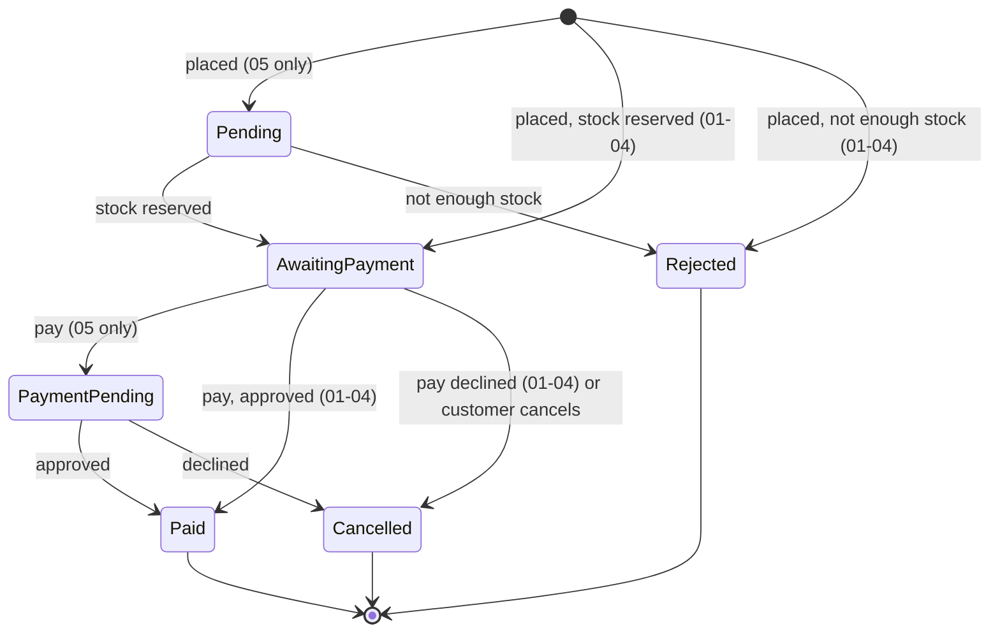

# Architecture Playground — Guide

This guide goes with the code. It explains software architecture from zero. Every acronym is spelled out the first time it appears, and every idea gets a plain-language introduction before any code. Then it walks through the same shop built five different ways.

**How to read it.** Chapters 1–2 are practical: install, run, find your way around the repo. Chapter 3 is the map: the vocabulary and the ideas every later chapter relies on. Chapters 4–8 take one architecture each, in the order they were built, and follow a real request through its layers. Chapters 9–12 put it all together: how styles combine, how to choose, and what this means when you work with AI coding agents. Unknown word? See the [Glossary](#glossary).

## Contents

1. [Setup](#1-setup)
   1. [The .NET SDK](#11-the-net-sdk)
   2. [VS Code and the recommended extensions](#12-vs-code-and-the-recommended-extensions)
   3. [Docker Desktop](#13-docker-desktop)
   4. [.NET Aspire (version 05 only)](#14-net-aspire-version-05-only)
   5. [Everyday commands](#15-everyday-commands)
2. [Project anatomy](#2-project-anatomy)
   1. [Solutions: `.slnx`](#21-solutions-slnx)
   2. [Projects: `.csproj`](#22-projects-csproj)
   3. [Project references: architecture enforced by the compiler](#23-project-references-architecture-enforced-by-the-compiler)
   4. [`Directory.Build.props`](#24-directorybuildprops)
   5. [Central package management](#25-central-package-management)
   6. [`.editorconfig` and analyzers](#26-editorconfig-and-analyzers)
   7. [Kinds of tests](#27-kinds-of-tests)
   8. [The shared contract suite](#28-the-shared-contract-suite)
   9. [Request files (`http/`)](#29-request-files-http)
   10. [Anatomy of a version folder](#210-anatomy-of-a-version-folder)
3. [The map and the primers](#3-the-map-and-the-primers)
   1. [What software architecture is](#31-what-software-architecture-is)
   2. [The four axes](#32-the-four-axes)
   3. [Clean Code is not Clean Architecture](#33-clean-code-is-not-clean-architecture)
   4. [Hexagonal, Onion, Clean: one family](#34-hexagonal-onion-clean-one-family)
   5. [Primer: coupling and cohesion](#35-primer-coupling-and-cohesion)
   6. [Primer: the dependency rule and dependency inversion](#36-primer-the-dependency-rule-and-dependency-inversion)
   7. [Primer: DDD in 10 minutes](#37-primer-ddd-in-10-minutes)
   8. [Primer: CQRS](#38-primer-cqrs)
   9. [Primer: events and messaging](#39-primer-events-and-messaging)
   10. [Primer: transactions and consistency](#310-primer-transactions-and-consistency)
   11. [The shop we build five times](#311-the-shop-we-build-five-times)
4. Layered (N-tier) — *coming in phase 01*
5. Clean / Hexagonal — *coming in phase 02*
6. Vertical Slice — *coming in phase 03*
7. Modular monolith — *coming in phase 04*
8. Microservices — *coming in phase 05*
9. Combining styles — *coming in phase 06*
10. Decision guide — *coming in phase 06*
11. Styles explained but not implemented — *coming in phase 06*
12. Architecture and AI agents — *coming in phase 06*
13. References — *coming in phase 06*
- [Glossary](#glossary)
- Appendix: Java/Spring equivalences — *coming in phase 06*

---

## 1. Setup

### 1.1 The .NET SDK

.NET comes in two flavours:

- The **runtime** *runs* .NET programs. It is what a server needs.
- The **SDK** (Software Development Kit) *builds* them. It contains the runtime, plus the **C# compiler** (Roslyn), the **`dotnet` CLI** (Command-Line Interface: `dotnet build`, `dotnet test`, `dotnet run`…), MSBuild (the build engine) and the project templates.

There is no separate "C# install": installing the SDK installs C#. Each .NET version comes with a C# version (.NET 10 → C# 14).

**Install** (Windows):

```bash
winget install Microsoft.DotNet.SDK.10
```

Then open a **new** terminal, so it sees the updated `PATH`, and check:

```bash
dotnet --list-sdks      # should list 10.0.xxx
dotnet --info           # SDK, runtimes, OS details
```

**`global.json`** at the root pins the SDK this repo builds with:

```json
{
  "sdk": { "version": "10.0.401", "rollForward": "latestFeature" },
  "test": { "runner": "Microsoft.Testing.Platform" },
  "msbuild-sdks": { "Aspire.AppHost.Sdk": "13.6.0" }
}
```

- **`sdk`**: several SDKs can be installed side by side. This makes every `dotnet` command in this folder use 10.0.401 or the newest installed **feature band** of .NET 10 (10.0.4xx, 10.0.5xx…; a feature band is a group of SDK releases that add tooling features without changing the runtime). It never picks .NET 11, so the repo always builds with the same major version. Installing a newer .NET 10 SDK does switch to it silently; `dotnet --version` in the repo tells you which one is in use.
- **`test`**: `dotnet test` runs on **Microsoft.Testing.Platform**, the new test runner of .NET 10 (the older one is called VSTest). xUnit v3 test projects are small executables that this platform runs directly. Without this line, `dotnet test` on the .NET 10 SDK refuses to run them.
- **`msbuild-sdks`**: pins the version of the Aspire project SDK used by version 05 (§1.4).

### 1.2 VS Code and the recommended extensions

When you open the repo, VS Code offers to install the extensions listed in `.vscode/extensions.json`:

| Extension | What it gives you |
|---|---|
| **C# Dev Kit** (`ms-dotnettools.csdevkit`) | C# language support (IntelliSense, refactorings), the **Solution Explorer** (open a version's `Shop.slnx`), and the **Test Explorer** to run and debug tests one by one |
| **REST Client** (`humao.rest-client`) | Send the requests in `http/shop.http` with one click and see the response next to them |
| **EditorConfig** (`editorconfig.editorconfig`) | Applies `.editorconfig` (indentation, line endings) while you type |
| **Container Tools** (`ms-azuretools.vscode-containers`) | See and manage the Docker containers (PostgreSQL, RabbitMQ) from VS Code |
| **Markdown Preview Mermaid Support** (`bierner.markdown-mermaid`) | Renders the **Mermaid** diagrams of this guide and of the READMEs in the Markdown preview (`Ctrl+Shift+V`) |

*Mermaid* is a text format for diagrams: a few lines like `A --> B` become a drawing. GitHub renders it too.

**Opening one version.** With C# Dev Kit, use *File → Open Folder* on the repo root, then in the Solution Explorer pick the `Shop.slnx` of the version you want to study. Each version is a separate solution: you look at one architecture at a time.

Visual Studio 2026 and JetBrains Rider work just as well: open `<version>/Shop.slnx` directly.

### 1.3 Docker Desktop

Docker runs **containers**: lightweight, isolated processes started from an **image** (a packaged program with everything it needs). We use it for infrastructure we do not want to install on the machine:

- **PostgreSQL** (the database) for versions 01–04, started by `compose.yaml` at the repo root.
- **PostgreSQL and RabbitMQ** (the message broker) for version 05, started by Aspire (§1.4).
- **Throwaway containers in the tests**, started by **Testcontainers**: a library that starts a fresh container for a test run and removes it afterwards. So tests never touch your local data.

Docker Desktop must be **running** (whale icon in the system tray) before you start a version or run its tests. `docker info` fails if it is not.

**`compose.yaml`** describes the local PostgreSQL:
- image `postgres:17`, user and password `shop` (development only);
- port **5433** on your machine → 5432 in the container, so it does not clash with another local PostgreSQL;
- a named volume `shop-pgdata`, so data survives restarts;
- `docker/postgres/init.sql`, which creates one database per version the first time: `shop_layered`, `shop_clean`, `shop_slice`, `shop_modular`.

### 1.4 .NET Aspire (version 05 only)

**Aspire** (called *.NET Aspire* until version 13, when it dropped the prefix) is Microsoft's toolkit for running and observing **distributed applications** (several processes that talk to each other) on a developer machine. Version 05 has four processes (three services and an **API gateway**, the single entry point that forwards each request to the right service) plus PostgreSQL and RabbitMQ. Without Aspire you would start each one by hand and wire their addresses together.

With Aspire, one project, the **AppHost**, describes the whole system in C#: "a PostgreSQL with three databases, a RabbitMQ, these three services, this gateway, and who talks to whom". `dotnet run` on the AppHost starts everything and opens the **Aspire dashboard**: logs, traces and metrics of every process in one place. There you can see one order travel through the services.

Aspire comes as NuGet packages (`Aspire.AppHost.Sdk`, `Aspire.Hosting.*`), so **nothing extra needs installing**. The optional **Aspire CLI** (`aspire run`, `aspire new`) is a convenience; chapter 8 shows how to install it if you want it.

### 1.5 Everyday commands

Run them from the repo root. Replace `01-layered` with the version you are working on.

**Database (versions 01–04)**

```bash
docker compose up -d          # start PostgreSQL in the background
docker compose ps             # is it running and healthy?
docker compose down           # stop it (data is kept)
docker compose down -v        # stop it and DELETE the data (the databases are recreated on next start)
docker compose exec postgres psql -U shop -d shop_layered   # SQL prompt inside a version's database (\dt lists tables, \q quits)
```

**Build and test**

```bash
dotnet build 01-layered/Shop.slnx                    # compile the version
dotnet test 01-layered/Shop.slnx                     # all its tests: unit, architecture, contract (Docker must be running)
dotnet test 01-layered/tests/Shop.Layered.UnitTests  # one test project
dotnet test 01-layered/Shop.slnx --filter "FullyQualifiedName~OrderTests"                    # tests whose name contains OrderTests
dotnet test 01-layered/Shop.slnx --filter "FullyQualifiedName~PayingTwice_Returns409"        # one test
dotnet format 01-layered/Shop.slnx                   # fix formatting
dotnet format 01-layered/Shop.slnx --verify-no-changes   # only check it (what the done-checks run)
```

**Run a version**

```bash
dotnet run --project 01-layered/src/Shop.Layered.Api         # http://localhost:5101
dotnet run --project 05-microservices/src/Shop.Micro.AppHost  # everything for 05; gateway on http://localhost:5105
```

Ports: 01 → 5101, 02 → 5102, 03 → 5103, 04 → 5104, 05 → 5105. Several versions can run at once.

**Database migrations (EF Core)**

A **migration** is a versioned C# description of a schema change ("add table `orders`"). EF Core generates it by comparing your model with the last migration. Each version applies its migrations automatically at startup **in Development**. In production you would apply them in a controlled deployment step instead: a migration that runs by surprise on every app start is risky.

The `dotnet ef` tool comes from a local tool manifest added in phase 01 (`dotnet tool restore` installs it for this repo only):

```bash
dotnet tool restore
dotnet ef migrations add AddSomething --project 01-layered/src/Shop.Layered.Data --startup-project 01-layered/src/Shop.Layered.Api
dotnet ef database update --project 01-layered/src/Shop.Layered.Data --startup-project 01-layered/src/Shop.Layered.Api
```

---

## 2. Project anatomy

### 2.1 Solutions: `.slnx`

A **solution** groups projects that are worked on together. `Shop.slnx` is the new XML solution format, the default since .NET 10. It does the same job as the old `.sln` but is short and readable:

```xml
<Solution>
  <Folder Name="/src/">
    <Project Path="src/Shop.Layered.Api/Shop.Layered.Api.csproj" />
  </Folder>
</Solution>
```

Every version has its own `Shop.slnx`, and there is no solution at the root that groups all five. All versions have projects with similar names, so a combined solution would be confusing. One architecture at a time.

### 2.2 Projects: `.csproj`

A **project** compiles to one **assembly** (a `.dll`, or an `.exe` for apps and xUnit v3 test projects). Modern "SDK-style" projects are tiny because the SDK supplies the defaults: every `.cs` file in the folder is included automatically.

```xml
<Project Sdk="Microsoft.NET.Sdk">               <!-- the SDK supplies the defaults -->
  <ItemGroup>
    <ProjectReference Include="..\Shop.Clean.Domain\Shop.Clean.Domain.csproj" />   <!-- may use Domain's types -->
    <PackageReference Include="Microsoft.EntityFrameworkCore" />                   <!-- a NuGet package; no version: see §2.5 -->
  </ItemGroup>
</Project>
```

A web application uses `Sdk="Microsoft.NET.Sdk.Web"` instead, which adds ASP.NET Core. **NuGet** is .NET's package manager: `PackageReference` pulls a library from nuget.org.

### 2.3 Project references: architecture enforced by the compiler

This is the most important idea of this chapter. **A project can only use types from projects it references.** If `Shop.Clean.Domain` does not reference `Shop.Clean.Infrastructure`, then code in Domain *cannot* mention `ShopDbContext`: it does not compile.

So **splitting code into projects turns architectural rules into compiler errors**:

```
Shop.Clean.Api ──► Shop.Clean.Application ──► Shop.Clean.Domain
      │                      ▲
      └──► Shop.Clean.Infrastructure ──┘
```

Domain references nothing, so it cannot depend on EF Core or ASP.NET Core even by accident.

Project references have limits, though, and that is why each version also has **architecture tests** (§2.7):
- References are **transitive**: if Api references Business and Business references Data, then Api can see Data's types too. Version 01 shows this hole on purpose.
- They cannot express rules *inside* one project, such as "a vertical slice must not use another slice" (version 03) or "this class must be internal".

### 2.4 `Directory.Build.props`

MSBuild automatically imports the first `Directory.Build.props` it finds walking **up** from a project's folder. Ours sits at the root, so it applies to every project of every version:

| Setting | Why |
|---|---|
| `TargetFramework` = `net10.0` | Every project targets .NET 10 |
| `Nullable` = `enable` | The compiler warns when something might be `null` and you did not say so (`string?`) |
| `ImplicitUsings` = `enable` | Common `using`s (`System`, `System.Linq`…) are added for you |
| `TreatWarningsAsErrors` = `true` | A warning breaks the build, so warnings never pile up |
| `AnalysisLevel` = `latest-recommended` | Turns on the recommended set of code-quality analyzers (§2.6) |
| `EnforceCodeStyleInBuild` = `true` | Style rules from `.editorconfig` are checked by `dotnet build`, not only in the editor |
| `GenerateDocumentationFile` = `true` | Required for the build to report unused `using`s (IDE0005); warnings about missing XML comments (CS1591) are turned off |
| `InvariantGlobalization` = `true` | Culture-independent behaviour: `12.50` is never formatted as `12,50` |
| `ManagePackageVersionsCentrally` = `true` | Turns on §2.5 |

With one shared file, the five versions differ **only in architecture**, never in compiler settings.

### 2.5 Central package management

`Directory.Packages.props` holds the version of **every** NuGet package used anywhere in the repo:

```xml
<PackageVersion Include="Microsoft.EntityFrameworkCore" Version="10.0.12" />
```

Projects list packages **without** a version (`<PackageReference Include="Microsoft.EntityFrameworkCore" />`). Two projects can therefore never use different versions of the same library, and an upgrade is a one-line change.

Some libraries are **deliberately not used**. MediatR, AutoMapper and FluentAssertions moved to commercial licences in 2025, and MassTransit's new major version (v9) is commercial too. More importantly, writing the small pieces they would provide by hand (a dispatcher, an outbox, a mapping) shows you how those pieces actually work.

### 2.6 `.editorconfig` and analyzers

`.editorconfig` holds the code style: indentation, line endings, file-scoped namespaces, `_camelCase` for private fields, PascalCase for constants, braces always… Editors apply it while you type, and `dotnet format --verify-no-changes` checks it.

**Analyzers** are compiler plug-ins that report problems beyond syntax: possible null dereferences, an unused `using`, a string comparison that depends on the current culture. They are rules with IDs like `CA1707` (code analysis) or `IDE0005` (code style). Because warnings are errors here, analyzers act as an automatic reviewer. The `.editorconfig` file can tune a rule. For example, `CA1707` ("no underscores in member names") is turned off for test code, where names like `PayingTwice_Returns409` read better.

### 2.7 Kinds of tests

Every version has the same three test projects:

| Project | What it tests | Needs Docker? |
|---|---|---|
| `Shop.<V>.UnitTests` | Business rules in isolation: an order cannot be paid twice, a price must be positive… Fast, no database | No |
| `Shop.<V>.ArchitectureTests` | The **rules of the architecture**, written as tests with **ArchUnitNET**: "Domain depends on nothing", "a module only uses another module's Contracts" | No |
| `Shop.<V>.ContractTests` | The **public API**, over HTTP, against the real app and a real database | Yes |

**Architecture tests** deserve a word. ArchUnitNET loads the compiled assemblies and checks rules about their dependencies:

```csharp
// "The domain must not know how it is stored or exposed."
IArchRule rule = Types().That().ResideInAssembly(DomainAssembly)
    .Should().NotDependOnAny(Types().That().ResideInNamespace("Microsoft.EntityFrameworkCore"));
rule.Check(Architecture);
```

These tests are the executable form of the architecture. If someone breaks a rule (a colleague in a hurry, or an AI agent that does not know the design), a test fails and says which rule and why. Chapter 12 builds on this.

**Testing tools:**
- **xUnit v3**: the test framework (`[Fact]` for a test, `[Theory]` for a test with several inputs, plain `Assert`). It runs on Microsoft.Testing.Platform (§1.1).
- `Microsoft.AspNetCore.Mvc.Testing`: its **`WebApplicationFactory`** starts the real API in memory for the tests, with no network port.
- Testcontainers (§1.3).
- **ArchUnitNET**: architecture rules as tests.
- In 05, Aspire's testing host, which starts the whole distributed app for a test run.

### 2.8 The shared contract suite

`contract-tests/Shop.ContractTests` is the only code shared between versions. It is a library of **abstract** test classes (`ProductContractTests`, `OrderContractTests`, `PaymentContractTests`) that only talk HTTP to the public API. Each version's contract test project:

1. implements `IShopApi`: "here is an `HttpClient` pointing at my API, and here is whether I finish orders inside the request or later" (01–04: `WebApplicationFactory` + a PostgreSQL container, `IsAsynchronous = false`; 05: the Aspire testing host calling the gateway, `IsAsynchronous = true`);
2. registers it as an **assembly fixture**: an xUnit v3 feature where one object is created once for the whole test assembly, so the API and database start only once;
3. declares one concrete class per abstract class (`public sealed class OrderTests(LayeredShopApi api) : OrderContractTests(api);`). xUnit then runs the inherited tests.

If every version passes the same suite, then they really are **the same shop**, and comparing their insides is fair. Two details make one suite fit synchronous and asynchronous versions: placing and paying an order answer `201`/`200` when `IsAsynchronous` is false and `202 Accepted` when it is true (only version 05), and the `WaitFor…` helpers poll an order until it leaves its transient states (in 01–04 they return on the first read). The suite's own [README](../contract-tests/Shop.ContractTests/README.md) has the details.

### 2.9 Request files (`http/`)

[`http/shop.http`](../http/shop.http) contains ready-made requests for every endpoint, for the REST Client extension: a full happy path (create product → place order → pay → see the payment), a declined payment and a cancellation. The API is the same in all versions, so one file serves them all: change `@baseUrl` to `{{clean}}`, `{{micro}}`… and send the same requests to another version.

### 2.10 Anatomy of a version folder

```
02-clean-hexagonal/
  README.md              ← the short version of the guide chapter: diagram, journey of a request, trade-offs
  docs/adr/              ← Architecture Decision Records: why this version is built the way it is
  Shop.slnx              ← open this
  src/                   ← production code: one project per layer / module / service
  tests/
    Shop.Clean.UnitTests/
    Shop.Clean.ArchitectureTests/
    Shop.Clean.ContractTests/
```

An **ADR** (Architecture Decision Record) is a short document that records one decision: the **context** (what forced a choice), the **decision**, and its **consequences** (good and bad). ADRs are numbered and never rewritten. If a decision changes, a new ADR replaces the old one. Six months later, they answer the question everybody asks: "why on earth is it done like this?"

---

## 3. The map and the primers

### 3.1 What software architecture is

Every program has a structure: some code calls other code, some data lives somewhere. **Software architecture** is the set of **decisions about that structure that are expensive to change later**:
- how the code is split, and which part may depend on which;
- where the business rules live;
- how many processes there are and how they talk to each other;
- where data is stored, and who owns it.

Renaming a variable is cheap: not architecture. Splitting one application into five services, or moving all business rules out of the database layer, is expensive: architecture.

**Why it matters.** Good structure keeps the cost of change low as the system grows. Bad structure makes every change touch everything. The trap is that there is no best architecture, only **trade-offs**: every style makes some changes cheap and others expensive. Being good at architecture means knowing those trade-offs and choosing the right style for the problem in front of you. That is why this repo builds the same shop five times.

### 3.2 The four axes

Architecture discussions get confusing because people compare styles that answer **different questions**. "Hexagonal or microservices?" is like asking "blue or a car?". The styles sit on four independent axes:

| Axis | Question it answers | Options | In this repo |
|---|---|---|---|
| **A. Code organisation** | How is the code arranged *inside* one deployable application? | N-tier layered · Clean / Hexagonal / Onion · Vertical Slice · simple CRUD / Transaction Script | 01, 02, 03, and mixed in 04–05 |
| **B. Domain modelling** | Where are the boundaries of the business, and how rich is the model? | Anemic model · DDD tactical (aggregates, value objects) · DDD strategic (bounded contexts) | 01 anemic, 02+ rich, 04+ bounded contexts |
| **C. Deployment** | How many processes, and how do they talk? | Monolith · Modular monolith · Microservices (also SOA, serverless) | 01–03 monolith, 04 modular, 05 microservices |
| **D. Data and command flow** | How do changes and reads move through the system? | Synchronous calls · CQRS · domain/integration events · messaging · sagas · event sourcing | 03 CQRS, 04 in-process events, 05 messaging + saga |

A real system picks **one option per axis**, and often a different one per part of the system. Version 05 is "microservices (C), split by bounded context (B), each service with its own internal style (A), talking through messages and a saga (D)". Chapter 9 comes back to this map with all five versions on it.

**Words you will meet everywhere:**
- **Deployable / deployment unit**: something you can start and ship on its own (a web app, a service).
- **Monolith**: the whole application is one deployable. This is not an insult. Most successful systems start as one.
- **Layer**: a group of code with one kind of responsibility (presentation, business, data), with rules about which layer may call which.
- **Module**: a part of the application with a clear boundary and a small public surface, usually one area of the business.

**The options in the table, in one line each** (the chapters give each its full explanation):

*Axis A — inside one application*
- **N-tier layered**: horizontal layers stacked on top of each other: presentation → business → data, each calling the one below. "Tier" originally meant a physical machine; today "layer" and "tier" are used loosely for the same idea. Chapter 4.
- **Clean / Hexagonal / Onion**: the business rules in the centre, and every technology plugged in from the outside (§3.4). Chapter 5.
- **Vertical Slice**: one folder per use case ("place an order") containing everything that use case needs, instead of one folder per technical layer. Chapter 6.
- **Transaction Script**: each operation is one straightforward procedure that reads, decides and writes, with no domain model. Perfect for simple CRUD. Used for Catalog in 04.

*Axis C — how many processes*
- **Modular monolith**: one deployable, split inside into modules with strict boundaries. Chapter 7.
- **Microservices**: each business capability is a separate, independently deployable service with its own database, and services talk over the network. Chapter 8.
- **SOA** (Service-Oriented Architecture): the 2000s ancestor of microservices: large shared services, often connected through a central "enterprise service bus". Common in big, older enterprises. Chapter 11.
- **Serverless**: you deploy individual functions (Azure Functions, AWS Lambda) and the cloud runs them on demand; there is no server for you to manage. Chapter 11.

*Axis D — how changes flow*
- **CQRS, events, messaging, sagas**: see the primers §3.8–§3.10.
- **Event sourcing**: instead of storing the current state ("stock = 3"), you store every event that happened ("added 5", "reserved 2") and compute the state by replaying them. It gives a full history, but it is a big step up in complexity. Chapter 11.

### 3.3 Clean Code is not Clean Architecture

Two books by the same author (Robert C. Martin, "Uncle Bob") that are often confused:

- ***Clean Code*** (2008) is about writing good code **in the small**: meaningful names, short functions that do one thing, no duplication, readable tests. It applies to any architecture.
- ***Clean Architecture*** (2017) is about **structure**: how to arrange the parts of a system so that business rules do not depend on frameworks, databases or the UI. It is axis A, and it is version 02.

You can write clean code in a messy architecture, and messy code in a clean architecture. They are separate skills.

### 3.4 Hexagonal, Onion, Clean: one family

These three are often presented as rivals, but they are **the same idea drawn three ways**, each building on the one before:

| Name | Author, year | Picture | Vocabulary |
|---|---|---|---|
| **Hexagonal Architecture**, also called **Ports and Adapters** | Alistair Cockburn, 2005 | The application is a hexagon; the outside world plugs into its sides | **Ports** (interfaces the application defines), **adapters** (implementations that connect a port to a technology: a web controller, an EF repository). *Driving* adapters call the application (HTTP API, tests); *driven* adapters are called by it (database, payment gateway). |
| **Onion Architecture** | Jeffrey Palermo, 2008 | Concentric rings | Domain model at the centre, then domain services, application services, and infrastructure/UI on the outer ring |
| **Clean Architecture** | Robert C. Martin, 2012 (blog), 2017 (book) | Concentric circles | Entities → Use Cases → Interface Adapters → Frameworks & Drivers |

The shared idea is one rule:

> **Source code dependencies point inwards.** The business rules at the centre know nothing about the database, the web framework or any other technology. The outer parts depend on the centre, never the other way round.

When you used "Clean Architecture" in .NET with `Domain`, `Application`, `Infrastructure` and `Api` projects, you were doing all three at once. The hexagon's ports are the interfaces in `Application`, and its adapters live in `Infrastructure` and `Api`. Chapter 5 maps every project of version 02 to all three vocabularies.

### 3.5 Primer: coupling and cohesion

Two words that sit behind almost every architectural argument:

- **Coupling** measures how much one part depends on another. If changing A forces changes in B, then A and B are coupled. **Low coupling** is the goal: parts that can change independently.
- **Cohesion** measures how much the things *inside* one part belong together. A class or module where everything serves one purpose has **high cohesion**. A `Utils` class with dates, emails and taxes has low cohesion.

Every style in this repo is a different answer to "what should be grouped together (cohesion) and what should be kept apart (coupling)?":
- **Layered (01)** groups by **technical kind**: all controllers together, all data access together.
- **Vertical Slice (03)** groups by **use case**: everything for "place an order" together.
- **Modular monolith and microservices (04–05)** group by **business capability**: everything about payments together.

### 3.6 Primer: the dependency rule and dependency inversion

Two directions are easy to mix up:
- **Call direction (runtime):** who calls whom while the program runs. A use case *calls* the repository to save an order.
- **Dependency direction (compile time):** whose code mentions whose. Which project references which, and which `using` you write.

In a naive design they point the same way. The business code calls the database code *and* depends on it:

```csharp
// Business depends on the database technology. Swapping the database or
// unit-testing PlaceOrder means touching business code.
public sealed class PlaceOrder(ShopDbContext db)
{
    public async Task Handle(Order order) { db.Orders.Add(order); await db.SaveChangesAsync(); }
}
```

**Dependency inversion** (the "D" of **SOLID**, five classic object-oriented design principles: Single responsibility, Open/closed, Liskov substitution, Interface segregation, Dependency inversion) flips the dependency without changing the call. The business code declares the interface it *needs*, which is a **port**. The technology code *implements* it, which is an **adapter**:

```csharp
// Application (inner): owns the interface, knows nothing about EF Core.
public interface IOrderRepository { Task Add(Order order); }
public sealed class PlaceOrder(IOrderRepository orders)
{
    public Task Handle(Order order) => orders.Add(order);
}

// Infrastructure (outer): depends on Application, implements its port.
public sealed class EfOrderRepository(ShopDbContext db) : IOrderRepository
{
    public async Task Add(Order order) { db.Orders.Add(order); await db.SaveChangesAsync(); }
}
```

At runtime `PlaceOrder` still calls into EF Core, but at compile time Infrastructure depends on Application, not the other way round. **The call goes out; the dependency points in.** The **dependency rule** of §3.4 is this trick applied everywhere. Dependency injection (`builder.Services.AddScoped<IOrderRepository, EfOrderRepository>()`) is what connects the two at startup.

The payoffs are a business core you can unit-test with a fake repository, and technology you can replace without touching business rules. The costs are more types, more projects and more indirection. Chapter 5 shows when that is worth it.

### 3.7 Primer: DDD in 10 minutes

**DDD** stands for **Domain-Driven Design**, from Eric Evans' 2003 book of the same name. The **domain** is the area of business the software serves: here, a shop. DDD's central idea is that **the structure and the language of the code should follow the business**, so that developers and business experts talk about the same things with the same words.

DDD has two halves.

**Strategic DDD: the big picture, the boundaries.**
- **Ubiquitous language**: one precise vocabulary shared by the business and the code. If the business says "the order is *placed*", the method is `Place()`, not `Create()` or `Insert()`.
- **Bounded context**: a boundary inside which one model and one language apply. The same word can mean different things in different contexts. A *product* in **Catalog** has a description, a price and stock. A *product* in **Ordering** is just an id, a name and a price frozen at the time of the order. Forcing one `Product` class to serve both creates a model that fits neither. So each context gets its own. Our shop has three bounded contexts: **Catalog**, **Ordering** and **Payments**.
- **Context map**: how bounded contexts relate and talk to each other. In 04 and 05, Ordering asks Catalog for prices and they exchange events about stock.

Strategic DDD is what tells you **where to cut** a modular monolith into modules, or a system into microservices. Cutting in the wrong place is the most expensive architectural mistake there is.

**Tactical DDD: the building blocks inside one context.**
- **Entity**: an object with an **identity** that lasts through changes. An `Order` is still the same order after its status changes, because it keeps its id.
- **Value object**: an object defined only by its **values**, immutable, with no id. `Money(12.50)` is equal to any other `Money(12.50)`. Value objects are a great place for rules: a `Money` that cannot be negative or have three decimals means no code anywhere can hold an invalid amount.
- **Aggregate**: a cluster of entities and value objects treated as **one unit for changes**, with one entry point, the **aggregate root**. `Order` (the root) and its `OrderLine`s form an aggregate. You never edit a line directly. You ask the order, and the order enforces the rules ("a paid order cannot be cancelled"). A common rule of thumb (from Vaughn Vernon's *Implementing Domain-Driven Design*) is **one transaction changes one aggregate**, so aggregates stay small and do not lock each other. Versions 02–03 knowingly break it: placing an order changes the `Order` *and* the stock of each `Product` in one transaction, because in one database that is the simplest way to never oversell. Versions 04–05 show the alternative: separate steps connected by events (§3.10).
- **Domain event**: a record that something meaningful happened in the domain, named in the past tense: `OrderPlaced`, `PaymentDeclined`. Other parts react to it without the aggregate knowing them.
- **Repository**: the collection-like interface to load and save whole aggregates (`IOrderRepository`).
- **Domain service**: a business operation that does not naturally belong to one entity.

The opposite of a rich model is an **anemic domain model**: classes with only getters and setters, where all the rules live in "service" classes. Version 01 is deliberately anemic. Version 02 moves the rules into the `Order` aggregate and value objects.

**When DDD is worth it:** when the business rules are rich, and they are the reason the software exists. It is **not** worth it for a simple CRUD screen (Create, Read, Update, Delete: just storing and showing data). Version 04 makes exactly this choice: Ordering gets tactical DDD, Catalog stays simple CRUD.

### 3.8 Primer: CQRS

**CQRS** stands for **Command Query Responsibility Segregation**. It means **handling changes and reads separately**:

- A **command** changes state and returns little or nothing: `PlaceOrder`, `PayOrder`. Commands go through the business rules, usually through an aggregate.
- A **query** reads state and changes nothing: `GetOrder`, `ListProducts`. Queries can skip the domain model entirely and read straight into the response shape with a **projection** (a query that selects only the columns the response needs, `Select(o => new OrderResponse(...))`, instead of loading whole entities), which is simpler and faster.

The light version (used in 03) is just this split in the code, over **one database**: command handlers load aggregates and save them, while query handlers run a projection (`Select(o => new OrderResponse(...))`) with `AsNoTracking`. The heavy version uses **separate read and write databases** kept in sync by events. It is powerful for very read-heavy systems, but it brings eventual consistency (§3.10). CQRS is a choice on axis D and fits any style on axis A.

### 3.9 Primer: events and messaging

An **event** is a fact about the past: "order 42 was placed". Events let one part of the system react to another without the sender knowing who listens, which is low coupling (§3.5).

- **Domain event**: raised *inside* a bounded context, about its own model (`Order` raises `OrderPlaced`). It is handled in the same process, usually in the same transaction.
- **Integration event**: published to *other* bounded contexts, as part of the context's public contract. It contains only what others need (ids, amounts), never internal objects.

How the parts talk:
- **Synchronous** (request/response, such as HTTP or a direct method call): the caller waits for the answer. Simple, but the caller fails if the other side is down, and their response times add up.
- **Asynchronous messaging**: the sender puts a **message** on a **message broker** (RabbitMQ in 05) and carries on. The broker delivers it to the receivers when they are ready. This decouples them in time: the receiver can be down for a minute and catch up later. The price is that the result is not immediate, and it brings its own problems, which version 05 tackles (chapter 8):
  - *Saving and publishing are two operations.* If the app crashes between "save the order" and "publish OrderPlaced", the message is lost. The **transactional outbox** fixes this: the message is saved in an `outbox` table **in the same transaction** as the data, and a background worker publishes it afterwards.
  - *Brokers may deliver a message twice.* The **inbox** fixes this: the receiver records the id of every message it has handled, in the same transaction as its own changes, and ignores repeats. Handling a message twice then has the same effect as handling it once, which is called being **idempotent**.
  - *A process spans several services and can fail half-way.* A **saga** coordinates it (§3.10).

A **message broker** is a server that receives messages and routes them to queues, where consumers pick them up. RabbitMQ, Azure Service Bus and Kafka are common ones.

### 3.10 Primer: transactions and consistency

A **transaction** is a group of database changes that succeed or fail together. It guarantees **ACID**:
- **Atomicity**: all or nothing.
- **Consistency**: rules such as constraints hold before and after.
- **Isolation**: concurrent transactions do not see each other's half-done work.
- **Durability**: once committed, the changes survive a crash.

In 01–03, "reserve stock + save the order" is one transaction in one database. Either both happen or neither does, and the data is never half-updated. That is **strong consistency**, and it is very convenient.

Once data lives in **different databases owned by different services** (05), no single transaction covers them. You accept **eventual consistency** instead: for a short time the parts may disagree (the order says `Pending` while Catalog already reserved the stock), but they converge once all messages are processed. A **saga** coordinates such a multi-step process as a sequence of local transactions. When a later step fails, it runs **compensating actions**: if the payment is declined, it *releases* the stock reserved earlier.

**Concurrency** is the other half of consistency: two requests changing the same data at once. Two customers ordering the last unit must never both get it. Every version handles this, either with **optimistic concurrency** (each row carries a version; a save fails if someone changed the row in the meantime, and the code retries) or with a **conditional update** (`UPDATE … SET stock = stock - 1 WHERE stock >= 1`). The contract test `ConcurrentOrdersForLastUnits_NeverOversell` checks it for all five versions.

### 3.11 The shop we build five times

Three bounded contexts:

| Context | Owns | Operations |
|---|---|---|
| **Catalog** | Products: name, SKU, price, stock | Create a product, list and get, change the price, adjust stock (never below 0), reserve and release stock for orders |
| **Ordering** | Orders and their lines | Place an order (prices are copied at that moment), pay it, cancel it, get it |
| **Payments** | Payments | Charge an order through a **fake gateway**: totals up to 1000.00 are approved, anything above is declined |

A **SKU** (Stock Keeping Unit) is the shop's own product code, like `MUG-001`. It is unique and case-insensitive, and it is stored in upper case.

**The life of an order** is where the rules are:



- Every move to `Cancelled` gives the reserved stock back. `Rejected` never reserved any.
- Anything else, such as paying twice, paying a rejected order or cancelling a paid one, is refused with `409 Conflict`.
- `Pending` and `PaymentPending` exist only in version 05, where the work is asynchronous and the order waits for answers from other services.

**The public API** is identical in every version:

| Request | Does |
|---|---|
| `POST /api/products`, `GET /api/products`, `GET /api/products/{id}` | Create, list, get products |
| `PUT /api/products/{id}/price`, `POST /api/products/{id}/stock-adjustments` | Change price, add or remove stock |
| `POST /api/orders`, `GET /api/orders/{id}` | Place, get an order |
| `POST /api/orders/{id}/pay`, `POST /api/orders/{id}/cancel` | Pay, cancel an order |
| `GET /api/payments?orderId={id}` | Get the payment of an order |

Errors use **ProblemDetails** (RFC 9457), a standard JSON format for HTTP errors (`type`, `title`, `status`, `detail`, plus `errors` for validation). An **RFC** (Request for Comments) is a numbered internet standard. Status codes: `400` invalid request, `404` not found, `409` the request conflicts with a business rule or the current state.

---

## Glossary

Terms are added as each chapter introduces them. The section where a term is explained is in brackets.

- **ACID**: Atomicity, Consistency, Isolation, Durability, the guarantees of a database transaction. [§3.10]
- **Adapter**: in Hexagonal Architecture, code that connects a port to a concrete technology (an HTTP endpoint, an EF Core repository). *Driving* adapters call the application; *driven* adapters are called by it. [§3.4]
- **ADR**: Architecture Decision Record, a short numbered document with the context, the decision and the consequences of one architectural choice. [§2.10]
- **Aggregate / aggregate root**: a cluster of domain objects changed as one unit through a single entry point (the root), which enforces the rules. [§3.7]
- **Analyzer**: a compiler plug-in that reports code problems as warnings with an ID (`CA…`, `IDE…`). [§2.6]
- **Anemic domain model**: domain classes with data but no behaviour; the rules live in service classes. [§3.7]
- **API gateway**: the single entry point of a distributed system; it forwards each request to the right service (YARP in 05). [§1.4]
- **Architecture test**: an automated test that checks the dependency rules of an architecture (ArchUnitNET here). [§2.7]
- **ArchUnitNET**: a .NET library to write architecture rules as tests. [§2.7]
- **Aspire**: Microsoft's toolkit (formerly ".NET Aspire") to run, wire and observe a distributed application locally. The AppHost describes the system; the dashboard shows logs and traces. [§1.4]
- **Assembly**: the compiled output of a project (`.dll` / `.exe`). [§2.2]
- **Assembly fixture**: an xUnit v3 object created once for all the tests in an assembly. [§2.8]
- **Bounded context**: a boundary inside which one domain model and one language apply. [§3.7]
- **Call direction / dependency direction**: who calls whom at runtime, versus whose code references whose at compile time. [§3.6]
- **Central package management**: all NuGet versions in one `Directory.Packages.props`. [§2.5]
- **Clean Architecture**: Robert C. Martin's version of "business rules in the centre, dependencies point inwards" (2012/2017). [§3.4]
- **Clean Code**: Robert C. Martin's book (2008) about writing readable code in the small. Not an architecture. [§3.3]
- **CLI**: Command-Line Interface; here, the `dotnet` command. [§1.1]
- **Cohesion**: how much the things inside one part belong together. High is good. [§3.5]
- **Command**: a request to change state (`PlaceOrder`). [§3.8]
- **Compensating action**: a step that undoes the effect of an earlier step when a later one fails (release stock after a declined payment). [§3.10]
- **Concurrency**: several requests working on the same data at the same time. [§3.10]
- **Conditional update**: an `UPDATE` that only applies if a condition still holds (`WHERE stock >= 1`), so a race cannot oversell. [§3.10]
- **Container / image**: an isolated running process (Docker) / the package it starts from. [§1.3]
- **Context map**: how bounded contexts relate and communicate. [§3.7]
- **Contract test**: a test of the public API over HTTP only; here, shared by all versions. [§2.8]
- **Coupling**: how much one part depends on another. Low is good. [§3.5]
- **CQRS**: Command Query Responsibility Segregation, handling changes and reads separately. [§3.8]
- **CRUD**: Create, Read, Update, Delete; an application that mostly stores and shows data. [§3.7]
- **DDD**: Domain-Driven Design, shaping code, boundaries and language after the business domain. Strategic (boundaries) and tactical (building blocks). [§3.7]
- **Dependency injection (DI)**: supplying a class's dependencies from outside (constructor parameters), wired at startup. [§3.6]
- **Dependency inversion**: high-level code owns the interface it needs; low-level code implements it, so the dependency points to the high-level code. [§3.6]
- **Dependency rule**: source code dependencies point inwards, towards the business rules. [§3.4]
- **Deployable**: something you can start and ship on its own. [§3.2]
- **Docker Compose**: a tool that starts the containers described in a `compose.yaml` file. [§1.3]
- **Domain**: the area of business the software serves. [§3.7]
- **Domain event**: something meaningful that happened inside a bounded context, named in the past tense. [§3.9]
- **Domain service**: a business operation that does not naturally belong to one entity. [§3.7]
- **Entity**: a domain object with an identity that lasts through changes. [§3.7]
- **Event**: a fact about something that happened (`OrderPlaced`). [§3.9]
- **Event sourcing**: storing every event instead of the current state, and computing the state by replaying them. [§3.2]
- **Eventual consistency**: parts of the system may disagree for a short time but converge. [§3.10]
- **Feature band**: a group of SDK releases (10.0.4xx) that adds tooling features without changing the runtime. [§1.1]
- **`global.json`**: the file that pins the .NET SDK, the test runner and project SDK versions for a folder. [§1.1]
- **Hexagonal Architecture / Ports and Adapters**: Alistair Cockburn's style (2005): the application defines ports, and adapters connect them to technologies. [§3.4]
- **Idempotent**: doing it twice has the same effect as doing it once. [§3.9]
- **Inbox**: a table of already-handled message ids, used to ignore duplicate deliveries. [§3.9]
- **Integration event**: an event published to other bounded contexts, part of a context's public contract. [§3.9]
- **Layer**: a group of code with one kind of responsibility, with rules about which layers it may use. [§3.2]
- **Mermaid**: a text format for diagrams, rendered by GitHub and by VS Code with an extension. [§1.2]
- **Message**: a piece of data sent from one part of a system to another, often through a broker. [§3.9]
- **Message broker**: a server that receives messages and delivers them to consumers through queues (RabbitMQ). [§3.9]
- **Microservices**: independently deployable services, each owning one business capability and its data. [§3.2]
- **Microsoft.Testing.Platform**: the .NET 10 test runner used by `dotnet test` here (the older one is VSTest). [§1.1]
- **Migration (EF Core)**: a versioned, generated description of a database schema change. [§1.5]
- **Modular monolith**: one deployable split inside into modules with strict boundaries. [§3.2]
- **Module**: a part of an application with a clear boundary and a small public surface. [§3.2]
- **Monolith**: an application deployed as a single unit. [§3.2]
- **MSBuild**: the .NET build engine that reads `.csproj` and `.props` files. [§1.1]
- **N-tier (layered) architecture**: horizontal layers (presentation → business → data), each calling the one below. [§3.2]
- **NuGet**: .NET's package manager and the nuget.org package registry. [§2.2]
- **Onion Architecture**: Jeffrey Palermo's style (2008): the domain model in the centre, with concentric rings around it. [§3.4]
- **Optimistic concurrency**: detecting, at save time, that someone else changed the row since you read it, and retrying. [§3.10]
- **Outbox (transactional)**: saving outgoing messages in the same transaction as the data and publishing them afterwards, so none is lost. [§3.9]
- **Port**: in Hexagonal Architecture, an interface defined by the application for something it needs or offers. [§3.4]
- **PostgreSQL**: the open-source relational database used by every version. [§1.3]
- **ProblemDetails**: the standard JSON format for HTTP API errors (RFC 9457). [§3.11]
- **Project (SDK-style)**: a `.csproj` that compiles to one assembly, with defaults supplied by the SDK. [§2.2]
- **Projection**: a query that selects exactly the data a response needs, instead of loading whole entities. [§3.8]
- **Query**: a request that reads state and changes nothing (`GetOrder`). [§3.8]
- **RabbitMQ**: the open-source message broker used by version 05. [§3.9]
- **Repository**: a collection-like interface to load and save aggregates. [§3.7]
- **RFC**: Request for Comments, a numbered internet standard. [§3.11]
- **Roslyn**: the C# compiler. [§1.1]
- **Runtime**: the part of .NET that runs compiled programs. [§1.1]
- **Saga**: a multi-step process across services, made of local transactions, with compensating actions on failure. [§3.10]
- **SDK**: Software Development Kit; for .NET, the runtime + C# compiler + `dotnet` CLI + MSBuild. [§1.1]
- **Serverless**: deploying individual functions that the cloud runs on demand. [§3.2]
- **SKU**: Stock Keeping Unit, the shop's own unique product code. [§3.11]
- **SOA**: Service-Oriented Architecture, large shared services often joined by an enterprise service bus; the ancestor of microservices. [§3.2]
- **Software architecture**: the decisions about a system's structure that are expensive to change. [§3.1]
- **Solution (`.slnx`)**: a file that groups the projects worked on together. [§2.1]
- **SOLID**: five object-oriented design principles: Single responsibility, Open/closed, Liskov substitution, Interface segregation, Dependency inversion. [§3.6]
- **Strong consistency**: every reader sees the latest committed data at once, as with one database transaction. [§3.10]
- **Testcontainers**: a library that starts throwaway Docker containers for tests. [§1.3]
- **Transaction**: a group of database changes that succeed or fail together. [§3.10]
- **Transaction Script**: each operation is one procedure that reads, decides and writes, with no domain model. [§3.2]
- **Ubiquitous language**: one precise vocabulary shared by business experts and code. [§3.7]
- **Value object**: an immutable domain object defined only by its values (`Money`). [§3.7]
- **Vertical Slice architecture**: code organised by use case, one folder per feature, instead of by technical layer. [§3.2]
- **Volume (Docker)**: storage that outlives a container, used here to keep the database data. [§1.3]
- **WebApplicationFactory**: starts an ASP.NET Core app in memory for tests. [§2.7]
- **xUnit**: the test framework used here (version 3). [§2.7]
