# Architecture Playground — Guide

This guide goes with the code. It explains software architecture from zero. Every acronym is spelled out the first time it appears, and every idea gets a plain-language introduction before any code. Then it walks through the same shop built five different ways.

**How to read it.** Chapters 1–2 are practical: install, run, find your way around the repo. Chapter 3 is the map: the vocabulary and the ideas every later chapter relies on. Chapters 4–8 take one architecture each, in the order they were built, and follow a real request through its layers. Chapters 9–12 put it all together: how styles combine, how to choose, the styles not built here, and what this means when you work with AI coding agents. Chapter 13 lists the books and articles behind it all, and the appendix maps every .NET piece to Java and Spring. Unknown word? See the [Glossary](#glossary).

**A shorter path.** Short on time? Read §3.2 (the four axes), §9.1 (the same request in all five versions), §10.3 (the comparison table) and the "Trade-offs" section of each version chapter.

## Contents

1. [Setup](#1-setup)
   1. [The .NET SDK](#11-the-net-sdk)
   2. [VS Code and the recommended extensions](#12-vs-code-and-the-recommended-extensions)
   3. [Docker Desktop](#13-docker-desktop)
   4. [.NET Aspire (version 05 only)](#14-net-aspire-version-05-only)
   5. [Everyday commands](#15-everyday-commands)
   6. [First run on a new machine: where the database comes from](#16-first-run-on-a-new-machine-where-the-database-comes-from)
2. [Project anatomy](#2-project-anatomy)
   1. [Solutions: `.slnx`](#21-solutions-slnx)
   2. [Projects: `.csproj`](#22-projects-csproj)
   3. [Project references: architecture enforced by the compiler](#23-project-references-architecture-enforced-by-the-compiler)
   4. [`Directory.Build.props`](#24-directorybuildprops)
   5. [Central package management](#25-central-package-management)
   6. [`.editorconfig` and analyzers](#26-editorconfig-and-analyzers)
   7. [Kinds of tests](#27-kinds-of-tests)
   8. [The shared contract suite](#28-the-shared-contract-suite)
   9. [Request files (`http/`)](#29-request-files-http)
   10. [Anatomy of a version folder](#210-anatomy-of-a-version-folder)
3. [The map and the primers](#3-the-map-and-the-primers)
   1. [What software architecture is](#31-what-software-architecture-is)
   2. [The four axes](#32-the-four-axes)
   3. [Clean Code is not Clean Architecture](#33-clean-code-is-not-clean-architecture)
   4. [Hexagonal, Onion, Clean: one family](#34-hexagonal-onion-clean-one-family)
   5. [Primer: coupling and cohesion](#35-primer-coupling-and-cohesion)
   6. [Primer: the dependency rule and dependency inversion](#36-primer-the-dependency-rule-and-dependency-inversion)
   7. [Primer: DDD in 10 minutes](#37-primer-ddd-in-10-minutes)
   8. [Primer: CQRS](#38-primer-cqrs)
   9. [Primer: events and messaging](#39-primer-events-and-messaging)
   10. [Primer: transactions and consistency](#310-primer-transactions-and-consistency)
   11. [The shop we build five times](#311-the-shop-we-build-five-times)
4. [Layered (N-tier)](#4-layered-n-tier)
   1. [The idea](#41-the-idea)
   2. [Layers and their responsibilities](#42-layers-and-their-responsibilities)
   3. [Using it](#43-using-it)
   4. [Before our code runs: what ASP.NET Core does](#44-before-our-code-runs-what-aspnet-core-does)
   5. [Journey of a request](#45-journey-of-a-request)
   6. [Rules](#46-rules)
   7. [What changed from the previous version](#47-what-changed-from-the-previous-version)
   8. [Trade-offs](#48-trade-offs)
   9. [Interview questions](#49-interview-questions)
5. [Clean / Hexagonal](#5-clean--hexagonal)
   1. [The idea](#51-the-idea)
   2. [Layers, ports and adapters](#52-layers-ports-and-adapters)
   3. [Using it](#53-using-it)
   4. [Dependency inversion, made visible](#54-dependency-inversion-made-visible)
   5. [Journey of a request](#55-journey-of-a-request)
   6. [Rules](#56-rules)
   7. [What changed from version 01](#57-what-changed-from-version-01)
   8. [Trade-offs](#58-trade-offs)
   9. [Interview questions](#59-interview-questions)
6. [Vertical Slice](#6-vertical-slice)
   1. [The idea](#61-the-idea)
   2. [Slices and their responsibilities](#62-slices-and-their-responsibilities)
   3. [Using it](#63-using-it)
   4. [Commands and queries: light CQRS](#64-commands-and-queries-light-cqrs)
   5. [Journey of a request](#65-journey-of-a-request)
   6. [Rules](#66-rules)
   7. [What changed from version 02](#67-what-changed-from-version-02)
   8. [Trade-offs](#68-trade-offs)
   9. [Interview questions](#69-interview-questions)
7. [Modular monolith](#7-modular-monolith)
   1. [The idea](#71-the-idea)
   2. [Modules and their responsibilities](#72-modules-and-their-responsibilities)
   3. [How modules talk: contracts, events and one transaction](#73-how-modules-talk-contracts-events-and-one-transaction)
   4. [Using it](#74-using-it)
   5. [Journey of a request](#75-journey-of-a-request)
   6. [Rules](#76-rules)
   7. [What changed from version 03](#77-what-changed-from-version-03)
   8. [Trade-offs](#78-trade-offs)
   9. [Interview questions](#79-interview-questions)
8. [Microservices](#8-microservices)
   1. [The idea](#81-the-idea)
   2. [Services and their responsibilities](#82-services-and-their-responsibilities)
   3. [Running and watching it with Aspire](#83-running-and-watching-it-with-aspire)
   4. [Messaging done safely: broker, outbox, inbox](#84-messaging-done-safely-broker-outbox-inbox)
   5. [The saga: orchestration and compensation](#85-the-saga-orchestration-and-compensation)
   6. [Journey of a request](#86-journey-of-a-request)
   7. [Rules](#87-rules)
   8. [What changed from version 04](#88-what-changed-from-version-04)
   9. [Trade-offs](#89-trade-offs)
   10. [Interview questions](#810-interview-questions)
9. [Combining styles](#9-combining-styles)
   1. [The same request in five versions](#91-the-same-request-in-five-versions)
   2. [The five versions on the four axes](#92-the-five-versions-on-the-four-axes)
   3. [Choosing per bounded context](#93-choosing-per-bounded-context)
   4. [Hexagonal inside a microservice](#94-hexagonal-inside-a-microservice)
   5. [CQRS and slices on any style](#95-cqrs-and-slices-on-any-style)
   6. [How a system moves between styles](#96-how-a-system-moves-between-styles)
   7. [Interview questions](#97-interview-questions)
10. [Decision guide](#10-decision-guide)
    1. [What drives the decision](#101-what-drives-the-decision)
    2. [Decision points](#102-decision-points)
    3. [The five versions compared](#103-the-five-versions-compared)
    4. [Common mistakes](#104-common-mistakes)
    5. [Keeping a decision honest](#105-keeping-a-decision-honest)
    6. [Interview questions](#106-interview-questions)
11. [Styles explained but not implemented](#11-styles-explained-but-not-implemented)
    1. [MVC, MVP and MVVM: patterns for user interfaces](#111-mvc-mvp-and-mvvm-patterns-for-user-interfaces)
    2. [Microkernel (plug-in) architecture](#112-microkernel-plug-in-architecture)
    3. [Pipes and filters](#113-pipes-and-filters)
    4. [Event-driven architecture](#114-event-driven-architecture)
    5. [Event sourcing](#115-event-sourcing)
    6. [SOA and the enterprise service bus](#116-soa-and-the-enterprise-service-bus)
    7. [Serverless](#117-serverless)
    8. [Micro-frontends](#118-micro-frontends)
    9. [Other names you will hear](#119-other-names-you-will-hear)
12. [Architecture and AI agents](#12-architecture-and-ai-agents)
    1. [Why agents and architecture meet](#121-why-agents-and-architecture-meet)
    2. [Tell: ADRs and agent instruction files](#122-tell-adrs-and-agent-instruction-files)
    3. [Enforce: guardrails that fail the build](#123-enforce-guardrails-that-fail-the-build)
    4. [Verify: reviewing agent output against the rules](#124-verify-reviewing-agent-output-against-the-rules)
    5. [Structures that help agents](#125-structures-that-help-agents)
    6. [How this repo was built](#126-how-this-repo-was-built)
    7. [Interview questions](#127-interview-questions)
13. [References](#13-references)
    1. [Architecture in general](#131-architecture-in-general)
    2. [Layered, Clean, Hexagonal, Onion](#132-layered-clean-hexagonal-onion)
    3. [Vertical slices and CQRS](#133-vertical-slices-and-cqrs)
    4. [Domain-Driven Design](#134-domain-driven-design)
    5. [Modular monoliths and microservices](#135-modular-monoliths-and-microservices)
    6. [Messaging, consistency and data](#136-messaging-consistency-and-data)
    7. [Decisions, rules and agents](#137-decisions-rules-and-agents)
- [Glossary](#glossary)
- [Appendix: Java/Spring equivalences](#appendix-javaspring-equivalences)

---

## 1. Setup

### 1.1 The .NET SDK

.NET comes in two flavours:

- The **runtime** *runs* .NET programs. It is what a server needs.
- The **SDK** (Software Development Kit) *builds* them. It contains the runtime, plus the **C# compiler** (Roslyn), the **`dotnet` CLI** (Command-Line Interface: `dotnet build`, `dotnet test`, `dotnet run`…), MSBuild (the build engine) and the project templates.

There is no separate "C# install": installing the SDK installs C#. Each .NET version comes with a C# version (.NET 10 → C# 14).

**Install** (Windows):

```bash
winget install Microsoft.DotNet.SDK.10
```

Then open a **new** terminal, so it sees the updated `PATH`, and check:

```bash
dotnet --list-sdks      # should list 10.0.xxx
dotnet --info           # SDK, runtimes, OS details
```

**`global.json`** at the root pins the SDK this repo builds with:

```json
{
  "sdk": { "version": "10.0.401", "rollForward": "latestFeature" },
  "test": { "runner": "Microsoft.Testing.Platform" },
  "msbuild-sdks": { "Aspire.AppHost.Sdk": "13.6.0" }
}
```

- **`sdk`**: several SDKs can be installed side by side. This makes every `dotnet` command in this folder use 10.0.401 or the newest installed **feature band** of .NET 10 (10.0.4xx, 10.0.5xx…; a feature band is a group of SDK releases that add tooling features without changing the runtime). It never picks .NET 11, so the repo always builds with the same major version. Installing a newer .NET 10 SDK does switch to it silently; `dotnet --version` in the repo tells you which one is in use.
- **`test`**: `dotnet test` runs on **Microsoft.Testing.Platform**, the new test runner of .NET 10 (the older one is called VSTest). xUnit v3 test projects are small executables that this platform runs directly. Without this line, `dotnet test` on the .NET 10 SDK refuses to run them.
- **`msbuild-sdks`**: pins the version of the Aspire project SDK used by version 05 (§1.4).

### 1.2 VS Code and the recommended extensions

When you open the repo, VS Code offers to install the extensions listed in `.vscode/extensions.json`:

| Extension | What it gives you |
|---|---|
| **C# Dev Kit** (`ms-dotnettools.csdevkit`) | C# language support (IntelliSense, refactorings), the **Solution Explorer** (open a version's `Shop.slnx`), and the **Test Explorer** to run and debug tests one by one |
| **REST Client** (`humao.rest-client`) | Send the requests in `http/shop.http` with one click and see the response next to them |
| **EditorConfig** (`editorconfig.editorconfig`) | Applies `.editorconfig` (indentation, line endings) while you type |
| **Container Tools** (`ms-azuretools.vscode-containers`) | See and manage the Docker containers (PostgreSQL, RabbitMQ) from VS Code |
| **Markdown Preview Mermaid Support** (`bierner.markdown-mermaid`) | Renders the **Mermaid** diagrams of this guide and of the READMEs in the Markdown preview (`Ctrl+Shift+V`) |

*Mermaid* is a text format for diagrams: a few lines like `A --> B` become a drawing. GitHub renders it too.

**Opening one version.** With C# Dev Kit, use *File → Open Folder* on the repo root, then in the Solution Explorer pick the `Shop.slnx` of the version you want to study. Each version is a separate solution: you look at one architecture at a time.

Visual Studio 2026 and JetBrains Rider work just as well: open `<version>/Shop.slnx` directly.

### 1.3 Docker Desktop

Docker runs **containers**: lightweight, isolated processes started from an **image** (a packaged program with everything it needs). We use it for infrastructure we do not want to install on the machine:

- **PostgreSQL** (the database) for versions 01–04, started by `compose.yaml` at the repo root.
- **PostgreSQL and RabbitMQ** (the message broker) for version 05, started by Aspire (§1.4).
- **Throwaway containers in the tests**, started by **Testcontainers**: a library that starts a fresh container for a test run and removes it afterwards. So tests never touch your local data.

Docker Desktop must be **running** (whale icon in the system tray) before you start a version or run its tests. `docker info` fails if it is not.

**`compose.yaml`** describes the local PostgreSQL:
- image `postgres:17`, user and password `shop` (development only);
- port **5433** on your machine → 5432 in the container, so it does not clash with another local PostgreSQL;
- a named volume `shop-pgdata`, so data survives restarts;
- `docker/postgres/init.sql`, which creates one database per version the first time: `shop_layered`, `shop_clean`, `shop_slice`, `shop_modular`.

### 1.4 .NET Aspire (version 05 only)

**Aspire** (called *.NET Aspire* until version 13, when it dropped the prefix) is Microsoft's toolkit for running and observing **distributed applications** (several processes that talk to each other) on a developer machine. Version 05 has four processes (three services and an **API gateway**, the single entry point that forwards each request to the right service) plus PostgreSQL and RabbitMQ. Without Aspire you would start each one by hand and wire their addresses together.

With Aspire, one project, the **AppHost**, describes the whole system in C#: "a PostgreSQL with three databases, a RabbitMQ, these three services, this gateway, and who talks to whom". `dotnet run` on the AppHost starts everything and opens the **Aspire dashboard**: logs, traces and metrics of every process in one place. There you can see one order travel through the services.

Aspire comes as NuGet packages (`Aspire.AppHost.Sdk`, `Aspire.Hosting.*`), so **nothing extra needs installing**. The optional **Aspire CLI** (`aspire run`, `aspire new`) is a convenience; §8.3 says where to get it if you want it.

### 1.5 Everyday commands

Run them from the repo root. Replace `01-layered` with the version you are working on.

**Database (versions 01–04)**

```bash
docker compose up -d          # start PostgreSQL in the background
docker compose ps             # is it running and healthy?
docker compose down           # stop it (data is kept)
docker compose down -v        # stop it and DELETE the data (the databases are recreated on next start)
docker compose exec postgres psql -U shop -d shop_layered   # SQL prompt inside a version's database (\dt lists tables, \q quits)
```

**Build and test**

```bash
dotnet build 01-layered/Shop.slnx                    # compile the version
dotnet test 01-layered/Shop.slnx                     # all its tests: unit, architecture, contract (Docker must be running)
dotnet test 01-layered/tests/Shop.Layered.UnitTests  # one test project
dotnet test 01-layered/Shop.slnx --filter "FullyQualifiedName~OrderTests"                    # tests whose name contains OrderTests
dotnet test 01-layered/Shop.slnx --filter "FullyQualifiedName~PayingTwice_Returns409"        # one test
dotnet format 01-layered/Shop.slnx                   # fix formatting
dotnet format 01-layered/Shop.slnx --verify-no-changes   # only check it (what the done-checks run)
```

With `--filter` on a whole solution, the test projects with no matching test report "zero tests ran" and the command ends with exit code 8 even when the selected tests pass. Read the passed count in the summary (the CLI output follows your system language), or run the filter on the one test project that holds the tests.

**Run a version**

```bash
dotnet run --project 01-layered/src/Shop.Layered.Api         # http://localhost:5101
dotnet run --project 05-microservices/src/Shop.Micro.AppHost  # everything for 05; gateway on http://localhost:5105
```

Ports: 01 → 5101, 02 → 5102, 03 → 5103, 04 → 5104, 05 → 5105. Several versions can run at once.

**Database migrations (EF Core)**

A **migration** is a versioned C# description of a schema change ("add table `orders`"). EF Core generates it by comparing your model with the last migration. Each version applies its migrations automatically at startup **in Development**. In production you would apply them in a controlled deployment step instead: a migration that runs by surprise on every app start is risky.

The `dotnet ef` tool comes from the local tool manifest `.config/dotnet-tools.json`. `dotnet tool restore` downloads it for this repo only, like a package restore; nothing is installed machine-wide:

```bash
dotnet tool restore
dotnet ef migrations add AddSomething --project 01-layered/src/Shop.Layered.Data     # new migration from model changes
dotnet ef migrations list --project 01-layered/src/Shop.Layered.Data                 # which exist, which are applied
dotnet ef database update --project 01-layered/src/Shop.Layered.Data                 # apply them to the local database
```

Each data project has a small **design-time factory** (`ShopDbContextFactory`) that tells the tool how to create the `DbContext`, so the data project is all the tool needs: no `--startup-project`, and the API does not have to start.

### 1.6 First run on a new machine: where the database comes from

There is no database dump and no hand-written `CREATE TABLE` script in the repo, and none is needed. A fresh clone gets a working database in two steps, each owned by a different tool:

| What | Created by | When |
|---|---|---|
| The PostgreSQL **server** | Docker, from `compose.yaml` | `docker compose up -d` |
| The four empty **databases** (`shop_layered`, `shop_clean`…) | [`docker/postgres/init.sql`](../docker/postgres/init.sql), run by the PostgreSQL image | Only the first time, when the data volume is empty |
| The **tables**, indexes and keys of one version | That version's **EF Core migrations**, applied by the API | Every start in Development; a migration already applied is skipped |

So on a new machine, after installing the prerequisites (§1.1–1.3):

```bash
git clone <repo> && cd architecture-playground
docker compose up -d                                          # server + empty databases
dotnet run --project 02-clean-hexagonal/src/Shop.Clean.Api    # creates the tables of shop_clean, then serves on 5102
```

The **migrations are the schema's source of truth**. They live next to the code (`Migrations/` in each data or infrastructure project), they are versioned with it, and they record which of them a database already has in a table called `__EFMigrationsHistory`. When you pull a change that adds a migration, the next start applies just that one. A separate `.sql` file kept by hand would drift away from the code the first time someone forgot to update it. The contract tests prove the "empty database" path on every run: Testcontainers gives the API a brand-new PostgreSQL, and the API builds the whole schema before the first test.

**Starting over.** `docker compose down -v` deletes the volume. The next `docker compose up -d` recreates the empty databases, and the next start of each API recreates its tables.

**Creating the schema without running the app.** In production, or when someone wants to read the SQL before it touches a database, you do not want an application changing the schema on startup (that is why the APIs migrate in Development only). Generate the SQL from the migrations instead:

```bash
scripts/create-schemas.sh                      # Bash; on PowerShell: ./scripts/create-schemas.ps1
scripts/create-schemas.sh 02-clean-hexagonal   # just one version
docker compose exec -T postgres psql -U shop -d shop_clean < artifacts/sql/02-clean-hexagonal.sql
```

The scripts write one file per schema to `artifacts/sql/` (git-ignored) with `dotnet ef migrations script --idempotent`. **Idempotent** here means the script checks `__EFMigrationsHistory` before each migration, so it can be run against an empty database, a partly migrated one, or twice in a row. Each new version adds its line to both scripts. Version 04 adds one line per module schema; version 05 creates its databases through Aspire and adds one line per service.

---

## 2. Project anatomy

### 2.1 Solutions: `.slnx`

A **solution** groups projects that are worked on together. `Shop.slnx` is the new XML solution format, the default since .NET 10. It does the same job as the old `.sln` but is short and readable:

```xml
<Solution>
  <Folder Name="/src/">
    <Project Path="src/Shop.Layered.Api/Shop.Layered.Api.csproj" />
  </Folder>
</Solution>
```

Every version has its own `Shop.slnx`, and there is no solution at the root that groups all five. All versions have projects with similar names, so a combined solution would be confusing. One architecture at a time.

### 2.2 Projects: `.csproj`

A **project** compiles to one **assembly** (a `.dll`, or an `.exe` for apps and xUnit v3 test projects). Modern "SDK-style" projects are tiny because the SDK supplies the defaults: every `.cs` file in the folder is included automatically.

```xml
<Project Sdk="Microsoft.NET.Sdk">               <!-- the SDK supplies the defaults -->
  <ItemGroup>
    <ProjectReference Include="..\Shop.Clean.Domain\Shop.Clean.Domain.csproj" />   <!-- may use Domain's types -->
    <PackageReference Include="Microsoft.EntityFrameworkCore" />                   <!-- a NuGet package; no version: see §2.5 -->
  </ItemGroup>
</Project>
```

A web application uses `Sdk="Microsoft.NET.Sdk.Web"` instead, which adds ASP.NET Core. **NuGet** is .NET's package manager: `PackageReference` pulls a library from nuget.org.

### 2.3 Project references: architecture enforced by the compiler

This is the most important idea of this chapter. **A project can only use types from projects it references.** If `Shop.Clean.Domain` does not reference `Shop.Clean.Infrastructure`, then code in Domain *cannot* mention `ShopDbContext`: it does not compile.

So **splitting code into projects turns architectural rules into compiler errors**:

```
Shop.Clean.Api ──► Shop.Clean.Application ──► Shop.Clean.Domain
      │                      ▲
      └──► Shop.Clean.Infrastructure ──┘
```

Domain references nothing, so it cannot depend on EF Core or ASP.NET Core even by accident.

Project references have limits, though, and that is why each version also has **architecture tests** (§2.7):
- References are **transitive**: if Api references Business and Business references Data, then Api can see Data's types too. Version 01 shows this hole on purpose.
- They cannot express rules *inside* one project, such as "a vertical slice must not use another slice" (version 03) or "this class must be internal".

### 2.4 `Directory.Build.props`

MSBuild automatically imports the first `Directory.Build.props` it finds walking **up** from a project's folder. Ours sits at the root, so it applies to every project of every version:

| Setting | Why |
|---|---|
| `TargetFramework` = `net10.0` | Every project targets .NET 10 |
| `Nullable` = `enable` | The compiler warns when something might be `null` and you did not say so (`string?`) |
| `ImplicitUsings` = `enable` | Common `using`s (`System`, `System.Linq`…) are added for you |
| `TreatWarningsAsErrors` = `true` | A warning breaks the build, so warnings never pile up |
| `AnalysisLevel` = `latest-recommended` | Turns on the recommended set of code-quality analyzers (§2.6) |
| `EnforceCodeStyleInBuild` = `true` | Style rules from `.editorconfig` are checked by `dotnet build`, not only in the editor |
| `GenerateDocumentationFile` = `true` | Required for the build to report unused `using`s (IDE0005); warnings about missing XML comments (CS1591) are turned off |
| `InvariantGlobalization` = `true` | Culture-independent behaviour: `12.50` is never formatted as `12,50` |
| `ManagePackageVersionsCentrally` = `true` | Turns on §2.5 |

With one shared file, the five versions differ **only in architecture**, never in compiler settings.

### 2.5 Central package management

`Directory.Packages.props` holds the version of **every** NuGet package used anywhere in the repo:

```xml
<PackageVersion Include="Microsoft.EntityFrameworkCore" Version="10.0.12" />
```

Projects list packages **without** a version (`<PackageReference Include="Microsoft.EntityFrameworkCore" />`). Two projects can therefore never use different versions of the same library, and an upgrade is a one-line change.

Packages also bring their own dependencies (**transitive packages**). The Npgsql EF Core provider, for example, depends on an older EF Core than the one listed here. `CentralPackageTransitivePinningEnabled` makes the versions in this file win for those too, so the whole repo agrees on one EF Core version instead of failing the build with a version conflict (`MSB3277`).

Some libraries are **deliberately not used**. MediatR, AutoMapper and FluentAssertions moved to commercial licences in 2025, and MassTransit's new major version (v9) is commercial too. More importantly, writing the small pieces they would provide by hand (a dispatcher, an outbox, a mapping) shows you how those pieces actually work.

### 2.6 `.editorconfig` and analyzers

`.editorconfig` holds the code style: indentation, line endings, file-scoped namespaces, `_camelCase` for private fields, PascalCase for constants, braces always… Editors apply it while you type, and `dotnet format --verify-no-changes` checks it.

**Analyzers** are compiler plug-ins that report problems beyond syntax: possible null dereferences, an unused `using`, a string comparison that depends on the current culture. They are rules with IDs like `CA1707` (code analysis) or `IDE0005` (code style). Because warnings are errors here, analyzers act as an automatic reviewer. The `.editorconfig` file can tune a rule. For example, `CA1707` ("no underscores in member names") is turned off for test code, where names like `PayingTwice_Returns409` read better.

### 2.7 Kinds of tests

Every version has the same three test projects:

| Project | What it tests | Needs Docker? |
|---|---|---|
| `Shop.<V>.UnitTests` | Business rules in isolation: an order cannot be paid twice, a price must be positive… Fast, no database | No |
| `Shop.<V>.ArchitectureTests` | The **rules of the architecture**, written as tests with **ArchUnitNET**: "Domain depends on nothing", "a module only uses another module's Contracts" | No |
| `Shop.<V>.ContractTests` | The **public API**, over HTTP, against the real app and a real database | Yes |

**Architecture tests** deserve a word. ArchUnitNET loads the compiled assemblies and checks rules about their dependencies:

```csharp
// "The domain must not know how it is stored or exposed."
IArchRule rule = Types().That().ResideInAssembly(DomainAssembly)
    .Should().NotDependOnAny(Types().That().ResideInNamespace("Microsoft.EntityFrameworkCore"));
rule.Check(Architecture);
```

These tests are the executable form of the architecture. If someone breaks a rule (a colleague in a hurry, or an AI agent that does not know the design), a test fails and says which rule and why. [Chapter 12](#12-architecture-and-ai-agents) builds on this.

**Testing tools:**
- **xUnit v3**: the test framework (`[Fact]` for a test, `[Theory]` for a test with several inputs, plain `Assert`). It runs on Microsoft.Testing.Platform (§1.1).
- `Microsoft.AspNetCore.Mvc.Testing`: its **`WebApplicationFactory`** starts the real API in memory for the tests, with no network port.
- Testcontainers (§1.3).
- **ArchUnitNET**: architecture rules as tests.
- In 05, Aspire's testing host, which starts the whole distributed app for a test run.

### 2.8 The shared contract suite

`contract-tests/Shop.ContractTests` is the only code shared between versions. It is a library of **abstract** test classes (`ProductContractTests`, `OrderContractTests`, `PaymentContractTests`) that only talk HTTP to the public API. Each version's contract test project:

1. implements `IShopApi`: "here is an `HttpClient` pointing at my API, and here is whether I finish orders inside the request or later" (01–04: `WebApplicationFactory` + a PostgreSQL container, `IsAsynchronous = false`; 05: the Aspire testing host calling the gateway, `IsAsynchronous = true`);
2. registers it as an **assembly fixture**: an xUnit v3 feature where one object is created once for the whole test assembly, so the API and database start only once;
3. declares one concrete class per abstract class (`public sealed class OrderTests(LayeredShopApi api) : OrderContractTests(api);`). xUnit then runs the inherited tests.

If every version passes the same suite, then they really are **the same shop**, and comparing their insides is fair. Two details make one suite fit synchronous and asynchronous versions: placing and paying an order answer `201`/`200` when `IsAsynchronous` is false and `202 Accepted` when it is true (only version 05), and the `WaitFor…` helpers poll an order until it leaves its transient states (in 01–04 they return on the first read). The suite's own [README](../contract-tests/Shop.ContractTests/README.md) has the details.

### 2.9 Request files (`http/`)

[`http/shop.http`](../http/shop.http) contains ready-made requests for every endpoint, for the REST Client extension: a full happy path (create product → place order → pay → see the payment), a declined payment and a cancellation. The API is the same in all versions, so one file serves them all: change `@baseUrl` to `{{clean}}`, `{{micro}}`… and send the same requests to another version.

### 2.10 Anatomy of a version folder

```
02-clean-hexagonal/
  README.md              ← the short version of the guide chapter: diagram, journey of a request, trade-offs
  docs/adr/              ← Architecture Decision Records: why this version is built the way it is
  Shop.slnx              ← open this
  src/                   ← production code: one project per layer / module / service
  tests/
    Shop.Clean.UnitTests/
    Shop.Clean.ArchitectureTests/
    Shop.Clean.ContractTests/
```

An **ADR** (Architecture Decision Record) is a short document that records one decision: the **context** (what forced a choice), the **decision**, and its **consequences** (good and bad). ADRs are numbered and never rewritten. If a decision changes, a new ADR replaces the old one. Six months later, they answer the question everybody asks: "why on earth is it done like this?"

---

## 3. The map and the primers

### 3.1 What software architecture is

Every program has a structure: some code calls other code, some data lives somewhere. **Software architecture** is the set of **decisions about that structure that are expensive to change later**:
- how the code is split, and which part may depend on which;
- where the business rules live;
- how many processes there are and how they talk to each other;
- where data is stored, and who owns it.

Renaming a variable is cheap: not architecture. Splitting one application into five services, or moving all business rules out of the database layer, is expensive: architecture.

**Why it matters.** Good structure keeps the cost of change low as the system grows. Bad structure makes every change touch everything. The trap is that there is no best architecture, only **trade-offs**: every style makes some changes cheap and others expensive. Being good at architecture means knowing those trade-offs and choosing the right style for the problem in front of you. That is why this repo builds the same shop five times.

### 3.2 The four axes

Architecture discussions get confusing because people compare styles that answer **different questions**. "Hexagonal or microservices?" is like asking "blue or a car?". The styles sit on four independent axes:

| Axis | Question it answers | Options | In this repo |
|---|---|---|---|
| **A. Code organisation** | How is the code arranged *inside* one deployable application? | N-tier layered · Clean / Hexagonal / Onion · Vertical Slice · simple CRUD / Transaction Script | 01, 02, 03, and mixed in 04–05 |
| **B. Domain modelling** | Where are the boundaries of the business, and how rich is the model? | Anemic model · DDD tactical (aggregates, value objects) · DDD strategic (bounded contexts) | 01 anemic, 02+ rich, 04+ bounded contexts |
| **C. Deployment** | How many processes, and how do they talk? | Monolith · Modular monolith · Microservices (also SOA, serverless) | 01–03 monolith, 04 modular, 05 microservices |
| **D. Data and command flow** | How do changes and reads move through the system? | Synchronous calls · CQRS · domain/integration events · messaging · sagas · event sourcing | 03 CQRS, 04 in-process events, 05 messaging + saga |

A real system picks **one option per axis**, and often a different one per part of the system. Version 05 is "microservices (C), split by bounded context (B), each service with its own internal style (A), talking through messages and a saga (D)". [§9.2](#92-the-five-versions-on-the-four-axes) comes back to this map with all five versions on it.

**Words you will meet everywhere:**
- **Deployable / deployment unit**: something you can start and ship on its own (a web app, a service).
- **Monolith**: the whole application is one deployable. This is not an insult. Most successful systems start as one.
- **Layer**: a group of code with one kind of responsibility (presentation, business, data), with rules about which layer may call which.
- **Module**: a part of the application with a clear boundary and a small public surface, usually one area of the business.

**The options in the table, in one line each** (the chapters give each its full explanation):

*Axis A — inside one application*
- **N-tier layered**: horizontal layers stacked on top of each other: presentation → business → data, each calling the one below. "Tier" originally meant a physical machine; today "layer" and "tier" are used loosely for the same idea. Chapter 4.
- **Clean / Hexagonal / Onion**: the business rules in the centre, and every technology plugged in from the outside (§3.4). Chapter 5.
- **Vertical Slice**: one folder per use case ("place an order") containing everything that use case needs, instead of one folder per technical layer. Chapter 6.
- **Transaction Script**: each operation is one straightforward procedure that reads, decides and writes, with no domain model. Perfect for simple CRUD. Used for Catalog in 04.

*Axis C — how many processes*
- **Modular monolith**: one deployable, split inside into modules with strict boundaries. Chapter 7.
- **Microservices**: each business capability is a separate, independently deployable service with its own database, and services talk over the network. Chapter 8.
- **SOA** (Service-Oriented Architecture): the 2000s ancestor of microservices: large shared services, often connected through a central "enterprise service bus". Common in big, older enterprises. See [§11.6](#116-soa-and-the-enterprise-service-bus).
- **Serverless**: you deploy individual functions (Azure Functions, AWS Lambda) and the cloud runs them on demand; there is no server for you to manage. See [§11.7](#117-serverless).

*Axis D — how changes flow*
- **CQRS, events, messaging, sagas**: see the primers §3.8–§3.10.
- **Event sourcing**: instead of storing the current state ("stock = 3"), you store every event that happened ("added 5", "reserved 2") and compute the state by replaying them. It gives a full history, but it is a big step up in complexity. See [§11.5](#115-event-sourcing).

### 3.3 Clean Code is not Clean Architecture

Two books by the same author (Robert C. Martin, "Uncle Bob") that are often confused:

- ***Clean Code*** (2008) is about writing good code **in the small**: meaningful names, short functions that do one thing, no duplication, readable tests. It applies to any architecture.
- ***Clean Architecture*** (2017) is about **structure**: how to arrange the parts of a system so that business rules do not depend on frameworks, databases or the UI. It is axis A, and it is version 02.

You can write clean code in a messy architecture, and messy code in a clean architecture. They are separate skills.

### 3.4 Hexagonal, Onion, Clean: one family

These three are often presented as rivals, but they are **the same idea drawn three ways**, each building on the one before:

| Name | Author, year | Picture | Vocabulary |
|---|---|---|---|
| **Hexagonal Architecture**, also called **Ports and Adapters** | Alistair Cockburn, 2005 | The application is a hexagon; the outside world plugs into its sides | **Ports** (interfaces the application defines), **adapters** (implementations that connect a port to a technology: a web controller, an EF repository). *Driving* adapters call the application (HTTP API, tests); *driven* adapters are called by it (database, payment gateway). |
| **Onion Architecture** | Jeffrey Palermo, 2008 | Concentric rings | Domain model at the centre, then domain services, application services, and infrastructure/UI on the outer ring |
| **Clean Architecture** | Robert C. Martin, 2012 (blog), 2017 (book) | Concentric circles | Entities → Use Cases → Interface Adapters → Frameworks & Drivers |

The shared idea is one rule:

> **Source code dependencies point inwards.** The business rules at the centre know nothing about the database, the web framework or any other technology. The outer parts depend on the centre, never the other way round.

When you used "Clean Architecture" in .NET with `Domain`, `Application`, `Infrastructure` and `Api` projects, you were doing all three at once. The hexagon's ports are the interfaces in `Application`, and its adapters live in `Infrastructure` and `Api`. Chapter 5 maps every project of version 02 to all three vocabularies.

### 3.5 Primer: coupling and cohesion

Two words that sit behind almost every architectural argument:

- **Coupling** measures how much one part depends on another. If changing A forces changes in B, then A and B are coupled. **Low coupling** is the goal: parts that can change independently.
- **Cohesion** measures how much the things *inside* one part belong together. A class or module where everything serves one purpose has **high cohesion**. A `Utils` class with dates, emails and taxes has low cohesion.

Every style in this repo is a different answer to "what should be grouped together (cohesion) and what should be kept apart (coupling)?":
- **Layered (01)** groups by **technical kind**: all controllers together, all data access together.
- **Vertical Slice (03)** groups by **use case**: everything for "place an order" together.
- **Modular monolith and microservices (04–05)** group by **business capability**: everything about payments together.

### 3.6 Primer: the dependency rule and dependency inversion

Two directions are easy to mix up:
- **Call direction (runtime):** who calls whom while the program runs. A use case *calls* the repository to save an order.
- **Dependency direction (compile time):** whose code mentions whose. Which project references which, and which `using` you write.

In a naive design they point the same way. The business code calls the database code *and* depends on it:

```csharp
// Business depends on the database technology. Swapping the database or
// unit-testing PlaceOrder means touching business code.
public sealed class PlaceOrder(ShopDbContext db)
{
    public async Task Handle(Order order) { db.Orders.Add(order); await db.SaveChangesAsync(); }
}
```

**Dependency inversion** (the "D" of **SOLID**, five classic object-oriented design principles: Single responsibility, Open/closed, Liskov substitution, Interface segregation, Dependency inversion) flips the dependency without changing the call. The business code declares the interface it *needs*, which is a **port**. The technology code *implements* it, which is an **adapter**:

```csharp
// Application (inner): owns the interface, knows nothing about EF Core.
public interface IOrderRepository { Task Add(Order order); }
public sealed class PlaceOrder(IOrderRepository orders)
{
    public Task Handle(Order order) => orders.Add(order);
}

// Infrastructure (outer): depends on Application, implements its port.
public sealed class EfOrderRepository(ShopDbContext db) : IOrderRepository
{
    public async Task Add(Order order) { db.Orders.Add(order); await db.SaveChangesAsync(); }
}
```

At runtime `PlaceOrder` still calls into EF Core, but at compile time Infrastructure depends on Application, not the other way round. **The call goes out; the dependency points in.** The **dependency rule** of §3.4 is this trick applied everywhere. Dependency injection (`builder.Services.AddScoped<IOrderRepository, EfOrderRepository>()`) is what connects the two at startup.

The payoffs are a business core you can unit-test with a fake repository, and technology you can replace without touching business rules. The costs are more types, more projects and more indirection. Chapter 5 shows when that is worth it.

### 3.7 Primer: DDD in 10 minutes

**DDD** stands for **Domain-Driven Design**, from Eric Evans' 2003 book of the same name. The **domain** is the area of business the software serves: here, a shop. DDD's central idea is that **the structure and the language of the code should follow the business**, so that developers and business experts talk about the same things with the same words.

DDD has two halves.

**Strategic DDD: the big picture, the boundaries.**
- **Ubiquitous language**: one precise vocabulary shared by the business and the code. If the business says "the order is *placed*", the method is `Place()`, not `Create()` or `Insert()`.
- **Bounded context**: a boundary inside which one model and one language apply. The same word can mean different things in different contexts. A *product* in **Catalog** has a description, a price and stock. A *product* in **Ordering** is just an id, a name and a price frozen at the time of the order. Forcing one `Product` class to serve both creates a model that fits neither. So each context gets its own. Our shop has three bounded contexts: **Catalog**, **Ordering** and **Payments**.
- **Context map**: how bounded contexts relate and talk to each other. In 04 and 05, Ordering asks Catalog for prices and they exchange events about stock.

Strategic DDD is what tells you **where to cut** a modular monolith into modules, or a system into microservices. Cutting in the wrong place is the most expensive architectural mistake there is.

**Tactical DDD: the building blocks inside one context.**
- **Entity**: an object with an **identity** that lasts through changes. An `Order` is still the same order after its status changes, because it keeps its id.
- **Value object**: an object defined only by its **values**, immutable, with no id. `Money(12.50)` is equal to any other `Money(12.50)`. Value objects are a great place for rules: a `Money` that cannot be negative or have three decimals means no code anywhere can hold an invalid amount.
- **Aggregate**: a cluster of entities and value objects treated as **one unit for changes**, with one entry point, the **aggregate root**. `Order` (the root) and its `OrderLine`s form an aggregate. You never edit a line directly. You ask the order, and the order enforces the rules ("a paid order cannot be cancelled"). A common rule of thumb (from Vaughn Vernon's *Implementing Domain-Driven Design*) is **one transaction changes one aggregate**, so aggregates stay small and do not lock each other. Versions 02–03 knowingly break it: placing an order changes the `Order` *and* the stock of each `Product` in one transaction, because in one database that is the simplest way to never oversell. Versions 04–05 show the alternative: each module changes only its own aggregates, and the steps are connected by events. Version 04 still runs those steps in one database transaction; version 05 gives that up too (§3.10).
- **Domain event**: a record that something meaningful happened in the domain, named in the past tense: `OrderPlaced`, `PaymentDeclined`. Other parts react to it without the aggregate knowing them.
- **Repository**: the collection-like interface to load and save whole aggregates (`IOrderRepository`).
- **Domain service**: a business operation that does not naturally belong to one entity.

The opposite of a rich model is an **anemic domain model**: classes with only getters and setters, where all the rules live in "service" classes. Version 01 is deliberately anemic. Version 02 moves the rules into the `Order` aggregate and value objects.

**When DDD is worth it:** when the business rules are rich, and they are the reason the software exists. It is **not** worth it for a simple CRUD screen (Create, Read, Update, Delete: just storing and showing data). Version 04 makes exactly this choice: Ordering gets tactical DDD, Catalog stays simple CRUD.

### 3.8 Primer: CQRS

**CQRS** stands for **Command Query Responsibility Segregation**. It means **handling changes and reads separately**:

- A **command** changes state and returns little or nothing: `PlaceOrder`, `PayOrder`. Commands go through the business rules, usually through an aggregate.
- A **query** reads state and changes nothing: `GetOrder`, `ListProducts`. Queries can skip the domain model entirely and read straight into the response shape with a **projection** (a query that selects only the columns the response needs, `Select(o => new OrderResponse(...))`, instead of loading whole entities), which is simpler and faster.

The light version (used in 03) is just this split in the code, over **one database**: command handlers load aggregates and save them, while query handlers run a projection that selects only the columns the response needs and builds no aggregate. The heavy version uses **separate read and write databases** kept in sync by events. It is powerful for very read-heavy systems, but it brings eventual consistency (§3.10). CQRS is a choice on axis D and fits any style on axis A.

### 3.9 Primer: events and messaging

An **event** is a fact about the past: "order 42 was placed". Events let one part of the system react to another without the sender knowing who listens, which is low coupling (§3.5).

- **Domain event**: raised *inside* a bounded context, about its own model (`Order` raises `OrderPlaced`). It is handled in the same process, usually in the same transaction.
- **Integration event**: published to *other* bounded contexts, as part of the context's public contract. It contains only what others need (ids, amounts), never internal objects.

How the parts talk:
- **Synchronous** (request/response, such as HTTP or a direct method call): the caller waits for the answer. Simple, but the caller fails if the other side is down, and their response times add up.
- **Asynchronous messaging**: the sender puts a **message** on a **message broker** (RabbitMQ in 05) and carries on. The broker delivers it to the receivers when they are ready. This decouples them in time: the receiver can be down for a minute and catch up later. The price is that the result is not immediate, and it brings its own problems, which version 05 tackles (chapter 8):
  - *Saving and publishing are two operations.* If the app crashes between "save the order" and "publish OrderPlaced", the message is lost. The **transactional outbox** fixes this: the message is saved in an `outbox` table **in the same transaction** as the data, and a background worker publishes it afterwards.
  - *Brokers may deliver a message twice.* The **inbox** fixes this: the receiver records the id of every message it has handled, in the same transaction as its own changes, and ignores repeats. Handling a message twice then has the same effect as handling it once, which is called being **idempotent**.
  - *A process spans several services and can fail half-way.* A **saga** coordinates it (§3.10).

A **message broker** is a server that receives messages and routes them to queues, where consumers pick them up. RabbitMQ, Azure Service Bus and Kafka are common ones.

### 3.10 Primer: transactions and consistency

A **transaction** is a group of database changes that succeed or fail together. It guarantees **ACID**:
- **Atomicity**: all or nothing.
- **Consistency**: rules such as constraints hold before and after.
- **Isolation**: concurrent transactions do not see each other's half-done work.
- **Durability**: once committed, the changes survive a crash.

In 01–03, "reserve stock + save the order" is one transaction in one database. Either both happen or neither does, and the data is never half-updated. That is **strong consistency**, and it is very convenient.

Once data lives in **different databases owned by different services** (05), no single transaction covers them. You accept **eventual consistency** instead: for a short time the parts may disagree (the order says `Pending` while Catalog already reserved the stock), but they converge once all messages are processed. A **saga** coordinates such a multi-step process as a sequence of local transactions. When a later step fails, it runs **compensating actions**: if the payment is declined, it *releases* the stock reserved earlier.

**Concurrency** is the other half of consistency: two requests changing the same data at once. Two customers ordering the last unit must never both get it. Every version handles this, with **optimistic concurrency** (each row carries a version; a save fails if someone changed the row in the meantime, and the code retries), a **conditional update** (`UPDATE … SET stock = stock - 1 WHERE stock >= 1`) or **pessimistic locking** (lock the row first, `SELECT … FOR UPDATE`; versions 04 and 05). §7.5 compares them. The contract test `ConcurrentOrdersForLastUnits_NeverOversell` checks it for all five versions.

### 3.11 The shop we build five times

Three bounded contexts:

| Context | Owns | Operations |
|---|---|---|
| **Catalog** | Products: name, SKU, price, stock | Create a product, list and get, change the price, adjust stock (never below 0), reserve and release stock for orders |
| **Ordering** | Orders and their lines | Place an order (prices are copied at that moment), pay it, cancel it, get it |
| **Payments** | Payments | Charge an order through a **fake gateway**: totals up to 1000.00 are approved, anything above is declined |

A **SKU** (Stock Keeping Unit) is the shop's own product code, like `MUG-001`. It is unique and case-insensitive, and it is stored in upper case.

**Limits.** A price is at most 1,000,000.00 with two decimals at most. Stock goes from 0 to 1,000,000, and one adjustment moves at most 1,000,000 units. An order line asks for 1 to 1000 units. Beyond a limit, invalid input is a `400`, and an adjustment that would push the stock out of range is a `409`. These are business rules, but they also protect the system. Without them, a price of 10¹⁷ passes "positive, two decimals" and then overflows the `numeric(18,2)` column (a `500`), and stock near the largest `int` wraps around to a negative number. Every type and every column has a limit; a good API states it as a rule instead of discovering it as a crash.

**The life of an order** is where the rules are:

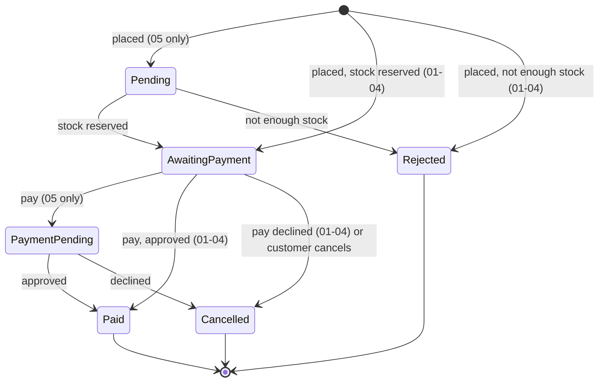
```mermaid
stateDiagram-v2
    [*] --> Pending: placed (05 only)
    [*] --> AwaitingPayment: placed, stock reserved (01-04)
    [*] --> Rejected: placed, not enough stock (01-04)
    Pending --> AwaitingPayment: stock reserved
    Pending --> Rejected: not enough stock
    AwaitingPayment --> PaymentPending: pay (05 only)
    AwaitingPayment --> Paid: pay, approved (01-04)
    AwaitingPayment --> Cancelled: pay declined (01-04) or customer cancels
    PaymentPending --> Paid: approved
    PaymentPending --> Cancelled: declined
    Paid --> [*]
    Rejected --> [*]
    Cancelled --> [*]
```

- Every move to `Cancelled` gives the reserved stock back. `Rejected` never reserved any.
- Anything else, such as paying twice, paying a rejected order or cancelling a paid one, is refused with `409 Conflict`.
- `Pending` and `PaymentPending` are visible only in version 05, where the work is asynchronous and the order waits for answers from other services. Version 04 also starts an order as `Pending`, but resolves it inside the same request and transaction, so no client ever sees it (§7.5).

**The public API** is identical in every version:

| Request | Does |
|---|---|
| `POST /api/products`, `GET /api/products`, `GET /api/products/{id}` | Create, list, get products |
| `PUT /api/products/{id}/price`, `POST /api/products/{id}/stock-adjustments` | Change price, add or remove stock |
| `POST /api/orders`, `GET /api/orders/{id}` | Place, get an order |
| `POST /api/orders/{id}/pay`, `POST /api/orders/{id}/cancel` | Pay, cancel an order |
| `GET /api/payments?orderId={id}` | Get the payment of an order |

Errors use **ProblemDetails** (RFC 9457), a standard JSON format for HTTP errors (`type`, `title`, `status`, `detail`, plus `errors` for validation). An **RFC** (Request for Comments) is a numbered internet standard. Status codes: `400` invalid request, `404` not found, `409` the request conflicts with a business rule or the current state.

---

## 4. Layered (N-tier)

Code: [`01-layered/`](../01-layered/README.md). Decisions: [ADR 0001](../01-layered/docs/adr/0001-use-layered-architecture.md), [ADR 0002](../01-layered/docs/adr/0002-ef-entities-as-business-model.md).

### 4.1 The idea

A **layered** (or **N-tier**) architecture cuts the application into horizontal slices by *kind of work*:

- the **presentation layer** talks to the outside world (here: HTTP);
- the **business layer** holds the rules ("an order can only be paid while it awaits payment");
- the **data access layer** reads and writes the database.

Each layer calls only the one below it. A request comes in at the top, goes down to the database and the answer comes back up.

**Analogy.** A restaurant. The waiter (presentation) takes the order and brings the food, but never cooks. The chef (business) decides how the dish is made, but never talks to the guests. The pantry (data) stores ingredients and hands them over when asked. Everyone knows only the person next to them.

It is the oldest and most common way to organise a business application, and the one most codebases you will meet in interviews use. In Java/Spring it is the familiar `@RestController` → `@Service` → `@Repository` with JPA `@Entity` classes. It solves a real problem: without it, SQL, rules and HTTP code end up mixed in the same method. Its weakness, which this chapter makes visible, is that **the dependencies point towards the database**. The business layer is built on top of the data layer, so the rules depend on storage details.

"Tier" originally meant a separate machine (browser, app server, database server) and "layer" a logical part of one program. Today both words are used for the logical split. Here everything runs in one process: three layers, one deployable.

### 4.2 Layers and their responsibilities

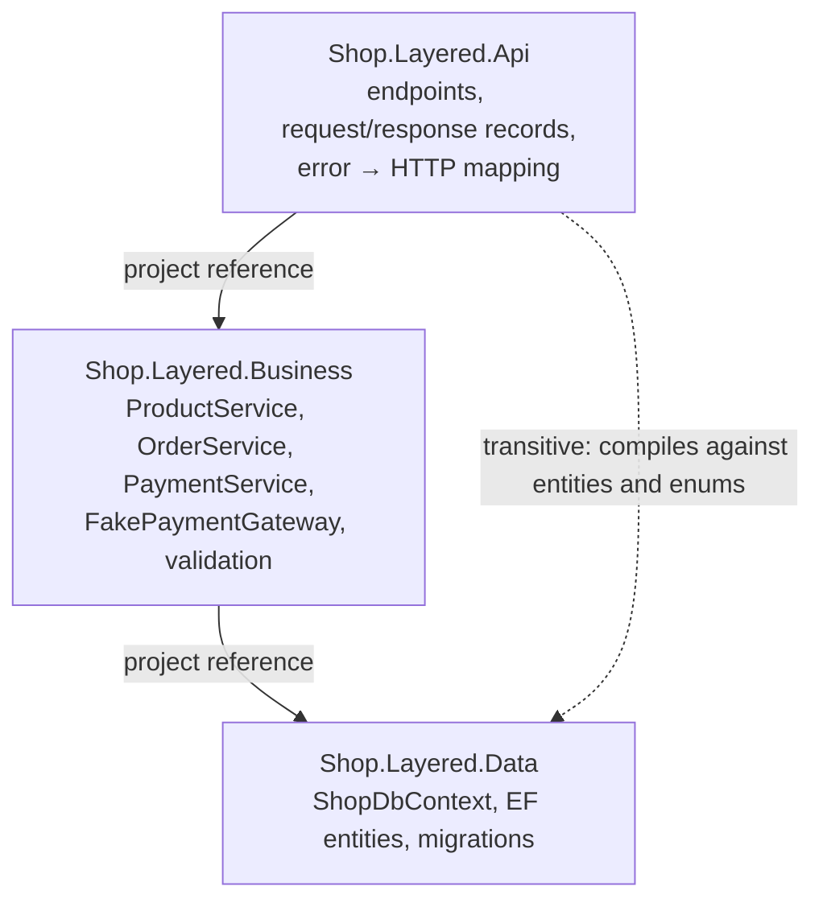
```mermaid
flowchart TD
    Api["Shop.Layered.Api<br/>endpoints, request/response records,<br/>error → HTTP mapping"]
    Business["Shop.Layered.Business<br/>ProductService, OrderService, PaymentService,<br/>FakePaymentGateway, validation"]
    Data["Shop.Layered.Data<br/>ShopDbContext, EF entities, migrations"]
    Api -->|project reference| Business
    Business -->|project reference| Data
    Api -.->|"transitive: compiles against entities and enums"| Data
```

An arrow means "references and depends on". Solid arrows are the project references in the `.csproj` files. The dotted one is not declared anywhere, yet it is real: a project sees the types of its references' references (a **transitive reference**). §4.6 comes back to this.

| Layer | Responsibility | May know | Must NOT know | Example file |
|---|---|---|---|---|
| **Api** (presentation) | Receive HTTP, call one service method, map the result to a response record, turn exceptions into ProblemDetails | Business services and exceptions; ASP.NET Core; *in practice* the EF entities (to map them) | The `DbContext`, SQL, EF Core, the rules | [`Endpoints/OrderEndpoints.cs`](../01-layered/src/Shop.Layered.Api/Endpoints/OrderEndpoints.cs) |
| **Business** | Validation, every business rule, transactions, coordination between services | The Data layer: `ShopDbContext`, the entities, EF Core, even PostgreSQL error codes | HTTP, status codes, JSON, the Api | [`Ordering/OrderService.cs`](../01-layered/src/Shop.Layered.Business/Ordering/OrderService.cs) |
| **Data** | Map tables to classes, the schema, migrations, connection setup | EF Core and Npgsql | Business and Api: anything above it | [`ShopDbContext.cs`](../01-layered/src/Shop.Layered.Data/ShopDbContext.cs) |

A **service** in this style is a class that groups the operations on one area (`OrderService.PlaceAsync`, `PayAsync`, `CancelAsync`). An **entity** here means an EF Core entity: a class mapped to a table row ([`Entities/Order.cs`](../01-layered/src/Shop.Layered.Data/Entities/Order.cs)). It has public setters and no behaviour, so it is an **anemic** model (§3.7). The **`DbContext`** is EF Core's unit of work: it tracks the entities you loaded or added and writes all changes in one `SaveChanges` call.

**Data shapes at each boundary** while placing an order:

| Boundary | Type that crosses it | Defined in | Why this type |
|---|---|---|---|
| Client → Api | JSON → `PlaceOrderRequest` | Api ([`Models/OrderModels.cs`](../01-layered/src/Shop.Layered.Api/Models/OrderModels.cs)) | The shape of the HTTP body, owned by the presentation layer |
| Api → Business | `Guid customerId` + `OrderLineInput[]` | Business ([`OrderService.cs`](../01-layered/src/Shop.Layered.Business/Ordering/OrderService.cs)) | The Business layer cannot see Api types, so it defines its own input |
| Business ↔ Data | `Order`, `OrderLine`, `Product` **EF entities** | Data | **The business model *is* the persistence model**: one class for both |
| Business → Api | `Order` **EF entity** | Data | The service returns what it worked on |
| Api → Client | `OrderResponse` → JSON | Api | Mapped "at the last moment" so the JSON does not expose every column |

The third and fourth rows are the point of this version. One class serves as the table row, the business object and, almost, the API shape, so a change to any of them ripples through all three layers (see "where would I change…" in §4.5).

> Why not return the entity as JSON directly and skip `OrderResponse`? Many layered apps do. It fails in subtle ways. Every new column becomes public API. Internal fields such as `Version` leak out. Navigation properties can loop (an order with lines that point back to the order). The response record costs a few lines and keeps the JSON stable.

**The database schema.** Database `shop_layered`, schema `public`, four tables, generated by EF Core from the entities and the configuration in [`ShopDbContext`](../01-layered/src/Shop.Layered.Data/ShopDbContext.cs):

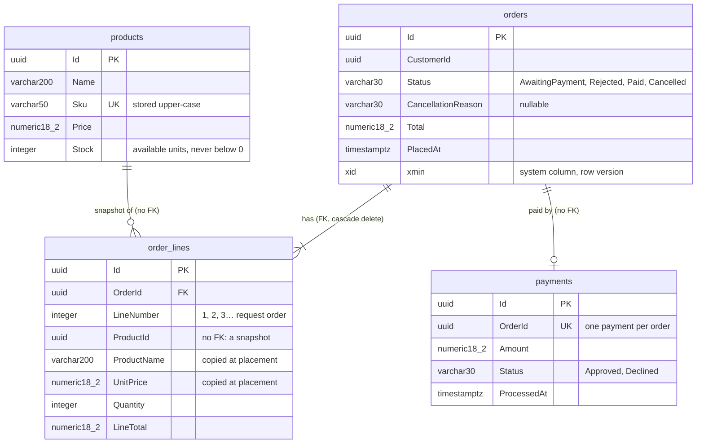
```mermaid
erDiagram
    products {
        uuid Id PK
        varchar200 Name
        varchar50 Sku UK "stored upper-case"
        numeric18_2 Price
        integer Stock "available units, never below 0"
    }
    orders {
        uuid Id PK
        uuid CustomerId
        varchar30 Status "AwaitingPayment, Rejected, Paid, Cancelled"
        varchar30 CancellationReason "nullable"
        numeric18_2 Total
        timestamptz PlacedAt
        xid xmin "system column, row version"
    }
    order_lines {
        uuid Id PK
        uuid OrderId FK
        integer LineNumber "1, 2, 3… request order"
        uuid ProductId "no FK: a snapshot"
        varchar200 ProductName "copied at placement"
        numeric18_2 UnitPrice "copied at placement"
        integer Quantity
        numeric18_2 LineTotal
    }
    payments {
        uuid Id PK
        uuid OrderId UK "one payment per order"
        numeric18_2 Amount
        varchar30 Status "Approved, Declined"
        timestamptz ProcessedAt
    }
    orders ||--|{ order_lines : "has (FK, cascade delete)"
    orders ||--o| payments : "paid by (no FK)"
    products ||--o{ order_lines : "snapshot of (no FK)"
```

- The column names are the C# property names (`"Name"`, `"PlacedAt"`), so in SQL they need double quotes. The table names come from `ToTable("products")`.
- Status values are stored as **text**, not numbers (`HasConversion<string>()`). A row is readable in a SQL prompt, and reordering the enum cannot silently change the data's meaning.
- `xmin` is not a real column. PostgreSQL keeps it on every row, and EF Core reads it as the order's row version (§4.5).
- `order_lines.LineNumber` keeps the lines in the order the customer sent them. A table has no order of its own, and ids created in the same millisecond are not sequential. It arrived in a second migration, `AddOrderLineNumber`, the normal way a schema evolves: a new migration, never an edited old one.
- **Foreign keys are deliberately few.** Only `order_lines → orders` has one, because a line cannot exist without its order. An order line's `ProductId` is a historical reference: the name and price were copied, so the line stays meaningful even if the product is later changed. `payments.OrderId` has a unique index but no foreign key. Both are a first hint of the boundaries between Catalog, Ordering and Payments. Version 04 turns them into separate schemas and keeps foreign keys out of them on purpose; version 05 turns them into separate databases, where such foreign keys are impossible.

**Where to read the schema yourself.** The **migrations are the source of truth**: [`Migrations/`](../01-layered/src/Shop.Layered.Data/Migrations) in the Data project. Three ways to see it:

```bash
dotnet ef migrations script --project 01-layered/src/Shop.Layered.Data      # the full SQL (CREATE TABLE …) of all migrations
docker compose exec postgres psql -U shop -d shop_layered -c '\d+ orders'   # one table as it exists in the database
docker compose exec postgres psql -U shop -d shop_layered -c '\dt'          # list the tables
```

A graphical client such as DBeaver or pgAdmin (optional, not needed for this repo) connects with the same settings: `localhost:5433`, user and password `shop`.

### 4.3 Using it

1. `docker compose up -d` at the repo root (PostgreSQL on port 5433).
2. `dotnet run --project 01-layered/src/Shop.Layered.Api`. It listens on **http://localhost:5101** and applies the migrations to `shop_layered` on startup (Development only).
3. Open [`http/shop.http`](../http/shop.http) with `@baseUrl = {{layered}}` and send the requests from top to bottom: create a product, place an order (the answer is `201` with `"status": "AwaitingPayment"`), pay it (`"Paid"`), then the declined-payment block (`"Cancelled"`, `"PaymentDeclined"`, stock back to 3).
4. Watch the console: creating a product and placing, paying or cancelling an order each log one line (`Order … placed: AwaitingPayment`). When two requests race for the same order, EF Core also logs the losing update as `fail: Microsoft.EntityFrameworkCore.Update`. The request still ends as a clean `409`; EF Core logs before our code handles the exception.

**Try this**

- **See the database.** `docker compose exec postgres psql -U shop -d shop_layered`, then `\dt` and `select "Name", "Sku", "Stock" from products;`. The tables are exactly the entities: `products`, `orders`, `order_lines`, `payments`. The column names keep the C# property names, and PostgreSQL folds unquoted names to lower case, so they need the double quotes. One more sign that the C# classes and the schema are the same thing here.
- **Break the one enforceable rule.** In an endpoint, take `ShopDbContext` as a parameter and query it. It compiles, because the Data project is reachable transitively. Then run `dotnet test 01-layered/tests/Shop.Layered.ArchitectureTests`: `Api_DoesNotUseTheDbContext` fails and names the offending type. Undo the change.
- **Watch the race being handled.** Create a product with `initialStock: 1` and send the same `POST /api/orders` twice quickly. One gets `AwaitingPayment`, the other `Rejected`, and the stock is 0, never -1. The contract test `ConcurrentOrdersForLastUnits_NeverOversell` does this with ten requests.
- **Feel the coupling.** Rename `Product.Name` to `Title` in the entity and build: errors appear in Business *and* Api.

### 4.4 Before our code runs: what ASP.NET Core does

This box applies to every version; later chapters point back to it. The chapters are about *our* layers. The framework part is the same everywhere and short:

1. **Kestrel**, ASP.NET Core's built-in web server, accepts the TCP connection and parses the HTTP request.
2. The request goes through the **middleware pipeline**: a chain of components that each can act before and after the next one. Ours, in [`Program.cs`](../01-layered/src/Shop.Layered.Api/Program.cs), are the exception handler (catches exceptions thrown further down and turns them into ProblemDetails) and status code pages (gives empty error responses, like an unknown route, a ProblemDetails body).
3. **Routing** matches the method and path (`POST /api/orders`) to one **endpoint**: the lambda registered with `MapPost`.
4. **Binding** builds the lambda's parameters. The JSON body becomes the request record (System.Text.Json, camelCase), route values become `Guid id` (the `{id:guid}` constraint makes a non-Guid a `404`), query strings become `Guid? orderId`, and services come from **dependency injection** (§3.6). A new DI **scope** is created per request, so every scoped service in this request (`OrderService`, `ShopDbContext`) is the same instance from top to bottom. If binding fails (malformed JSON, `"abc"` where a Guid is expected), the endpoint never runs. In Development, Minimal APIs throw a `BadHttpRequestException` for it, and our exception handler turns that into a `400` ProblemDetails like any other error. In Production the framework answers `400` itself.
5. Our endpoint runs. On the way back, the returned `TypedResults` value is serialised to JSON (enums as strings, thanks to `JsonStringEnumConverter`).

**Validation** is deliberately *not* done by the framework here. .NET 10 can validate request records with attributes (`AddValidation()`), but then the rules would sit in the presentation layer in every version and hide the difference this playground is about. Instead, each version validates where its architecture says the rules belong. In 01 that is the Business services.

### 4.5 Journey of a request

`POST /api/orders` with one line of two units, enough stock, from the client's request to its response:

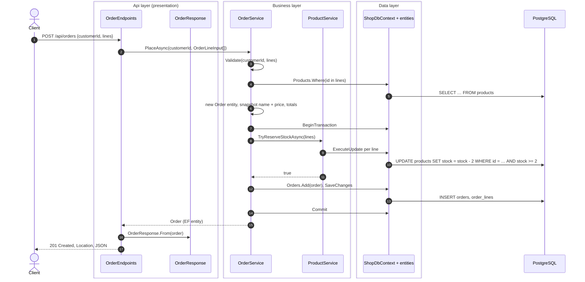
```mermaid
sequenceDiagram
    autonumber
    actor C as Client
    box Api layer (presentation)
        participant E as OrderEndpoints
        participant M as OrderResponse
    end
    box Business layer
        participant OS as OrderService
        participant PS as ProductService
    end
    box Data layer
        participant DB as ShopDbContext + entities
    end
    participant PG as PostgreSQL
    C->>E: POST /api/orders {customerId, lines}
    E->>OS: PlaceAsync(customerId, OrderLineInput[])
    OS->>OS: Validate(customerId, lines)
    OS->>DB: Products.Where(id in lines)
    DB->>PG: SELECT … FROM products
    OS->>OS: new Order entity, snapshot name + price, totals
    OS->>DB: BeginTransaction
    OS->>PS: TryReserveStockAsync(lines)
    PS->>DB: ExecuteUpdate per line
    DB->>PG: UPDATE products SET stock = stock - 2 WHERE id = … AND stock >= 2
    PS-->>OS: true
    OS->>DB: Orders.Add(order), SaveChanges
    DB->>PG: INSERT orders, order_lines
    OS->>DB: Commit
    OS-->>E: Order (EF entity)
    E->>M: OrderResponse.From(order)
    E-->>C: 201 Created, Location, JSON
```

**Reception (Api layer)**

1. The framework part (Kestrel, middleware, routing, binding) is the box in §4.4. It ends with a `PlaceOrderRequest` record and a scoped `OrderService` handed to the lambda in [`OrderEndpoints.MapOrderEndpoints`](../01-layered/src/Shop.Layered.Api/Endpoints/OrderEndpoints.cs).
2. The endpoint converts the request lines into the Business layer's `OrderLineInput` records and calls `OrderService.PlaceAsync`. It decides nothing.
   *Boundary Api → Business: the call goes down and the dependency goes down (Api references Business). Same direction.*

**Processing (Business layer, using the Data layer)**

3. `OrderService.Validate` checks the input rules: customer id present, at least one line, quantity 1–1000, no product twice. A failure throws `ValidationException` (see the error path below).
4. The service reads the products of the order through `ShopDbContext` (`AsNoTracking`, a read-only query). An unknown product id is another validation error. The Business layer queries the database directly; there is nothing between them.
   *Boundary Business → Data: call down, dependency down. Same direction. The Business layer compiles against EF Core.*
5. It builds the `Order` **entity**, the same class that maps to the `orders` table. Each line snapshots the product's name and current price. The service computes `LineTotal` and `Total`. These are business rules written as assignments, because the entity has no methods to hold them.
6. **The transaction starts** (`Database.BeginTransactionAsync`). Everything until the commit happens or nothing does.
7. `ProductService.TryReserveStockAsync` reserves each line with a **conditional update** (§3.10). There is no "read the stock, check it, write it back" sequence, which two requests could interleave. Instead the check is inside the `UPDATE` itself: `… SET stock = stock - 2 WHERE id = … AND stock >= 2`. It returns how many rows changed: 1 means reserved, 0 means not enough stock. PostgreSQL locks the row during the update. A second request for the same product waits, then re-checks `stock >= 2` against the new value, so two requests cannot both take the last unit. That re-check is how PostgreSQL behaves at its default **isolation level**, READ COMMITTED. (Under the stricter REPEATABLE READ, the waiting update would fail with a serialization error instead, and the code would have to retry.) Lines are reserved in product-id order, so two multi-line orders lock rows in the same order and can never wait for each other forever (a **deadlock**).
   This step is a service calling another service on the **same scoped `DbContext`**, which is why both run inside the transaction opened in step 6. This hidden sharing is how layered code composes work. It is convenient, and nothing in the method signatures tells you about it.
8. All lines reserved: the order gets `AwaitingPayment`, `SaveChanges` inserts the order and its lines, and **the transaction commits**. Had a line failed, leaving the `using` block without committing rolls everything back. Units reserved for earlier lines come back too. The order is then stored as `Rejected`. Not enough stock is not an error: it is a normal business outcome, and the answer is still `201`.

**Response (Api layer)**

9. The service returns the `Order` entity, a Data-layer type, to the Api.
   *Boundary Business → Api (return value): the data flows up, the dependency still points down.*
10. The endpoint maps it with `OrderResponse.From` ([`Models/OrderModels.cs`](../01-layered/src/Shop.Layered.Api/Models/OrderModels.cs)) and returns `TypedResults.Created` with the `Location` header. The status enum, defined in Data, is written as the string `"AwaitingPayment"`.

**The error path**

- **Invalid request → `400`** (for example `quantity: 0`). Detected in step 3 by `OrderService.Validate`, before any database work. The `ValidationException` flies up through the endpoint, which catches nothing. The exception-handler middleware hands it to [`BusinessExceptionHandler`](../01-layered/src/Shop.Layered.Api/ErrorHandling/BusinessExceptionHandler.cs). That is the only class that knows which exception means which status code, and it writes an `HttpValidationProblemDetails` with an `errors` member: `{"lines[0].quantity": ["Quantity must be between 1 and 1000."]}`.
- **Broken business rule → `409`** (for example paying an order that is already `Paid`). `OrderService.PayAsync` loads the order, `EnsureAwaitingPayment` sees the wrong status and throws `BusinessRuleException`, which the same handler maps to `409` ProblemDetails. Nothing was written.
- **Two requests change the same order at once → `409`.** Pay and cancel load the order *tracked*. Its `Version` property is mapped to PostgreSQL's `xmin` system column, a value that changes on every update of the row. EF Core adds `WHERE xmin = <value read>` to the update. The loser of the race updates zero rows and gets a `DbUpdateConcurrencyException`, which `OrderService.SaveOrderAsync` turns into `BusinessRuleException`. This is **optimistic concurrency** (§3.10): no lock while reading, a check while writing. When two *pays* race, the loser may instead hit the second guard first: the unique index on `payments.OrderId` rejects a second payment row. `SaveOrderAsync` maps that to the same `409`.
- **The double charge hidden in that race.** `PayAsync` calls the gateway *before* opening the transaction, so a slow payment provider never keeps a transaction open. The cost: both racing requests reach the gateway. The loser's `Payment` row is rolled back, but with a real provider its money has already moved. Real systems close this gap in one of three ways. They send the provider an **idempotency key** (the order id), so a repeated charge is ignored. They refund the loser. Or they first store a "payment pending" state that a second pay is refused against. Version 05 does the last one (`PaymentPending`).
- **A request the framework cannot bind** (malformed JSON, a non-Guid id in the query string) never reaches the Business layer. §4.4 explains how it still becomes a `400` ProblemDetails.
- **Anything else** (database down, a bug) is not handled by `BusinessExceptionHandler` and ends as a `500`.

Notice that the Business layer reports failures *without knowing HTTP*. It throws its own exception types and the Api translates them. That part of the layering is clean.

**Where would I change…**

| Change | Files touched | Layers |
|---|---|---|
| Add a field to products (`Description`) | `Data/Entities/Product.cs`, `ShopDbContext` (length), a new migration; `ProductService.CreateAsync` (parameter, validation); `Api/Models/ProductModels.cs` (request and response), `ProductEndpoints` | **all three** |
| Rename a field (`Name` → `Title`) | Same as above, plus `OrderService` (it copies the name into each line) | **all three** |
| Rename only the column (`"Name"` → `title`) | `HasColumnName("title")` in `ShopDbContext` + a migration | Data |
| Change a rule (max 500 units per line) | `OrderService.MaxQuantityPerLine` | Business |
| Switch PostgreSQL → SQL Server | Data (provider, regenerated migrations, `xmin` → `rowversion`), **and Business** (it catches `PostgresException` unique violations) | Data + Business |
| Add an endpoint (orders of a customer) | `OrderService.ListByCustomerAsync`, `OrderEndpoints`, maybe an index in `ShopDbContext` | all three |

Two lessons hide in that table. A business change stays in one layer, which is the promise of layering. A data change climbs to the top, which is its price. And because Business depends on Data, even "switch the database" reaches the business rules.

**Unit tests and the database.** [`PriceRulesTests`](../01-layered/tests/Shop.Layered.UnitTests/PriceRulesTests.cs) and [`FakePaymentGatewayTests`](../01-layered/tests/Shop.Layered.UnitTests/FakePaymentGatewayTests.cs) are the only unit tests in this version. `OrderService` takes a `ShopDbContext` and runs SQL: conditional updates, transactions, the `xmin` check. To test "placing an order without stock ends `Rejected`", you need a real PostgreSQL. EF Core's in-memory provider supports neither `ExecuteUpdate` nor transactions, and SQLite behaves differently under concurrency. Here the contract tests carry that weight with Testcontainers. It works, but every business test is a slow integration test. Version 02 fixes exactly this.

### 4.6 Rules

The architecture tests are in [`LayerRulesTests.cs`](../01-layered/tests/Shop.Layered.ArchitectureTests/LayerRulesTests.cs):

| Test | Rule | Why it exists |
|---|---|---|
| `Api_DoesNotReferenceData` | The Api `.csproj` has no `ProjectReference` to Data | Each layer declares only the layer directly below |
| `Api_DoesNotUseTheDbContext` | No Api type depends on `ShopDbContext` or EF Core | Endpoints must not bypass the rules by querying or saving themselves |
| `Business_DoesNotDependOnAspNetCore` | No Business type uses `Microsoft.AspNetCore.*` | The rules must work the same from HTTP, a background job or a test |
| `Data_DoesNotReferenceBusiness` | No Data type depends on a Business type | Dependencies point down; the bottom layer knows nobody |
| `Business_DoesNotReferenceApi` | No Business type depends on an Api type | The Api calls Business, never the other way round |

The last two can never fail today: breaking them would need a circular project reference, which MSBuild refuses to build. They are kept so the whole rule set is written down in one place. The first three can fail without any compiler error. A single `<FrameworkReference Include="Microsoft.AspNetCore.App" />` in the Business project is enough to break `Business_DoesNotDependOnAspNetCore`. That is the general lesson: **an architecture test earns its place when it checks something the project references do not already prevent.**

`Api_DoesNotUseTheDbContext` reads the compiled IL instead of using ArchUnitNET, because the endpoints are async lambdas whose bodies ArchUnitNET does not see (§6.6 tells how this was found).

**The honest limit.** "Api does not reference Data" is the classic rule of this style, and the project file obeys it. Yet `ProductResponse.From(Product product)` takes a Data entity and `OrderResponse` exposes Data's enums. They compile because the Api sees Data *transitively* through Business. An ArchUnitNET rule "Api types do not depend on Data types" would fail on this code, so the test checks what can honestly be enforced here: the declared reference, and no use of the database itself. Two ways out exist. Set `DisableTransitiveProjectReferences` so the Api cannot see Data at all, which forces the Business layer to return its own types. Or put the business model somewhere that does not depend on the database, which is version 02. **Strict layering** means each layer uses only the one directly below; **relaxed layering** lets a layer use any layer beneath it. This version is strict on paper and relaxed in practice. That is common, and worth noticing in any codebase you review.

The second limit is the direction itself. Every rule above is satisfied, and still the business rules depend on EF Core and PostgreSQL. Layering controls *who may call whom*. It says nothing about *which side owns the abstractions*. §3.6 explains why that matters; chapter 5 acts on it.

### 4.7 What changed from the previous version

Nothing: this is the baseline. Every later version is built from a copy of the previous one and refactored, so the differences are diffs you can read. What 01 fixes for the rest is the external behaviour (it passes every contract test) and the schema of the shop.

### 4.8 Trade-offs

**Benefits**

- Everyone knows it. Onboarding is fast and the folder names explain themselves.
- Few types: one class per table, one service per area. A small app stays small.
- Reading top-down is easy: endpoint → service → query.
- The database's own features (conditional updates, transactions, unique indexes) are used directly, with no abstraction in between.

**Costs**

- The business rules depend on the data layer: on EF Core and even on PostgreSQL error codes. Changing storage reaches the rules.
- The entity is the business model, the table row and almost the API shape. A change in one ripples through all three.
- The rules are scattered across services. Nothing stops a new method from setting `order.Status = Paid` without the checks, because the entity has public setters.
- Business logic is hard to unit-test: each test needs a database.
- Services call services and share a `DbContext` implicitly. In a big codebase this becomes a web of hidden coupling, sometimes called a "big ball of mud".
- Pass-through code: an endpoint that only calls a service that only calls the `DbContext` adds layers without adding decisions (the "lasagna" smell).

**When to use it.** CRUD-heavy apps with few rules, internal tools, prototypes, short-lived systems, and teams that need the simplest structure everyone already knows.

**When NOT to use it.** When the domain has real rules and states (like an order lifecycle that grows), when the infrastructure must be swappable or testable in isolation, or when several teams need clear ownership. The first two point to chapter 5, the third to chapters 7 and 8.

### 4.9 Interview questions

1. **What are the layers of an N-tier application, and what does each do?**
   Presentation handles input and output (HTTP, UI). Business holds the rules and the transactions. Data access reads and writes storage. Each layer calls only the one below. In Spring: controller, service, repository plus entities.
2. **What is the main weakness of classic layering?**
   The dependency direction. Business depends on data access, so the rules depend on the persistence technology. That makes them hard to test without a database, and storage changes leak upwards. The fix is dependency inversion: the business code owns interfaces and the data layer implements them (Clean/Hexagonal).
3. **Strict versus relaxed layering?**
   Strict: a layer may use only the layer directly below. Relaxed: any lower layer. Many codebases are relaxed in practice through transitive references, for example controllers using JPA entities. Name the rule you want and enforce it with an architecture test.
4. **Should a controller return JPA/EF entities?**
   Better not. It turns every column into public API, can leak internal fields, can loop through navigation properties, and couples the API to the schema. Map to response DTOs at the edge.
5. **How do you stop two requests from selling the last unit twice?**
   Let the database decide atomically. Use a conditional `UPDATE … WHERE stock >= @qty` and check the affected row count, or optimistic concurrency with a version column and a retry. Never read-check-write in application code without one of them. For several rows, lock them in a consistent order to avoid deadlocks.
6. **When would you still choose layered today?**
   For CRUD-style apps, small teams, and short-lived or internal systems, where its familiarity and low ceremony beat the cost of the coupling. Plan the exit: keep the rules in services, keep entities out of the API, and the move to Clean Architecture stays a refactoring, not a rewrite.

---

## 5. Clean / Hexagonal

Code: [`02-clean-hexagonal/`](../02-clean-hexagonal/README.md). Decisions: [ADR 0001](../02-clean-hexagonal/docs/adr/0001-clean-architecture.md), [ADR 0002](../02-clean-hexagonal/docs/adr/0002-rich-domain-model.md), [ADR 0003](../02-clean-hexagonal/docs/adr/0003-ports-defined-by-application.md).

### 5.1 The idea

Version 01 stacked the layers on top of the database: the rules depended on the data layer. This version **turns that dependency around**. The business rules sit in the centre and depend on nothing. Everything technical (HTTP, EF Core, PostgreSQL, the payment provider) sits around them and depends on them.

The centre states what it needs from the outside world as **interfaces it owns**: "give me the products with these ids", "charge this amount". Those interfaces are the **ports**. The outer code implements them (the database **adapter**) or calls into the centre (the HTTP adapter). Section 3.4 introduced the vocabulary; this chapter shows it in code.

**Analogy.** A laptop and its USB ports. The laptop defines the port: shape, pins, protocol. A mouse, a keyboard or a disk is built *to fit the laptop's port*, not the other way round. You can swap the mouse without opening the laptop. You can even test the laptop with a fake device plugged in. In 01 the laptop was soldered to one specific mouse.

Two more ideas arrive together with the inversion, because the centre now has room for them:

- a **rich domain model**: `Order` and `Product` are no longer bags of public setters. They have methods (`order.Cancel()`, `product.Reserve(quantity)`) that refuse invalid moves. **Value objects** (`Money`, `Sku`, `Quantity`, `ProductName`) cannot even be created invalid;
- **one class per use case** (`PlaceOrder`, `PayOrder`…) instead of one big service per area.

In Spring the same shape is usually a `domain` module with plain Java classes, an `application` module with use cases and `port` interfaces, and `adapter` packages with `@RestController`s and JPA repositories that implement those ports.

### 5.2 Layers, ports and adapters

**Project references** (who compiles against whom):

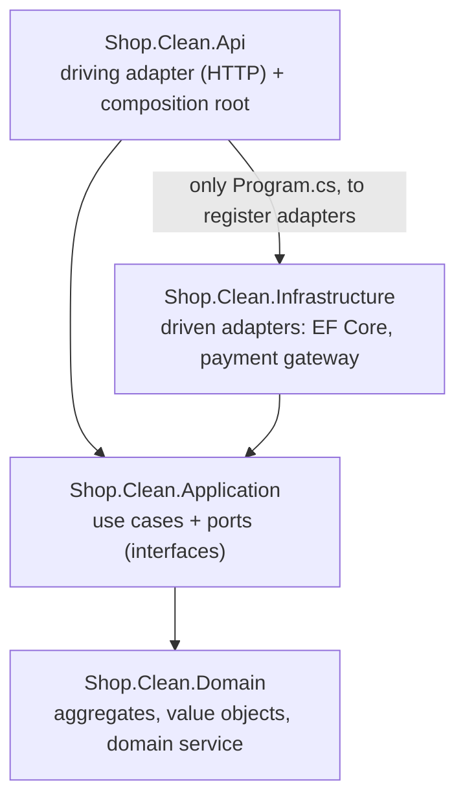
```mermaid
flowchart TD
    Api["Shop.Clean.Api<br/>driving adapter (HTTP) + composition root"]
    Infrastructure["Shop.Clean.Infrastructure<br/>driven adapters: EF Core, payment gateway"]
    Application["Shop.Clean.Application<br/>use cases + ports (interfaces)"]
    Domain["Shop.Clean.Domain<br/>aggregates, value objects, domain service"]
    Api --> Application
    Api -->|"only Program.cs, to register adapters"| Infrastructure
    Infrastructure --> Application
    Application --> Domain
```

Compare with 01. There, `Business → Data`: the rules pointed at the database. Here, `Infrastructure → Application`: the database code points at the rules. Every arrow ends, directly or not, at `Domain`, and `Domain` has no arrow at all. That is **the dependency rule** (§3.6).

**The same code drawn as a hexagon** (who calls whom, and who implements what):

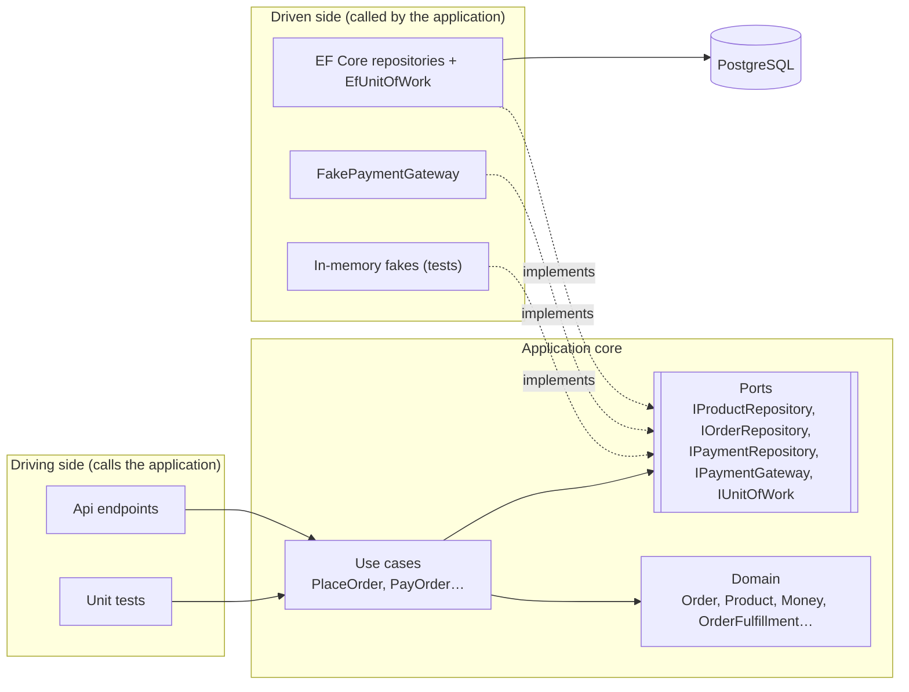
```mermaid
flowchart LR
    subgraph driving["Driving side (calls the application)"]
        HTTP["Api endpoints"]
        UT["Unit tests"]
    end
    subgraph core["Application core"]
        UC["Use cases<br/>PlaceOrder, PayOrder…"]
        P[["Ports<br/>IProductRepository, IOrderRepository,<br/>IPaymentRepository, IPaymentGateway, IUnitOfWork"]]
        D["Domain<br/>Order, Product, Money, OrderFulfillment…"]
    end
    subgraph driven["Driven side (called by the application)"]
        EF["EF Core repositories + EfUnitOfWork"]
        FG["FakePaymentGateway"]
        FK["In-memory fakes (tests)"]
    end
    HTTP --> UC
    UT --> UC
    UC --> D
    UC --> P
    EF -.->|implements| P
    FG -.->|implements| P
    FK -.->|implements| P
    EF --> PG[("PostgreSQL")]
```

- **Driving (primary) adapters** start the conversation: the HTTP endpoints, and also the unit tests, which drive the use cases directly.
- **Driven (secondary) adapters** are started by the application: the EF Core repositories, the payment gateway, and in the tests the in-memory fakes.
- In this repo the use-case classes are themselves the driving ports. Many codebases add an interface per use case (`IPlaceOrder`, an "input port"). With one adapter calling each use case, that would be an interface with a single implementation and a single caller, so we skip it (YAGNI, "You Aren't Gonna Need It").

| Layer / project | Responsibility | May know | Must NOT know | Example file |
|---|---|---|---|---|
| **Domain** | The business model and its rules: aggregates, value objects, the domain service, domain exceptions | Only the .NET base library | Everything else: Application, EF Core, HTTP, logging | [`Ordering/Order.cs`](../02-clean-hexagonal/src/Shop.Clean.Domain/Ordering/Order.cs) |
| **Application** | One use case per operation: validate input, load through ports, let the domain decide, save. Declares the ports | Domain; logging and DI *abstractions* | EF Core, Npgsql, ASP.NET Core, any adapter | [`UseCases/Ordering/PlaceOrder.cs`](../02-clean-hexagonal/src/Shop.Clean.Application/UseCases/Ordering/PlaceOrder.cs), [`Ports/Ports.cs`](../02-clean-hexagonal/src/Shop.Clean.Application/Ports/Ports.cs) |
| **Infrastructure** | Driven adapters: implement the ports with EF Core and PostgreSQL, and the payment gateway. All mapping between objects and tables | Application (ports), Domain, EF Core, Npgsql | The Api, HTTP | [`Persistence/Repositories.cs`](../02-clean-hexagonal/src/Shop.Clean.Infrastructure/Persistence/Repositories.cs), [`Configurations.cs`](../02-clean-hexagonal/src/Shop.Clean.Infrastructure/Persistence/Configurations/Configurations.cs) |
| **Api** | Driving adapter: HTTP to use case and back, errors to ProblemDetails. `Program.cs` is the **composition root** | Application, Domain (to map responses), ASP.NET Core; Infrastructure *only in `Program.cs`* | EF Core, SQL, the adapters' classes | [`Endpoints/Endpoints.cs`](../02-clean-hexagonal/src/Shop.Clean.Api/Endpoints/Endpoints.cs) |

**Clean, Hexagonal and Onion, side by side.** The three styles of §3.4 describe this same structure with different words:

| In this repo | Clean Architecture (Martin) | Hexagonal (Cockburn) | Onion (Palermo) |
|---|---|---|---|
| `Domain` | Entities | The domain inside the application | Domain model (the core) |
| `Application/UseCases` | Use cases (interactors) | The application; its API is the driving ports | Application services |
| `Application/Ports` | Gateway interfaces at the use-case boundary | Driven ports | Repository and service interfaces, in the core |
| `Infrastructure` | Interface adapters (gateways) + frameworks and drivers | Driven (secondary) adapters | Infrastructure (outer ring) |
| `Api` | Interface adapters (controllers, presenters) + web framework | Driving (primary) adapters | User interface (outer ring) |
| `Program.cs` | The "main" component | The configurator that plugs adapters in | Dependency resolution |

**Data shapes at each boundary** while placing an order:

| Boundary | Type | Defined in | Why this type |
|---|---|---|---|
| Client → Api | JSON → `PlaceOrderRequest` | Api ([`Models/Models.cs`](../02-clean-hexagonal/src/Shop.Clean.Api/Models/Models.cs)) | The HTTP shape, owned by the adapter |
| Api → Application | `PlaceOrderCommand` | Application ([`PlaceOrder.cs`](../02-clean-hexagonal/src/Shop.Clean.Application/UseCases/Ordering/PlaceOrder.cs)) | The use case's input. It knows nothing about JSON or HTTP, so a message consumer or a CLI could send the same command |
| Application ↔ Domain | `Product`, `Order` aggregates; `Money`, `Quantity`… | Domain | The business model. It holds the rules |
| Application ↔ Infrastructure (through the ports) | Aggregates in, aggregates out | Domain (types), Application (interfaces) | The port speaks the application's language, never rows or `DbSet`s |
| Infrastructure ↔ database | Columns. EF Core maps them to the aggregates with **value converters** and a **shadow property** | Infrastructure | Storage details stay on the outside |
| Application → Api | `Order` aggregate | Domain | Read-only use: the Api only reads its properties |
| Api → Client | `OrderResponse` → JSON | Api | Mapped from the aggregate (`Money` → `decimal`, `Sku` → `string`) |

In 01, one class was the row, the business object and almost the JSON. Here each boundary has its own type, and the mapping between them is explicit code, in the adapters.

**The database schema.** Database `shop_clean`. It is **the same schema as version 01**: same four tables, same columns, same keys (§4.2, "The database schema"):

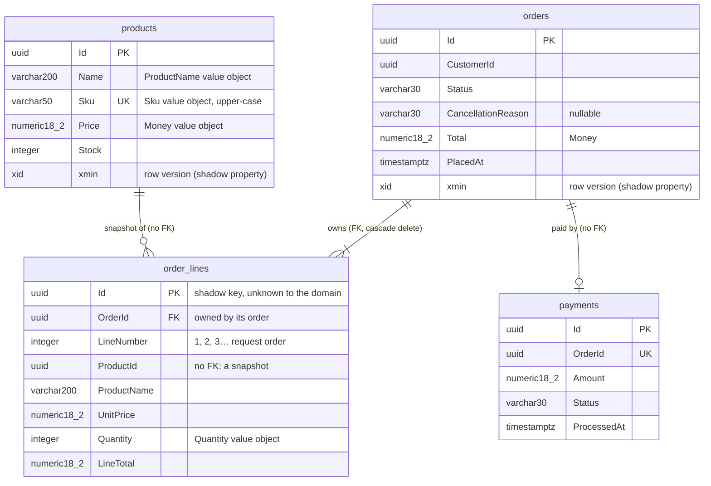
```mermaid
erDiagram
    products {
        uuid Id PK
        varchar200 Name "ProductName value object"
        varchar50 Sku UK "Sku value object, upper-case"
        numeric18_2 Price "Money value object"
        integer Stock
        xid xmin "row version (shadow property)"
    }
    orders {
        uuid Id PK
        uuid CustomerId
        varchar30 Status
        varchar30 CancellationReason "nullable"
        numeric18_2 Total "Money"
        timestamptz PlacedAt
        xid xmin "row version (shadow property)"
    }
    order_lines {
        uuid Id PK "shadow key, unknown to the domain"
        uuid OrderId FK "owned by its order"
        integer LineNumber "1, 2, 3… request order"
        uuid ProductId "no FK: a snapshot"
        varchar200 ProductName
        numeric18_2 UnitPrice
        integer Quantity "Quantity value object"
        numeric18_2 LineTotal
    }
    payments {
        uuid Id PK
        uuid OrderId UK
        numeric18_2 Amount
        varchar30 Status
        timestamptz ProcessedAt
    }
    orders ||--|{ order_lines : "owns (FK, cascade delete)"
    orders ||--o| payments : "paid by (no FK)"
    products ||--o{ order_lines : "snapshot of (no FK)"
```

What changed is only *how the code reaches it*. Value objects are stored as plain columns through **value converters** (`Money` ↔ `numeric`). Writing goes through the domain's rules, because a `Money` can only be created valid. **Reading back does not re-run them**: the converters call `Money.Rehydrate`, `Quantity.Rehydrate`… instead of `Of`. A row was valid when it was written. If a rule tightens later (at most 500 units per line), re-checking every old row on load would make past orders unreadable. Turning stored data back into objects is called **rehydration**, and the architecture test `OnlyPersistenceAdapters_RehydrateValueObjects` keeps that shortcut inside the adapters. The row version is a **shadow property**: EF Core tracks `xmin` for `products` and `orders`, but the domain classes have no `Version` property. Order lines are **owned** by their order: EF Core loads and saves them only with it, which matches the aggregate. `LineNumber` (added to both versions by a second migration, `AddOrderLineNumber`) keeps the lines in the order the customer sent them. A table has no order of its own, and ids generated in the same millisecond are not sequential, so without it a `GET` could list the lines shuffled. The contract test `OrderLines_KeepTheRequestOrder` now checks this for every version. One lesson hides in the identical schema: **the architecture is in the code, not in the database.** To inspect it, run `dotnet ef migrations script --project 02-clean-hexagonal/src/Shop.Clean.Infrastructure`, or open `docker compose exec postgres psql -U shop -d shop_clean`.

### 5.3 Using it

```bash
docker compose up -d
dotnet run --project 02-clean-hexagonal/src/Shop.Clean.Api      # http://localhost:5102
dotnet test 02-clean-hexagonal/tests/Shop.Clean.UnitTests        # 75 tests, no database, about one second
```

In [`http/shop.http`](../http/shop.http) set `@baseUrl = {{clean}}` and send the same requests as for 01. The answers are identical: the contract tests guarantee it. The console log lines now come from the use-case classes (`Shop.Clean.Application.UseCases.Ordering.PlaceOrder`).

**Try this**

- **Run the unit tests** and look at [`UseCaseTests.cs`](../02-clean-hexagonal/tests/Shop.Clean.UnitTests/Application/UseCaseTests.cs). "Place an order without stock ends `Rejected`" and "a concurrency conflict is retried" run in milliseconds against the in-memory fakes in [`Fakes.cs`](../02-clean-hexagonal/tests/Shop.Clean.UnitTests/Application/Fakes.cs). In 01 the same checks needed PostgreSQL.
- **Try to break the order lifecycle.** Write `order.Status = OrderStatus.Paid;` in a use case. It does not compile: the setter is private. Then make it public in `Order.cs` and run the architecture tests: `DomainModel_HasNoPublicSetters` fails.
- **Swap an adapter.** Write a second `IPaymentGateway` (say, one that declines everything above 50) and register it in `InfrastructureServiceCollectionExtensions` instead of `FakePaymentGateway`. No use case or domain file changes.
- **Add a package to Domain** (any NuGet package, used in one class). `Domain_DependsOnNothing` fails and names it.

### 5.4 Dependency inversion, made visible

At runtime, `PlaceOrder` calls `ProductRepository`, which calls PostgreSQL: the **call** goes from the centre outwards. In the source code, `ProductRepository` (Infrastructure) implements `IProductRepository` (Application): the **dependency** goes from the outside inwards. The two arrows point in **opposite directions** across every port. That opposite pointing is the whole trick of this chapter:

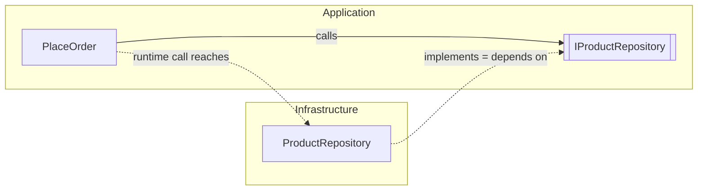
```mermaid
flowchart LR
    subgraph Application
        UC[PlaceOrder] -->|calls| IPR[["IProductRepository"]]
    end
    subgraph Infrastructure
        PR[ProductRepository]
    end
    PR -.->|implements = depends on| IPR
    UC -. "runtime call reaches" .-> PR
```

Version 01 had `OrderService → ShopDbContext`: call and dependency both pointed down, at the database. To change the database you edited the rules' layer. Here, changing the database means writing new adapters. The rules do not even get recompiled.

The interface lives **with its consumer, not with its implementation**. That is what makes it an inversion and not just "use interfaces everywhere". An `IProductRepository` placed in the Infrastructure project would keep the old direction, only with more files.

### 5.5 Journey of a request

`POST /api/orders` again, one line, enough stock:

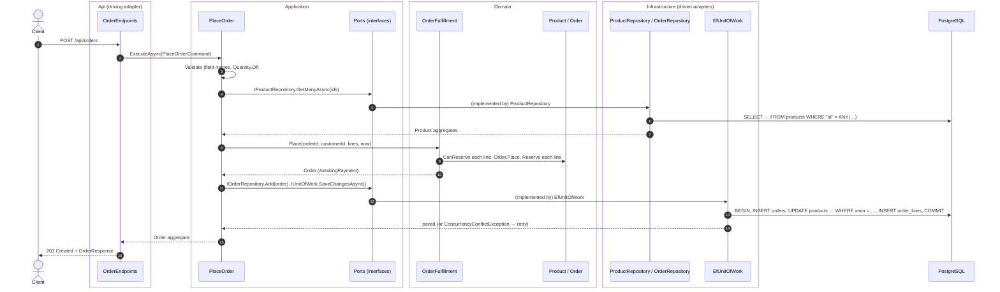
```mermaid
sequenceDiagram
    autonumber
    actor C as Client
    box Api (driving adapter)
        participant E as OrderEndpoints
    end
    box Application
        participant UC as PlaceOrder
        participant P as Ports (interfaces)
    end
    box Domain
        participant F as OrderFulfillment
        participant AG as Product / Order
    end
    box Infrastructure (driven adapters)
        participant R as ProductRepository / OrderRepository
        participant U as EfUnitOfWork
    end
    participant PG as PostgreSQL
    C->>E: POST /api/orders
    E->>UC: ExecuteAsync(PlaceOrderCommand)
    UC->>UC: Validate (field names, Quantity.Of)
    UC->>P: IProductRepository.GetManyAsync(ids)
    P->>R: (implemented by) ProductRepository
    R->>PG: SELECT … FROM products WHERE "Id" = ANY(…)
    R-->>UC: Product aggregates
    UC->>F: Place(orderId, customerId, lines, now)
    F->>AG: CanReserve each line, Order.Place, Reserve each line
    F-->>UC: Order (AwaitingPayment)
    UC->>P: IOrderRepository.Add(order), IUnitOfWork.SaveChangesAsync()
    P->>U: (implemented by) EfUnitOfWork
    U->>PG: BEGIN, INSERT orders, UPDATE products … WHERE xmin = …, INSERT order_lines, COMMIT
    U-->>UC: saved (or ConcurrencyConflictException → retry)
    UC-->>E: Order aggregate
    E-->>C: 201 Created + OrderResponse
```

**Reception (Api, the driving adapter)**

1. The framework part is the same as in 01 (§4.4). [`OrderEndpoints`](../02-clean-hexagonal/src/Shop.Clean.Api/Endpoints/Endpoints.cs) turns the `PlaceOrderRequest` into a `PlaceOrderCommand` and calls `PlaceOrder.ExecuteAsync`.
   *Boundary Api → Application: call inwards, dependency inwards (Api references Application). Same direction.*

**Processing (Application orchestrates, Domain decides, Infrastructure fetches and stores)**

2. `PlaceOrder.Validate` ([`PlaceOrder.cs`](../02-clean-hexagonal/src/Shop.Clean.Application/UseCases/Ordering/PlaceOrder.cs)) checks that the request is **well formed**: customer present, lines present, each quantity a valid `Quantity` (the domain's rule, applied through `ValidationErrors.Capture` so the error is reported under `lines[0].quantity`), no product twice. This is **input validation**. The domain checks the same **invariants** again when it builds the `Order`, but only the use case knows the JSON field names to report.
3. `ConcurrencyRetry.ExecuteAsync` starts the first attempt (more in step 7).
4. The use case asks the **port** `IProductRepository.GetManyAsync` for the products. An unknown id is a validation error on that line.
   *Boundary Application → Infrastructure: the call goes **outwards** (use case → repository → database), the dependency goes **inwards** (Infrastructure implements Application's interface). Opposite directions: dependency inversion (§5.4).*
5. [`ProductRepository`](../02-clean-hexagonal/src/Shop.Clean.Infrastructure/Persistence/Repositories.cs), the driven adapter, runs the EF Core query. EF Core builds real `Product` aggregates through their private constructor and value converters. What crosses back through the port is domain objects, never rows.
6. The use case hands everything to the **domain service** [`OrderFulfillment.Place`](../02-clean-hexagonal/src/Shop.Clean.Domain/Ordering/OrderFulfillment.cs). **This is where the business rules run**, in memory: can every line be reserved? If yes, `Order.Place` (snapshot of names and prices, totals in `Money`) and `product.Reserve` for each line. If not, `Order.Reject`, and no stock moves.
   *Boundary Application → Domain: call inwards, dependency inwards. Same direction.*
7. `orders.Add(order)` and `unitOfWork.SaveChangesAsync()`. [`EfUnitOfWork`](../02-clean-hexagonal/src/Shop.Clean.Infrastructure/Persistence/Repositories.cs) calls EF Core's `SaveChanges`, and **the transaction starts and commits here**, in one call: insert the order and its lines, update each changed product with `WHERE "Id" = … AND xmin = <value read in step 5>`.
   **Concurrency is handled differently from 01.** In 01 the database applied "stock ≥ quantity" itself, atomically, in a conditional `UPDATE`. Here that rule lives in `Product.Reserve`, in memory, where the database cannot apply it. So the database can only *detect* that someone changed the row in the meantime: the `xmin` check matches zero rows, and EF Core throws. `EfUnitOfWork` translates that into the port's `ConcurrencyConflictException`. [`ConcurrencyRetry`](../02-clean-hexagonal/src/Shop.Clean.Application/Common/ConcurrencyRetry.cs) then discards everything tracked and runs steps 4–7 again with fresh data, up to 15 times. A request loses only when another request committed a change to the same product between its read and its save. With ten customers racing for two units, only two reservations ever commit, so no request loses more than a couple of times; with plenty of stock and N writers, a request could lose up to N − 1 times. The losers of the stock see `Stock = 0` on reload and get `Rejected`, which writes no product row. This is **optimistic concurrency with retry** (§3.10). It is the price of keeping the rule in the domain: correct, and the losers pay with extra round trips.

**Response (Api)**

8. The use case returns the `Order` aggregate. The endpoint maps it with `OrderResponse.From` (`Money` → `decimal`, `ProductName` → `string`) and returns `201 Created`.

**The error path**

- **Invalid input → `400`.** Detected in step 2, before any database call. `ValidationErrors` collects *every* invalid field into one `ValidationException`, and the Api's [`ProblemDetailsExceptionHandler`](../02-clean-hexagonal/src/Shop.Clean.Api/ErrorHandling/ProblemDetailsExceptionHandler.cs) writes it as a validation problem with `errors`. Product creation reports name, SKU and price errors together. A `DomainValidationException` that escaped a use case would also become a `400`, as a safety net.
- **Broken business rule → `409`.** Paying a paid order: `PayOrder` loads the order and calls `order.EnsureAwaitingPayment`, which throws the domain's `BusinessRuleViolationException`. The domain decides that it is forbidden; the Api decides that this means `409`.
- **Duplicate SKU → `409`.** `CreateProduct` checks first through the port. If two requests race past that check, the unique index fires, `EfUnitOfWork` translates the PostgreSQL error into the port's `DuplicateKeyException`, and the use case turns it into a `ConflictException`. Compare with 01, where the Business layer caught `PostgresException` itself.
- **Endless conflicts → `409`.** After 15 lost rounds, `ConcurrencyRetry` gives up with a `ConflictException` instead of retrying forever.
- **Paying, and the double charge.** `PayOrder` checks the status *before* charging, charges **once**, outside the retry loop, and then retries only the state change. The order id travels through the port as the provider's **idempotency key** (§4.5). If another request paid the order meanwhile, the retry reloads it, `RecordPayment` refuses, and the answer is `409`; a real provider, seeing the same idempotency key, charged only once. **One gap remains:** a *cancel* that commits between the charge and the save. The money moved, the order is now `Cancelled`, and no `Payment` row is stored. The idempotency key cannot help, because there was only one charge. This version makes the case visible (a warning log, "charged … refund required") but does not cure it. The cures are a refund, or recording a `PaymentPending` state *before* charging so a cancel is refused meanwhile. Version 05 does the latter. A synchronous call to an external system inside a business operation always leaves such a window.

**Where would I change…**

| Change | Files touched | Layers |
|---|---|---|
| Add a field to products (`Description`) | `Product` (+ a value object if it has rules), `CreateProductCommand` + `CreateProduct`, `ProductConfiguration` + a migration, `Models.cs` (request and response) | **all four** (more files than 01) |
| Rename a domain property (`Name` → `Title`) | Domain, the use cases that read it, `Configurations.cs`, `Models.cs`. The JSON field can stay `name`, because the Api maps explicitly | all four, but the API contract is untouched |
| Rename only the column | `HasColumnName` in `Configurations.cs` + a migration | Infrastructure |
| Change a rule (max 500 units per line) | `Quantity.Max`. Old orders with bigger lines still load (rehydration skips the rule); what they *mean* now is a business decision | **Domain only** |
| Switch PostgreSQL → SQL Server | Infrastructure: provider, migrations, `xmin` → `rowversion`, unique-violation translation in `EfUnitOfWork` | **Infrastructure only** (01: Data + Business) |
| Use a real payment provider | A new `IPaymentGateway` adapter + one line in `AddInfrastructure` | Infrastructure only |
| Add an endpoint (orders of a customer) | A new use case, a port method, its EF implementation, an endpoint | Api, Application, Infrastructure |

The pattern is the mirror image of 01. **Technology changes stay at the edge, and rule changes stay in the centre.** Adding data still crosses every layer, now with more mapping.

**Unit tests without a database.** [`Domain/`](../02-clean-hexagonal/tests/Shop.Clean.UnitTests/Domain) tests the aggregates, value objects and the domain service as plain objects: every order transition, valid and invalid. [`Application/`](../02-clean-hexagonal/tests/Shop.Clean.UnitTests/Application) runs the use cases against hand-written in-memory adapters. That is 75 tests in about a second, where 01 had 12 that could run without PostgreSQL. The contract tests still run against a real database. The unit tests prove the rules; the contract tests prove the adapters and the wiring.

### 5.6 Rules

The architecture tests are in [`CleanArchitectureRulesTests.cs`](../02-clean-hexagonal/tests/Shop.Clean.ArchitectureTests/CleanArchitectureRulesTests.cs):

| Test | Rule | Why it exists | Compiler already prevents it? |
|---|---|---|---|
| `Domain_DependsOnNothing` | Domain references only the .NET base library and no other layer | The most valuable code is immune to changes in everything else | No: anyone can add a package to Domain |
| `Application_DependsOnlyOnDomain` | No Application type uses Infrastructure or Api (packages: next rule) | Use cases say *what*, adapters say *how* | Yes (it would be a circular reference); kept as documentation |
| `Application_DoesNotUseEfCoreOrAspNetCore` | No Application type uses EF Core, Npgsql or ASP.NET Core | Keeps the core testable with fakes and the technologies swappable | No: a package reference is enough |
| `Infrastructure_DoesNotReferenceApi` | No Infrastructure type uses the Api | Adapters are independent of each other | Yes (circular); kept as documentation |
| `Ports_AreInterfacesInApplication` | The Ports namespace holds interfaces (and their contract's exceptions); Domain and Infrastructure declare no interfaces | The inner layer owns the abstractions: that is the inversion | No |
| `Api_UsesInfrastructureOnlyInTheCompositionRoot` | Only `Program` touches Infrastructure; no endpoint uses EF Core | An endpoint using an adapter would bypass the use cases | Partly: the adapters are `internal`, the registration class is public |
| `OnlyPersistenceAdapters_RehydrateValueObjects` | Only Infrastructure calls `Rehydrate` | Skipping validation is safe only for data read back from storage | No |
| `DomainModel_HasNoPublicSetters` | No domain property has a public setter | The rules hold only if they cannot be bypassed | No |

`Application_DoesNotUseEfCoreOrAspNetCore`, `Api_UsesInfrastructureOnlyInTheCompositionRoot` and `OnlyPersistenceAdapters_RehydrateValueObjects` read the compiled IL (`CompiledCode.cs`): the use cases and the endpoints do their work inside async lambdas, which ArchUnitNET does not see into (§6.6).

Two tools work together here. **Project references** stop the wrong *direction* at compile time. **`internal`** hides the adapters: `ShopDbContext` and the repositories cannot be named outside Infrastructure. The **tests** catch what neither can see: packages, namespaces, setters, where interfaces live.

### 5.7 What changed from version 01

| | 01 Layered | 02 Clean / Hexagonal |
|---|---|---|
| Projects | Api → Business → Data | Api → Application → Domain; Infrastructure → Application |
| Direction | Rules depend on the database layer | The database layer depends on the rules |
| Business model | EF entities, public setters, no behaviour | Aggregates with methods, private setters, value objects |
| Where the rules are | `OrderService`, `ProductService` | `Order`, `Product`, `Money`…, `OrderFulfillment` |
| Operations | One service per area | One use-case class per operation |
| Database access | Business uses `ShopDbContext` directly | Through ports; `ShopDbContext` is `internal` to Infrastructure |
| PostgreSQL errors | Caught in Business | Translated in the adapter into the port's exceptions |
| Stock concurrency | Conditional `UPDATE` (the database applies the rule) | Optimistic `xmin` check + retry (the domain applies the rule) |
| Payment gateway | Concrete class used by the service | `IPaymentGateway` port, adapter in Infrastructure |
| Unit tests | 12 (pure helpers only) | 75 (domain + use cases with fakes) |
| C# lines in `src/` (without migrations) | about 1,010 in 24 files | about 1,600 in 29 files |
| Schema | 4 tables | **the same** 4 tables |

The code grew by more than half. That is the honest cost, paid in mapping (value converters, response mapping, commands), in ports and in small classes.

### 5.8 Trade-offs

**Benefits**

- The rules are in one place, with a name, and cannot be bypassed: `order.Cancel()` is the only way to cancel.
- Business logic is unit-testable in milliseconds, without a database or mocks.
- Technologies are replaceable at the edge: database, payment provider, even the delivery mechanism (a message consumer could call the same use cases).
- The structure tells you where things go. That helps humans and AI agents equally, and the architecture tests catch them when they get it wrong.

**Costs**

- More code and more types: commands, value objects, converters, response mapping. A field added to a product touches more files than in 01.
- **The persistence compromise.** EF Core maps the domain classes directly, so they need a private parameterless constructor and private setters EF can fill. The domain is *almost* persistence-ignorant. The pure alternative is a separate persistence model (row classes in Infrastructure) mapped to and from the aggregates: a cleaner domain, twice the mapping. Most teams accept the compromise.
- Optimistic concurrency needs retries, and the losers pay with extra round trips. 01's conditional `UPDATE` was simpler and cheaper under contention.
- Placing an order changes several aggregates (an `Order` and several `Product`s) in one transaction. That breaks the DDD guideline of one aggregate per transaction (§3.7). It is fine in a monolith with one database. Versions 04 and 05 show what it costs when the aggregates move apart.
- Indirection: a reader follows endpoint → use case → port → adapter to find a query.

**When to use it.** Domains with real rules and states, long-lived systems, when several delivery mechanisms or infrastructures are likely, and when fast tests of business logic matter.

**When NOT to use it.** Thin CRUD over a database, prototypes, small tools. There the ports and mappings add ceremony without protecting much. A common middle ground is to apply it to the one complex part of a system only, which is what version 04 does with its Ordering module.

### 5.9 Interview questions

1. **Hexagonal, Onion, Clean: what is the difference?**
   Mostly vocabulary and drawing style. All three put the business rules in the centre and make every dependency point inwards, with the core owning the interfaces the outside implements. Hexagonal speaks of ports and driving/driven adapters, Onion of rings, Clean of entities, use cases and interface adapters.
2. **What is dependency inversion, and where must the interface live?**
   High-level code (use cases) depends on an abstraction it owns, and low-level code (the database adapter) implements it. The interface lives with the consumer, in the core. Put it next to the implementation and the dependency still points at the infrastructure.
3. **What are driving and driven adapters?**
   Driving (primary) adapters call into the application: controllers, message consumers, tests. Driven (secondary) adapters are called by it through ports: repositories, gateways, message publishers.
4. **Anemic versus rich domain model?**
   Anemic: data classes, with the rules in services (version 01). Rich: entities and value objects with methods that protect their invariants, with private setters, so invalid states cannot be represented. Rich pays off when there are real rules; for CRUD it is ceremony.
5. **Where does validation go?**
   In two places, for two purposes. Input validation (is the request well formed? which field is wrong?) belongs at the application boundary. Invariants (an amount has at most two decimals, a paid order cannot be cancelled) belong in the domain and are enforced always, whoever calls.
6. **Should the domain reference EF Core or JPA?**
   Ideally not: no attributes, no `DbContext`, no annotations. Mapping lives in infrastructure (fluent configuration, or `orm.xml` in Java). A private constructor for the ORM is the usual small compromise; a separate persistence model is the pure alternative.

---

## 6. Vertical Slice

Code: [`03-vertical-slice/`](../03-vertical-slice/README.md). Decisions: [ADR 0001](../03-vertical-slice/docs/adr/0001-vertical-slices.md), [ADR 0002](../03-vertical-slice/docs/adr/0002-no-mediator-library.md), [ADR 0003](../03-vertical-slice/docs/adr/0003-cqrs-light.md).

### 6.1 The idea

Versions 01 and 02 cut the code **horizontally**, by technical role: endpoints here, business logic there, data access somewhere else. Placing an order touches a file in every layer. **Vertical Slice Architecture** cuts it the other way: **one slice per use case**, and everything that use case needs lives together. Its request, validation, logic, database access and route all go in one file: [`Features/Ordering/PlaceOrder.cs`](../03-vertical-slice/src/Shop.Slice.Api/Features/Ordering/PlaceOrder.cs).

The insight behind it, popularised by Jimmy Bogard around 2018: most changes are requests for **a feature** ("orders need a gift message"), not for **a layer** ("change all the repositories"). So group code by what changes together. That is *cohesion* (§3.5) applied to use cases.

**Analogy.** Two ways to write a cookbook. One has a chapter for all chopping, a chapter for all frying and a chapter for all plating; to cook one dish you jump between three chapters. The other has one page per recipe. Layers are the first book; slices are the second. Shared basics (how to make a stock) still get their own pages, and in this codebase that is the `Domain` folder.

Two things come with it:

- **Light CQRS** (§3.8). Slices that change data (**commands**) load aggregates and let the domain decide. Slices that read (**queries**) skip the model entirely and project the columns they show straight into the response. Same database, two styles of code.
- **Fewer abstractions.** No repositories, no ports, no mediator library: each slice uses EF Core's `DbContext` directly. The structure comes from folders and architecture tests, not from project references.

In Java/Spring this is **package-by-feature** (`com.shop.ordering.placeorder` containing its controller, request and service) instead of package-by-layer (`controller`, `service`, `repository`).

### 6.2 Slices and their responsibilities

**Layers versus slices**, the same use cases drawn both ways:

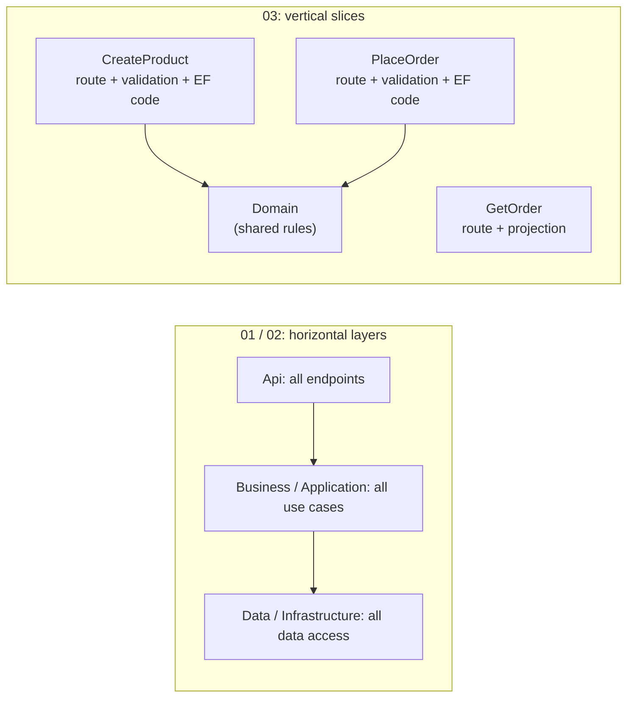
```mermaid
flowchart LR
    subgraph layers["01 / 02: horizontal layers"]
        direction TB
        L1["Api: all endpoints"] --> L2["Business / Application: all use cases"] --> L3["Data / Infrastructure: all data access"]
    end
    subgraph slices["03: vertical slices"]
        direction TB
        S1["CreateProduct<br/>route + validation + EF code"]
        S2["PlaceOrder<br/>route + validation + EF code"]
        S3["GetOrder<br/>route + projection"]
        D["Domain<br/>(shared rules)"]
        S1 --> D
        S2 --> D
    end
```

**Folders** (one project, `Shop.Slice.Api`, plus tests):

```
src/Shop.Slice.Api/
  Features/
    Catalog/   CreateProduct.cs  ListProducts.cs  GetProduct.cs  ChangeProductPrice.cs  AdjustStock.cs  ProductResponse.cs
    Ordering/  PlaceOrder.cs  GetOrder.cs  PayOrder.cs  CancelOrder.cs  OrderResponse.cs
    Payments/  GetPayment.cs
  Domain/          ← copied from 02: Product, Order, Money, OrderFulfillment… (the rules worth a model)
  Infrastructure/  ← ShopDbContext + configurations + migrations, retry helper, FakePaymentGateway
  Common/          ← IEndpoint + discovery, validation helper, error types, ProblemDetails handler
  Program.cs
```

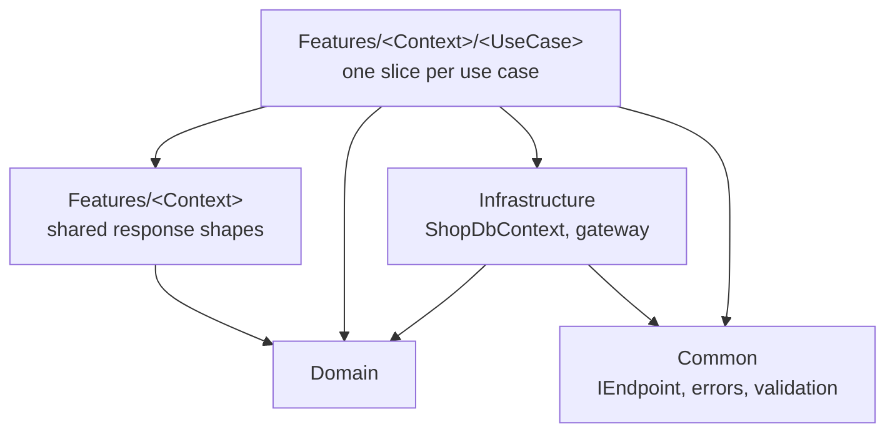
```mermaid
flowchart TD
    F["Features/&lt;Context&gt;/&lt;UseCase&gt;<br/>one slice per use case"]
    R["Features/&lt;Context&gt;<br/>shared response shapes"]
    D["Domain"]
    I["Infrastructure<br/>ShopDbContext, gateway"]
    C["Common<br/>IEndpoint, errors, validation"]
    F --> R
    F --> D
    F --> I
    F --> C
    I --> D
    I --> C
    R --> D
```

| Part | Responsibility | May know | Must NOT know | Example file |
|---|---|---|---|---|
| **A slice** (`Features/<Context>/<UseCase>`) | One use case end to end: request record, input validation, handler, route | Domain, `ShopDbContext`, Common, its context's response shapes | **Any other slice** | [`PlaceOrder.cs`](../03-vertical-slice/src/Shop.Slice.Api/Features/Ordering/PlaceOrder.cs) |
| **Context response shapes** | The JSON a context answers with, shared by its slices (it is the API contract) | Domain (to map from aggregates) | Slices | [`OrderResponse.cs`](../03-vertical-slice/src/Shop.Slice.Api/Features/Ordering/OrderResponse.cs) |
| **Domain** | Aggregates, value objects, `OrderFulfillment`: the rules with real logic | Nothing else | Features, Infrastructure, EF Core, ASP.NET Core | [`Domain/Ordering/Order.cs`](../03-vertical-slice/src/Shop.Slice.Api/Domain/Ordering/Order.cs) |
| **Infrastructure** | EF Core mapping and migrations, the save-retry helper, the fake payment gateway | Domain, Common (error types), EF Core, Npgsql | Features | [`DbConcurrency.cs`](../03-vertical-slice/src/Shop.Slice.Api/Infrastructure/Persistence/DbConcurrency.cs) |
| **Common** | Cross-cutting plumbing: endpoint discovery, errors, `ValidationErrors` | ASP.NET Core, Domain exceptions | Features | [`Endpoints.cs`](../03-vertical-slice/src/Shop.Slice.Api/Common/Endpoints.cs) |

**How a slice gets its route.** Each slice has a small class implementing [`IEndpoint`](../03-vertical-slice/src/Shop.Slice.Api/Common/Endpoints.cs) with one method, `Map`. At startup `AddEndpoints` finds every such class by reflection, and `MapEndpoints` calls them. `Program.cs` has no list of routes, and a new use case is a new file and nothing else. That is the useful part of a "mediator" library (ADR 0002). The rest, a request/handler pipeline with behaviours, is not needed here: ASP.NET Core already has middleware and endpoint filters.

**Data shapes at each boundary** for `POST /api/orders`:

| Boundary | Type | Defined in | Why |
|---|---|---|---|
| Client → slice | JSON → `PlaceOrderRequest` | The slice itself | It belongs to this use case only |
| Slice ↔ Domain | `Product`, `Order` aggregates, `Quantity`, `Money` | Domain | Commands still let the model decide |
| Slice ↔ database | Aggregates through `ShopDbContext` (no repository) | Infrastructure | EF Core *is* the data-access abstraction here |
| Slice → client | `OrderResponse` | `Features/Ordering` | The ordering contract, shared by the four ordering slices |

There is no command type and no use-case class. The request record goes straight to the handler: one fewer type per operation than 02.

**The database schema.** Database `shop_slice`, the same tables and columns as 01 and 02 (§5.2 has the diagram). `LineNumber` is already in this version's first migration, `InitialCreate`, because 03 was born after the column existed. In 01 and 02 it came with a second migration. The resulting schema is unchanged. To inspect it, `scripts/create-schemas.sh 03` writes the SQL, `dotnet ef migrations script --project 03-vertical-slice/src/Shop.Slice.Api` prints it, and `docker compose exec postgres psql -U shop -d shop_slice -c '\d+ orders'` shows one table as it exists.

### 6.3 Using it

```bash
docker compose up -d
dotnet run --project 03-vertical-slice/src/Shop.Slice.Api      # http://localhost:5103
dotnet test 03-vertical-slice/Shop.slnx
```

Use [`http/shop.http`](../http/shop.http) with `@baseUrl = {{slice}}`. The log categories now name the slices (`Shop.Slice.Api.Features.Ordering.PlaceOrder.PlaceOrderEndpoint`), so the logs read like a list of use cases.

**Try this**

- **Add a use case** in one file: `Features/Catalog/ListLowStock.cs` with an `IEndpoint` that maps `GET /api/products/low-stock` and projects products with `Stock < 5`. Restart: the route exists. Nothing else changed.
- **Make a slice call another.** Use `GetOrderEndpoint` from `PlaceOrder.cs`. `Features_DoNotReferenceOtherFeatures` fails and names both slices.
- **Save in a query.** Call `db.SaveChangesAsync()` in `GetOrder.cs`. `Queries_DoNotModifyState` fails.
- **Read a slice top to bottom.** Open `PlaceOrder.cs` and compare it with what the same request crosses in 02: an endpoint, a command, a use case, two ports, two repositories and a unit of work, in four projects.

### 6.4 Commands and queries: light CQRS

**Commands** (`CreateProduct`, `ChangeProductPrice`, `AdjustStock`, `PlaceOrder`, `PayOrder`, `CancelOrder`) need the rules, so they load tracked aggregates, call domain methods and `SaveChanges`. They use the same optimistic `xmin` check and bounded retry as 02 (§5.5, step 7), here as an extension method on the `DbContext`, `RetryOnConflictAsync`.

**Queries** (`ListProducts`, `GetProduct`, `GetOrder`, `GetPayment`) need no rules: a read cannot break an invariant. So they skip the model. [`GetOrder`](../03-vertical-slice/src/Shop.Slice.Api/Features/Ordering/GetOrder.cs) asks EF Core for exactly the columns of the response, with lines sorted by `LineNumber` in SQL. It projects into an anonymous type, so no aggregate is built. Each column still arrives as its value object (EF Core's converters run on every read), so the last step maps `Money` → `decimal`. The **change tracker** is EF Core's record of every entity it loaded, used to find what to update on `SaveChanges`. It does not get involved either: EF Core tracks only *entities*, and a projection returns none. The `AsNoTracking()` in the query slices is therefore a statement of intent ("this is a read"). It would only matter if a query returned whole entities, which these never do.

This is **CQRS without two databases**: one model and one store, but two code paths that can evolve separately. It lets the read side do what the write side must not. It can join tables freely, add columns for screens, or later move to a read replica or to raw SQL, all without touching a rule. Splitting into **two stores** (a separate read database fed by events) is a much bigger step. It pays off when reads and writes have very different load or shape, and it costs eventual consistency (§3.10). This shop needs nothing of the kind.

Queries in 01 and 02 went through the same service or use case and loaded full objects. Here, `GetOrder` and `PayOrder` share nothing but the `OrderResponse` shape.

### 6.5 Journey of a request

`POST /api/orders`, in one file:

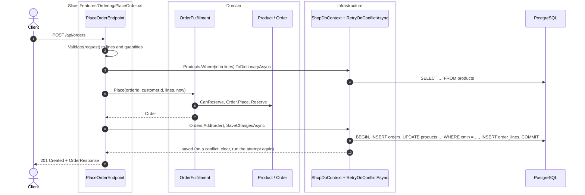
```mermaid
sequenceDiagram
    autonumber
    actor C as Client
    box Slice: Features/Ordering/PlaceOrder.cs
        participant E as PlaceOrderEndpoint
    end
    box Domain
        participant F as OrderFulfillment
        participant AG as Product / Order
    end
    box Infrastructure
        participant DB as ShopDbContext + RetryOnConflictAsync
    end
    participant PG as PostgreSQL
    C->>E: POST /api/orders
    E->>E: Validate(request) to lines and quantities
    E->>DB: Products.Where(id in lines).ToDictionaryAsync
    DB->>PG: SELECT … FROM products
    E->>F: Place(orderId, customerId, lines, now)
    F->>AG: CanReserve, Order.Place, Reserve
    F-->>E: Order
    E->>DB: Orders.Add(order), SaveChangesAsync
    DB->>PG: BEGIN, INSERT orders, UPDATE products … WHERE xmin = …, INSERT order_lines, COMMIT
    DB-->>E: saved (on a conflict: clear, run the attempt again)
    E-->>C: 201 Created + OrderResponse
```

**Reception (the slice's endpoint)**

1. The framework part is §4.4. Endpoint discovery mapped `POST /api/orders` to `PlaceOrderEndpoint.HandleAsync` at startup; binding builds a `PlaceOrderRequest` and resolves `ShopDbContext`, `TimeProvider` and the logger from DI. There is no layer between the route and the use case: **the endpoint is the use case**.

**Processing (still in the same file, using Domain and Infrastructure)**

2. `Validate` does the input validation (same rules and field names as 02, through `ValidationErrors`).
3. `db.RetryOnConflictAsync` ([`DbConcurrency.cs`](../03-vertical-slice/src/Shop.Slice.Api/Infrastructure/Persistence/DbConcurrency.cs)) wraps the attempt.
   *Boundary slice → Infrastructure: the call goes towards the database and the dependency points the same way, at EF Core. There is no port and no inversion here, unlike 02. The slice depends on EF Core directly, as 01's Business layer did, but only inside this one file.*
4. The slice loads the products as tracked aggregates and reports unknown ids as validation errors.
5. [`OrderFulfillment.Place`](../03-vertical-slice/src/Shop.Slice.Api/Domain/Ordering/OrderFulfillment.cs) decides, exactly as in 02: reserve all lines or none, `AwaitingPayment` or `Rejected`. **The business rules run in the Domain**, which knows nothing about slices or EF Core.
   *Boundary slice → Domain: call and dependency both point at the domain.*
6. `db.Orders.Add(order)` and `SaveChangesAsync`: **one transaction**, the order insert plus each changed product guarded by its `xmin`. On a conflict, EF Core throws `DbUpdateConcurrencyException`; the helper clears the change tracker and runs steps 4–6 again (up to 15 times), then gives up with `409`.

**Response (the slice)**

7. `OrderResponse.From(order)` and `201 Created`.

**The error path** is the same as 02's, with the same handler, now in `Common/`:

- **`400`.** `Validate` throws a `ValidationException` with every invalid field; a malformed body never reaches the slice (`BadHttpRequestException`).
- **`409`.** The domain throws `BusinessRuleViolationException` (pay a paid order, stock out of range), or the slice throws `ConflictException` (duplicate SKU, detected with `IsUniqueViolation()`, or concurrency retries exhausted).
- **`404`.** The slice throws `NotFoundException`.

[`ProblemDetailsExceptionHandler`](../03-vertical-slice/src/Shop.Slice.Api/Common/ProblemDetailsExceptionHandler.cs) maps each one. The pay-versus-cancel window described in §5.5 exists here too, with the same warning log.

**The query journey** is shorter. `GET /api/orders/{id}` → `GetOrderEndpoint` → one `SELECT` with the columns it needs → `OrderResponse`. No Domain, no retry, no tracking.

**Where would I change…**

| Change | Files touched |
|---|---|
| Add a field to products (`Description`) | `Product` (domain), `Configurations.cs` + a migration, `ProductResponse`, `CreateProduct.cs`, and each query slice that should show it (`GetProduct.cs`, `ListProducts.cs`) |
| Change a rule (max 500 units per line) | `Quantity.Max` in Domain |
| Change only how the order list is read (add a column, a join) | That one query slice |
| Add a use case | **One new file** under `Features/` |
| Switch the database, same ORM (PostgreSQL → SQL Server) | Infrastructure only: `UseNpgsql`, the `xmin` row version, `IsUniqueViolation`, regenerated migrations. The slices use EF Core, not PostgreSQL |
| Switch the data-access technology (EF Core → Dapper) | **Every slice** that touches the database: there is no port to swap behind |
| Replace the payment gateway | `FakePaymentGateway` and the one slice that uses it |

Use cases are cheap to add and change. Cross-cutting technology changes cost more than in 02, because there is no port to swap behind.

### 6.6 Rules

A single project has no project references to enforce anything, so every boundary is an architecture test ([`SliceRulesTests.cs`](../03-vertical-slice/tests/Shop.Slice.ArchitectureTests/SliceRulesTests.cs)):

| Test | Rule | Why |
|---|---|---|
| `Features_DoNotReferenceOtherFeatures` | No type in one slice namespace uses a type in another slice | A change to one use case must not ripple into others |
| `SharedCode_DoesNotDependOnSlices` | Domain, Infrastructure, Common and the context response shapes use no slice | Shared code that depends on one slice breaks every other slice when that one changes |
| `Domain_DoesNotDependOnFeaturesOrEfCore` | Domain uses no Features, Infrastructure, Common, EF Core, ASP.NET Core or Npgsql | The rules stay pure and testable (the 02 rule, inside one project) |
| `Queries_DoNotModifyState` | `Get*` and `List*` slices call nothing that writes: no `SaveChanges`, `ExecuteUpdate`/`ExecuteDelete`, raw SQL commands, `Add`/`Update`/`Remove`/`Attach`, change tracker or retry helper | Light CQRS: reads are safe to optimise |
| `OnlyInfrastructure_RehydratesValueObjects` | Only Infrastructure calls `Rehydrate` | Skipping validation is safe only for stored data |
| `Endpoints_LiveInsideASlice` | Every `IEndpoint` is sealed and lives in a slice namespace | A route always sits next to its handler |

**A lesson about testing the tests.** Building these rules went wrong twice, in two different ways. Both mistakes produced rules that passed whatever the code did.

1. **A rule that selects nothing passes.** The first "queries do not save" rule said, in ArchUnitNET, "types in a query namespace should not call any method whose name starts with `SaveChanges`". But `SaveChangesAsync` is declared in EF Core's assembly, which was not loaded into the analysis. So the selection "methods named SaveChanges…" matched **zero** methods, and "call none of zero methods" is always true.
2. **Code the tool cannot see passes.** C# compiles every lambda and every `async` method into generated classes: closures, and a **state machine** for each async body. ArchUnitNET attributes calls made directly in an async method back to the type that wrote them, but not what happens *inside an async lambda*. That is exactly where these slices do their work (`RetryOnConflictAsync(async () => …)`), and where every endpoint of 01 and 02 lives (`MapPost(…, async (…) => …)`). A slice could have used another slice there, or a query saved there, and no rule would notice.

The fix is [`CompiledCode.cs`](../03-vertical-slice/tests/Shop.Slice.ArchitectureTests/CompiledCode.cs): about a hundred lines that read the compiled **IL** (Intermediate Language, what C# compiles to) with **Mono.Cecil**. It attributes every type and call in a generated class back to the class written in source. The rules about *what code does* now use it. Each one was then broken on purpose inside an async lambda, and each one failed. The same blind spot existed in some rules of 01 and 02, which now use the same reader. **An architecture test you have never seen fail proves nothing**, and "seen fail" must include the places where the real code lives.

**When is duplication across slices fine?** `GetProduct` and `ListProducts` repeat the same projection, and `PayOrder` and `CancelOrder` both load the products of an order. That is on purpose: each can change without the other. The rule of thumb is to duplicate *access code* (queries, mapping) freely and never duplicate a *business rule*. Rules go to the Domain, where `OrderFulfillment` serves every slice. Duplication becomes a smell when the same change keeps landing in several slices: that is the signal to extract.

### 6.7 What changed from version 02

The three versions so far, side by side:

| | 01 Layered | 02 Clean / Hexagonal | 03 Vertical Slice |
|---|---|---|---|
| Organised by | Technical layer (3 projects) | Technical layer (4 projects), dependencies inverted | Use case (1 project, a folder per context, a file per use case) |
| A use case is | A method in a service | Endpoint + command + use-case class + ports + adapters | One file |
| Data access | `DbContext` in the Business services | Repositories and unit of work behind ports | `DbContext` directly in the slice |
| Reads | Same services, whole entities | Through the use case and the repository, full aggregates | Projections, no aggregate |
| Where the rules are | Services (anemic entities) | Aggregates, value objects, `OrderFulfillment` | **Same Domain as 02** (copied) |
| Stock concurrency | Conditional `UPDATE` | Optimistic `xmin` + retry | Optimistic `xmin` + retry |
| Boundaries enforced by | Project references + tests | Project references + `internal` + tests | Tests only |
| Endpoint registration | Mapped by hand | Mapped by hand in `Endpoints.cs` | Discovered (`IEndpoint`) |
| Unit tests without a database | 12 (pure helpers) | 75 (domain + use cases with fakes) | 62 (domain only); slices are tested through HTTP |
| C# lines in `src/` (without migrations) | about 1,010 in 24 files | about 1,600 in 29 files | about 1,500 in 33 files (Domain 560, Features 500) |

The use cases did not get simpler: the domain carries the same rules. What disappeared is the scaffolding around them. The ports, repositories and commands are gone, and so is the ability to unit-test a use case with fakes. In this style a slice is tested from the outside, through HTTP, against a real database; the contract tests already do exactly that.

### 6.8 Trade-offs

**Benefits**

- A use case is in one place. Reading, changing or deleting it is local, and new ones do not touch existing files.
- Little ceremony. No interface with a single implementation, no command type that copies a request, no mediator library.
- Each slice picks the right tool: an aggregate for a command, a projection for a query, raw SQL for a report.
- It scales across a team well: two people working on two use cases rarely touch the same file.

**Costs**

- Cross-cutting changes are spread out. A new auditing rule for every command means editing every command slice (or adding an endpoint filter).
- Slices depend on EF Core directly. Another database behind EF Core stays in Infrastructure, but another data-access technology touches every slice: there is no port to swap.
- Business logic in slices is tested through HTTP and a database, which is slower than 02's unit tests. Rules that live in the Domain still get fast tests.
- Discipline is needed. Without the domain and the architecture tests, slices drift into copy-pasted transaction scripts (§3.2), and the same rule ends up implemented three times, slightly differently.
- The structure is less familiar to people used to layers, and "where do shared things go?" needs an explicit answer (here: Domain, Infrastructure, Common, context response shapes).

**When to use it.** Applications with many use cases that change independently: most line-of-business APIs. It is also a common default for new .NET services, often with a rich domain only where the rules are complex.

**When NOT to use it.** When infrastructure must be swappable or several delivery mechanisms share the same use cases (02 does that better), or for a tiny CRUD app where even slices are more structure than needed.

### 6.9 Interview questions

1. **What is Vertical Slice Architecture?**
   Organising code by use case instead of by technical layer. Each slice contains everything one request needs: input, validation, logic, data access, output. Coupling is minimised between slices and cohesion maximised within each.
2. **How is it different from Clean Architecture? Can they be combined?**
   Clean cuts horizontally and protects the core with dependency inversion. Slices cut vertically and accept direct dependencies inside a slice. They combine well: slices for the application layer, a clean domain shared by all slices. This version does exactly that, and version 04 uses different styles per module.
3. **Do you need MediatR for vertical slices?**
   No. A mediator gives a uniform handler shape and a pipeline for cross-cutting concerns. Minimal APIs with endpoint discovery, endpoint filters and middleware cover both here. Plus, since version 13 (2025) MediatR is dual-licensed: commercial, with a free tier for small users.
4. **What is CQRS, and does it need two databases?**
   Command Query Responsibility Segregation: separate code paths for changing and reading data. The light form uses one database, commands through the domain model, queries as projections. Two databases are a separate, much costlier decision with eventual consistency.
5. **What do you do about duplication between slices?**
   Accept duplicated access code; never duplicate business rules. Push rules into the domain, and extract shared code only when the same change keeps hitting several slices.
6. **How do you keep slices from depending on each other?**
   Namespaces per slice, plus architecture tests that fail when one slice uses another. Make sure those tests have been seen to fail, including for code inside lambdas and async methods, which some tools do not see.

---

## 7. Modular monolith

Code: [`04-modular-monolith/`](../04-modular-monolith/README.md). Decisions: [ADR 0001](../04-modular-monolith/docs/adr/0001-modular-monolith.md), [ADR 0002](../04-modular-monolith/docs/adr/0002-style-per-module.md), [ADR 0003](../04-modular-monolith/docs/adr/0003-schema-per-module.md), [ADR 0004](../04-modular-monolith/docs/adr/0004-in-process-integration-events.md).

### 7.1 The idea

Versions 01–03 are **one model**. Any class can use any other class and any query can read any table. Nothing stops the payment code from reading product rows or the catalog from changing an order. Over the years that is how a monolith becomes a **big ball of mud** (§3.2). Microservices (chapter 8) fix this with walls made of networks, at a high price. A **modular monolith** gets the walls without paying for the network.

The system is still **one deployable**: one process and one database. Inside, it is split into **modules**, one per **bounded context** (§3.7): Catalog, Ordering and Payments. Each module has:

- **its own code**, which is `internal`: other modules cannot use its classes, and the compiler enforces that;
- **its own data**, in its own database **schema** (`catalog`, `ordering`, `payments`), which no other module reads or writes;
- **a public contract**, a separate `*.Contracts` project with the only types other modules may know: query interfaces for questions that need an answer now ("what do these products cost?") and **integration events** for facts ("an order was placed").

**Analogy.** An office building shared by three companies. The building provides power, lifts and a reception desk; here that is the Host and the building blocks. Each company has its own locked floor and its own filing cabinets. People from different companies talk at the reception desk or by internal mail, never by walking into another company's office. If one company grows and moves to its own building (version 05), that is a move, not a divorce: the conversations stay the same, only the mail gets slower.

Two things in this version are new and worth noticing:

- **Each module chooses its own style.** Catalog is plain CRUD, Ordering keeps 02's Clean Architecture and rich domain, and Payments uses 03's vertical slices. An architecture style is a decision per bounded context, not one decision for the whole system (ADR 0002).
- **One database still buys one transaction.** A request that crosses modules (placing an order reserves stock in Catalog) runs in a single database transaction, so it commits or rolls back as a whole. That is the big practical difference from version 05.

The idea is old (it is what "modular programming" always meant), and it gained attention as the alternative to starting with microservices. In 2019 Shopify described how it split its large Rails monolith into components with enforced boundaries instead of into services.

### 7.2 Modules and their responsibilities

**Who references whom** (project references):

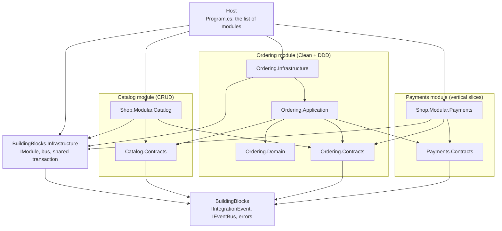
```mermaid
flowchart TD
    H["Host<br/>Program.cs: the list of modules"]
    subgraph catalog["Catalog module (CRUD)"]
        C["Shop.Modular.Catalog"]
        CC["Catalog.Contracts"]
    end
    subgraph ordering["Ordering module (Clean + DDD)"]
        OI["Ordering.Infrastructure"]
        OA["Ordering.Application"]
        OD["Ordering.Domain"]
        OC["Ordering.Contracts"]
    end
    subgraph payments["Payments module (vertical slices)"]
        P["Shop.Modular.Payments"]
        PC["Payments.Contracts"]
    end
    BBI["BuildingBlocks.Infrastructure<br/>IModule, bus, shared transaction"]
    BB["BuildingBlocks<br/>IIntegrationEvent, IEventBus, errors"]
    H --> C
    H --> OI
    H --> P
    H --> BBI
    C --> CC
    C --> OC
    OI --> OA
    OA --> OD
    OA --> OC
    OA --> CC
    OA --> PC
    P --> PC
    P --> OC
    C --> BBI
    OI --> BBI
    P --> BBI
    BBI --> BB
    CC --> BB
    OC --> BB
    PC --> BB
```

Every arrow between modules ends at a `*.Contracts` project. Catalog references `Ordering.Contracts` because it consumes `OrderPlaced`, and Ordering references `Catalog.Contracts` because it asks for prices and consumes `StockReserved`. There is no cycle, because contracts reference nothing but the building blocks.

```
src/
  Shop.Modular.Host/                      Program.cs only
  Shop.Modular.BuildingBlocks/            IIntegrationEvent, IIntegrationEventConsumer<T>, IEventBus, errors (no dependencies)
  Shop.Modular.BuildingBlocks.Infrastructure/
                                          IModule, InProcessEventBus, SharedTransaction, AddModuleDbContext, error handler
  Shop.Modular.Catalog/                   CatalogModule, Data/ (Product, CatalogDbContext), Products/ (endpoints, rules),
                                          Integration/ (CatalogQueries, OrderPlaced and OrderCancelled consumers)
  Shop.Modular.Catalog.Contracts/         ICatalogQueries, ProductSnapshot, StockReserved, StockReservationFailed
  Shop.Modular.Ordering.Domain/           Order, OrderLine, Money, Quantity, ProductName, domain exceptions
  Shop.Modular.Ordering.Application/      Ports/, UseCases/ (PlaceOrder, PayOrder, CancelOrder, GetOrder), IntegrationEvents/ (consumers)
  Shop.Modular.Ordering.Infrastructure/   OrderingModule, Persistence/ (DbContext, repository, unit of work), Http/ (endpoints, error handler)
  Shop.Modular.Ordering.Contracts/        OrderPlaced, OrderCancelled, PaymentRequested, OrderedItem
  Shop.Modular.Payments/                  PaymentsModule, Features/ (ProcessPayment, GetPayment), Data/, FakePaymentGateway
  Shop.Modular.Payments.Contracts/        PaymentSucceeded, PaymentDeclined
```

| Part | Responsibility | May know | Must NOT know | Example file |
|---|---|---|---|---|
| **Host** | The process and its composition root: the list of modules, JSON options, the exception middleware | Each module's `IModule`, the building blocks | Anything inside a module | [`Program.cs`](../04-modular-monolith/src/Shop.Modular.Host/Program.cs) |
| **BuildingBlocks** | The shared vocabulary: what an integration event is, how to publish one, the common errors | Nothing (base library only) | Any framework, any module | [`IntegrationEvents.cs`](../04-modular-monolith/src/Shop.Modular.BuildingBlocks/IntegrationEvents.cs) |
| **BuildingBlocks.Infrastructure** | The shared plumbing: `IModule`, the in-process bus, the shared connection and transaction, the error handler for shared errors | ASP.NET Core, EF Core, Npgsql, BuildingBlocks | Any module | [`SharedTransaction.cs`](../04-modular-monolith/src/Shop.Modular.BuildingBlocks.Infrastructure/Persistence/SharedTransaction.cs) |
| **Catalog** (CRUD) | Products and stock: HTTP endpoints over its DbContext, validation rules, price lookups for others, stock reservation | Its own types, `Ordering.Contracts` (events it consumes), building blocks | Ordering's or Payments' code or tables | [`ProductEndpoints.cs`](../04-modular-monolith/src/Shop.Modular.Catalog/Products/ProductEndpoints.cs) |
| **Ordering.Domain** | The `Order` aggregate and its value objects (02's model without products and payments) | Nothing | Everything else | [`Order.cs`](../04-modular-monolith/src/Shop.Modular.Ordering.Domain/Order.cs) |
| **Ordering.Application** | Use cases, consumers of other modules' answers, ports | Its Domain, the contracts of the modules it talks to, `IEventBus` | EF Core, ASP.NET Core, any module's code, its own Infrastructure | [`PlaceOrder.cs`](../04-modular-monolith/src/Shop.Modular.Ordering.Application/UseCases/PlaceOrder.cs) |
| **Ordering.Infrastructure** | Adapters (EF Core, HTTP) and the module's composition root `OrderingModule` | Application, Domain, building blocks | Other modules' code | [`OrderRepository.cs`](../04-modular-monolith/src/Shop.Modular.Ordering.Infrastructure/Persistence/OrderRepository.cs) |
| **Payments** (slices) | Charging orders (a slice triggered by an event) and reading payments (a query slice) | Its own types, `Ordering.Contracts`, building blocks | Other modules' code or tables | [`ProcessPayment.cs`](../04-modular-monolith/src/Shop.Modular.Payments/Features/ProcessPayment.cs) |
| **`*.Contracts`** | The public surface of one module: events it publishes, queries it answers | BuildingBlocks | Any framework, any module's internals | [`CatalogContracts.cs`](../04-modular-monolith/src/Shop.Modular.Catalog.Contracts/CatalogContracts.cs) |

**How the Host composes the modules.** Each module has exactly one public class, its [`IModule`](../04-modular-monolith/src/Shop.Modular.BuildingBlocks.Infrastructure/Modules/IModule.cs) (`CatalogModule`, `OrderingModule`, `PaymentsModule`). The Host calls three methods on each: `RegisterServices` (the module registers its DbContext, consumers and use cases), `MapEndpoints` (its routes) and, in Development, `MigrateAsync` (its schema). `Program.cs` has an explicit list of modules, not reflection. Reading that one line tells you what the monolith contains.

**Ordering's project layout.** Ordering has three projects, like 02, but no Api project: the Host is the only web project. The HTTP endpoints are a driving adapter, so they live in `Ordering.Infrastructure` next to the driven adapters, and `OrderingModule` is that module's composition root (what 02's `Program.cs` was for the whole application).

**Data shapes at each boundary** for `POST /api/orders`:

| Boundary | Type | Defined in | Why a separate type |
|---|---|---|---|
| Client → Ordering's HTTP adapter | JSON → `PlaceOrderRequest` | `Ordering.Infrastructure/Http` (internal) | The JSON contract, owned by the adapter |
| Adapter → use case | `PlaceOrderCommand` | `Ordering.Application` | The use case's input, free of HTTP |
| Ordering asks Catalog | `ICatalogQueries.GetProductsAsync(ids)` → `ProductSnapshot(Id, Name, Price)` | `Catalog.Contracts` | Catalog's `Product` row never leaves Catalog. Ordering gets plain values and turns them into its own `ProductName` and `Money` with `Of()`, so another module's data is checked at the border like any other input |
| Use case ↔ domain | `Order` aggregate, `OrderLine`, value objects | `Ordering.Domain` | The rules |
| Ordering tells Catalog | `OrderPlaced(OrderId, Items)` with `OrderedItem(ProductId, Quantity)` | `Ordering.Contracts` | A fact, with ids and numbers only |
| Catalog answers | `StockReserved(OrderId)` or `StockReservationFailed(OrderId)` | `Catalog.Contracts` | The publisher owns its events |
| Use case → adapter → client | `Order` → `OrderResponse` | `Ordering.Infrastructure/Http` | The JSON contract |

If Ordering used Catalog's `Product` class, Catalog could not rename a column, add a rule or move to its own database without breaking Ordering. The snapshot and the events are the price of that freedom: a few small records.

**The database schemas.** One database, `shop_modular`, with one schema per module. A **schema** is a named namespace for tables inside one PostgreSQL database (`catalog.products`, `ordering.orders`). Each module's DbContext maps only to its own schema and keeps its own migrations history table there, so each module migrates on its own. Read from the running database (`information_schema`):

`catalog` (Catalog module):

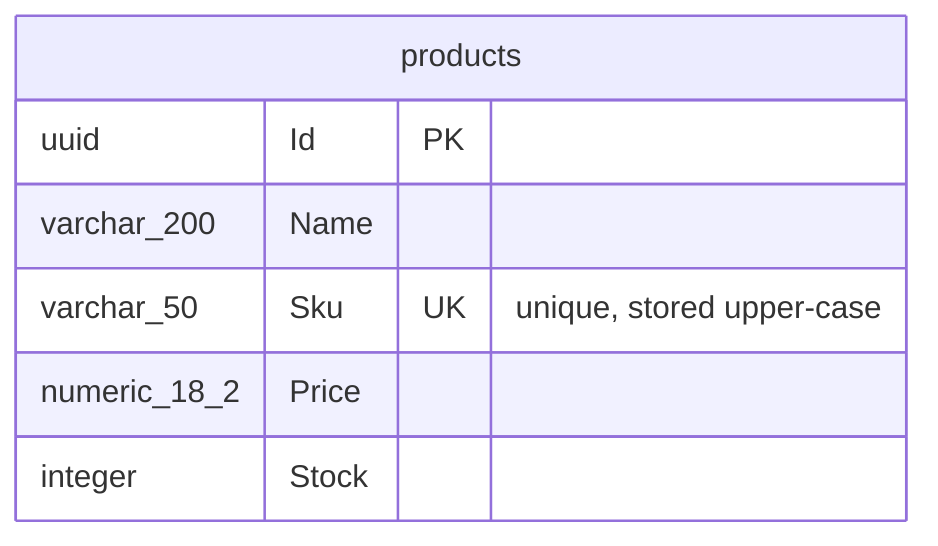
```mermaid
erDiagram
    products {
        uuid Id PK
        varchar_200 Name
        varchar_50 Sku UK "unique, stored upper-case"
        numeric_18_2 Price
        integer Stock
    }
```

`ordering` (Ordering module):

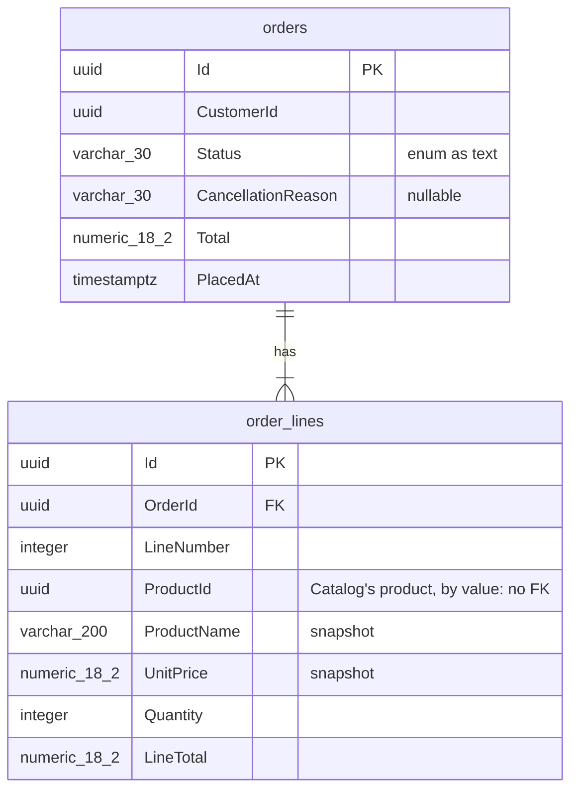
```mermaid
erDiagram
    orders ||--|{ order_lines : "has"
    orders {
        uuid Id PK
        uuid CustomerId
        varchar_30 Status "enum as text"
        varchar_30 CancellationReason "nullable"
        numeric_18_2 Total
        timestamptz PlacedAt
    }
    order_lines {
        uuid Id PK
        uuid OrderId FK
        integer LineNumber
        uuid ProductId "Catalog's product, by value: no FK"
        varchar_200 ProductName "snapshot"
        numeric_18_2 UnitPrice "snapshot"
        integer Quantity
        numeric_18_2 LineTotal
    }
```

`payments` (Payments module):

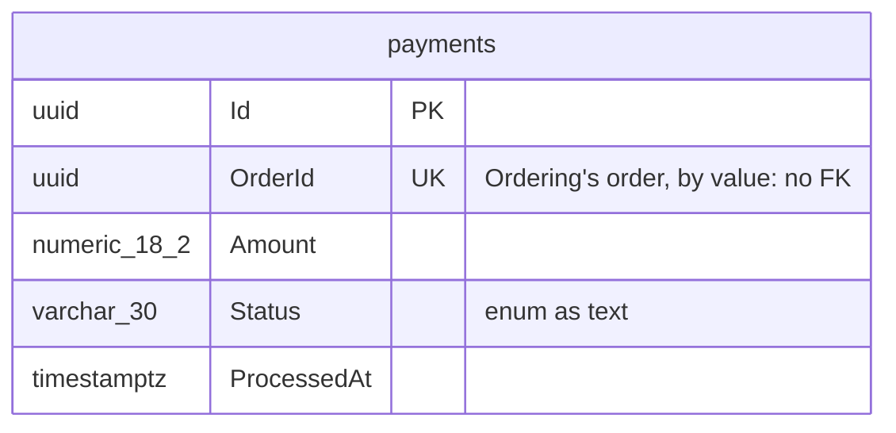
```mermaid
erDiagram
    payments {
        uuid Id PK
        uuid OrderId UK "Ordering's order, by value: no FK"
        numeric_18_2 Amount
        varchar_30 Status "enum as text"
        timestamptz ProcessedAt
    }
```

What changed from 01–03:

- **Same tables and columns, now in three schemas.** Each schema also has its own `__EFMigrationsHistory`.
- **The only foreign key is inside a module** (`order_lines → orders`). `order_lines.ProductId` and `payments.OrderId` point at other modules' rows by value only. A foreign key across schemas would be possible in one database, but it would tie two modules' tables together and could not survive the move to separate databases in 05. Version 01 already had these two columns without foreign keys (§4.2); now the reason is a module boundary.
- **No `xmin` row version.** This version locks rows instead (§7.5).

To inspect it: `scripts/create-schemas.sh 04` writes one SQL file per module, `dotnet ef migrations script --project 04-modular-monolith/src/Shop.Modular.Catalog` prints one module's SQL, `docker compose exec postgres psql -U shop -d shop_modular -c '\dn'` lists the schemas, and `-c '\d+ ordering.orders'` shows one table.

### 7.3 How modules talk: contracts, events and one transaction

A module offers two kinds of contract:

- **A query interface** for a question that needs an answer now. Ordering cannot build an order without names and prices, so it calls [`ICatalogQueries`](../04-modular-monolith/src/Shop.Modular.Catalog.Contracts/CatalogContracts.cs), which Catalog implements with an internal class. It works like a port of 02, except that the interface belongs to the module that provides the data, not to the one that uses it.
- **Integration events** (§3.9) for facts. Ordering publishes `OrderPlaced` and does not know who listens. Catalog consumes it and publishes its answer. The publisher owns the event type, in its `*.Contracts` project.

**Domain events versus integration events.** A domain event ("this order was cancelled") stays inside one module and may carry its types. An integration event crosses modules, is part of a contract and carries only ids and plain values. In this version the Ordering use cases publish integration events directly after the aggregate decides. A larger model would let `Order` record domain events and translate them into integration events in one place. The two places that cancel an order (`CancelOrder` and `PaymentDeclinedConsumer`) would then not each need to remember to publish `OrderCancelled`.

**The in-process event bus** is about ten lines ([`InProcessEventBus.cs`](../04-modular-monolith/src/Shop.Modular.BuildingBlocks.Infrastructure/Events/InProcessEventBus.cs)). `PublishAsync` resolves every `IIntegrationEventConsumer<TEvent>` registered in the current request's services and awaits them one after another. A **consumer** is the class that reacts to one kind of event. The bus has three properties. `InProcessEventBusTests` pins how consumers are called, nested and failed; `CrossModuleTransactionTests` pins the shared transaction:

- Consumers run **in the publisher's request, DI scope and transaction**.
- When `PublishAsync` returns, **every module has reacted**, including to events the consumers published themselves (Catalog's answer is consumed by Ordering before Ordering's `PublishAsync` returns).
- A consumer's **exception reaches the publisher**, and the transaction rolls everything back.

So the modules are decoupled in **code** (Ordering does not reference Catalog) but not in **time** (Ordering waits) or **failure** (a bug in Catalog fails the order).

**One transaction across modules.** Each module has its own DbContext, and a DbContext normally opens its own connection and transaction. To span modules, [`AddSharedDatabase`](../04-modular-monolith/src/Shop.Modular.BuildingBlocks.Infrastructure/Persistence/DatabaseServiceCollectionExtensions.cs) registers **one database connection per request** (a scoped `DbConnection`), and `AddModuleDbContext` builds every module's DbContext on it. [`SharedTransaction.ExecuteAsync`](../04-modular-monolith/src/Shop.Modular.BuildingBlocks.Infrastructure/Persistence/SharedTransaction.cs) then:

1. opens that connection and starts a transaction (`BEGIN`);
2. tells every module's DbContext to use it (`Database.UseTransaction`), so their `SaveChanges` calls write into it instead of starting their own;
3. runs the work and commits. Any exception skips the commit, and disposing the transaction rolls it back.

Ordering's use cases start it through their `IUnitOfWork` port, because Ordering starts every flow that spans modules: place, pay, cancel. The test [`CrossModuleTransactionTests`](../04-modular-monolith/tests/Shop.Modular.ContractTests/CrossModuleTransactionTests.cs) proves it: Catalog reserves stock, Ordering's consumer then fails, and the stock is back as it was.

**What would need an outbox if the bus were out of process.** Suppose `PublishAsync` sent a message to RabbitMQ instead of calling a method:

- **Dual write.** Saving the order and publishing `OrderPlaced` are now two writes to two systems, and no transaction covers both. Publish before the commit, and Catalog may reserve stock for an order that is then rolled back. Publish after the commit, and a crash in between loses the event: the order stays `Pending` forever. The fix is the **transactional outbox** (§3.9): write the event into an outbox table *in the same transaction* as the order, and let a background process publish it afterwards.
- **Duplicates.** Brokers deliver **at least once**, so Catalog could receive `OrderPlaced` twice and reserve twice. The fix is an **inbox**: consumers record message ids and skip repeats (they become idempotent).
- **No shared fate.** Catalog's answer arrives later, in another transaction. Placing an order must answer `202 Accepted`, `Pending` becomes visible, and if payment is declined after the stock was reserved, someone must **compensate** by releasing it. That coordination is a **saga**.

Version 05 does exactly that. This version needs none of it, because the transaction covers all modules. The code is still shaped for the move: the consumers are classes, the events are message-shaped records, and no module touches another's tables.

### 7.4 Using it

```bash
docker compose up -d
dotnet run --project 04-modular-monolith/src/Shop.Modular.Host     # http://localhost:5104
dotnet test 04-modular-monolith/Shop.slnx
```

Use [`http/shop.http`](../http/shop.http) with `@baseUrl = {{modular}}`. The API is the same as before. On the first start against an empty database, EF Core logs one `fail` per module while it looks for a migrations history table that does not exist yet, then creates it. That is harmless. To watch the modules talk, add `"Shop.Modular.BuildingBlocks.Infrastructure.Events": "Debug"` under `Logging:LogLevel` in `appsettings.Development.json`. Each publish is then logged, for example `PaymentRequested` → `PaymentDeclined` → `OrderCancelled` for one declined payment.

**Try this**

- **Cross a boundary.** In `Shop.Modular.Payments.csproj`, add a project reference to `Shop.Modular.Catalog`. `Modules_ReferenceOtherModulesOnlyThroughContracts` fails and names it.
- **Leak an internal.** Make any Catalog class `public`. `ModuleInternals_AreNotPublic` fails.
- **Remove the lock.** Delete `FOR UPDATE` from [`OrderPlacedConsumer`](../04-modular-monolith/src/Shop.Modular.Catalog/Integration/CatalogIntegration.cs). `ConcurrentOrdersForLastUnits_NeverOversell` fails: 10 orders out of 10 get the last two units (§7.5 explains why).
- **Unplug a module.** Remove `new PaymentsModule()` from `Program.cs` and pay an order. Nobody consumes `PaymentRequested`, and `PayOrder` fails with a `500` that says so, instead of answering a misleading `AwaitingPayment`.
- **Watch one connection do the work of three modules.** Turn on `"Microsoft.EntityFrameworkCore.Database.Command": "Information"` and place an order. The SELECT, INSERT and UPDATE statements of Catalog and Ordering are logged in one sequence. The `BEGIN` and `COMMIT` themselves are not: `SharedTransaction` starts the transaction on the connection directly, not through EF Core, so EF Core has nothing to log.

### 7.5 Journey of a request

`POST /api/orders`, across two modules:

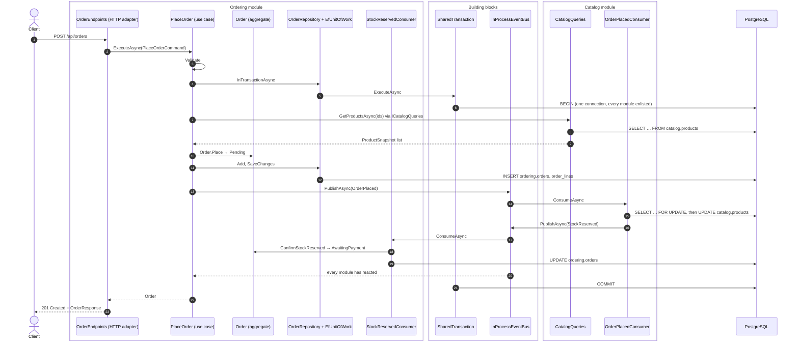
```mermaid
sequenceDiagram
    autonumber
    actor C as Client
    box Ordering module
        participant E as OrderEndpoints (HTTP adapter)
        participant U as PlaceOrder (use case)
        participant O as Order (aggregate)
        participant R as OrderRepository + EfUnitOfWork
        participant SC as StockReservedConsumer
    end
    box Building blocks
        participant T as SharedTransaction
        participant B as InProcessEventBus
    end
    box Catalog module
        participant Q as CatalogQueries
        participant K as OrderPlacedConsumer
    end
    participant PG as PostgreSQL
    C->>E: POST /api/orders
    E->>U: ExecuteAsync(PlaceOrderCommand)
    U->>U: Validate
    U->>R: InTransactionAsync
    R->>T: ExecuteAsync
    T->>PG: BEGIN (one connection, every module enlisted)
    U->>Q: GetProductsAsync(ids) via ICatalogQueries
    Q->>PG: SELECT … FROM catalog.products
    Q-->>U: ProductSnapshot list
    U->>O: Order.Place → Pending
    U->>R: Add, SaveChanges
    R->>PG: INSERT ordering.orders, order_lines
    U->>B: PublishAsync(OrderPlaced)
    B->>K: ConsumeAsync
    K->>PG: SELECT … FOR UPDATE, then UPDATE catalog.products
    K->>B: PublishAsync(StockReserved)
    B->>SC: ConsumeAsync
    SC->>O: ConfirmStockReserved → AwaitingPayment
    SC->>PG: UPDATE ordering.orders
    B-->>U: every module has reacted
    T->>PG: COMMIT
    U-->>E: Order
    E-->>C: 201 Created + OrderResponse
```

**Reception (Ordering's HTTP adapter)**

1. The framework part is §4.4. The Host mapped `POST /api/orders` to the route that `OrderingModule.MapEndpoints` registered in [`OrderEndpoints`](../04-modular-monolith/src/Shop.Modular.Ordering.Infrastructure/Http/OrderEndpoints.cs). The adapter turns the `PlaceOrderRequest` into a `PlaceOrderCommand` (a `null` line becomes an empty one, which validation then reports) and calls the use case.
   *Boundary adapter → Application: call and dependency both point inwards, as in 02.*

**Processing (Ordering, then Catalog, then Ordering again, in one transaction)**

2. [`PlaceOrder.Validate`](../04-modular-monolith/src/Shop.Modular.Ordering.Application/UseCases/PlaceOrder.cs) checks the input, with the same rules and field names as 02.
3. `unitOfWork.InTransactionAsync` → [`EfUnitOfWork`](../04-modular-monolith/src/Shop.Modular.Ordering.Infrastructure/Persistence/OrderRepository.cs) → `SharedTransaction.ExecuteAsync`: `BEGIN` on the request's connection, with the DbContexts of all three modules enlisted. **The transaction starts here.**
   *Boundary Application → Infrastructure through the `IUnitOfWork` port: the call goes outwards, the dependency points inwards.*
4. `catalog.GetProductsAsync(ids)` reaches Catalog's internal `CatalogQueries`, which projects `ProductSnapshot`s from `catalog.products`. Unknown ids become a `ValidationException` on `lines[i].productId`.
   *Boundary Ordering → Catalog: the call goes into Catalog, but the dependency stops at `Catalog.Contracts`. DI plugs in the implementation.*
5. `Order.Place` builds the aggregate in `Pending`, copying name and price from the snapshots with `Of()`. `SaveChanges` inserts the order and its lines. They exist only inside the transaction: no other request can see them.
6. `bus.PublishAsync(new OrderPlaced(…))` runs Catalog's [`OrderPlacedConsumer`](../04-modular-monolith/src/Shop.Modular.Catalog/Integration/CatalogIntegration.cs). It **locks** the order's products with `SELECT … FOR UPDATE`, in id order. A concurrent order for the same product waits here until this transaction ends. It checks that every line has enough stock, decrements all of them and saves, then publishes `StockReserved`. If any line is short, it changes nothing and publishes `StockReservationFailed`. **Catalog's rule (all lines or none) runs in Catalog.**
   *Boundary Ordering → Catalog through the bus: Ordering does not reference Catalog at all. Catalog depends on `Ordering.Contracts`, the event's owner.*
7. The bus hands `StockReserved` to Ordering's [`StockReservedConsumer`](../04-modular-monolith/src/Shop.Modular.Ordering.Application/IntegrationEvents/OrderingConsumers.cs). It loads the order (the same tracked object, since it is the same request and DbContext) and calls `ConfirmStockReserved()`: `Pending → AwaitingPayment`. **The order's rule runs in the order.** `StockReservationFailedConsumer` would call `RejectForLackOfStock()` instead.
8. `PublishAsync` returns. `PlaceOrder` reads the order again; if it were still `Pending`, nobody answered, and it throws rather than report a half-made order.
9. `COMMIT`. The order, its lines, the stock change and the final status become visible together. The waiting concurrent order now reads the reduced stock.

**Response (Ordering's HTTP adapter)**

10. `OrderResponse.From(order)` and `201 Created`. As in 01–03, the response holds the final state.

**Paying** follows the same pattern, through Payments:

1. `POST /api/orders/{id}/pay` → [`PayOrder`](../04-modular-monolith/src/Shop.Modular.Ordering.Application/UseCases/OrderUseCases.cs).
2. `InTransactionAsync` starts the shared transaction.
3. `orders.GetForUpdateAsync(id)` **locks the order row** (`SELECT 1 FROM ordering.orders … FOR UPDATE`, in [`OrderRepository`](../04-modular-monolith/src/Shop.Modular.Ordering.Infrastructure/Persistence/OrderRepository.cs)) and loads it.
4. `order.EnsureCanBePaid()`: anything but `AwaitingPayment` is a `409` before any money is asked for.
5. `PublishAsync(PaymentRequested)` → Payments' [`ProcessPayment`](../04-modular-monolith/src/Shop.Modular.Payments/Features/ProcessPayment.cs) slice charges the gateway (the order id is the idempotency key), inserts the payment and publishes `PaymentSucceeded` or `PaymentDeclined`.
6. Ordering consumes the answer: `MarkPaid()`, or `DeclinePayment()` followed by `OrderCancelled`, which Catalog's `OrderCancelledConsumer` consumes by giving the units back.
7. `COMMIT`, then `200 OK` with the order.

Step 3 closes the race that versions 02 and 03 could only document (§5.5): a cancel committing between the charge and the save. There, the order could end `Cancelled` with the money taken and no payment recorded. Here a second pay or a cancel waits at the lock, then sees `Paid` (or `Cancelled`) and is refused before Payments is asked for money. **One window remains, and no database can close it:** the charge is a call to an external system, so it is not part of the transaction. If the `COMMIT` fails after an approved charge (a dropped connection, a crash), the rows roll back but the money has moved. The idempotency key makes a retry of the same pay safe; recovering the lost charge needs a refund or a reconciliation with the provider. This is the dual write of §7.3 in miniature, already present in one process: rolling back a transaction undoes database rows, never calls to the outside world.

**Three ways to protect the stock, three versions.** Every version must pass the "ten orders, two units" test, and each does it differently:

| | How | Who waits | Cost |
|---|---|---|---|
| 01 | **Conditional update**: `UPDATE … SET stock = stock - n WHERE stock >= n` | Nobody: the database checks and writes in one statement | The rule lives in SQL |
| 02, 03 | **Optimistic concurrency**: read, decide in the domain, save `WHERE xmin = <the version read>`; on a conflict, retry | Nobody waits; losers redo their work | Retries under contention |
| 04 | **Pessimistic locking**: `SELECT … FOR UPDATE` first, then decide and save | Later requests queue on the row lock | Locks are held until the commit, so keep transactions short; lock rows in a fixed order to avoid deadlocks |

Without the lock, Catalog's code is a classic **lost update**. Ten requests read `Stock = 2` at the same time, each decides "enough", each writes `Stock = 1`, and the last write wins: ten orders reserved, one unit gone. The "Try this" experiment shows exactly that. The lock turns "read, decide, write" into a queue.

**The error path**

- **`400`.** `PlaceOrder.Validate`, Catalog's `ProductRules` and Payments' `GetPayment` throw the shared `ValidationException` (from `BuildingBlocks`). The shared handler in BuildingBlocks.Infrastructure maps it, the same way for every module.
- **`404`.** The shared `NotFoundException`, same handler.
- **`409`.** Two sources. The `Order` aggregate throws `BusinessRuleViolationException`, a type of Ordering's domain, so Ordering registers its own handler, [`OrderingExceptionHandler`](../04-modular-monolith/src/Shop.Modular.Ordering.Infrastructure/Http/OrderingExceptionHandler.cs), and the Host never learns that type exists. Catalog and Payments throw the shared `ConflictException` (duplicate SKU, stock out of range, a second payment).
- **A failure inside another module** travels back through the bus to the use case that published. The transaction rolls back, and the client gets that module's error. A bug in Catalog's consumer fails the order, and nothing is saved in any module. (Calls to the outside world, such as the payment charge, are the exception: see "Paying" above.) In one process, modules share their fate.

**Where would I change…**

| Change | Files touched |
|---|---|
| Add a field to products (`Description`) | Catalog only: `Product`, `CatalogDbContext` + a migration, the requests and `ProductResponse`, `ProductRules`. If Ordering needs it too, `ProductSnapshot` in `Catalog.Contracts`: a contract change, agreed between modules |
| Change an order rule (max 500 units per line) | `Quantity.Max` in `Ordering.Domain` |
| Change how stock is reserved (allow backorders) | `OrderPlacedConsumer` in Catalog. Ordering does not know how stock works, only the answer |
| Add an endpoint | The owning module only: `ProductEndpoints` (Catalog), a use case + `OrderEndpoints` (Ordering), a new slice file (Payments) |
| Switch the database | `BuildingBlocks.Infrastructure` (connection, design-time options, `IsUniqueViolation`), the two `FOR UPDATE` statements, each module's migrations |
| Add a module (Shipping) | New projects and its contracts, one line in `Program.cs`, consumers for the events it needs. Existing modules change only if they must publish something new |
| Move Payments to its own service | Payments and its contracts become a service, the bus becomes a broker, and the shared transaction is gone: outbox, inbox, saga (chapter 8) |

### 7.6 Rules

Two kinds of enforcement work together. The **compiler** enforces project references (a module cannot use what it does not reference) and `internal` (it cannot use what is not public, even with a reference). The **architecture tests** ([`ModuleRulesTests.cs`](../04-modular-monolith/tests/Shop.Modular.ArchitectureTests/ModuleRulesTests.cs)) guard those settings, and check what the compiler cannot see: schemas, where events live, what the compiled code uses.

| Test | Rule | Why |
|---|---|---|
| `Modules_ReferenceOtherModulesOnlyThroughContracts` | A module's projects reference only their own module, `*.Contracts` and the building blocks (project files and compiled references) | The rule that keeps modules separable |
| `Host_ReferencesOnlyModuleEntryPointsAndBuildingBlocks` | The Host references each module's entry project (the one with its `IModule`) and the building blocks, nothing else | The Host composes modules; it must not call into them |
| `BuildingBlocksInfrastructure_ReferencesNoModule` | The shared plumbing references no module, not even a contract | Shared code written for one module becomes a shared kernel for all (§7.8) |
| `Contracts_DependOnNothingButBuildingBlocks` | Contracts reference only the base library and BuildingBlocks | Every consumer inherits a contract's dependencies |
| `BuildingBlocks_DependOnNothing` | BuildingBlocks references only the base library | It is referenced by every contract and by Ordering's inner layers |
| `OrderingDomain_DependsOnNothing` | 02's first rule, inside the Ordering module | The domain is the stable centre |
| `OrderingApplication_DoesNotUseEfCoreOrAspNetCore` | 02's rule, read from the IL | Use cases stay testable with fakes |
| `OrderingApplication_DoesNotReferenceInfrastructure` | No `*.Infrastructure` assembly | Adapters depend on the application, not the reverse |
| `ModuleInternals_AreNotPublic` | Catalog, Payments and Ordering.Infrastructure export only their `IModule` (EF Core's generated migrations aside) | `internal` makes the boundary a compiler error |
| `EachModule_MapsOnlyToItsOwnSchema` | Every table in a module's EF Core model is in the schema named after the module | Data is private like code |
| `IntegrationEvents_LiveInContracts` | Every `IIntegrationEvent` is declared in a `*.Contracts` project | An event is a promise to other modules |
| `OnlyOrderingInfrastructure_RehydratesValueObjects` | 02's rule | Skipping validation is safe only for stored data |

The modules are not listed in the tests: they are read from the folders in `src/`, so a fourth module (`Shop.Modular.Shipping`) is checked from its first commit. Ordering's Domain and Application must be `public`, because its Infrastructure project uses them. The reference rules are what keep other modules out of them. One gap is accepted: `EachModule_MapsOnlyToItsOwnSchema` reads the EF Core model, so raw SQL (the two `FOR UPDATE` statements) is not checked and relies on review. A stricter setup gives each module its own database role, with rights on its own schema only. Payments' two slices have no rule between them, and Catalog has no layers to protect: rules are worth writing where a mistake is likely and expensive.

Following §6.6's lesson, every rule was broken on purpose and seen to fail, including the IL-based ones inside an async lambda. Two experiments on behaviour were also run once: committing even after an exception made `CrossModuleTransactionTests` fail (stock 3 instead of 5), removing `FOR UPDATE` made the concurrency contract test fail (10 orders instead of 2), and `RepeatedProductInOneEvent_IsReservedAsItsTotal` failed against Catalog's first version, which checked each line on its own instead of each product's total (stock -1).

### 7.7 What changed from version 03

The four versions so far:

| | 01 Layered | 02 Clean | 03 Vertical Slice | 04 Modular monolith |
|---|---|---|---|---|
| Organised by | Technical layer | Technical layer, inverted | Use case | **Business capability (module)**, then each module its own way |
| Projects in `src/` | 3 | 4 | 1 | 11 (3 modules × code + contracts, building blocks, Host) |
| Where the rules are | Services | Aggregates, `OrderFulfillment` | Same domain as 02 | `Order` aggregate in Ordering; plain rules in Catalog; none needed in Payments |
| Cross-context work | One service calls another | One domain service, one transaction | Same as 02 | **Events between modules**, one shared transaction |
| Stock concurrency | Conditional `UPDATE` | Optimistic + retry | Optimistic + retry | **Pessimistic** `FOR UPDATE` |
| Database | One schema | One schema | One schema | **One schema per module**, no cross-module foreign keys |
| Boundaries enforced by | References + tests | References + `internal` + tests | Tests | References + `internal` + tests, **per module** |
| Unit tests without a database | 12 | 75 | 62 | 81 |
| C# lines in `src/` (no migrations) | about 1,010 | about 1,600 | about 1,500 | about 1,890 in 40 files (Ordering 910, Catalog 370, building blocks 320, Payments 200, contracts 50, Host 44) |

What moved where:

- **02/03's single domain was split by owner.** `Product` went to Catalog, where it became a plain row with rules in functions: a product has field checks but no lifecycle, so CRUD is enough. `Order` went to Ordering, unchanged except for the new `Pending` state. `Payment` went to Payments as a record.
- **`OrderFulfillment` disappeared.** In 02 that domain service reserved stock on `Product` objects while placing an `Order`. Now no single module may touch both, so its job became a conversation: `OrderPlaced` → `StockReserved`. That is DDD's "one transaction per aggregate" guideline (§3.7) half-applied. Each module changes only its own aggregates, but the steps still share one database transaction.
- **Concurrency changed strategy**, from optimistic retries to pessimistic locks. With one transaction spanning a whole conversation, retrying would mean redoing the work of three modules. Queuing on a lock is simpler, and it also closed the pay-versus-cancel race (not the window between an external charge and the commit, §7.5).
- **The rule "who may know whom" moved up a level.** In 02 it was about layers; here it is mostly about modules, and inside Ordering the layers still apply.

### 7.8 Trade-offs

**Benefits**

- Boundaries that hold. The compiler and the tests stop accidental coupling, so the system stays modular as it grows, and a team can own a module.
- The right style per area: Catalog stays simple, and only Ordering pays for a rich model.
- Still one deployable and one database. Operations stay simple, a request is one stack trace to debug, and a transaction can span modules.
- A cheap path to microservices if it is ever needed. The modules already talk as services would, so extracting one is mostly mechanical (chapter 8).

**Costs**

- More structure: eleven projects instead of one, a module interface, a bus, a shared transaction, contracts.
- A boundary forbids shortcuts. There are no joins across modules, data is copied by value (snapshots), and a contract change must be agreed between modules.
- The in-process bus hides coupling in time and failure. A slow consumer slows the publisher, a failing one fails it, and every consumer holds the transaction's locks for the whole conversation. The fake payment gateway answers instantly; a real provider that takes two seconds would hold the order's row lock for two seconds on every payment.
- One database is still shared. A heavy query in one module slows the others, migrations are coordinated per release, and the whole application scales as one unit.
- BuildingBlocks needs discipline. Shared projects attract "just one more" helper. Once business logic lands there, it becomes a **shared kernel** that every module depends on, and changing it means changing every module.

**When to use it.** A new system with several business areas. Most products should start here rather than with microservices: the boundaries can be found and corrected while moving them costs a refactoring, not a migration between services. It is also a good target when cleaning up a big ball of mud.

**When NOT to use it.** A small application with one bounded context (layered or slices are enough). Parts that already need independent deployment, scaling or technology (chapter 8). Teams that cannot release together.

### 7.9 Interview questions

1. **What is a modular monolith? How is it different from a monolith and from microservices?**
   One deployable, split inside into modules with enforced boundaries, each owning its code and data and exposing a contract. A plain monolith has no enforced boundaries. Microservices have the same boundaries but put networks between them and deploy them separately.
2. **How do you enforce module boundaries in .NET?**
   A project per module (or per module layer), `internal` types, a public contracts project, project references only to contracts, a schema per module, and architecture tests that fail when any of those is broken.
3. **How should modules communicate?**
   Through their contracts only: a query interface when an answer is needed now, integration events for facts. Never through another module's classes or tables. Events carry ids and plain values.
4. **What changes if the in-process bus becomes a message broker?**
   Saving and publishing become a dual write: use a transactional outbox. Delivery is at least once: make consumers idempotent with an inbox. Answers arrive later: return `202`, expose intermediate states, and coordinate with a saga that compensates on failure.
5. **Should modules share a database?**
   Sharing the server is fine, and so is a transaction while it is one database. Sharing tables is not. Each module owns a schema, nothing reads another module's tables, and there are no foreign keys across modules. Otherwise the database couples what the code separated.
6. **Optimistic or pessimistic concurrency?**
   Optimistic (version check, retry) when conflicts are rare and the work is cheap to redo. Pessimistic (lock first) when conflicts are frequent, or redoing the work is expensive or has side effects such as charging money. Keep locked transactions short and lock in a fixed order.

---

## 8. Microservices

Code: [`05-microservices/`](../05-microservices/README.md). Decisions: [ADR 0001](../05-microservices/docs/adr/0001-microservices.md), [ADR 0002](../05-microservices/docs/adr/0002-database-per-service.md), [ADR 0003](../05-microservices/docs/adr/0003-orchestrated-saga.md), [ADR 0004](../05-microservices/docs/adr/0004-outbox-and-inbox.md), [ADR 0005](../05-microservices/docs/adr/0005-api-gateway.md), [ADR 0006](../05-microservices/docs/adr/0006-sync-price-lookup.md).

### 8.1 The idea

Version 04 drew walls inside one process. **Microservices** move each module into a process of its own: Catalog, Ordering and Payments become three **services**, each with its own database, deployed and scaled on its own, talking over the network. A fourth process, the **API gateway**, gives clients one address and the same API as before.

Why would anyone do that? Not for cleaner code: 04 already had that. The reasons are about **independence at run time and in the organisation**:

- **deploy one part** without redeploying the rest (a fix in Payments ships today, whatever Ordering is doing);
- **scale one part** (ten Catalog instances for a sale, one Payments instance);
- **isolate failures** (if Payments is down, products can still be browsed);
- **let teams own services end to end**, including their technology and release rhythm.

The price is that the network becomes part of every business operation. A method call that could not fail becomes a message that can be lost, delivered twice, delivered late or delivered out of order, and a database transaction that covered everything is gone. Almost everything new in this version exists to pay that price safely:

| Problem (new in 05) | What it looks like | The answer here |
|---|---|---|
| **Dual write** (§3.9) | The order is saved, then the process dies before the message is sent: the order waits forever | **Transactional outbox** (§8.4) |
| **Duplicate delivery** | The broker delivers `ReserveStock` twice: stock taken twice | **Idempotent inbox** (§8.4) |
| **No shared transaction** | Payment declined after the stock was reserved in another database: no rollback can reach it | **Saga** with a **compensating action** (§8.5) |
| **Partial failure** | Catalog is slow or down while an order is placed | Timeouts, retries, circuit breaker, a clear `503` (§8.6) |
| **Seeing what happened** | One order touches four processes, three databases and a broker | **Distributed tracing** in the Aspire dashboard (§8.3) |

**Analogy.** The three companies of §7.1 move to three buildings in different towns. Each keeps its own files, so nobody can walk into another's archive. Internal mail becomes the postal service: letters take time, sometimes arrive twice, and a company can be closed when you write. So every company keeps a register of letters already answered (the inbox), writes the letter in the same ledger entry as the decision (the outbox), and one company acts as the coordinator that follows each order to the end and sends "please undo" letters when a later step fails (the saga).

**Inside, nothing changed.** Each service keeps the style its 04 module had: Catalog is CRUD, Ordering is clean/hexagonal with a rich domain, Payments is vertical slices. A microservice is a **deployment** boundary, not an internal architecture (§3.2): "microservices" answers *where the code runs*, not *how a service is written*.

### 8.2 Services and their responsibilities

**Who references whom** (project references). The arrows that are missing are the point: no service references another.

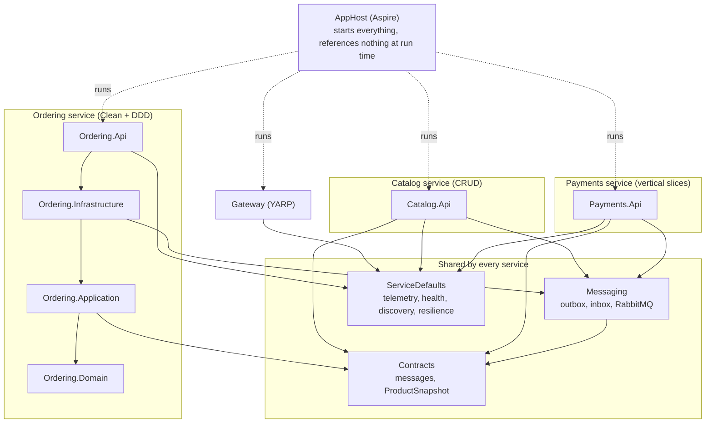
```mermaid
flowchart TD
    AH["AppHost (Aspire)<br/>starts everything, references nothing at run time"]
    GW["Gateway (YARP)"]
    subgraph catalog["Catalog service (CRUD)"]
        C["Catalog.Api"]
    end
    subgraph ordering["Ordering service (Clean + DDD)"]
        OA["Ordering.Api"]
        OI["Ordering.Infrastructure"]
        OAP["Ordering.Application"]
        OD["Ordering.Domain"]
    end
    subgraph payments["Payments service (vertical slices)"]
        P["Payments.Api"]
    end
    subgraph shared["Shared by every service"]
        CT["Contracts<br/>messages, ProductSnapshot"]
        M["Messaging<br/>outbox, inbox, RabbitMQ"]
        SD["ServiceDefaults<br/>telemetry, health, discovery, resilience"]
    end
    AH -.runs.-> GW
    AH -.runs.-> C
    AH -.runs.-> OA
    AH -.runs.-> P
    GW --> SD
    C --> M
    C --> SD
    C --> CT
    OA --> OI
    OA --> SD
    OI --> OAP
    OI --> M
    OAP --> OD
    OAP --> CT
    P --> M
    P --> SD
    P --> CT
    M --> CT
```

```
src/
  Shop.Micro.AppHost/                 Program.cs: PostgreSQL (3 databases), RabbitMQ, the services, the gateway
  Shop.Micro.ServiceDefaults/         AddServiceDefaults (OpenTelemetry, health checks, service discovery, resilience),
                                      BackgroundPollingSampler
  Shop.Micro.Gateway/                 Program.cs: YARP routes /api/products, /api/orders, /api/payments
  Shop.Micro.Contracts/               IIntegrationMessage; CatalogContracts (ReserveStock, ReleaseStock, StockReserved,
                                      StockReservationFailed, OrderedItem, ProductSnapshot); PaymentsContracts
  Shop.Micro.Messaging/               IMessageOutbox, IMessageConsumer<T>, outbox/inbox tables, OutboxDispatcher,
                                      RabbitMqConsumerHost, Topology, tracing
  Shop.Micro.Catalog.Api/             Program.cs, Products/ (endpoints, rules, snapshots), Stock/ (consumers), Data/, Errors/
  Shop.Micro.Ordering.Domain/         Order (with PaymentPending), OrderLine, value objects
  Shop.Micro.Ordering.Application/    Ports/, UseCases/ (PlaceOrder, PayOrder, CancelOrder, GetOrder), Sagas/OrderSaga, Common/
  Shop.Micro.Ordering.Infrastructure/ Persistence/ (DbContext, adapters), Catalog/CatalogHttpClient, Messaging/ (consumers)
  Shop.Micro.Ordering.Api/            Program.cs, Http/ (endpoints, error handler)
  Shop.Micro.Payments.Api/            Program.cs, Features/ (ProcessPayment, GetPayment), Data/, FakePaymentGateway, Errors/
```

| Part | Responsibility | May know | Must NOT know | Example file |
|---|---|---|---|---|
| **AppHost** | Describes the system for development: containers, databases, services, who references whom, start order | The projects it runs (as names and addresses) | Nothing at run time: it is not deployed | [`Program.cs`](../05-microservices/src/Shop.Micro.AppHost/Program.cs) |
| **Gateway** | One entry point: forwards each path prefix to the service that owns it | ServiceDefaults | Any service's code; any business rule | [`Program.cs`](../05-microservices/src/Shop.Micro.Gateway/Program.cs) |
| **ServiceDefaults** | Hosting concerns every process shares: telemetry, health endpoints, service discovery, HTTP resilience | ASP.NET Core, OpenTelemetry | Any service, any message | [`ServiceDefaultsExtensions.cs`](../05-microservices/src/Shop.Micro.ServiceDefaults/ServiceDefaultsExtensions.cs) |
| **Contracts** | The messages and the one HTTP shape another service reads | Nothing (base library only) | Any framework, any service | [`CatalogContracts.cs`](../05-microservices/src/Shop.Micro.Contracts/CatalogContracts.cs) |
| **Messaging** | Sending and receiving safely: outbox, dispatcher, inbox, consumer host, queue layout, trace propagation | EF Core, RabbitMQ.Client, Contracts' marker interface | Which messages exist, any service | [`Outbox.cs`](../05-microservices/src/Shop.Micro.Messaging/Outbox.cs) |
| **Catalog** (CRUD) | Products and stock over HTTP; reserves and releases stock on command; answers price lookups | Contracts, Messaging, ServiceDefaults | Other services' code or databases | [`StockConsumers.cs`](../05-microservices/src/Shop.Micro.Catalog.Api/Stock/StockConsumers.cs) |
| **Ordering.Domain** | The `Order` aggregate, now with `PaymentPending` | Nothing | Everything else | [`Order.cs`](../05-microservices/src/Shop.Micro.Ordering.Domain/Order.cs) |
| **Ordering.Application** | Use cases, the saga, the ports (`IOrderRepository`, `IUnitOfWork`, `IOutgoingMessages`, `ICatalogClient`) | Domain, Contracts | EF Core, ASP.NET Core, RabbitMQ, Messaging | [`OrderSaga.cs`](../05-microservices/src/Shop.Micro.Ordering.Application/Sagas/OrderSaga.cs) |
| **Ordering.Infrastructure** | The adapters: EF Core, the outbox, the Catalog HTTP client, the message consumers that drive the saga | Application, Messaging | Other services' code | [`CatalogHttpClient.cs`](../05-microservices/src/Shop.Micro.Ordering.Infrastructure/Catalog/CatalogHttpClient.cs) |
| **Ordering.Api** | The HTTP adapter and the service's composition root | Infrastructure, ServiceDefaults | Other services | [`OrderEndpoints.cs`](../05-microservices/src/Shop.Micro.Ordering.Api/Http/OrderEndpoints.cs) |
| **Payments** (slices) | Charges orders on command (once per order) and serves payment reads | Contracts, Messaging, ServiceDefaults | Other services' code or databases | [`ProcessPayment.cs`](../05-microservices/src/Shop.Micro.Payments.Api/Features/ProcessPayment.cs) |

**What the services share, and why so little.** Only three projects: Contracts (the messages: two services must agree on them anyway), Messaging and ServiceDefaults (plumbing with no business meaning). Version 04's `BuildingBlocks` also held the error types (`ValidationException`…) and a ProblemDetails handler; here **each service has its own small copy** ([Catalog's](../05-microservices/src/Shop.Micro.Catalog.Api/Errors/ErrorHandling.cs)). Sharing them would mean that changing an error type forces every service to rebuild and redeploy, which is the coupling microservices exist to remove. The usual advice is "don't share business code between services; share libraries only like you would share a public NuGet package", and a little duplication is the accepted price.

**Data shapes at each boundary** for `POST /api/orders`:

| Boundary | Type | Defined in | Why a separate type |
|---|---|---|---|
| Client → gateway → Ordering | JSON → `PlaceOrderRequest` | `Ordering.Api/Http` | The public JSON contract, unchanged since 01 |
| Adapter → use case | `PlaceOrderCommand` | `Ordering.Application` | Free of HTTP |
| Ordering asks Catalog (HTTP) | `GET /internal/product-snapshots?ids=…` → `ProductSnapshot[]` | `Contracts` | Was `ICatalogQueries` in 04: the same question, now over the network |
| Use case ↔ domain | `Order`, `OrderLine`, value objects | `Ordering.Domain` | The rules |
| Ordering → outbox row → broker | `ReserveStock(OrderId, Items)` as JSON in `outbox_messages.Payload`, then an AMQP message | `Contracts`; `Messaging` | Ids and numbers only: the receiver may be written, deployed and versioned separately |
| Catalog → broker → Ordering | `StockReserved(OrderId)` / `StockReservationFailed(OrderId)` | `Contracts` | Answers |
| Use case → adapter → client | `Order` → `OrderResponse` with `status: "Pending"` | `Ordering.Api/Http` | The response describes what is known *now* |

**The databases.** One PostgreSQL **server** for convenience (the AppHost starts one container) with **one database per service**: `catalogdb`, `orderingdb`, `paymentsdb`. That is the pattern called **database per service** (ADR 0002). A service's tables are reachable only through that service's API or messages: PostgreSQL cannot even join tables across databases, so the boundary of 04's schemas is now a hard one. Read from the databases (`information_schema`):

`catalogdb` (Catalog service):

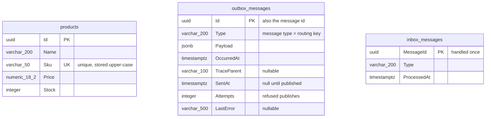
```mermaid
erDiagram
    products {
        uuid Id PK
        varchar_200 Name
        varchar_50 Sku UK "unique, stored upper-case"
        numeric_18_2 Price
        integer Stock
    }
    outbox_messages {
        uuid Id PK "also the message id"
        varchar_200 Type "message type = routing key"
        jsonb Payload
        timestamptz OccurredAt
        varchar_100 TraceParent "nullable"
        timestamptz SentAt "null until published"
        integer Attempts "refused publishes"
        varchar_500 LastError "nullable"
    }
    inbox_messages {
        uuid MessageId PK "handled once"
        varchar_200 Type
        timestamptz ProcessedAt
    }
```

`orderingdb` (Ordering service):

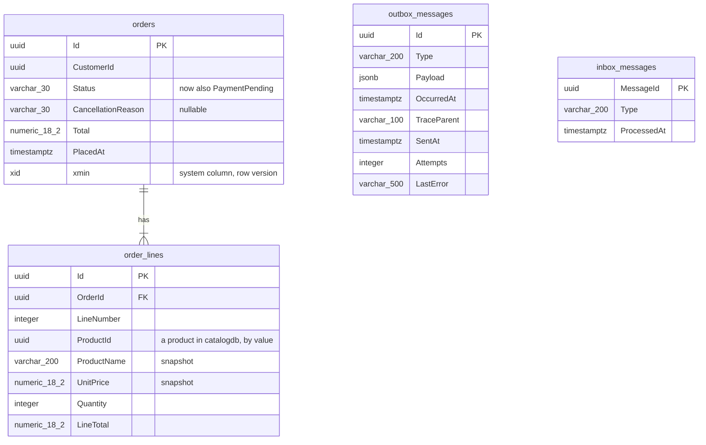
```mermaid
erDiagram
    orders ||--|{ order_lines : "has"
    orders {
        uuid Id PK
        uuid CustomerId
        varchar_30 Status "now also PaymentPending"
        varchar_30 CancellationReason "nullable"
        numeric_18_2 Total
        timestamptz PlacedAt
        xid xmin "system column, row version"
    }
    order_lines {
        uuid Id PK
        uuid OrderId FK
        integer LineNumber
        uuid ProductId "a product in catalogdb, by value"
        varchar_200 ProductName "snapshot"
        numeric_18_2 UnitPrice "snapshot"
        integer Quantity
        numeric_18_2 LineTotal
    }
    outbox_messages {
        uuid Id PK
        varchar_200 Type
        jsonb Payload
        timestamptz OccurredAt
        varchar_100 TraceParent
        timestamptz SentAt
        integer Attempts
        varchar_500 LastError
    }
    inbox_messages {
        uuid MessageId PK
        varchar_200 Type
        timestamptz ProcessedAt
    }
```

`paymentsdb` (Payments service):

```mermaid
erDiagram
    payments {
        uuid Id PK
        uuid OrderId UK "one payment per order; an order in orderingdb"
        numeric_18_2 Amount
        varchar_30 Status "Approved or Declined"
        timestamptz ProcessedAt
    }
    outbox_messages {
        uuid Id PK
        varchar_200 Type
        jsonb Payload
        timestamptz OccurredAt
        varchar_100 TraceParent
        timestamptz SentAt
        integer Attempts
        varchar_500 LastError
    }
    inbox_messages {
        uuid MessageId PK
        varchar_200 Type
        timestamptz ProcessedAt
    }
```

What changed from 04's schemas:

- **Three databases instead of three schemas**, each with its own `__EFMigrationsHistory`, migrated by its own service at startup (Development only).
- **`outbox_messages` and `inbox_messages` in every database.** They must live next to the business tables, because the whole point is to write them in the same local transaction (§8.4). The partial index `IX_outbox_messages_OccurredAt … WHERE "SentAt" IS NULL` keeps the dispatcher's query cheap however many sent rows accumulate.
- **`xmin` is back on `orders`** (as in 02): 05 uses optimistic concurrency again, because a row lock cannot be held across services and messages (§8.6).
- **The `Status` column has one more value**, `PaymentPending`.

To inspect it: `scripts/create-schemas.sh 05` writes one SQL file per service database; while the AppHost runs, the dashboard shows the PostgreSQL container's connection details, and `docker exec -it <postgres container> psql -U postgres -d orderingdb -c '\d+ orders'` shows one table (`docker ps` lists the container names Aspire chose).

### 8.3 Running and watching it with Aspire

```bash
dotnet run --project 05-microservices/src/Shop.Micro.AppHost     # gateway on http://localhost:5105, dashboard link in the console
dotnet test 05-microservices/Shop.slnx
```

Docker Desktop must be running; the root `compose.yaml` database is not used (the AppHost starts its own PostgreSQL and RabbitMQ containers). The console prints a dashboard login link (`http://localhost:15105/login?t=…`). The services listen on 5106 (catalog), 5107 (ordering) and 5108 (payments), but clients use only the gateway. If you want the optional **Aspire CLI** (`aspire run` instead of `dotnet run`, templates, a nicer console), install it yourself following aspire.dev; the AppHost suppresses warning `ASPIRE010`, which only says that some CLI features are unavailable without it. On a first start each service logs one EF Core `fail` while it looks for a migrations history table that does not exist yet (the red badge in the dashboard): harmless, as in 04. If the PostgreSQL and RabbitMQ containers are still running after you stop the AppHost (`docker ps`), remove them by name with `docker rm -f`; killing the process, as the trial runs of this chapter did, left them behind.

**The AppHost** ([`Program.cs`](../05-microservices/src/Shop.Micro.AppHost/Program.cs)) is the whole system in about 30 lines of C#. `AddPostgres` and `AddDatabase` declare a container and three databases; `AddRabbitMQ` a broker with its management UI; `AddProject` each service. `WithReference(x)` gives a service the connection string or address of `x` (as environment variables such as `ConnectionStrings__orderingdb` and `services__catalog__http__0`), and `WaitFor(x)` delays its start until `x` is healthy. It is a **development** tool: in production each service is deployed by its own pipeline (Aspire can also generate deployment manifests, which this playground does not use).

**ServiceDefaults** ([`ServiceDefaultsExtensions.cs`](../05-microservices/src/Shop.Micro.ServiceDefaults/ServiceDefaultsExtensions.cs)) is what every process calls first (`builder.AddServiceDefaults()`):

- **OpenTelemetry**, the vendor-neutral standard for logs, metrics and traces, exported to the dashboard;
- **health checks**: `/alive` (the process runs) and `/health` (every check passes: the database answers and, through Messaging, the service's queue is being consumed);
- **service discovery**: `http://catalog` in an `HttpClient` or a YARP destination is resolved to the address the AppHost gave the catalog service;
- **resilience** on every `HttpClient`: retries with back-off, a per-attempt timeout, a **circuit breaker** (after repeated failures, stop calling for a while and fail fast), from `Microsoft.Extensions.Http.Resilience`. The standard breaker only trips under sustained load (at least 100 calls in 30 seconds, mostly failing): placing a few orders by hand never opens it.

**Reading one order in the dashboard.** Open *Traces* (*Seguimientos* in a Spanish UI). Each row is a **trace**: everything that happened because of one request, across all processes. Each trace is a tree of **spans** (one timed operation: an HTTP call, a query, a publish). The link between processes is the **W3C Trace Context**, a `traceparent` value such as `00-<trace id>-<span id>-01`: ASP.NET Core and `HttpClient` carry it in an HTTP header automatically; Messaging carries it in the outbox row and then in an AMQP header ([`MessagingTracing`](../05-microservices/src/Shop.Micro.Messaging/MessageTypes.cs)). Paying an order whose payment is declined gives one trace with 7 resources:

```
gateway   POST /api/orders/{**rest}                        ~12 ms   ← the client already has its 202 here
ordering    POST /api/orders/{id:guid}/pay                         SELECT order, UPDATE order + INSERT outbox row
ordering      ProcessPayment publish                               (the dispatcher, after the commit)
payments        ProcessPayment process                             inbox check, charge, INSERT payment + outbox
payments          PaymentDeclined publish
ordering            PaymentDeclined process                        saga: Cancelled, outbox ReleaseStock
ordering              ReleaseStock publish
catalog                 ReleaseStock process                       UPDATE products (the compensation)
                                                          ~370 ms   ← the trace ends here
```

The shape *is* the lesson: the HTTP request ended after about 12 ms, and the business operation went on for another third of a second in three other processes. (The dashboard labels message spans by their messaging attributes, `rabbitmq shop` for a publish and `rabbitmq <queue>` for a process; click one to see the message type and id.) [`BackgroundPollingSampler`](../05-microservices/src/Shop.Micro.ServiceDefaults/BackgroundPollingSampler.cs) keeps the list readable: without it, the outbox dispatchers' polling queries and the health probes' queries showed up as more than a hundred one-span traces within a minute.

The **RabbitMQ management UI** is linked from the dashboard's *Resources* page (its user name and generated password are in the `messaging` resource's details): it shows the exchange `shop`, the queues `catalog`, `ordering`, `payments` and their `.dead-letter` queues, and the message rates.

**Try this**

- **Watch the 202.** Send `POST /api/orders` from [`http/shop.http`](../http/shop.http) with `@baseUrl = {{micro}}`: the response says `Pending`; a `GET` a moment later says `AwaitingPayment`. Pay, and `PaymentPending` comes before `Paid`. Pay twice quickly: the second answers `409`.
- **Stop Catalog.** In the dashboard's *Resources* page, stop `catalog` and place an order. Ordering's client retries until its 5-second timeout, then Ordering answers `503` (about 5 s in the trial run), and the order was not created. Restart it: everything works again.
- **Stop Payments, then pay.** The order stays `PaymentPending`; the `ProcessPayment` message waits in the `payments` queue (management UI). Start Payments again: the message is handled and the order becomes `Paid`. Nothing was lost, because the message was in the broker, not in memory. Meanwhile `GET /api/payments` through the gateway answers `504 Gateway Timeout` after 10 seconds: the gateway does not wait forever for a service that does not answer.
- **Break a rule.** Add a project reference from `Shop.Micro.Payments.Api` to `Shop.Micro.Catalog.Api`: `Services_DoNotReferenceEachOther` and `Services_ShareOnlyContractsMessagingAndServiceDefaults` both fail and name it.
- **Remove the lock, and see nothing break.** Delete `FOR UPDATE` from [`ReserveStockConsumer`](../05-microservices/src/Shop.Micro.Catalog.Api/Stock/StockConsumers.cs): `ConcurrentOrdersForLastUnits_NeverOversell` still passes. One Catalog instance handles its queue one message at a time, so the queue itself serialises the reservations. The lock is for the day there are two instances (or an HTTP stock adjustment arriving at the same moment): compare 04, where removing it made the test fail at once (§7.5). A test passing does not prove a mechanism is unnecessary.

### 8.4 Messaging done safely: broker, outbox, inbox

**The broker.** RabbitMQ is a **message broker** (§3.9): services hand it messages and it stores and delivers them, so sender and receiver need not be running at the same time. The layout is in one file, [`Topology.cs`](../05-microservices/src/Shop.Micro.Messaging/Topology.cs):

- one **exchange** named `shop`, of type **topic**. An exchange receives every published message and routes it by its **routing key**, here the message type name (`ReserveStock`);
- one **queue** per service (`catalog`, `ordering`, `payments`), **bound** to the routing keys that service consumes. A command (`ReserveStock`) has one binding, its receiver; an event could have several. Several instances of one service share its queue and split its messages (**competing consumers**);
- the queues are **quorum queues** (replicated, the recommended durable type). A message that keeps failing goes, after 5 attempts, to the queue's **dead-letter queue** (`catalog.dead-letter`…) instead of being retried forever. A message that can never succeed (a **poison message**) would otherwise block the queue and burn CPU. The attempts are counted by the consumer host, in an `x-attempt` header, not by RabbitMQ: the first version relied on the queue's own `x-delivery-limit`, which worked on RabbitMQ 4.1 and silently stopped working on 4.3 (the version Aspire starts), where a message the consumer returns with a nack is not counted. `InboxTests.FailedMessage_IsRetriedThenDeadLettered` caught it: 6,892 attempts in 30 seconds and no dead letter. `x-delivery-limit` stays as a backstop for messages the broker takes back by itself (a consumer that crashes mid-message).

**The transactional outbox** solves the dual write (§3.9, §7.3). A use case never talks to RabbitMQ. It calls `IMessageOutbox.Add(message)` ([`EfMessageOutbox`](../05-microservices/src/Shop.Micro.Messaging/Outbox.cs)), which only adds an `outbox_messages` row to the service's DbContext. The next `SaveChanges` writes the order and the row in **one local transaction**: both or neither. A background service, the **outbox dispatcher** (also called *relay* or *message relay*), then publishes what was committed:

1. It wakes up when a transaction commits (an EF Core interceptor, `OutboxSignalInterceptor`, signals it) or every 5 seconds as a fallback.
2. In a transaction, it reads up to 50 unsent rows, oldest first, with `SELECT … FOR UPDATE SKIP LOCKED`. **`SKIP LOCKED`** makes a second instance of the service skip rows the first is already sending, instead of waiting for them or sending them too.
3. It publishes each row with **publisher confirms** (the broker acknowledges that it has stored the message) and `mandatory` (the broker refuses a message no queue is bound to, instead of dropping it silently).
4. It sets `SentAt` and commits. Two kinds of failure are treated differently. If the broker refuses **one message** (no queue is bound to its type, or a nack), the row's `Attempts` grows, `LastError` records why, and the dispatcher goes on with the next row: retrying the refused row first every time would hold back every message behind it (**head-of-line blocking**). After 5 refusals the row is skipped for good and waits, unsent, for a person. If the broker or the connection is down, nothing can be sent: the dispatcher records what it sent, stops and tries again later without counting it against the rows (otherwise a short outage would park every message). `OutboxTests.UnroutableMessage_DoesNotBlockTheOthers` pins the first case; the first version stopped at the first failure, and that test timed out against it. Order is therefore kept only per row, not across rows; the saga never depends on the order of messages about different orders.

The outbox moves the problem; it does not make it vanish. If the dispatcher dies between step 3 and step 4, the row is published again on the next run. Delivery is therefore **at least once**, never "exactly once".

**The idempotent inbox** makes "at least once" harmless. [`RabbitMqConsumerHost`](../05-microservices/src/Shop.Micro.Messaging/Inbox.cs) handles each delivery in one local transaction:

1. `BEGIN`; if `inbox_messages` already has this message id, end the transaction (nothing to write), **acknowledge** (tell the broker it can forget the message) and stop: a duplicate.
2. Insert the inbox row, run the service's consumer (its writes and the messages it sends through the outbox, all in this transaction), `SaveChanges`, `COMMIT`.
3. Acknowledge. If the process dies before this line, the broker redelivers, and step 1 recognises the message.
4. On any exception: roll back (no inbox row, no business change, no outgoing message). If this was not yet the fifth attempt, wait a little (200 ms × attempt), publish a copy back to the queue with the next attempt number, and acknowledge the original; otherwise **reject** it without requeue, which sends it to the dead-letter queue. (An ack tells the broker the message is handled; a **nack** or reject says it failed.)

`InboxTests.DuplicateMessage_IsHandledOnce` publishes the same message id twice and checks that the consumer ran once and its row was written once. Two copies handled at the very same moment both pass step 1, and the inbox's primary key stops the second at commit. Its redelivery is then a recognised duplicate. **"Exactly once" is not something the broker gives; it is what the outbox plus an idempotent consumer achieve together** (often called *effectively once*).

Two kinds of duplicates need two defences. The inbox catches the *same message* delivered twice. A *second message with the same meaning* (a new id) needs a business-level check: Payments refuses to charge an order that already has a payment, and the saga ignores replies that do not fit the order's state (§8.5).

**Readiness.** A message published to an exchange with no matching queue is refused (`mandatory`), and the dispatcher keeps it and retries. To avoid that at startup, each service reports itself healthy only once its queue is declared and consumed (`MessagingHealthCheck`), and the AppHost starts the gateway only after all three services are healthy.

**What this playground leaves out.** Retries wait inside the consumer, which handles one message at a time, so a failing message delays the rest of its service's queue (about 2 seconds over its 5 attempts); a separate delay queue would avoid that. Sent outbox rows and inbox rows are never deleted (a scheduled job would delete them after a few days); messages are not versioned (adding an optional field is safe, renaming a type is a breaking change because the name is the routing key); there is no replay tooling for dead letters (the management UI can move them by hand). A library such as MassTransit or Wolverine provides all of this; it is hand-written here so the mechanics are visible, and the guide's advice for production is to use one (§8.9).

### 8.5 The saga: orchestration and compensation

A **saga** (§3.10) replaces one database transaction with a sequence of **local transactions**, one per service, linked by messages. When a later step fails, the earlier ones cannot be rolled back, because they are already committed in other databases. Instead the saga runs **compensating actions**: new transactions that undo the effect in business terms ("give the units back"), not technically ("restore the old row").

There are two ways to coordinate one:

- **Choreography**: each service reacts to the others' events and publishes its own; nobody holds the whole picture. Version 04's in-process events were choreography (`OrderPlaced` → Catalog reacted → `StockReserved`).
- **Orchestration**: one component, the **orchestrator**, tells each participant what to do (**commands**) and decides the next step from their replies (**events**). Version 05 uses orchestration, with Ordering as the orchestrator (ADR 0003): the flow is short, it has one natural owner (the order), and its whole logic is then in one readable class, [`OrderSaga`](../05-microservices/src/Shop.Micro.Ordering.Application/Sagas/OrderSaga.cs).

That choice shows in the messages ([`Contracts`](../05-microservices/src/Shop.Micro.Contracts/CatalogContracts.cs)). 04's events became commands with imperative names, owned by the service that **receives** them, because a command is part of the receiver's API:

| 04 (choreography, in process) | 05 (orchestration, broker) | Kind | Owner |
|---|---|---|---|
| `OrderPlaced` | `ReserveStock(OrderId, Items)` | command | Catalog |
| `OrderCancelled` | `ReleaseStock(OrderId, Items)` | command (the compensation) | Catalog |
| `PaymentRequested` | `ProcessPayment(OrderId, Amount)` | command | Payments |
| `StockReserved`, `StockReservationFailed` | same | reply event | Catalog |
| `PaymentSucceeded`, `PaymentDeclined` | same | reply event | Payments |

**The saga's state is the order's status.** No separate saga table is needed, because the order already says how far the process went:

```mermaid
stateDiagram-v2
    [*] --> Pending: POST /orders (ReserveStock sent)
    Pending --> AwaitingPayment: StockReserved
    Pending --> Rejected: StockReservationFailed
    AwaitingPayment --> PaymentPending: POST /pay (ProcessPayment sent)
    AwaitingPayment --> Cancelled: POST /cancel (ReleaseStock sent)
    PaymentPending --> Paid: PaymentSucceeded
    PaymentPending --> Cancelled: PaymentDeclined (ReleaseStock sent = compensation)
    Rejected --> [*]
    Paid --> [*]
    Cancelled --> [*]
```

Each reply is handled in one local transaction: the inbox row, the order's new status and, if any, the next command in the outbox. [`OrderSaga.StepAsync`](../05-microservices/src/Shop.Micro.Ordering.Application/Sagas/OrderSaga.cs) checks that the order is in the state the reply belongs to. If not (a late reply, or a repeat with a new id), it logs a warning and does nothing: in a distributed system that is normal, not an error. An order that does not exist is a real fault, so it throws, and the message ends in the dead-letter queue. `OrderSagaTests` covers every transition, the compensation and every ignored reply.

**`PaymentPending` closes a race without a lock.** In 02/03 a cancel could slip in between the charge and the save (§5.5); 04 closed that with a row lock held for the whole request (§7.5). A lock cannot be held while a message travels to another service and back, so 05 closes it in the **model**: asking for the payment moves the order to `PaymentPending`, and from there neither pay nor cancel is allowed (`Order.Cancel` only works from `AwaitingPayment`). If a pay and a cancel read `AwaitingPayment` at the same instant, both try to save, and the `xmin` row version lets only the first succeed; the second becomes `409`.

**What a saga does not give you: isolation.** Between `ReserveStock` and `ReleaseStock`, other customers see the stock as taken, even if the payment will be declined. That is the "I" of ACID missing (§3.10), and it is a business decision: acceptable here, not for every domain. Sagas are designed around such semantic locks (`Pending`, `PaymentPending` are exactly that: states that tell everyone "in progress").

### 8.6 Journey of a request

**Placing an order** (`POST /api/orders`): the request ends at step 7; the saga goes on without the client.

```mermaid
sequenceDiagram
    autonumber
    actor C as Client
    participant G as Gateway (YARP)
    box Ordering service
        participant OE as OrderEndpoints
        participant PO as PlaceOrder
        participant ODB as orderingdb (+ outbox)
        participant OD as Outbox dispatcher
        participant OS as OrderSaga (via consumer + inbox)
    end
    box Catalog service
        participant CE as /internal/product-snapshots
        participant CR as ReserveStockConsumer (+ inbox)
        participant CDB as catalogdb (+ outbox)
        participant CD as Outbox dispatcher
    end
    participant MQ as RabbitMQ
    C->>G: POST /api/orders
    G->>OE: forward (service discovery)
    OE->>PO: ExecuteAsync(PlaceOrderCommand)
    PO->>CE: GET snapshots (HTTP, timeout, retries)
    CE-->>PO: ProductSnapshot[]
    PO->>ODB: INSERT order (Pending) + outbox ReserveStock, one COMMIT
    OE-->>C: 202 Accepted, Location, status Pending
    OD->>ODB: SELECT unsent … FOR UPDATE SKIP LOCKED
    OD->>MQ: publish ReserveStock (confirmed), mark sent
    MQ->>CR: deliver (catalog queue)
    CR->>CDB: BEGIN, inbox row, SELECT … FOR UPDATE, UPDATE stock, outbox StockReserved, COMMIT
    CR-->>MQ: ack
    CD->>MQ: publish StockReserved
    MQ->>OS: deliver (ordering queue)
    OS->>ODB: BEGIN, inbox row, order → AwaitingPayment, COMMIT
    OS-->>MQ: ack
    C->>G: GET /api/orders/{id} (later)
    G->>OE: forward
    OE-->>C: 200, status AwaitingPayment
```

**Reception (gateway, then Ordering's HTTP adapter)**

1. The [gateway](../05-microservices/src/Shop.Micro.Gateway/Program.cs) matches `/api/orders/{**rest}` and forwards the request to the `ordering` cluster, whose destination `http://ordering` service discovery resolves. It adds no logic. **YARP** (Yet Another Reverse Proxy) is Microsoft's **reverse proxy** library: a server that receives requests on behalf of others and forwards them (ADR 0005).
   *Boundary client → gateway → service: an HTTP hop, no code dependency at all.*
2. ASP.NET Core in the Ordering process (§4.4) calls [`OrderEndpoints`](../05-microservices/src/Shop.Micro.Ordering.Api/Http/OrderEndpoints.cs), which builds a `PlaceOrderCommand`, as in 02 and 04.

**Processing (inside Ordering, one local transaction)**

3. [`PlaceOrder`](../05-microservices/src/Shop.Micro.Ordering.Application/UseCases/PlaceOrder.cs) validates the input, then asks Catalog for names and prices through the `ICatalogClient` port. The adapter, [`CatalogHttpClient`](../05-microservices/src/Shop.Micro.Ordering.Infrastructure/Catalog/CatalogHttpClient.cs), calls `GET http://catalog/internal/product-snapshots?ids=…` with retries, a circuit breaker and a 5-second overall timeout. This is the one **synchronous** call between services (ADR 0006): the customer is waiting, and the order cannot be priced without it. Unknown ids → `400`, as before.
   *Boundary Ordering → Catalog: the call crosses the network; the only shared type is `ProductSnapshot` in Contracts. Dependency: Application → port; Infrastructure → Application.*
4. `Order.Place` creates the order in `Pending`. `orders.Add(order)` and `messages.Send(new ReserveStock(…))` only stage changes (the second through the [`OutboxOutgoingMessages`](../05-microservices/src/Shop.Micro.Ordering.Infrastructure/Persistence/Adapters.cs) adapter into Messaging's outbox). `unitOfWork.SaveChangesAsync` writes **the order, its lines and the outbox row in one transaction**. That transaction is the only one this request has.
   *Boundary Application → Messaging: through Ordering's own port `IOutgoingMessages`; the Application does not know there is an outbox.*

**Response**

5. The adapter answers **`202 Accepted`** with `Location: /api/orders/{id}` and the order in `Pending`. `202` means "accepted for processing, not finished": the client polls the `Location` (the **asynchronous request-reply** pattern). This is the one intended difference in the public API (§2.8).

**After the response (the saga, in the background)**

6. Ordering's outbox dispatcher, woken by the commit, publishes `ReserveStock` to the `shop` exchange; RabbitMQ routes it to the `catalog` queue.
7. Catalog's consumer host opens a transaction, records the message in the inbox and runs [`ReserveStockConsumer`](../05-microservices/src/Shop.Micro.Catalog.Api/Stock/StockConsumers.cs): lock the products in id order, check every line (all or none), decrement, stage `StockReserved` (or `StockReservationFailed`) in Catalog's outbox. One commit; then the delivery is acknowledged.
8. Catalog's dispatcher publishes the reply to the `ordering` queue. Ordering's [consumer](../05-microservices/src/Shop.Micro.Ordering.Infrastructure/Messaging/SagaConsumers.cs) hands it to `OrderSaga`, which moves the order to `AwaitingPayment` (or `Rejected`) in one more local transaction.

Three local transactions in two databases, four message hops counting the publishes, and no moment where both databases are locked together. In the test environment the whole sequence takes a few tens of milliseconds; a client that reads the order right after the `202` may still see `Pending`, which is why the contract suite polls (`WaitForSettled`).

**Paying** (`POST /api/orders/{id}/pay`):

1. [`PayOrder`](../05-microservices/src/Shop.Micro.Ordering.Application/UseCases/OrderUseCases.cs) loads the order and calls `RequestPayment()`: `AwaitingPayment → PaymentPending`, or `409`.
2. It stages `ProcessPayment(OrderId, Total)` and saves both in one transaction (a concurrent change → `xmin` conflict → `409`). Answer: `202 Accepted`, status `PaymentPending`.
3. Payments' [`ProcessPaymentConsumer`](../05-microservices/src/Shop.Micro.Payments.Api/Features/ProcessPayment.cs), inside its inbox transaction: if the order already has a payment, it re-sends that outcome and charges nothing. Otherwise it charges the gateway (order id as the **idempotency key**), inserts the payment and stages `PaymentSucceeded` or `PaymentDeclined`.
4. `OrderSaga` marks the order `Paid`, or, on a decline, `Cancelled (PaymentDeclined)` and stages `ReleaseStock`: **the compensation**.
5. Catalog's [`ReleaseStockConsumer`](../05-microservices/src/Shop.Micro.Catalog.Api/Stock/StockConsumers.cs) gives the units back. Nobody waits for an answer.

**The external charge, again.** As in 04 (§7.5), the charge is a call to the outside world inside a local transaction that may still fail. Here the consequence is milder: a failed commit means the message was not acknowledged, so it is redelivered and the charge asked for again with the same idempotency key, which a real provider recognises. Without idempotency keys at the provider, this window would charge twice. Every external side effect in a message consumer must be idempotent.

**Cancelling** stays synchronous for the order (`200`, `Cancelled`), and asynchronous for the stock: `ReleaseStock` is staged in the same transaction and the units come back a moment later. The contract test waits for them (`WaitForProduct`).

**The error path**

- **`400`, `404`, `409`.** Detected exactly where they were in 04, each service mapping its own exceptions to ProblemDetails with its own handler ([Ordering's](../05-microservices/src/Shop.Micro.Ordering.Api/Http/ErrorHandler.cs)). The gateway passes the response through untouched.
- **A business failure after the `202`** is not an HTTP error any more: it is a **state**. A lack of stock arrives as `Rejected`, a declined payment as `Cancelled (PaymentDeclined)`. The client learns it by reading the order.
- **A technical failure in a consumer** (a bug, a database outage) rolls back that service's transaction and returns the message to the queue; after 5 attempts it waits in the dead-letter queue for a person. The order stays in its transient state (`Pending`, `PaymentPending`) meanwhile. That is visible and recoverable, unlike a lost message. A real system adds an alert on dead letters and on orders stuck in a transient state for too long.
- **Partial failure: Catalog is down while an order is placed.** The resilience handler retries until the client's 5-second timeout (`HttpClient.Timeout`) ends the wait, and `CatalogUnavailableException` becomes **`503 Service Unavailable`**: the request was valid, a dependency was not, try again later. Nothing was saved. Payments being down, on the other hand, delays payments without failing any request: messages wait in the queue. **Synchronous calls couple availability; messages do not.** That is the main reason to keep synchronous calls between services rare.
- **A service is down behind the gateway.** YARP waits at most 10 seconds for a destination (`ActivityTimeout` in the [gateway](../05-microservices/src/Shop.Micro.Gateway/Program.cs)), then answers `504 Gateway Timeout`. Without that setting the client waited for YARP's default of 100 seconds, which the first manual run of this version showed.

**Where would I change…**

| Change | Files touched |
|---|---|
| Add a field to products (`Description`) | Catalog only (entity, DbContext + migration, endpoints, rules). If Ordering needs it: `ProductSnapshot` in Contracts, a contract change, deployed **Catalog first** so the new field exists before anyone reads it |
| Change an order rule (max 500 units) | `Quantity.Max` in `Ordering.Domain`; deploy Ordering only |
| Change how stock is reserved (allow backorders) | `ReserveStockConsumer` in Catalog; deploy Catalog only |
| Add a step to the saga (reserve shipping) | A new service with its commands and replies in Contracts, new transitions in `Order` and `OrderSaga`, one more consumer in Ordering. The orchestrator is the one place to read the flow |
| Add an endpoint | The owning service, plus a gateway route if it is a new path prefix |
| Switch one service's database | That service only: its DbContext registration, migrations, raw SQL (`FOR UPDATE`, `SKIP LOCKED` in Messaging if it shares the library) |
| Replace RabbitMQ (Azure Service Bus, Kafka) | Messaging's dispatcher, consumer host and topology; the AppHost; no business code |
| Merge two services back | Possible because each kept clean insides: their messages become in-process calls again (04) |

### 8.7 Rules

[`ServiceRulesTests.cs`](../05-microservices/tests/Shop.Micro.ArchitectureTests/ServiceRulesTests.cs). Services are discovered from the folders in `src/`, like 04's modules, so a fourth service is checked from its first commit.

| Test | Rule | Why |
|---|---|---|
| `Services_DoNotReferenceEachOther` | No project of one service references a project of another (project files and compiled references) | Independent build, version and release: the reason for services |
| `Services_ShareOnlyContractsMessagingAndServiceDefaults` | Outside its own projects, a service references only those three | Shared code is coupling that must be upgraded in step |
| `Gateway_ReferencesNoService` | The gateway references only ServiceDefaults | Routing must not depend on a service's code |
| `Contracts_DependOnNothing` | Contracts reference only the base library | Every service inherits Contracts' dependencies |
| `Messaging_KnowsNoService` | Messaging references only Contracts (its marker interface) | Plumbing that knew a service would become a shared kernel |
| `ServiceDefaults_KnowsNoService` | ServiceDefaults references no Shop project | Same reason |
| `OrderingDomain_DependsOnNothing` | 02's first rule, inside the Ordering service | The domain is the stable centre |
| `OrderingApplication_DoesNotUseEfCoreAspNetCoreOrTheBroker` | No EF Core, ASP.NET Core, Npgsql, RabbitMQ or Messaging type in the Application's IL | The use cases and the saga stay testable with fakes; sending a message is a port |
| `OrderingApplication_DoesNotReferenceInfrastructure` | No `*.Infrastructure` or `*.Api` assembly | The dependency rule |
| `IntegrationMessages_LiveInContracts` | Every `IIntegrationMessage` is declared in Contracts | A message is a promise between services |
| `OnlyOrderingInfrastructure_RehydratesValueObjects` | 02's rule | Skipping validation is safe only for stored data |

Every rule was broken on purpose and seen to fail, except `OrderingApplication_DoesNotReferenceInfrastructure`: adding that reference creates a project cycle, and the build refuses it before any test runs (`MSB4006`). The rule stays, as documentation and for the day the reference arrives by another path. What the tests cannot see, review must: that no service connects to another service's **database** (the AppHost gives each service only its own connection string; that is a convention, not security, since the same server account could open the other databases: production would give each service its own database user), and that the messages keep their shape across deployments (contract tests per message, or a schema registry, are the usual answers; this playground relies on the end-to-end contract suite).

Besides the shared contract suite (54 tests, through the gateway), 05 has tests of its own:

- **Integration tests** of the messaging building block, against real PostgreSQL and RabbitMQ containers: `InboxTests.DuplicateMessage_IsHandledOnce`, `InboxTests.FailedMessage_IsRetriedThenDeadLettered`, `OutboxTests.MessageIsPublishedOnlyAfterCommit`, `OutboxTests.RolledBackMessage_IsNeverPublished`, `OutboxTests.UnroutableMessage_DoesNotBlockTheOthers`.
- **Duplicate tests on the running system** ([`DuplicateMessageTests`](../05-microservices/tests/Shop.Micro.ContractTests/DuplicateMessageTests.cs)), which reach past the gateway to the broker and the databases. `RedeliveredReserveStock_ReservesOnce` sends Ordering's own `ReserveStock` again with the same id: the stock is taken once. `SecondProcessPaymentForAnOrder_ChargesOnce_AndAnswersWithTheSamePayment` sends a new `ProcessPayment` for a paid order: one payment row, the same outcome sent again. `InternalEndpoints_AreNotReachableThroughTheGateway` checks that `/internal/…` answers `404` through the gateway. Seen failing on purpose: without the inbox, the stock ended at 1 instead of 3; without Payments' "already has a payment" check, the second message was never handled (the unique index refused it on every attempt, and it went to the dead-letter queue). Switching off only the inbox's lookup changed nothing, because the inbox's primary key still stopped the second copy at commit: the lookup is an optimisation, the key is the guarantee.
- **Saga unit tests** cover every transition with fakes. Removing the compensation from the saga makes `PaymentDeclined_CancelsTheOrder_AndCompensatesByReleasingTheStock` fail.

### 8.8 What changed from version 04

| | 04 Modular monolith | 05 Microservices |
|---|---|---|
| Deployables | 1 | 4 (3 services + gateway), plus PostgreSQL and RabbitMQ |
| Databases | 1, a schema per module | **1 per service** |
| Module/service communication | In-process bus, inside the request | **RabbitMQ**, after the request; one synchronous HTTP call (prices) |
| Coordination | Choreography of events | **Orchestrated saga** with commands and replies |
| Transaction | One across all modules | **One per service per step**; compensation instead of rollback |
| `POST /orders`, `/pay` | `201` / `200`, final state | **`202`**, `Pending` / `PaymentPending`, final state later |
| Order concurrency | `FOR UPDATE` on the order row | `xmin` row version + `PaymentPending` |
| Stock concurrency | `FOR UPDATE` (the test fails without it) | `FOR UPDATE` too (one consumer per instance makes the test pass even without it, §8.3) |
| Shared code | BuildingBlocks: events, bus, errors, transaction | Contracts, Messaging, ServiceDefaults; **errors duplicated per service** |
| New infrastructure code | Bus (≈ 10 lines), shared transaction | Outbox, dispatcher, inbox, consumer host, topology, tracing (≈ 750 lines of Messaging) |
| Tests | 81 unit, 12 architecture, 56 contract (54 shared + 2 of its own) | 99 unit, 11 architecture, 57 contract (54 shared + 3 of its own), **5 integration** |
| C# lines in `src/` (no migrations) | about 1,890 | about 2,770 in 47 files (Ordering 1,040, Messaging 750, Catalog 440, Payments 270, ServiceDefaults 130, Contracts 50, Gateway 50, AppHost 40) |

What moved where:

- **Each module became a service almost unchanged inside.** Catalog's endpoints and rules, Ordering's domain and use cases, Payments' slices: the diff from 04 is small. That was 04's promise (§7.8), and it held.
- **The bus became a broker plus a building block.** `IEventBus.PublishAsync` became `IMessageOutbox.Add`: publishing turned from "call the consumers now" into "write down that this must be sent". Consumers became `IMessageConsumer<T>` running under an inbox.
- **`ICatalogQueries` became an HTTP endpoint and a typed client.** The interface moved to Ordering as a port (`ICatalogClient`), because Catalog no longer runs in Ordering's process to implement it.
- **The shared transaction disappeared**, and with it the need for the pessimistic order lock. The model gained `PaymentPending` to do the lock's job across time.
- **The events became commands and replies** owned by their receivers, because the coordination moved from choreography to an orchestrator.

### 8.9 Trade-offs

**Benefits**

- **Independent deployment and scaling** per service, and **failure isolation** where communication is asynchronous (Payments down does not stop orders being placed).
- **Hard boundaries.** A service cannot read another's tables even by accident: the database is not reachable.
- **Team autonomy.** A team owns a service end to end, can pick its release rhythm, and in principle its technology.
- **Observability forced from the start**: tracing, health and structured logs are not optional any more, and they also help in a monolith.

**Costs**

- **Much more machinery**: a broker, an outbox, an inbox, a dispatcher, dead letters, health checks, service discovery, a gateway, tracing. About 750 lines of messaging code here, and that is the minimal version (§8.4 lists what is missing).
- **Eventual consistency.** Clients see `Pending`, must poll, and the UI must explain states that did not exist before. Stock looks taken during a payment that will fail.
- **Harder to reason about and to test.** Messages arrive late, twice or out of order; every consumer must be idempotent; the contract suite needs Aspire, containers and polling, and is slower to start and to run.
- **Operations**: four processes and two pieces of infrastructure to deploy, monitor, secure and upgrade; network calls that can time out; data spread over three databases (no join, no single backup, reports need their own read model).
- **Synchronous calls bring back coupling.** The price lookup makes order placement depend on Catalog being up: every such call trades availability for simplicity.

**The distributed monolith: warning signs.** The worst outcome is to pay all these costs and keep the coupling. Watch for:

- services that must be **deployed together** for a change to work (a shared library with business code, a message changed in a breaking way);
- **chains of synchronous calls** (A calls B, which calls C, to answer one request): the availability of the chain is the product of its links;
- **shared databases** or one service reading another's tables "just for a report";
- a "common" or "core" library every service depends on and that changes every sprint;
- one change touching most services; teams that cannot release without coordinating;
- services so small that every use case is a saga (**nano-services**).

The architecture tests here guard the first and fourth signs; the others need reviews and metrics.

**When to use it.** Several teams that must deliver independently; parts with very different scaling or availability needs; a modular monolith whose boundaries have proven stable and one of whose modules needs to break free. Extract **one** service at a time, starting where independence pays most.

**When NOT to use it.** A new product whose boundaries are still moving (start with a modular monolith, chapter 7); one small team (the coordination cost has nobody to pay off); no experience with operations, tracing and messaging yet; data that needs strong consistency across what would be services. And for a playground-sized shop, honestly: never. That is why 04 exists.

### 8.10 Interview questions

1. **What is a microservice, and what problem does it solve?**
   An independently deployable service that owns one business capability and its data, and talks to others over the network. It solves organisational and run-time problems: independent deployment, scaling and failure isolation for teams that need them. It does not solve code quality: a modular monolith gives the same boundaries far cheaper.
2. **How do you update your database and publish a message reliably?**
   With a transactional outbox: write the message to an outbox table in the same local transaction as the business change, and let a background dispatcher publish committed rows and mark them sent. Delivery becomes at least once, so consumers must be idempotent.
3. **How do you make a consumer idempotent?**
   Record each handled message id in an inbox table in the same transaction as the consumer's work, and skip ids already recorded. Add business-level checks for repeats that arrive as new messages (one payment per order, a saga that ignores replies that do not fit the state).
4. **What is a saga? Orchestration or choreography?**
   A sequence of local transactions across services, with compensating actions instead of a rollback. Choreography: services react to each other's events; good for short, loosely related flows, hard to follow as they grow. Orchestration: one orchestrator sends commands and reacts to replies; the flow is in one place, at the cost of a central component. Here Ordering orchestrates, and the order's status is the saga's state.
5. **Why answer `202 Accepted`?**
   Because the work is not finished when the request ends: it continues through messages. `202` with a `Location` tells the client where to check the outcome (asynchronous request-reply). Returning `201` with a final state would mean waiting for every service, coupling the request to all of them.
6. **What is a distributed monolith and how do you avoid it?**
   Services that cannot change or deploy independently: shared databases, shared business libraries, chains of synchronous calls, breaking message changes. Avoid it by drawing services around bounded contexts, sharing only contracts, preferring asynchronous messages, versioning contracts, enforcing references with tests, and starting from a modular monolith.

---

## 9. Combining styles

Chapters 4–8 took one architecture at a time. Real systems are rarely one style: they pick one option per axis (§3.2), and often a different option per part of the system. This chapter puts the five versions next to each other, then looks at the combinations they already contain.

### 9.1 The same request in five versions

`POST /api/orders` with one line of two units and enough stock, as told in §4.5, §5.5, §6.5, §7.5 and §8.6. One row per step, one column per version:

| Step | 01 Layered | 02 Clean / Hexagonal | 03 Vertical Slice | 04 Modular monolith | 05 Microservices |
|---|---|---|---|---|---|
| **Who receives it** | `OrderEndpoints` (Api layer) | `OrderEndpoints` (driving adapter) | `PlaceOrderEndpoint`, inside the slice file | Ordering's `OrderEndpoints`, mapped by the Host | The gateway (YARP), then Ordering's `OrderEndpoints` in another process |
| **What it hands over** | `OrderLineInput[]` | `PlaceOrderCommand` | Nothing: the endpoint *is* the use case | `PlaceOrderCommand` | `PlaceOrderCommand` |
| **Input validation** | `OrderService.Validate` | `PlaceOrder.Validate` | `Validate` in the slice | `PlaceOrder.Validate` in Ordering | `PlaceOrder.Validate` in Ordering |
| **Names and prices come from** | `ShopDbContext`, read by the Business layer | `IProductRepository` port → EF adapter | `ShopDbContext`, read by the slice | `ICatalogQueries` (Catalog's contract), in process | `ICatalogClient` port → **HTTP call** to Catalog |
| **"All lines or none" is decided by** | `ProductService.TryReserveStockAsync` (SQL) + rollback | `OrderFulfillment` (domain service) | `OrderFulfillment` (same domain as 02) | Catalog's `OrderPlacedConsumer` | Catalog's `ReserveStockConsumer` |
| **The order's state is set by** | The service, assigning `Status` | `Order.Place` / `Order.Reject` | `Order.Place` / `Order.Reject` | `Order.Place`, then `ConfirmStockReserved` | `Order.Place`, then `OrderSaga` |
| **Stock concurrency** | Conditional `UPDATE … WHERE stock >= n` | Optimistic (`xmin`) + retry | Optimistic (`xmin`) + retry | Pessimistic (`SELECT … FOR UPDATE`) | Pessimistic, inside Catalog |
| **Transactions** | 1, opened by the service | 1, inside `SaveChanges` | 1, inside `SaveChanges` | 1, shared by every module (Ordering and Catalog act) | **3**, in two databases, linked by messages |
| **How the contexts talk** | Method call between services | Domain service over aggregates | Domain service over aggregates | In-process events | RabbitMQ commands and replies, outbox and inbox |
| **Response** | `201`, final state | `201`, final state | `201`, final state | `201`, final state (`Pending` never visible) | **`202`**, `Pending`; the final state comes later |
| **A failure in stock handling** | Rolls everything back | Rolls everything back | Rolls everything back | Rolls back all modules | Rolls back Catalog's step only; the message is retried, then dead-lettered |
| **Files to read** | 3 projects, 2 services | 4 projects, use case + domain service + adapters | 1 file + the domain | 3 modules + the bus + the shared transaction | 3 services + Messaging + gateway + AppHost |

Read the table by columns and the trend is clear. Each version moves a decision further from where the request arrives. In 01, one class does almost everything. In 05, five processes take part (the gateway, three services and RabbitMQ, plus two databases), and the client gets its answer before the work is done.

Read it by rows, and one thing barely changes: **input validation and the order's rules stay in the same shape from 02 onwards.** They moved from project to module to service, but the `Order` aggregate of 05 is almost the one of 02. Good domain code survives a change of deployment style. That is the practical argument for keeping the rules away from the technology (§3.6).

### 9.2 The five versions on the four axes

The map of §3.2, filled in. Versions 04 and 05 need one row per context, because they choose per context:

| Version / part | A. Code organisation | B. Domain modelling | C. Deployment | D. Data and command flow |
|---|---|---|---|---|
| 01 | N-tier layered | Anemic (EF entities) | Monolith | Synchronous, one transaction |
| 02 | Clean / Hexagonal | DDD tactical (aggregates, value objects) | Monolith | Synchronous, one transaction |
| 03 | Vertical Slice | DDD tactical (same domain as 02) | Monolith | Light CQRS (projections for queries) |
| 04 · Catalog | CRUD / Transaction Script | Plain rows and rule functions | Modular monolith | In-process events, one shared transaction |
| 04 · Ordering | Clean / Hexagonal | DDD tactical | Modular monolith | Publishes and consumes in-process events |
| 04 · Payments | Vertical Slice | A record, no model | Modular monolith | Consumes and publishes in-process events |
| 05 · Catalog | CRUD | Plain rows and rule functions | Microservice | Messages, outbox and inbox; one internal HTTP endpoint |
| 05 · Ordering | Clean / Hexagonal | DDD tactical | Microservice | Saga orchestrator; one synchronous call to Catalog |
| 05 · Payments | Vertical Slice | A record, no model | Microservice | Messages, outbox and inbox |

Strategic DDD (bounded contexts) is the column that does not appear, because it sits under all of them: from 04 on, it decides where the rows are cut.

### 9.3 Choosing per bounded context

Versions 04 and 05 give each context the style its rules deserve ([ADR 0002 of 04](../04-modular-monolith/docs/adr/0002-style-per-module.md)):

- **Catalog is CRUD.** A product has field checks and no lifecycle. Endpoints use the DbContext directly and the rules are plain functions (`ProductRules`). A repository, a use-case class or an aggregate would add files without protecting anything.
- **Ordering is Clean / Hexagonal with a rich domain.** An order has states, transitions, money rules and a payment flow. This is where bugs cost money, so this is where the ports, the aggregate and the fast unit tests pay off.
- **Payments is vertical slices.** Two use cases: process a payment (triggered by a message) and get a payment (triggered by HTTP). One file each.

A simple way to choose, per context:

| If the context… | Then a good default is… |
|---|---|
| stores and shows data, with field checks only | CRUD (Transaction Script), maybe in slices |
| has states and rules that must never be bypassed | A rich domain model, with Clean / Hexagonal around it if technologies must be swappable or tested apart |
| has many independent use cases that change at different times | Vertical slices, with a domain model only where the rules are complex |
| talks to an unreliable external system | A port and an adapter for that system, whatever the rest looks like |

What must be **the same** across contexts is the boundary: how contexts talk (contracts, events), how errors look to clients (ProblemDetails), how the code is tested from outside (the contract suite). The inside can differ; the outside cannot.

The cost is real: a developer moving from Catalog to Ordering meets a different style. It works when each module states its style (here, in its ADR and in the guide) and when the boundary rules are enforced the same way for every module.

### 9.4 Hexagonal inside a microservice

"Microservices or hexagonal?" is the blue-or-a-car question of §3.2. A microservice is a **deployment** decision; inside it, the code still needs an organisation. The Ordering service of 05 is a small hexagon:

```mermaid
flowchart LR
    subgraph ORD["Ordering service"]
        direction LR
        API["Ordering.Api<br/>HTTP endpoints<br/>(driving adapter)"]
        SC["SagaConsumers<br/>in Ordering.Infrastructure<br/>(driving adapter: messages in)"]
        subgraph CORE["Core"]
            APP["Ordering.Application<br/>use cases, OrderSaga<br/>ports"]
            DOM["Ordering.Domain<br/>Order, Money, Quantity"]
        end
        INF["Ordering.Infrastructure<br/>EF Core, outbox adapter,<br/>CatalogHttpClient<br/>(driven adapters)"]
    end
    API --> APP
    SC --> APP
    APP --> DOM
    INF -. implements ports .-> APP
    INF --> PG[(ordering database)]
    INF --> MQ[[RabbitMQ via outbox]]
    INF --> CAT[Catalog service over HTTP]
```

The ports in [`Ports.cs`](../05-microservices/src/Shop.Micro.Ordering.Application/Ports/Ports.cs) say what the core needs from the outside world, in its own words:

| Port | What the core asks for | The adapter that answers |
|---|---|---|
| `IOrderRepository` | Load and save orders | EF Core |
| `IUnitOfWork` | Commit what changed, in one local transaction | EF Core |
| `IOutgoingMessages` | "Send this command" | Writes a row into the outbox |
| `ICatalogClient` | "Give me names and prices for these products" | `CatalogHttpClient`, with retries and a circuit breaker |

Two things in this table were *not* there in 02, and both are network concerns: sending a message and calling another service. The hexagon absorbed them as two more ports. `OrderSaga` never learns that a broker exists, so its unit tests run with fakes in milliseconds, and the architecture test `OrderingApplication_DoesNotUseEfCoreAspNetCoreOrTheBroker` keeps it that way.

Notice also what the **other** services do *not* have: Catalog and Payments have no ports at all. A service is free to be simple inside. Making every microservice a four-project hexagon "because that is our template" is the per-system mistake of §9.3 again, now multiplied by the number of services.

### 9.5 CQRS and slices on any style

CQRS (§3.8) is axis D, so it can sit on top of any organisation on axis A:

| Style | What light CQRS looks like there |
|---|---|
| Layered (01) | (Not done in this repo.) Separate query methods or an `OrderQueries` class in the Business layer that projects straight into response shapes, next to the services that change data |
| Clean (02) | (Not done in this repo: 02 reads through the repositories, §6.7.) Commands go through use cases, repositories and aggregates; queries get their own **query port** (or read directly in an adapter) and return response shapes, skipping the domain. Many teams let queries bypass the repository on purpose |
| Vertical Slice (03) | Built in: a query slice projects, a command slice loads an aggregate. The rule `Queries_DoNotModifyState` guards the split |
| Modular monolith (04) | Per module. Catalog's list endpoint already projects; `ICatalogQueries` is a read-only contract |
| Microservices (05) | Same per service, plus a second step when reads span services: a **read model** (a table or database built from the services' events), because there is no join across databases |

The full version, separate read and write stores kept in sync by events, belongs where reads and writes have very different load or shape. It costs eventual consistency between the two (§3.10) and is rarely needed for a whole system.

**Slices inside Clean Architecture.** The most common hybrid in .NET today is not on this repo's list, and it is worth knowing: keep the Clean projects (`Domain`, `Application`, `Infrastructure`, `Api`), but organise `Application` **by feature** instead of by technical kind. Instead of `Commands/`, `Queries/`, `Validators/`, `Dtos/`, there is `Orders/PlaceOrder/` with the command, its handler and its validator side by side. Version 02 already leans that way (`UseCases/Ordering/PlaceOrder.cs`). The dependency rule stays; the cohesion of a feature improves. Organisation by layer and by feature are not exclusive: one is the outer cut, the other the inner one.

### 9.6 How a system moves between styles

The repo was built by copying each version and refactoring it into the next. Real systems move in the same way: one step at a time, never all at once.

```mermaid
flowchart LR
    L["01 Layered<br/>fast start"] -->|rules grow| C["02 Clean<br/>rules in the centre"]
    C -.->|alternative: organise by feature| S["03 Slices<br/>organise by feature"]
    S -->|several areas, several people| M["04 Modular monolith<br/>boundaries by context"]
    M -->|one module needs to deploy,<br/>scale or fail alone| X["05 Microservices<br/>one service at a time"]
    X -.->|boundaries were wrong,<br/>costs too high| M
```

- **The arrows are triggers, not a ladder.** Most systems should stop at 03 or 04. Moving right is justified only by a problem the next style solves (chapter 10).
- **04 → 05 was almost mechanical** because the modules already talked like services (§8.8). Starting from 01, the same split would have meant first finding the boundaries inside tangled services. That is why the modular monolith is the usual stepping stone.
- **The dashed arrow exists.** Teams do merge services back when the boundaries were wrong or the operational cost outweighs the independence. It is easier when each service kept a clean inside (§8.6, "Merge two services back").
- **Extracting a service from a running system** usually follows the **strangler fig** pattern: put a proxy in front (a gateway like 05's), move one route at a time to the new service, and remove the old code when nothing calls it any more. The name comes from a fig that grows around a tree until it replaces it.

### 9.7 Interview questions

1. **Can you use Clean Architecture and microservices together?**
   Yes, and they answer different questions. Microservices decide how many deployables there are (axis C); Clean Architecture decides how the code inside one deployable is arranged (axis A). A service with complex rules can be hexagonal inside, as 05's Ordering is, and a simple one can be plain CRUD.
2. **Should every module or service use the same internal architecture?**
   Not necessarily. The boundary between them (contracts, error format, how they talk, how they are tested) should be uniform; the inside should match each context's complexity. The cost is that developers switch styles between modules, so each module's style must be stated and its rules enforced.
3. **Is CQRS an architecture?**
   It is a pattern on the data-flow axis. Light CQRS (separate command and query paths over one database) fits any code organisation and is cheap. Full CQRS (separate stores synchronised by events) adds eventual consistency and is worth it only for very different read and write needs.
4. **How would you move a layered monolith towards microservices?**
   First find the bounded contexts and turn them into modules with enforced boundaries inside the monolith (a modular monolith), with each module owning its tables. Then extract one module at a time behind a proxy (strangler fig), replacing in-process calls with messages and adding an outbox, an inbox and sagas where transactions used to be. Stop as soon as the remaining modules have no reason to leave.
5. **Where do the business rules go in a microservice?**
   In that service's domain code, as in any application: the deployment style does not change where rules belong. What changes is that rules spanning services can no longer run in one transaction, so they become sagas with compensations, or the boundary is redrawn so the rule fits inside one service.

---

## 10. Decision guide

There is no best architecture, only a best fit for a problem, a team and a moment (§3.1). This chapter turns the five versions into a way of choosing.

### 10.1 What drives the decision

Architects call the qualities a system must have **quality attributes** (or, informally, the "-ilities"): maintainability, testability, scalability, availability, performance, deployability, security. The functional requirements say *what* the system does; the quality attributes say *how well*, and they are what an architecture is chosen for. Two systems with the same features can need very different architectures because their quality attributes differ.

Ask these questions, in this order. The early ones rule out more options than the later ones:

1. **How complex are the business rules?** Data with field checks, or states and invariants that must never be broken? This decides axis B (anemic or rich model) and pushes axis A (CRUD, slices or Clean).
2. **How many distinct business areas are there, and how well do you know their boundaries?** One area: a monolith in any style. Several areas with known boundaries: modules. Boundaries still moving: keep them cheap to move (a monolith, or a modular monolith).
3. **How many teams, and must they release independently?** One team rarely needs more than one deployable. **Conway's law** says that a system's structure tends to copy the communication structure of the organisation that builds it. If three teams must ship on their own schedules, three deployables may follow; if one team owns everything, splitting into services creates coordination nobody needed. Some organisations use the law on purpose and shape their teams to get the architecture they want, the **inverse Conway manoeuvre**.
4. **Do parts of the system have very different needs for scale, availability or technology?** A catalogue read a thousand times per order, or a payment part that must keep working when the rest is down, can justify a separate deployable.
5. **How long will the system live, and how likely are its technologies to change?** Long-lived systems with replaceable infrastructure profit from ports and adapters; a three-month prototype does not.
6. **What can the team operate?** Microservices need messaging, tracing, deployment automation and on-call habits. Without them, the architecture fails in production however good the code is.

**Write the answers down.** An **ADR** records the decision, the alternatives and the consequences (§2.10). The questions above are a good "Context" section.

### 10.2 Decision points

**Axis A: inside one deployable**

| Pick… | When… | Avoid when… |
|---|---|---|
| CRUD / Transaction Script | Data in, data out, field checks; admin screens, catalogue maintenance | Rules about states and invariants keep appearing in several places |
| Layered | A small or short-lived app, a team that needs the most familiar structure, few rules | The rules must be tested without a database, or the infrastructure may change |
| Vertical Slice | Many use cases that change independently; most line-of-business APIs | Several delivery mechanisms must share the same use cases, or the data-access technology may change |
| Clean / Hexagonal | Rich rules, a long life, technologies to isolate, fast tests of business logic | Thin CRUD, prototypes, tools: ceremony without protection |

**Axis B: domain modelling**

| Pick… | When… |
|---|---|
| Anemic model / plain records | The "rules" are validation of fields |
| Tactical DDD (aggregates, value objects) | The model has states and invariants, and bugs in them are expensive |
| Strategic DDD (bounded contexts) | Always worth doing on paper. In code, as soon as there are several business areas or teams |

**Axis C: deployment**

| Pick… | When… |
|---|---|
| Monolith | One area, one team, or the start of anything |
| Modular monolith | Several areas, one or a few teams; the default for a new product of real size |
| Microservices | Several teams that must release independently, parts with very different scaling or availability needs, boundaries that have proven stable |

**Axis D: data and command flow**

| Pick… | When… |
|---|---|
| Synchronous calls, one transaction | Everything is in one database: the simplest correct choice |
| Light CQRS | Reads and writes have different shapes; almost always cheap |
| In-process events | Modules should not know each other, but still share a process and a transaction |
| Messaging + outbox/inbox + sagas | Contexts live in different processes and databases |
| Event sourcing | The history itself is a business requirement (audit, "what did the account look like on 3 March?") (§11.5) |

The same questions as a picture, for one part of a system:

```mermaid
flowchart TD
    A{Several business areas?} -->|No| B{Rich rules and states?}
    A -->|Yes| C{Must parts deploy, scale or fail independently?}
    B -->|No| B1[CRUD or Layered]
    B -->|Yes, many use cases| B2[Vertical Slice + domain model]
    B -->|Yes, technologies to isolate| B3[Clean / Hexagonal + DDD]
    C -->|No, or not yet| D[Modular monolith<br/>style per module]
    C -->|Yes, and the team can operate it| E[Microservices<br/>extract one at a time]
    C -->|Yes, but no ops experience yet| D
    D -.->|each module| B
    E -.->|each service| B
```

### 10.3 The five versions compared

Measured on this repo. The lines of code come from `git ls-files '<folder>/*.cs' | xargs wc -l`, split into `src/` without EF Core migrations (the hand-written application), migrations (generated) and `tests/`. Every version also runs the shared contract suite (`contract-tests/`, about 780 lines, counted once).

| | 01 Layered | 02 Clean / Hexagonal | 03 Vertical Slice | 04 Modular monolith | 05 Microservices |
|---|---|---|---|---|---|
| **Projects** (`src/` + `tests/`) | 3 + 3 | 4 + 3 | 1 + 3 | 11 + 3 | 11 + 4 |
| **Deployables** | 1 | 1 | 1 | 1 | 4 (3 services + gateway) |
| **Infrastructure** | PostgreSQL | PostgreSQL | PostgreSQL | PostgreSQL, a schema per module | PostgreSQL (a database per service), RabbitMQ, Aspire |
| **Architecture rules** | 5 | 8 | 6 | 12 | 11 |
| **Rules enforced by** | Project references + tests | References + `internal` + tests | Tests only | References + `internal` + tests, per module | References + tests; separate processes and databases |
| **Rule tests read** | ArchUnitNET + IL | ArchUnitNET + IL | ArchUnitNET + IL | Project files, references, IL (Mono.Cecil) | Project files, references, IL (Mono.Cecil) |
| **Unit tests** (no database) | 12 | 75 | 62 | 81 | 99 |
| **Other tests** | 54 contract | 54 contract | 54 contract | 56 contract | 57 contract + 5 integration |
| **Test setup** | `WebApplicationFactory` + PostgreSQL in Testcontainers | Same | Same | Same | Aspire testing host (all services, PostgreSQL, RabbitMQ in containers) + Testcontainers for messaging |
| **C# lines, `src/` without migrations** | 1,014 (24 files) | 1,604 (29) | 1,498 (33) | 1,890 (40) | 2,767 (47) |
| **C# lines, migrations** | 675 | 667 | 467 | 620 | 1,077 |
| **C# lines, `tests/`** | 351 | 1,123 | 770 | 1,360 | 1,666 |
| **C# lines, all** | 2,040 | 3,394 | 2,735 | 3,870 | 5,510 |
| **ADRs** | 2 | 3 | 3 | 4 | 6 |
| **Stock concurrency** | Conditional `UPDATE` | Optimistic + retry | Optimistic + retry | `SELECT … FOR UPDATE` | `SELECT … FOR UPDATE` in Catalog |
| **Easy** | Reading top-down; adding a CRUD field; onboarding | Changing a rule (Domain only); swapping infrastructure; unit-testing rules | Adding or changing one use case (one file); optimising one query | Giving each area its own style and owner; keeping boundaries as it grows; extracting a module later | Deploying, scaling and failing one service alone; team autonomy |
| **Hard** | Testing rules without a database; changing storage (reaches the rules); keeping rules in one place | Adding a field (all four layers, more mapping); the amount of ceremony for simple parts | Cross-cutting changes; swapping the data-access technology; rules tested only through HTTP | Joins and shortcuts across modules (forbidden); coupling in time hidden by the in-process bus | Consistency (sagas, `202`, polling); idempotency everywhere; operations, tracing, testing the whole |

Three things to notice:

- **Code size follows the number of boundaries, not the number of features.** All five do the same thing. 03 is shorter than 02 because it dropped ports; 05 is the longest because messaging alone is about 750 lines.
- **Tests move outwards as boundaries move outwards.** 02 has the most unit tests per line of code; 05 is the only one that needs integration tests of its own plumbing and a whole distributed app to run its contract tests.
- **More rules are not a sign of more quality.** 03 has the fewest enforcement tools (a single project) and the most need for tests; 04 and 05 have many rules because they have many boundaries.

### 10.4 Common mistakes

**Premature microservices.** Starting a new product as microservices because "we will need to scale". The boundaries of a new product are guesses. In a monolith, a wrong guess costs a refactoring; between services, it costs a migration of data and contracts. Martin Fowler's "Monolith First" advice: start with a well-structured monolith and extract services when a real need appears. Most products never reach that point.

**The distributed monolith.** Services that cannot be deployed or changed independently: shared databases, shared business libraries, chains of synchronous calls, messages changed in a breaking way. It has all the costs of microservices and none of the benefits. §8.9 lists the warning signs.

**Splitting by technical layer instead of by business capability.** A "database service", a "validation service", a "persistence service" that every request passes through: every feature change touches every service. Services, like modules, should follow bounded contexts (§3.7), so that most changes stay inside one.

**Entity services.** The variant of the previous mistake at the domain level: one deployed service per table (a Product service, an Order service, an OrderLine service) with CRUD endpoints. This is about deployables, not about the service classes of a layered application such as 01, and the real business process spread over callers. Each service is cohesive around data, but the behaviour is everywhere.

**Layers without a reason.** An `IOrderService` with one implementation that calls an `IOrderRepository` with one implementation that calls the `DbContext`, and no decision made anywhere (the "lasagna" of §4.8). A layer or an interface earns its place when it isolates something likely to change or needs to be replaced in tests. Otherwise it is ceremony.

**DDD vocabulary on an anemic model.** Folders named `Aggregates/` and `ValueObjects/` holding classes with public setters and no behaviour, and the rules still in services. The names promise protection the code does not give. Either move the rules into the model (02) or call it what it is, which is fine for simple contexts (Catalog in 04).

**One style for the whole system.** Forcing every part into the most complex template the team knows (or the simplest). §9.3: the style is a choice per bounded context.

**A generic repository over EF Core.** `IRepository<T>` with `GetAll`, `Add`, `Update`, `Delete` for every entity. EF Core's `DbContext` already is a unit of work and its `DbSet` a repository. A generic layer on top hides the useful parts (projections, `ExecuteUpdate`, includes) and protects nothing. Repositories pay off when they are specific to an aggregate (`IOrderRepository` in 02) and belong to the core as ports.

**A shared kernel that grows.** "Common", "Core" or "Shared" projects that start with a helper and end with business logic every module depends on (§7.8). Keep shared projects technical and small, and guard them with an architecture test.

**Architecture by diagram only.** Rules written on a wiki and enforced by nobody. They erode at the speed of the busiest week. Encode them: project references, `internal`, architecture tests, and an ADR that says why (chapter 12).

### 10.5 Keeping a decision honest

A decision is a bet on the future, so check it as the future arrives:

- **ADRs** make the bet visible: what was decided, why, what it costs. When the context changes, a new ADR supersedes the old one; the old one is kept, so the history of reasoning is never lost.
- **Fitness functions** make it measurable. The term comes from *Building Evolutionary Architectures* (Ford, Parsons, Kua): an automated check that tells whether the architecture still has a quality it was chosen for. The architecture tests of this repo are fitness functions for structure. Others measure performance (a response-time budget in a test), coupling (how many modules a typical change touches), or deployability (time from commit to production).
- **Watch where changes land.** If most changes touch three modules, the boundaries are in the wrong place. If one module changes in every sprint and nobody else does, it may be ready to leave. Version control history answers both questions.

### 10.6 Interview questions

1. **How do you choose an architecture for a new system?**
   Start from the quality attributes and constraints, not from a style: complexity of the rules, number of business areas and how well their boundaries are known, team structure, scaling and availability needs, expected lifetime, what the team can operate. For most new products that leads to a modular monolith, with a rich model only in the complex contexts. Record the decision in an ADR and protect it with tests.
2. **When would you NOT use microservices?**
   With one small team, a new product whose boundaries are still moving, no operational experience with messaging and tracing, or data that needs strong consistency across what would become services. A modular monolith gives the same code boundaries at a fraction of the cost.
3. **What is Conway's law and why does it matter?**
   Systems tend to mirror the communication structure of the organisation that builds them. It matters in both directions: service boundaries that cut across teams cause constant coordination, and some organisations deliberately shape teams to get the architecture they want (the "inverse Conway manoeuvre").
4. **What is a fitness function?**
   An automated check that an architectural characteristic still holds: an architecture test for dependencies, a performance budget, a limit on coupling. It turns an architecture decision into something the build verifies, instead of something people must remember.
5. **What is wrong with a generic repository on top of EF Core?**
   EF Core already provides a unit of work and repositories. A generic wrapper hides its useful features, leaks anyway (`IQueryable`, includes) and adds a layer that decides nothing. Aggregate-specific repositories defined as ports by the application are a different thing and can be worth it.

---

## 11. Styles explained but not implemented

Five versions cannot cover every name you will meet. The styles in this chapter are real and common, but either they answer a question this shop does not have (a user interface, plug-ins, a data pipeline), or they would turn a playground into a platform. Each section gives the idea, an analogy, what the shop would look like in that style, and when to use it.

Keep the axes of §3.2 in mind: most of these are not rivals of the five versions but choices on another axis, or patterns *inside* one part of a system.

### 11.1 MVC, MVP and MVVM: patterns for user interfaces

These three are about **the presentation layer**: how a user interface separates what it shows from what it knows. They are axis A, but at a smaller scale than the rest of this guide: they organise one part of one application.

- **MVC (Model–View–Controller).** The **model** holds data and rules, the **view** renders it, the **controller** receives input and decides what to do. On the web, a request goes to a controller, which uses the model and picks a view to render (ASP.NET Core MVC, Spring MVC, Ruby on Rails).
- **MVP (Model–View–Presenter).** Like MVC, but the view is passive: the **presenter** pulls data from the model and pushes it into the view through an interface, which makes the presenter testable without a UI. Common in older desktop frameworks (Windows Forms).
- **MVVM (Model–View–ViewModel).** The **view model** exposes state and commands; the view **binds** to them, and changes flow both ways automatically. WPF and .NET MAUI use it; Vue and Angular components work in the same spirit (a template bound to a component's state).

**Analogy.** A restaurant: the kitchen (model) cooks, the plate (view) presents, the waiter (controller, presenter or view model) takes the order and brings the food. The three patterns differ in how much the waiter does and whether the plate can talk to the kitchen.

**The shop in this style.** The API has no views, so these patterns do not appear. A web or mobile front end for the shop would use one of them *inside the front end*, and call the same API. A front end built with Vue or Angular would follow MVVM in spirit, with components as views and view models.

**When.** Whenever there is a user interface. They do not compete with Clean or Vertical Slice: an MVC web app can have a hexagonal core, with controllers as driving adapters.

### 11.2 Microkernel (plug-in) architecture

A small **core** provides the minimal system and an extension mechanism; features are **plug-ins** that the core discovers and loads, often at run time. The core does not know the plug-ins; the plug-ins know only the core's extension points.

**Analogy.** A games console and its cartridges. The console knows how to run a cartridge; each game is written against that contract and can be added years later.

**Examples.** VS Code and its extensions, browsers, Eclipse, the MSBuild task model, ASP.NET Core's own `IServiceCollection` extension methods in a small way. This repo's endpoint discovery (`IEndpoint` in 03) and module loading (`IModule` in 04) are tiny microkernels: the host finds the parts through an interface and calls them.

**The shop in this style.** A core that knows products and orders, with **payment providers** and **discount rules** as plug-ins loaded from separate assemblies: a new provider ships as a new package, with no change to the core.

**When.** Products that third parties extend, and systems with many variants of one thing (rules per country, connectors per vendor). The hard part is designing extension points that are stable for years: once plug-ins depend on them, every change breaks someone.

### 11.3 Pipes and filters

Data flows through a chain of independent steps (**filters**), connected by channels (**pipes**). Each filter takes input, transforms it and passes it on, without knowing who comes before or after.

**Analogy.** A car wash: soak, brush, rinse, dry. Each station does one thing, and stations can be added, removed or reordered.

**Examples.** The Unix shell (`cat log | grep error | sort | uniq -c`), ETL (Extract, Transform, Load) jobs that move data between systems, compiler stages, media processing. **The ASP.NET Core middleware pipeline is one** (§4.4): each middleware receives the request, does its part and calls the next.

**The shop in this style.** Not the shop's request handling, but its **back office**: a nightly import of supplier prices (read file → parse → validate → convert currency → update Catalog), with each step a filter.

**When.** Processing that is a sequence of transformations: imports, data pipelines, message processing, request pipelines. Not for business processes with branching decisions and shared state.

### 11.4 Event-driven architecture

A system where the main way parts interact is by **producing and reacting to events** (§3.9), usually through a broker. It is axis D taken as the organising principle of the whole system.

Two shapes are often described:

- **Broker topology (choreography).** No coordinator: each service reacts to events and publishes new ones. `OrderPlaced` → Catalog reserves and publishes `StockReserved` → Ordering reacts. Version 04 works this way, in process.
- **Mediator topology (orchestration).** A coordinator receives an initial event and sends commands step by step. Version 05's `OrderSaga` is a mediator for one process.

**Analogy.** A newsroom where reporters shout headlines and whoever cares picks them up, versus an editor who assigns each story.

**The shop in this style.** Already half there: 05 is event-driven between services. A fully event-driven shop would also publish `ProductPriceChanged` and `StockAdjusted`, and let new consumers (search, recommendations, a reporting database) subscribe without any change to Catalog.

**When.** Many consumers interested in the same facts, integration between systems that evolve separately, workloads that must absorb peaks (a queue smooths them). The costs are those of chapter 8: eventual consistency, duplicates, ordering, and flows that are hard to see without tracing.

### 11.5 Event sourcing

Instead of storing the current state of an aggregate, store **every event** that changed it, in order, in an **event store**, and compute the state by replaying them (§3.2).

```text
order 42:  OrderPlaced(lines, total 30.00)
           StockConfirmed
           PaymentRequested
           PaymentFailed
           OrderCancelled(PaymentDeclined)
state  →   Cancelled, total 30.00
```

Every event in the stream is Ordering's own fact: `StockConfirmed` and `PaymentFailed` record how the order reacted to the replies of Catalog and Payments, whose own events live in their own streams.

Reads that need another shape are served by **projections** (in the event-sourcing sense): read models built by consumers of the event stream, such as "orders per customer" or "revenue per day". For aggregates with long histories, a **snapshot** of the state every N events avoids replaying from the start.

**Analogy.** A bank statement versus a balance. The balance (current state) tells you how much you have; the statement (events) tells you how you got there, and you can always recompute the balance from it.

**The shop in this style.** Ordering is the natural candidate: its life *is* a sequence of events, and "why was this order cancelled?" becomes a query of its history. Catalog's stock could be event-sourced too (every adjustment and reservation as an event), which would make stock audits trivial.

**What it costs.** Events are permanent, so their shape must be versioned forever (an event written in 2026 must still be readable in 2030). Queries across aggregates need projections, which are eventually consistent. Fixing bad data means writing compensating events, not editing a row. Developers need time to think in events. It is usually combined with CQRS: commands append events, queries read projections.

**When.** When the history is a business requirement: finance, accounting, audit trails, compliance, domains where "what happened" matters as much as "what is". Not as a default persistence technique.

### 11.6 SOA and the enterprise service bus

**SOA** (Service-Oriented Architecture) was the 2000s answer to integrating many large applications in a company: expose each one's capabilities as **services** with formal contracts (often **SOAP**, the Simple Object Access Protocol, an XML message format, with each service described in **WSDL**, the Web Services Description Language), and connect them through an **ESB** (Enterprise Service Bus), a central piece of middleware that routes, transforms and orchestrates messages between them.

**How it differs from microservices.** Both are services over a network, but:

| | SOA | Microservices |
|---|---|---|
| Size of a service | Large, often a whole application or department | Small enough for one team and one bounded context |
| Data | Often shared databases | A database per service |
| Integration logic | In the central ESB ("smart pipes") | In the services ("smart endpoints, dumb pipes") |
| Goal | Reuse of enterprise capabilities | Independent change and deployment |

**Analogy.** A corporate switchboard that every call goes through, versus colleagues who have each other's direct numbers.

**When you meet it.** In large, older organisations (banks, insurance, public administration). The idea of services with explicit contracts survived; the central bus, which tended to become a bottleneck and a team that every change had to wait for, mostly did not.

### 11.7 Serverless

You deploy **functions** (Azure Functions, AWS Lambda, Google Cloud Functions), each triggered by an event: an HTTP request, a message, a timer, a file upload. The cloud provider starts instances on demand, scales them, and bills per execution. There is no server for you to manage, though there are servers. Also called **FaaS** (Function as a Service).

**Analogy.** A taxi instead of owning a car. You pay per ride, never maintain it, and it scales to as many rides as you need; but you wait for it to arrive, and long daily trips cost more than owning.

**The shop in this style.** Each consumer of 05 becomes a function triggered by its queue (`ReserveStock`, `ProcessPayment`); the HTTP endpoints become HTTP-triggered functions; the outbox dispatcher becomes a timer or a database-change trigger. The internal style of each function is still a choice: the Ordering rules would still live in a domain library the functions call.

**What it costs.** **Cold starts** (the first call after idle time waits for an instance to start), execution time limits, a harder local development and testing story, and **vendor lock-in**: the triggers, bindings and configuration are specific to one cloud. Costs are low for spiky or small workloads and can be high for constant heavy load.

**When.** Event-driven glue, spiky or unpredictable load, scheduled jobs, small teams that do not want to run servers. Less suited to latency-critical paths and long-running work.

### 11.8 Micro-frontends

Microservices applied to the user interface: the front end is split into parts owned by different teams (the product page, the cart, the account area), each built and deployed independently, and composed into one page in the browser or on the server. Common techniques: a shell application that loads remote bundles at run time (Webpack or Rspack **Module Federation**, used with Angular, React or Vue), web components, or server-side composition.

**Analogy.** A shopping centre: one building and one entrance, but each shop is fitted out and run by its own owner.

**The shop in this style.** A Catalog team ships the product pages, an Ordering team the cart and checkout, a Payments team the payment form, each talking to its own service of 05. A shell provides the layout, navigation and login.

**What it costs.** Consistent look and feel across teams, shared dependencies (two versions of a framework on one page), larger downloads, and integration testing of the whole page. As with microservices, the benefit is organisational.

**When.** Large front ends with several teams that must release independently. For one team, a well-organised single front end (feature folders, lazy-loaded routes) gives most of the benefits.

### 11.9 Other names you will hear

| Name | In one line | Relation to this repo |
|---|---|---|
| **Service-based architecture** | A few coarse-grained services (often 4–12) that share one database, deployed separately (Mark Richards' term) | A pragmatic step between 04 and 05: separate deployables without a database per service |
| **Space-based architecture** | Processing units hold data in replicated in-memory grids, and the database is written asynchronously; built for extreme, spiky load | None; it trades consistency for throughput at a scale this shop never has |
| **Actor model** | Many small isolated objects (**actors**) with private state that communicate only by messages, one message at a time (Akka, Microsoft Orleans) | Each order could be an actor; concurrency is solved by design, since an actor handles one message at a time |
| **Cell-based architecture** | The whole system is copied into independent **cells**, each serving a subset of customers, so a failure affects one cell only | A deployment choice on top of any style |
| **Screaming architecture** | Robert C. Martin's idea that the top-level folders should "scream" the business (`Orders/`, `Payments/`), not the framework (`Controllers/`, `Models/`) | 03 and 04 scream; 01 whispers "Api, Business, Data" |
| **Package by component** | Simon Brown's middle way: group code by component (a business-facing facade plus its implementation), and hide the implementation with access modifiers | Close to 04's modules, with `internal` as the hiding mechanism |
| **BCE (Boundary–Control–Entity)** | Ivar Jacobson's 1992 split of use-case objects into boundaries (input/output), controls (use-case logic) and entities | An ancestor of Hexagonal and Clean; the same three roles as adapters, use cases and domain |
| **C4 model** | Not a style: a way to *draw* architecture at four zoom levels (context, containers, components, code) | Useful to document any of the five versions |

---

## 12. Architecture and AI agents

An **AI coding agent** (Claude Code, GitHub Copilot's agent mode, Cursor, Codex and others) reads a codebase, writes code, runs commands and iterates until a task looks done. It is fast and tireless, and it is also the colleague most likely to break an unwritten rule: it sees the files in front of it, not the meeting where the team decided why `Domain` must not reference EF Core.

That makes architecture **more** important with agents, not less. The work splits into three verbs: **tell** the agent the rules, **enforce** them so a violation fails the build, and **verify** what it produced against them. This repo was built that way, and this chapter uses it as the example.

### 12.1 Why agents and architecture meet

- **Agents copy local patterns.** Asked to add a use case, an agent looks at nearby code and does the same. In a codebase with consistent structure that is exactly right; in an inconsistent one it picks a pattern at random and spreads it.
- **Agents optimise for "it works".** The shortest path to a passing feature is often a shortcut across a boundary: an endpoint that queries the `DbContext`, a module that reads another module's table, a domain class that takes an `ILogger`. Each one compiles and passes the functional tests.
- **Agents produce a lot of code quickly.** Review attention is the scarce resource. Whatever a machine can check should be checked by a machine, so people review what only people can judge.
- **Agents forget between sessions.** What was agreed in one conversation is gone in the next unless it is written in the repository.

Each point has the same answer: the architecture must be **written down where the agent reads it** and **encoded where the build checks it**.

### 12.2 Tell: ADRs and agent instruction files

**Agent instruction files** are Markdown files that coding agents load automatically at the start of every session: `CLAUDE.md` (Claude Code), `AGENTS.md` (a cross-tool convention read by several agents), `.github/copilot-instructions.md` (GitHub Copilot), and others. They are the agent's onboarding document.

This repo's [`CLAUDE.md`](../CLAUDE.md) shows what belongs there:

| Section | Why the agent needs it |
|---|---|
| What the repo is, in two lines | So the agent knows that explanations matter as much as code |
| Layout, one line per version | So it finds the right project without searching the whole tree |
| **"Never reference code across version folders"** | A rule that no compiler checks between separate solutions |
| **"The public API is a contract"** | So it does not change a status code in one version only |
| **"Architecture rules are tests… never weaken or delete an architecture test to make a change compile"** | The most important line: it closes the easiest escape |
| Conventions (naming, errors, logging, banned packages) | So generated code looks like the rest |
| Commands | So it can build, test and format without guessing |
| Workflow (branch, never merge, do not install software) | The limits of what it may do on its own |

What makes such a file work:

- **Short and specific.** Rules the agent can act on ("errors are ProblemDetails: validation `400`, business rule `409`"), not values ("write clean code"). Every line costs attention in every session.
- **The rule and a pointer to the why.** The file says *what*; the **ADRs** in each version's `docs/adr/` say *why*, with the alternatives that were rejected. An agent that knows why a rule exists makes better choices in cases the rule did not foresee, and is less tempted to "fix" a deliberate decision.
- **Kept in sync.** An instruction file that describes last year's structure is worse than none. Here, every phase updated it in the same commit as the code.
- **Scoped when it grows.** Most tools also read instruction files in sub-folders. A large repo can keep the global rules at the root and the rules of one module next to its code.

### 12.3 Enforce: guardrails that fail the build

An instruction is a request; a failing build is a fact. The repo uses three layers of enforcement, from cheapest to most expressive:

1. **Project references.** A project that does not reference another cannot use it: the compiler stops it. 02's `Domain` references no other project of the solution, so it cannot use Infrastructure (§2.3). A reference does not stop a *package*, though: adding EF Core to `Domain` is one line in its `.csproj`, and the architecture test `Domain_DependsOnNothing` (point 3) is what catches it.
2. **Access modifiers.** `internal` hides adapters and module internals. With a reference but no access, the code still does not compile (§5.6, §7.6).
3. **Architecture tests.** Everything the compiler cannot see: which packages a project uses, where interfaces live, that queries do not write, that every table is in its module's schema, that integration messages live in Contracts. One test per rule, named after it, with a comment explaining why (§2.7).

Three lessons from building them:

- **A rule must be seen failing.** §6.6 tells how two rules passed whatever the code did: one selected nothing, the other could not see inside async lambdas. Each rule in this repo that could be broken was broken on purpose, in the places where the real code lives, before it was trusted (§8.7 notes the one the build itself refuses to break). A rule written by an agent deserves the same test.
- **The failure message is an instruction.** When a test fails, its name (`Modules_ReferenceOtherModulesOnlyThroughContracts`) and the comment above it tell the agent what to do instead. A well-named rule turns a failure into guidance.
- **Protect the guardrails themselves.** An agent stuck on a failing architecture test can delete it, weaken it or exclude the offending type. That is why `CLAUDE.md` forbids it explicitly, and why changes to architecture tests deserve a careful human look in every review.

Other guardrails work the same way: analyzers with warnings as errors (`TreatWarningsAsErrors`, CA1848 for logging), `dotnet format --verify-no-changes`, central package management (a new package needs a visible line in `Directory.Packages.props`, where a banned one stands out in review), and the **contract tests**, which turn the public API into an executable specification no internal refactoring may change.

### 12.4 Verify: reviewing agent output against the rules

Tests catch what can be stated as a rule. A review catches the rest. A checklist for reviewing an agent's change, ordered by how often each problem appears:

| Check | What to look for |
|---|---|
| **Direction of dependencies** | New `using` statements and project references. Does any inner part now know an outer one? |
| **Where the rule landed** | Is a new business rule in the domain (or the context's rule functions), or in an endpoint, a handler or a SQL query? Is the same rule now in two places? |
| **Boundaries** | Does a module or service read another's data, or call its internals instead of its contract? |
| **Shared code** | Was something added to a shared project (BuildingBlocks, Messaging, a "Common" folder) that only one module needs? |
| **Transactions and consistency** | Does the change write to two places that are not in one transaction? Is a message sent without the outbox? Is a new consumer idempotent? |
| **Contracts** | Did a public API shape, a status code or a message change? Is it backwards compatible? |
| **Tests** | Do the new tests fail without the change? Were existing tests changed, and why? Was an architecture test touched? |
| **Docs** | Was the ADR, README or guide updated with the code? |

Some practical habits:

- **Ask the agent to name the rules it followed.** "Which ADRs and architecture rules does this change touch?" is a cheap question, and a wrong answer shows a misunderstanding before it shows up in code.
- **Use a fresh reviewer.** The context that wrote the code shares its blind spots. Every phase of this repo ended with a separate agent session, with no memory of the implementation, reviewing the diff against the plan, the spec and the rules, and several of its findings were real defects.
- **Review the diff, not the description.** A summary says what the agent meant to do; the diff says what it did.

### 12.5 Structures that help agents

Some architectural properties help an agent as much as they help a new team member:

- **Locality.** A vertical slice (03) puts a use case in one file: the agent reads one file to change one behaviour, and the risk of side effects is visible. Deep layering spreads one change over many files, each a chance to get something wrong.
- **Explicit boundaries.** Ports, `*.Contracts` projects and `internal` make the allowed paths obvious. An agent that cannot see a type cannot misuse it.
- **Consistent conventions.** One way to report errors, one way to name tests, one way to register endpoints. Agents generalise from examples; consistent examples produce consistent code.
- **Fast feedback.** Unit tests that run in a second (02's domain) let an agent iterate many times; a suite that needs ten minutes and five containers slows every loop. This is one more hidden cost of distribution.
- **Executable specifications.** The shared contract suite told the agent what every version had to do, so each version could be refactored freely inside.

### 12.6 How this repo was built

The playground was written by an AI agent working with its owner, phase by phase:

1. A **design spec** fixed the goals, the domain, the API contract and the five versions.
2. A **plan** turned each phase into steps, with the contract tests written first (in phase 00) and run by every version.
3. Each phase was **implemented** by copying the previous version and refactoring, with the architecture tests written for that version's rules and each rule that could be broken broken on purpose once.
4. Each phase ended with the **checks** (build with warnings as errors, all tests, formatting), a **fresh reviewer** over the diff, fixes, and one commit.
5. `CLAUDE.md`, the ADRs and this guide were updated in the same commit as the code, so the next session started from an accurate description.

None of these steps is specific to AI. They are what a careful team does anyway. The difference is that with an agent, skipping them shows up immediately, and in quantity.

### 12.7 Interview questions

1. **How do you keep an AI coding agent from breaking your architecture?**
   State the rules where it reads them (an instruction file such as `CLAUDE.md` or `AGENTS.md`, linking to ADRs for the why), enforce them where the build checks them (project references, access modifiers, architecture tests, analyzers), and review its changes against them, ideally with a fresh reviewer. Forbid weakening the tests.
2. **What goes into an agent instruction file?**
   What the repo is, where things are, the architectural rules and conventions that are not obvious from the code, the commands to build and test, and the limits of what the agent may do on its own. Short, specific and kept in sync with the code.
3. **What is an architecture test, and how do you know it works?**
   An automated test that checks structural rules: dependencies between projects or namespaces, where types live, what code may call. You know it works by breaking the rule on purpose, including in generated code such as async lambdas, and watching it fail.
4. **Which architecture is easiest for an agent to work in?**
   One with locality (a change in one place), explicit boundaries, consistent conventions and fast tests. Vertical slices with a domain model and enforced module boundaries score well; deep layering with implicit conventions scores badly.

---

## 13. References

Grouped by topic, with the chapter of this guide each one supports. Books first, then articles. Where a book has several editions, the latest is worth reading.

### 13.1 Architecture in general

- **Mark Richards, Neal Ford**, *Fundamentals of Software Architecture* (O'Reilly, 2020; 2nd edition 2025). The styles, the quality attributes and the trade-offs, with a chapter per style, including several of chapter 11. The best single overview. [ch. 3, 10, 11]
- **Neal Ford, Mark Richards, Pramod Sadalage, Zhamak Dehghani**, *Software Architecture: The Hard Parts* (O'Reilly, 2021). Splitting systems and data, sagas, contracts: the decisions of chapters 7–8 in depth. [ch. 7, 8, 10]
- **Neal Ford, Rebecca Parsons, Patrick Kua** (and Pramod Sadalage in the 2nd edition), *Building Evolutionary Architectures* (O'Reilly, 2017; 2nd edition 2022). Fitness functions and architecture that can change. [§10.5, ch. 12]
- **Len Bass, Paul Clements, Rick Kazman**, *Software Architecture in Practice* (Addison-Wesley, 4th edition 2021). The academic reference on quality attributes. [§10.1]
- **Martin Fowler**, *Patterns of Enterprise Application Architecture* (Addison-Wesley, 2002). Where Transaction Script, Domain Model, Repository, Unit of Work and Service Layer were named. [ch. 4, 5]
- **Matthew Skelton, Manuel Pais**, *Team Topologies* (IT Revolution, 2019). Teams and architecture together; Conway's law in practice. [§10.1]
- **Melvin Conway**, "How Do Committees Invent?" (*Datamation*, 1968). The origin of Conway's law. [§10.1]
- **Simon Brown**, the C4 model, [c4model.com](https://c4model.com), and "The Missing Chapter" (package by component) in Robert C. Martin's *Clean Architecture*. [§11.9]

### 13.2 Layered, Clean, Hexagonal, Onion

- **Alistair Cockburn**, "Hexagonal Architecture" (2005), [alistair.cockburn.us/hexagonal-architecture](https://alistair.cockburn.us/hexagonal-architecture/); and with Juan Manuel Garrido de Paz, *Hexagonal Architecture Explained* (2024). Ports and adapters from their author. [§3.4, ch. 5]
- **Jeffrey Palermo**, "The Onion Architecture" (blog series, 2008), [jeffreypalermo.com](https://jeffreypalermo.com/2008/07/the-onion-architecture-part-1/). [§3.4]
- **Robert C. Martin**, "The Clean Architecture" (2012), [blog.cleancoder.com](https://blog.cleancoder.com/uncle-bob/2012/08/13/the-clean-architecture.html), and *Clean Architecture* (Prentice Hall, 2017). The dependency rule and SOLID at the level of components. [§3.4, §3.6, ch. 5]
- **Robert C. Martin**, *Clean Code* (Prentice Hall, 2008). The other book (§3.3).
- **Mark Seemann, Steven van Deursen**, *Dependency Injection Principles, Practices, and Patterns* (Manning, 2019). Dependency inversion and composition roots in .NET. [§3.6]

### 13.3 Vertical slices and CQRS

- **Jimmy Bogard**, "Vertical Slice Architecture" (2018), [jimmybogard.com](https://www.jimmybogard.com/vertical-slice-architecture/). [ch. 6]
- **Greg Young**, "CQRS Documents" (2010). The original long explanation of CQRS and event sourcing. [§3.8, §11.5]
- **Martin Fowler**, "CQRS" (2011), [martinfowler.com/bliki/CQRS.html](https://martinfowler.com/bliki/CQRS.html), with its warning about applying it everywhere. [§3.8, §9.5]

### 13.4 Domain-Driven Design

- **Eric Evans**, *Domain-Driven Design: Tackling Complexity in the Heart of Software* (Addison-Wesley, 2003). The "blue book". [§3.7]
- **Vaughn Vernon**, *Implementing Domain-Driven Design* (Addison-Wesley, 2013), the "red book", and *Domain-Driven Design Distilled* (2016), a short introduction. Aggregate design rules. [§3.7, ch. 5]
- **Vlad Khononov**, *Learning Domain-Driven Design* (O'Reilly, 2021). A modern, practical introduction, strong on strategic design. [§3.7, §9.3]
- **Martin Fowler**, "Anemic Domain Model" (2003), [martinfowler.com/bliki/AnemicDomainModel.html](https://martinfowler.com/bliki/AnemicDomainModel.html). [§3.7, ch. 4]

### 13.5 Modular monoliths and microservices

- **Sam Newman**, *Building Microservices* (O'Reilly, 2nd edition 2021) and *Monolith to Microservices* (2019). What microservices are, and how to get there step by step. [ch. 8, §9.6]
- **Chris Richardson**, *Microservices Patterns* (Manning, 2018) and [microservices.io](https://microservices.io), the catalogue of patterns: [saga](https://microservices.io/patterns/data/saga.html), [transactional outbox](https://microservices.io/patterns/data/transactional-outbox.html), database per service, API gateway. [ch. 8]
- **James Lewis, Martin Fowler**, "Microservices" (2014), [martinfowler.com/articles/microservices.html](https://martinfowler.com/articles/microservices.html). The article that popularised and characterised the term. [§8.1, §11.6]
- **Martin Fowler**, "Monolith First" (2015), [martinfowler.com/bliki/MonolithFirst.html](https://martinfowler.com/bliki/MonolithFirst.html), and "Strangler Fig Application", [martinfowler.com/bliki/StranglerFigApplication.html](https://martinfowler.com/bliki/StranglerFigApplication.html). [§9.6, §10.4]
- **Kamil Grzybek**, *Modular Monolith with DDD*, a complete .NET reference implementation, [github.com/kgrzybek/modular-monolith-with-ddd](https://github.com/kgrzybek/modular-monolith-with-ddd). [ch. 7]
- **Microsoft**, *.NET Microservices: Architecture for Containerized .NET Applications* (free e-book), [learn.microsoft.com](https://learn.microsoft.com/dotnet/architecture/microservices/). [ch. 8]

### 13.6 Messaging, consistency and data

- **Gregor Hohpe, Bobby Woolf**, *Enterprise Integration Patterns* (Addison-Wesley, 2003). The vocabulary of messaging: channels, routers, idempotent receiver, dead-letter channel. [§3.9, §8.4]
- **Hector Garcia-Molina, Kenneth Salem**, "Sagas" (ACM SIGMOD, 1987). The original paper on long-lived transactions with compensation. [§3.10, §8.5]
- **Martin Kleppmann**, *Designing Data-Intensive Applications* (O'Reilly, 2017). Transactions, isolation levels, replication and stream processing, explained from first principles. [§3.10, §4.5, §7.5]
- **Martin Fowler**, "Event Sourcing" (2005), [martinfowler.com/eaaDev/EventSourcing.html](https://martinfowler.com/eaaDev/EventSourcing.html). [§11.5]

### 13.7 Decisions, rules and agents

- **Michael Nygard**, "Documenting Architecture Decisions" (2011), [cognitect.com](https://cognitect.com/blog/2011/11/15/documenting-architecture-decisions). The ADR format used in every version. [§2.10, §10.5]
- **ADR GitHub organisation**, templates and tools, [adr.github.io](https://adr.github.io). [§10.5]
- **ArchUnit** (Java), [archunit.org](https://www.archunit.org), and its .NET port **ArchUnitNET**, [github.com/TNG/ArchUnitNET](https://github.com/TNG/ArchUnitNET). [§2.7, ch. 12]
- **AGENTS.md**, the cross-tool convention for agent instruction files, [agents.md](https://agents.md). [§12.2]
- **Spring Modulith**, [spring.io/projects/spring-modulith](https://spring.io/projects/spring-modulith). Module rules, events and an outbox-like publication registry for Spring. [Appendix]

---

## Glossary

Terms are added as each chapter introduces them. The section where a term is explained is in brackets.

- **ACID**: Atomicity, Consistency, Isolation, Durability, the guarantees of a database transaction. [§3.10]
- **Acknowledgement (ack / nack)**: the consumer telling the broker a message was handled (ack: forget it) or failed (nack or reject: return it, or drop it to the dead-letter queue). Messaging acks only after the commit. [§8.4]
- **Actor model**: a style where many small isolated objects (actors) with private state communicate only by messages and handle one message at a time (Akka, Microsoft Orleans). [§11.9]
- **Adapter**: in Hexagonal Architecture, code that connects a port to a concrete technology (an HTTP endpoint, an EF Core repository). *Driving* adapters call the application; *driven* adapters are called by it. [§3.4]
- **ADR**: Architecture Decision Record, a short numbered document with the context, the decision and the consequences of one architectural choice. [§2.10]
- **Agent instruction file**: a Markdown file that AI coding agents load at the start of every session, with the repo's layout, rules, conventions and commands: `CLAUDE.md`, `AGENTS.md`, `.github/copilot-instructions.md`. [§12.2]
- **Aggregate / aggregate root**: a cluster of domain objects changed as one unit through a single entry point (the root), which enforces the rules. [§3.7]
- **AI coding agent**: a tool that reads a codebase, writes code, runs commands and iterates on a task (Claude Code, GitHub Copilot's agent mode, Cursor, Codex). [§12]
- **Analyzer**: a compiler plug-in that reports code problems as warnings with an ID (`CA…`, `IDE…`). [§2.6]
- **Anemic domain model**: domain classes with data but no behaviour; the rules live in service classes. [§3.7]
- **API gateway**: the single entry point of a distributed system; it forwards each request to the service that owns it and adds cross-cutting concerns such as timeouts (YARP in 05). [§1.4, §8.6]
- **AppHost**: the Aspire project that describes a distributed application in C# (containers, databases, services, references, start order) and runs it for development. Not deployed. [§8.3]
- **Architecture test**: an automated test that checks the dependency rules of an architecture (ArchUnitNET here). [§2.7]
- **ArchUnit**: the original Java library for architecture rules as tests; ArchUnitNET is its .NET port. [Appendix]
- **ArchUnitNET**: a .NET library to write architecture rules as tests. [§2.7]
- **Aspire**: Microsoft's toolkit (formerly ".NET Aspire") to run, wire and observe a distributed application locally. The AppHost describes the system; the dashboard shows logs, traces and metrics of every process. [§1.4, §8.3]
- **Assembly**: the compiled output of a project (`.dll` / `.exe`). [§2.2]
- **Assembly fixture**: an xUnit v3 object created once for all the tests in an assembly. [§2.8]
- **Asynchronous request-reply**: answering `202 Accepted` with a `Location` the client polls, because the work continues after the response. [§8.6]
- **At-least-once delivery**: what message brokers guarantee: a message is never lost, but may arrive more than once, so consumers must be idempotent. [§7.3]
- **BCE (Boundary–Control–Entity)**: Ivar Jacobson's 1992 split of a use case into boundary, control and entity objects; an ancestor of Hexagonal and Clean. [§11.9]
- **Big ball of mud**: a system with no visible structure, where everything depends on everything. [§4.8]
- **Binding (RabbitMQ)**: the rule connecting a queue to an exchange for a routing key ("deliver `ReserveStock` to the `catalog` queue"). [§8.4]
- **BOM (Bill of Materials)**: in Maven, a POM that fixes the versions of a family of libraries (such as `spring-boot-dependencies`); the Java counterpart of central package management. [Appendix]
- **Bounded context**: a boundary inside which one domain model and one language apply. [§3.7]
- **Building blocks**: the small shared projects every module of a modular monolith uses (event interfaces, the bus, shared errors). Kept free of business logic, or they become a shared kernel. [§7.2]
- **Business layer**: in a layered architecture, the layer with the rules and the transactions, between presentation and data access. [§4.1]
- **C4 model**: Simon Brown's way to draw architecture at four zoom levels: context, containers, components, code. [§11.9]
- **Call direction / dependency direction**: who calls whom at runtime, versus whose code references whose at compile time. [§3.6]
- **CDC (change data capture)**: reading a database's transaction log to publish every committed change as an event (Debezium); an alternative way to feed an outbox or a read model. [Appendix]
- **Cell-based architecture**: the whole system copied into independent cells, each serving a subset of customers, so a failure stays inside one cell. [§11.9]
- **Central package management**: all NuGet versions in one `Directory.Packages.props`. [§2.5]
- **Change tracker (EF Core)**: EF Core's record of every entity it loaded or was given, used to work out what to write on `SaveChanges`. Projections that return no entities are not tracked. [§6.4]
- **Choreography / orchestration**: the two ways to coordinate a saga. In choreography each service reacts to the others' events; in orchestration one **orchestrator** sends commands and decides the next step from the replies (Ordering in 05). [§8.5, §11.4]
- **Circuit breaker**: after repeated failures calling a dependency, stop calling it for a while and fail at once, so a sick service is not flooded and callers do not wait. [§8.3]
- **Clean Architecture**: Robert C. Martin's version of "business rules in the centre, dependencies point inwards" (2012/2017). [§3.4]
- **Clean Code**: Robert C. Martin's book (2008) about writing readable code in the small. Not an architecture. [§3.3]
- **CLI**: Command-Line Interface; here, the `dotnet` command. [§1.1]
- **Cohesion**: how much the things inside one part belong together. High is good. [§3.5]
- **Cold start**: the delay of the first call to a serverless function after idle time, while the platform starts an instance. [§11.7]
- **Command**: a request to change state (`PlaceOrder`). As a message between services, it has an imperative name and exactly one receiver, which owns its type (`ReserveStock` in 05). [§3.8, §8.5]
- **Compensating action**: a step that undoes the effect of an earlier step when a later one fails (release stock after a declined payment). [§3.10]
- **Competing consumers**: several instances of one service reading the same queue, each message going to one of them. [§8.4]
- **Composition root**: the one place, at startup, where the application wires its classes together (`Program.cs` here; in version 04 also each module's `IModule`). [§4.2, §7.2]
- **Concurrency**: several requests working on the same data at the same time. [§3.10]
- **Conditional update**: an `UPDATE` that only applies if a condition still holds (`WHERE stock >= 1`), so a race cannot oversell. [§3.10]
- **Consumer (of an event or message)**: the class that reacts to one kind of event or message (`OrderPlacedConsumer` in 04, `ReserveStockConsumer` in 05). [§7.3, §8.4]
- **Container / image**: an isolated running process (Docker) / the package it starts from. [§1.3]
- **Context map**: how bounded contexts relate and communicate. [§3.7]
- **Contract test**: a test of the public API over HTTP only; here, shared by all versions. [§2.8]
- **Contracts project**: a module's public surface in its own project (`Shop.Modular.Catalog.Contracts`): the events it publishes and the queries it answers. Other modules reference it, never the module itself. [§7.2]
- **Conway's law**: systems tend to mirror the communication structure of the organisation that builds them. [§10.1]
- **Coupling**: how much one part depends on another. Low is good. [§3.5]
- **CQRS**: Command Query Responsibility Segregation, handling changes and reads separately. [§3.8]
- **CRUD**: Create, Read, Update, Delete; an application that mostly stores and shows data. [§3.7]
- **Data access layer**: the bottom layer of a layered architecture; it reads and writes storage. [§4.1]
- **Database per service**: each service owns a database no other service reads or writes; the only way to its data is the service's API or messages. [§8.2]
- **DbContext**: EF Core's main class. It tracks the entities you loaded or added and writes all their changes in one `SaveChanges` call. [§4.2]
- **DDD**: Domain-Driven Design, shaping code, boundaries and language after the business domain. Strategic (boundaries) and tactical (building blocks). [§3.7]
- **Dead-letter queue**: where a message goes after failing too many times, for a person to inspect, instead of being retried forever. [§8.4]
- **Deadlock**: two transactions each waiting for a lock the other holds; the database kills one of them. Avoided by always locking rows in the same order. [§4.5]
- **Dependency injection (DI)**: supplying a class's dependencies from outside (constructor parameters), wired at startup. [§3.6]
- **Dependency inversion**: high-level code owns the interface it needs; low-level code implements it, so the dependency points to the high-level code. [§3.6]
- **Dependency rule**: source code dependencies point inwards, towards the business rules. [§3.4]
- **Deployable**: something you can start and ship on its own. [§3.2]
- **Design-time factory**: a class (`IDesignTimeDbContextFactory`) that tells the `dotnet ef` tool how to create a `DbContext` without starting the application. [§1.5]
- **Distributed monolith**: services that cannot change or deploy independently (shared databases, shared business code, chains of synchronous calls): the costs of microservices without the benefits. [§8.9]
- **Docker Compose**: a tool that starts the containers described in a `compose.yaml` file. [§1.3]
- **Domain**: the area of business the software serves. [§3.7]
- **Domain event**: something meaningful that happened inside a bounded context, named in the past tense. [§3.9]
- **Domain service**: a business operation that does not naturally belong to one entity. [§3.7]
- **Driving / driven adapter**: in Hexagonal Architecture, a driving (primary) adapter calls into the application (HTTP endpoints, tests); a driven (secondary) adapter is called by it through a port (repositories, gateways). [§5.2]
- **DTO**: Data Transfer Object, a plain type that only carries data across a boundary (a request or response record). [§4.2]
- **Dual write**: writing to two systems (a database and a message broker) with no transaction covering both, so a crash in between leaves them disagreeing. Solved with an outbox. [§7.3]
- **EF Core / EF Core entity**: Entity Framework Core, the .NET object-relational mapper that maps classes to tables. An EF Core entity is a class mapped to a table; it is not the same idea as a DDD entity. [§4.2]
- **Effectively once**: what an outbox plus an idempotent consumer achieve on top of at-least-once delivery: each message's effect happens once, though it may be delivered more often. [§8.4]
- **Endpoint**: in ASP.NET Core, the code that handles one method and path (`POST /api/orders`). [§4.4]
- **Endpoint discovery**: finding every endpoint class at startup by reflection and mapping it, so no central list of routes exists (`IEndpoint` in version 03). [§6.2]
- **Endpoint filter**: ASP.NET Core code that runs before and after one endpoint or a group of endpoints; the place for cross-cutting behaviour without a mediator. [§6.2]
- **Entity**: a domain object with an identity that lasts through changes. [§3.7]
- **Entity services**: one service per table with CRUD operations, and the business process spread over its callers; a common way to cut services wrongly. [§10.4]
- **ER diagram**: Entity-Relationship diagram, a picture of the tables, their columns and how they relate. [§4.2]
- **ESB (Enterprise Service Bus)**: central middleware of SOA that routes, transforms and orchestrates messages between services ("smart pipes"). [§11.6]
- **ETL (Extract, Transform, Load)**: a job that reads data from one system, transforms it and writes it to another; a typical pipes-and-filters workload. [§11.3]
- **Event**: a fact about something that happened (`OrderPlaced`). [§3.9]
- **Event sourcing**: storing every event instead of the current state, and computing the state by replaying them. [§3.2, §11.5]
- **Event store**: the append-only database of an event-sourced system, holding every event of every aggregate in order. [§11.5]
- **Event-driven architecture**: a system whose parts interact mainly by publishing and reacting to events through a broker, either by choreography (broker topology) or with a coordinator (mediator topology). [§11.4]
- **Eventual consistency**: parts of the system may disagree for a short time but converge. [§3.10]
- **Exception handler (ASP.NET Core)**: middleware that catches exceptions thrown further down the pipeline and writes an error response; ours turns them into ProblemDetails. [§4.4]
- **Exchange (RabbitMQ)**: the entry point messages are published to; it routes each one to the bound queues. A **topic** exchange routes by routing key (05 has one, `shop`). [§8.4]
- **FaaS (Function as a Service)**: the serverless model where you deploy individual functions triggered by events and billed per execution. [§11.7]
- **Feature band**: a group of SDK releases (10.0.4xx) that adds tooling features without changing the runtime. [§1.1]
- **Fitness function**: an automated check that an architectural characteristic still holds, such as an architecture test or a performance budget. [§10.5]
- **Foreign key (FK)**: a column whose value must exist as the primary key of another table; the database refuses rows that break it. [§4.2]
- **Generic repository**: an `IRepository<T>` with the same CRUD methods for every entity, usually on top of an ORM that already provides them; rarely worth it. [§10.4]
- **`global.json`**: the file that pins the .NET SDK, the test runner and project SDK versions for a folder. [§1.1]
- **Head-of-line blocking**: one stuck item at the front of a queue holding back everything behind it; the outbox dispatcher avoids it by skipping a refused row. [§8.4]
- **Health check**: an endpoint that reports whether a process is alive (`/alive`) or ready for traffic (`/health`: its database and queue work). Aspire waits on it before starting dependants. [§8.3]
- **Hexagonal Architecture / Ports and Adapters**: Alistair Cockburn's style (2005): the application defines ports, and adapters connect them to technologies. [§3.4]
- **Idempotency key**: a unique value sent with a request (such as the order id with a charge) so the receiver can recognise a repeat and do the work only once. [§4.5]
- **Idempotent**: doing it twice has the same effect as doing it once. [§3.9]
- **IL (Intermediate Language)**: what C# compiles to; the code inside a `.dll`. Architecture tests can read it to see what code really calls. [§6.6]
- **In-process event bus**: an event bus that calls the consumers directly, in the same process, request and transaction as the publisher. Decouples code, not time or failure. [§7.3]
- **Inbox**: a table of already-handled message ids, written in the same transaction as the consumer's work, used to ignore duplicate deliveries. [§3.9, §8.4]
- **Input port**: an interface through which a driving adapter calls a use case (`IPlaceOrder`). Here the use-case class itself plays that role. [§5.2]
- **Input validation**: checking that a request is well formed and reporting which field is wrong; done at the application boundary. Compare invariant. [§5.5]
- **Integration event**: an event published to other bounded contexts, part of a context's public contract; carries ids and plain values only. [§3.9, §7.3]
- **Invariant**: a rule that must always hold for an object, whoever changes it (an amount has at most two decimals). Enforced by the domain itself, unlike input validation. [§5.5]
- **Inverse Conway manoeuvre**: shaping teams on purpose so that Conway's law produces the architecture you want. [§10.1]
- **Isolation level**: how much concurrent transactions see of each other. PostgreSQL defaults to READ COMMITTED: each statement sees the data committed before it started. [§4.5]
- **JPA / Hibernate**: JPA (Jakarta Persistence API) is the Java persistence standard and Hibernate its most common implementation; the Java counterparts of EF Core. [Appendix]
- **Kestrel**: the web server built into ASP.NET Core. [§4.4]
- **Lasagna code**: so many pass-through layers that each one adds code but no decision. [§4.8]
- **Layer**: a group of code with one kind of responsibility, with rules about which layers it may use. [§3.2]
- **Local tool manifest**: `.config/dotnet-tools.json`, the list of .NET tools (such as `dotnet-ef`) a repo uses; `dotnet tool restore` fetches them for that repo only. [§1.5]
- **Lost update**: two requests read the same value, both change it, and the second write silently overwrites the first. [§7.5]
- **Maven / Gradle**: the two common Java build tools; a Maven module or Gradle subproject plays the role of a `.csproj`. [Appendix]
- **Mediator (pattern / library)**: an object that receives a request and dispatches it to its handler, often with a pipeline of behaviours (MediatR is the best-known .NET library). Not used here. [§6.2]
- **Mermaid**: a text format for diagrams, rendered by GitHub and by VS Code with an extension. [§1.2]
- **Message**: a piece of data sent from one part of a system to another, often through a broker. [§3.9]
- **Message broker**: a server that receives messages and delivers them to consumers through queues (RabbitMQ). [§3.9]
- **Micro-frontends**: a front end split into parts owned and deployed by different teams and composed into one page. [§11.8]
- **Microkernel (plug-in) architecture**: a minimal core with extension points, and features delivered as plug-ins the core discovers and loads. [§11.2]
- **Microservices**: independently deployable services, each owning one business capability and its data, talking over the network. [§3.2, §8.1]
- **Microsoft.Testing.Platform**: the .NET 10 test runner used by `dotnet test` here (the older one is VSTest). [§1.1]
- **Middleware**: a component of the ASP.NET Core request pipeline; each one can act before and after the next. [§4.4]
- **Migration (EF Core)**: a versioned, generated description of a database schema change. Applied migrations are recorded in the table `__EFMigrationsHistory`. [§1.5, §1.6]
- **Model binding**: the framework step that turns route values, query strings and the JSON body into the parameters of an endpoint. [§4.4]
- **Modular monolith**: one deployable split inside into modules with strict boundaries: each module owns its code, its data and a public contract. [§3.2, §7.1]
- **Module**: a part of an application with a clear boundary and a small public surface. In version 04: Catalog, Ordering and Payments. [§3.2, §7.1]
- **Module Federation**: a bundler feature (Webpack, Rspack) that loads code from separately deployed builds at run time; a common way to build micro-frontends. [§11.8]
- **Mono.Cecil**: a .NET library that reads and writes compiled assemblies (their IL); ArchUnitNET is built on it, and the architecture tests use it directly to see inside lambdas. [§6.6]
- **Monolith**: an application deployed as a single unit. [§3.2]
- **MSBuild**: the .NET build engine that reads `.csproj` and `.props` files. [§1.1]
- **MVC / MVP / MVVM**: Model–View–Controller, Model–View–Presenter and Model–View–ViewModel, three patterns for separating a user interface from its data and logic. [§11.1]
- **N-tier (layered) architecture**: horizontal layers (presentation → business → data), each calling the one below. [§3.2]
- **Nano-services**: services so small that most use cases span several of them; a sign of boundaries drawn too fine. [§8.9]
- **Navigation property**: a property of an EF Core entity that points to related entities (`Order.Lines`). [§4.2]
- **NuGet**: .NET's package manager and the nuget.org package registry. [§2.2]
- **Onion Architecture**: Jeffrey Palermo's style (2008): the domain model in the centre, with concentric rings around it. [§3.4]
- **OpenTelemetry**: the vendor-neutral standard and libraries for logs, metrics and traces; 05 exports them to the Aspire dashboard. [§8.3]
- **Optimistic concurrency**: detecting, at save time, that someone else changed the row since you read it, and retrying. [§3.10]
- **Outbox (transactional)**: saving outgoing messages in the same transaction as the data and publishing them afterwards (through the outbox dispatcher), so a message goes out if and only if the change was committed. [§3.9, §8.4]
- **Outbox dispatcher (relay)**: the background process that publishes committed outbox rows to the broker and marks them sent. [§8.4]
- **Owned entity (EF Core)**: an entity stored and loaded only together with its owner, like order lines with their order. [§5.2]
- **Package by component**: Simon Brown's organisation where each component is a business-facing facade plus a hidden implementation, protected by access modifiers. [§11.9]
- **Package-by-feature**: the Java name for organising packages by feature instead of by layer; the idea behind vertical slices. [§6.1]
- **Partial failure**: one part of a distributed system failing while the others run; every network call must expect it (timeouts, retries, a clear error such as `503`). [§8.6]
- **Persistence ignorance**: domain classes that know nothing about how they are stored (no ORM attributes, no database types). [§5.8]
- **Pessimistic locking**: locking the rows first (`SELECT … FOR UPDATE`) so concurrent requests wait their turn, instead of detecting conflicts afterwards (optimistic). [§7.5]
- **Pipes and filters**: a chain of independent processing steps (filters) connected by channels (pipes); ASP.NET Core's middleware is one. [§11.3]
- **Poison message**: a message that fails every time it is handled; without a delivery limit it would be retried forever. [§8.4]
- **Port**: in Hexagonal Architecture, an interface defined by the application for something it needs or offers. [§3.4]
- **PostgreSQL**: the open-source relational database used by every version. [§1.3]
- **Premature microservices**: splitting a system into services before its boundaries are known or before any need for independent deployment exists. [§10.4]
- **Presentation layer**: the top layer of a layered architecture; it talks to the outside world (HTTP, UI). [§4.1]
- **Primary key (PK)**: the column that identifies each row of a table uniquely (`Id` here). [§4.2]
- **ProblemDetails**: the standard JSON format for HTTP API errors (RFC 9457). [§3.11]
- **Project (SDK-style)**: a `.csproj` that compiles to one assembly, with defaults supplied by the SDK. [§2.2]
- **Projection**: a query that selects exactly the data a response needs, instead of loading whole entities. In event sourcing, also a read model built by replaying the event stream. [§3.8, §11.5]
- **Publisher confirms**: the broker acknowledging to the publisher that it has stored a message; the outbox row is marked sent only after it. [§8.4]
- **Quality attribute**: a property a system must have beyond its features, such as maintainability, scalability, availability or testability; what an architecture is chosen for. [§10.1]
- **Query**: a request that reads state and changes nothing (`GetOrder`). [§3.8]
- **Queue**: where a broker keeps messages until a consumer takes them; in 05, one durable queue per service. [§8.4]
- **Quorum queue**: RabbitMQ's replicated, durable queue type, the recommended choice for durable queues. [§8.4]
- **RabbitMQ**: the open-source message broker used by version 05. [§3.9]
- **Read model**: data shaped for queries, kept separate from the model that handles commands, often built from events; needed for queries that span services. [§9.5]
- **Read replica**: a read-only copy of a database that serves queries, so reads do not load the main database. [§6.4]
- **Rehydration**: turning stored data back into domain objects, without re-running today's validation rules on it. [§5.2]
- **Relaxed / strict layering**: strict means a layer may use only the layer directly below it; relaxed means any layer below. [§4.6]
- **Repository**: a collection-like interface to load and save aggregates. [§3.7]
- **Resilience (HTTP)**: retries with back-off, timeouts and a circuit breaker around calls to other services (`Microsoft.Extensions.Http.Resilience`). [§8.3]
- **Reverse proxy**: a server that receives requests on behalf of other servers and forwards them; an API gateway is one. [§8.6]
- **RFC**: Request for Comments, a numbered internet standard. [§3.11]
- **Rich domain model**: entities and value objects with behaviour that protects their own rules; the opposite of an anemic model. [§5.1]
- **Roslyn**: the C# compiler. [§1.1]
- **Routing**: the framework step that picks the endpoint matching a request method and path. [§4.4]
- **Routing key**: the label a message is published with, which the exchange uses to pick queues (the message type name in 05). [§8.4]
- **Row lock**: a lock the database takes on a row while a transaction updates it (or reads it with `SELECT … FOR UPDATE`); other writers of that row wait until it commits. [§4.5, §7.5]
- **Row version**: a value that changes on every update of a row; comparing it at save time detects that someone else changed the row (`xmin` here). [§4.5]
- **Runtime**: the part of .NET that runs compiled programs. [§1.1]
- **Saga**: a multi-step process across services, made of local transactions linked by messages, with compensating actions instead of a rollback on failure. Coordinated by choreography or orchestration. [§3.10, §8.5]
- **Sampler (tracing)**: decides which spans are recorded; 05's drops background polling so the dashboard shows only real work. [§8.3]
- **Schema (database)**: a named namespace for tables inside one database (`catalog.products`). Version 04 gives each module its own. [§7.2]
- **Scope (dependency injection)**: a lifetime for services; ASP.NET Core creates one per request, so scoped services are shared inside that request only. [§4.4]
- **Screaming architecture**: Robert C. Martin's idea that the top-level structure should show the business (`Orders/`), not the framework (`Controllers/`). [§11.9]
- **SDK**: Software Development Kit; for .NET, the runtime + C# compiler + `dotnet` CLI + MSBuild. [§1.1]
- **`SELECT … FOR UPDATE`**: a SQL read that also locks the rows it returns until the transaction ends. [§7.5]
- **Semantic lock**: a state that tells everyone "in progress" (`Pending`, `PaymentPending`) and makes other operations wait or be refused, instead of a database lock across services. [§8.5]
- **Serverless**: deploying individual functions that the cloud runs on demand. [§3.2, §11.7]
- **Service (layered architecture)**: a class in the business layer that groups the operations of one area (`OrderService`). [§4.2]
- **Service (microservices)**: one independently deployable process that owns one business capability and its data. [§8.1]
- **Service discovery**: finding another service's address by name (`http://catalog`) instead of configuring ports. [§8.3]
- **Service-based architecture**: a few coarse-grained services deployed separately but sharing one database; a step between a modular monolith and microservices. [§11.9]
- **ServiceDefaults**: the Aspire convention of one shared project with hosting defaults every service applies (telemetry, health checks, discovery, resilience). [§8.3]
- **Shadow property**: a property EF Core maps to a column although the class has no such property (the row version here). [§5.2]
- **Shared kernel**: a part of the model that several bounded contexts share and must change together. Sometimes deliberate, often an accident of a "common" project that grew. [§7.8]
- **`SKIP LOCKED`**: a PostgreSQL option of `SELECT … FOR UPDATE` that skips rows another transaction has locked, so several workers take different rows instead of waiting. [§8.4]
- **SKU**: Stock Keeping Unit, the shop's own unique product code. [§3.11]
- **Snapshot (event sourcing)**: the stored state of an aggregate after N events, so it can be rebuilt without replaying its whole history. [§11.5]
- **Snapshot (order line)**: a copy of a value taken at a moment in time, such as the product name and price when an order is placed. [§4.5]
- **SOA**: Service-Oriented Architecture, large shared services often joined by an enterprise service bus; the ancestor of microservices. [§3.2, §11.6]
- **Software architecture**: the decisions about a system's structure that are expensive to change. [§3.1]
- **SOAP / WSDL**: Simple Object Access Protocol, an XML message format for services, and Web Services Description Language, the XML that describes a SOAP service's contract; typical of SOA. [§11.6]
- **SOLID**: five object-oriented design principles: Single responsibility, Open/closed, Liskov substitution, Interface segregation, Dependency inversion. [§3.6]
- **Solution (`.slnx`)**: a file that groups the projects worked on together. [§2.1]
- **Space-based architecture**: processing units with replicated in-memory data grids and asynchronous writes to the database, built for extreme and spiky load. [§11.9]
- **Spring Boot / Spring Modulith**: the standard Java application framework, and its library for modular monoliths (module verification, events, an event publication registry). [Appendix]
- **State machine (async)**: the class the C# compiler generates for an `async` method or lambda; the body moves into it. Tools that inspect compiled code must attribute it back to the type that wrote it, or they miss what it does. [§6.6]
- **Strangler fig**: replacing a system piece by piece behind a proxy, moving one route at a time to the new code until the old one can be removed. [§9.6]
- **Strong consistency**: every reader sees the latest committed data at once, as with one database transaction. [§3.10]
- **Test double / fake**: an object that stands in for a real dependency in a test; a fake is a small working implementation (the in-memory repositories). [§5.5]
- **Testcontainers**: a library that starts throwaway Docker containers for tests. [§1.3]
- **Trace / span**: a trace is everything that happened because of one request, across processes; it is a tree of spans, each one timed operation (an HTTP call, a query, a publish). [§8.3]
- **Transaction**: a group of database changes that succeed or fail together. [§3.10]
- **Transaction Script**: each operation is one procedure that reads, decides and writes, with no domain model. [§3.2]
- **Transitive package**: a package your project gets because another package depends on it. [§2.5]
- **Transitive reference**: a project sees the types of its references' references; Api sees Data through Business. [§4.2]
- **Ubiquitous language**: one precise vocabulary shared by business experts and code. [§3.7]
- **Unique index (UK)**: an index that also forbids two rows with the same value (`products.Sku`). [§4.2]
- **Unit of work**: an object that collects every change made during one business operation and writes them together (EF Core: the `DbContext` and `SaveChanges`). [§4.2]
- **Use case (interactor)**: one application operation as one class (`PlaceOrder`): validate, load, let the domain decide, save. [§5.1]
- **Value converter (EF Core)**: code that turns a property into a column value and back (`Money` to `numeric`). [§5.2]
- **Value object**: an immutable domain object defined only by its values (`Money`). [§3.7]
- **Vendor lock-in**: depending on features of one provider so much that moving to another is expensive. [§11.7]
- **Vertical Slice architecture**: code organised by use case, one slice (here one file) per use case, instead of by technical layer. [§3.2, §6.1]
- **Volume (Docker)**: storage that outlives a container, used here to keep the database data. [§1.3]
- **W3C Trace Context (`traceparent`)**: the standard header that carries the trace id from process to process; 05 also carries it through the outbox row and an AMQP header. [§8.3]
- **WebApplicationFactory**: starts an ASP.NET Core app in memory for tests. [§2.7]
- **xmin**: a PostgreSQL system column that changes on every update of a row; used as a row version for optimistic concurrency. [§4.5]
- **xUnit**: the test framework used here (version 3). [§2.7]
- **YAGNI**: "You Aren't Gonna Need It", do not build something until it is needed. [§5.2]
- **YARP (Yet Another Reverse Proxy)**: Microsoft's reverse proxy library, used for 05's gateway. [§8.6]

---

## Appendix: Java/Spring equivalences

The ideas of this guide do not depend on .NET. This appendix maps every .NET piece used here to its usual counterpart in Java with Spring Boot, so the same architectures can be recognised (and built) there. "≈" marks an equivalent that works differently enough to matter.

### Build and project structure

| .NET (this repo) | Java / Spring | Notes |
|---|---|---|
| Solution (`.slnx`) | Maven multi-module project (a parent `pom.xml`, the **POM** or Project Object Model, with `<modules>`) or Gradle multi-project build (`settings.gradle`) | |
| Project (`.csproj`) | Maven module (`pom.xml`) or Gradle subproject (`build.gradle`) | One per layer, module or service, as here |
| `ProjectReference` | A `<dependency>` on another module of the build | Same role: architecture enforced by the build (§2.3) |
| `Directory.Build.props` | Parent POM `<properties>` and `<build>`, or a Gradle convention plugin | Shared compiler settings |
| `Directory.Packages.props` (central package management) | `<dependencyManagement>` in the parent POM, a **BOM** (Bill of Materials, such as `spring-boot-dependencies`), or a Gradle version catalog (`libs.versions.toml`) | |
| `global.json` (SDK version) | Maven toolchains, Gradle Java toolchains, or `.sdkmanrc` | |
| NuGet | Maven Central | |
| `internal` | Package-private (no modifier), or the Java Platform Module System's `exports` in `module-info.java` | Package-private works per package, not per project, so Java modules or ArchUnit rules fill the gap |
| `.editorconfig` + analyzers | Checkstyle, PMD, SpotBugs, Error Prone; Spotless for formatting | |

### Language and runtime

| .NET | Java | Notes |
|---|---|---|
| `record` | `record` (Java 16+) | Both immutable data carriers |
| `sealed` class | `final` class (or `sealed` with `permits`, Java 17+) | |
| `decimal` | `BigDecimal` | Mind `equals` vs `compareTo` on scale in Java |
| `Guid` | `UUID` | |
| `TimeProvider` | `java.time.Clock` | Injected so tests control time |
| `async`/`await`, `Task` | Blocking calls on virtual threads (Java 21+), or `CompletableFuture`, or reactive types (Project Reactor) | |
| `[LoggerMessage]` source generator | SLF4J parameterised logging (`log.info("Order {} placed", id)`) | |
| Dependency injection (`IServiceCollection`) | Spring's IoC (Inversion of Control) container (`@Component`, `@Service`, `@Bean`, constructor injection) | Same rule: constructor injection only |

### Web and errors

| .NET | Spring | Notes |
|---|---|---|
| ASP.NET Core Minimal APIs | Spring MVC `@RestController`, or WebFlux functional routes (`RouterFunction`) | Functional routes are the closest to Minimal APIs |
| Kestrel | Embedded Tomcat (or Netty with WebFlux) | |
| Middleware pipeline (§4.4) | Servlet filters and Spring `HandlerInterceptor`s | A pipes-and-filters chain too (§11.3) |
| ProblemDetails (RFC 9457) | `ProblemDetail` (Spring 6+), with `@RestControllerAdvice` and `@ExceptionHandler` | `BusinessExceptionHandler` ≈ a `@RestControllerAdvice` |
| Built-in validation | Jakarta Bean Validation (`@Valid`, `@NotNull`, `@Min`) | |
| `IEndpoint` discovery (03) | Component scanning finds every `@RestController` | Spring discovers by default |

### Data access and concurrency

| .NET | Java / Spring | Notes |
|---|---|---|
| EF Core | JPA (Jakarta Persistence API) with Hibernate, usually through Spring Data JPA | Also jOOQ or Spring JDBC (Java Database Connectivity, the low-level SQL API) for SQL-first code |
| `DbContext` | `EntityManager` (the persistence context) | Both a unit of work with a change tracker |
| `DbSet<T>` / a repository port | Spring Data `JpaRepository<T, ID>` | A generated generic repository: see §10.4 before exposing it everywhere |
| Migrations (`dotnet ef migrations add`) | Flyway or Liquibase | Versioned SQL applied at startup or in the pipeline |
| Projection with `Select(...)` | JPQL (Jakarta Persistence Query Language) constructor expressions, Spring Data interface or record projections | Light CQRS reads (§3.8) |
| `ExecuteUpdate` (conditional `UPDATE`, 01) | `@Modifying @Query("update …")` | |
| `xmin` row version (optimistic, 02/03/05) | `@Version` on an entity field | Hibernate adds `WHERE version = ?` and throws `OptimisticLockException` |
| `SELECT … FOR UPDATE` (04/05) | `@Lock(LockModeType.PESSIMISTIC_WRITE)` on a repository method | |
| `BeginTransaction` / `SharedTransaction` | `@Transactional` | Spring's declarative transactions; the shared transaction of 04 is simply one `@Transactional` method across modules |
| Value converter / owned entity | `@Convert` with an `AttributeConverter` / `@Embeddable` | For value objects such as `Money` |

### Tests and architecture rules

| .NET | Java / Spring | Notes |
|---|---|---|
| xUnit v3 | JUnit 5 (Jupiter) | |
| Plain `Assert` | JUnit `Assertions`, or AssertJ | |
| `WebApplicationFactory` | `@SpringBootTest` with `MockMvc`, `WebTestClient` or `TestRestTemplate` | Starts the real application for API tests |
| Testcontainers for .NET | Testcontainers for Java (the original), plus Spring Boot's `@ServiceConnection` | |
| ArchUnitNET | **ArchUnit**, the original Java library | Java compiles lambdas into synthetic methods of the enclosing class and has no async state machines, so the blind spot of §6.6 hardly arises there |
| Architecture tests on project files (04/05) | Maven Enforcer rules, or ArchUnit rules on packages | |
| A shared, abstract contract suite | An abstract JUnit test class inherited per version, or Spring Cloud Contract for consumer-driven contracts | |

### Modular monolith and messaging

| .NET (this repo) | Java / Spring | Notes |
|---|---|---|
| Modules with `*.Contracts` and `internal` (04) | **Spring Modulith**: each top-level package is a module, its sub-packages are internal, and `ApplicationModules.of(App.class).verify()` fails a test on illegal dependencies | The closest ready-made equivalent of 04's rules |
| In-process event bus (04) | `ApplicationEventPublisher` and `@EventListener`; `@TransactionalEventListener` to run after the commit | Spring Modulith adds `@ApplicationModuleListener` |
| Transactional outbox (05, hand-written) | Spring Modulith's event publication registry (events stored in the same transaction, republished if not completed); or Debezium, a **CDC** (change data capture) tool that reads the database's transaction log and publishes each committed change | Spring Modulith can also externalise events to a broker |
| `RabbitMQ.Client` | Spring AMQP (`RabbitTemplate`, `@RabbitListener`), or Spring Cloud Stream for broker-neutral code | |
| Inbox (idempotent consumer) | Hand-written as here, or Spring Integration's idempotent receiver | |
| Saga orchestrator (`OrderSaga`) | Hand-written as here; or a framework such as Axon or Eventuate Tram Sagas | |
| MediatR (not used here) | No standard equivalent; Spring's own events and plain services usually cover it | |

### Distributed systems

| .NET (05) | Java / Spring | Notes |
|---|---|---|
| Aspire AppHost (local orchestration) | Docker Compose with Spring Boot's Compose support, or Testcontainers at development time; Kubernetes for deployment | Aspire has no single Spring equivalent |
| ServiceDefaults (health, telemetry, resilience) | Spring Boot starters and auto-configuration, Spring Boot Actuator for health | |
| YARP gateway | Spring Cloud Gateway | |
| Service discovery | Kubernetes services, or Spring Cloud Netflix Eureka / Consul | |
| `Microsoft.Extensions.Http.Resilience` (retries, circuit breaker, timeouts) | Resilience4j, Spring Retry | |
| OpenTelemetry | Micrometer Tracing with an OpenTelemetry bridge, or the OpenTelemetry Java agent | |

### Each version in Spring

| Version | In a Spring codebase it would look like |
|---|---|
| 01 Layered | One Maven module with `controller`, `service`, `repository` and `entity` packages, JPA entities returned to controllers. The classic Spring tutorial shape |
| 02 Clean / Hexagonal | Maven modules `domain` (no Spring dependency), `application` (use cases and port interfaces), `adapters` (web, persistence) and a `bootstrap` module with the `@SpringBootApplication`. ArchUnit's `onionArchitecture()` rule checks it in a few lines; the jMolecules library adds annotations for the roles |
| 03 Vertical Slice | Package-by-feature: `orders.placeorder` with its controller, handler and request, `orders.getorder` with a JDBC or JPQL projection. Same domain package as 02 |
| 04 Modular monolith | A Spring Modulith application: packages `catalog`, `ordering`, `payments`, each exposing a small API, talking through application events, verified by `ApplicationModules.verify()` |
| 05 Microservices | Three Spring Boot applications with their own databases, Spring Cloud Gateway in front, Spring AMQP for RabbitMQ, an outbox (Spring Modulith's registry or hand-written), and Resilience4j around the price lookup |

The front end is a separate question in both ecosystems. An Angular or Vue client follows MVVM in spirit (§11.1) and talks to the same API, whatever the back end is built with.
